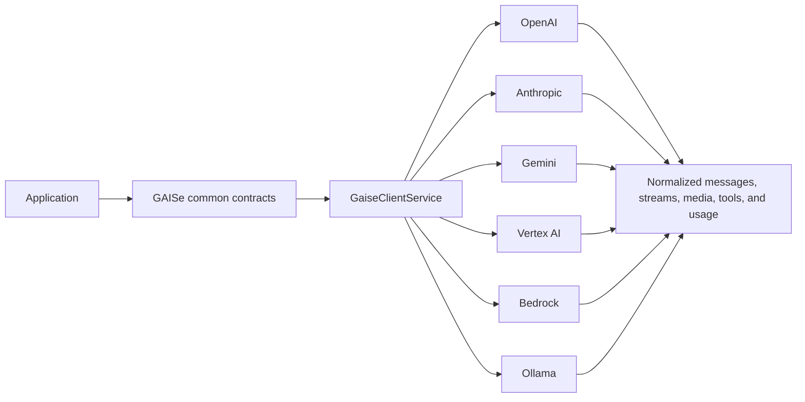

# GAISe developer wiki

This wiki describes the implementation in this repository as audited on 2026-07-22. It is the practical guide for building with GAISe, extending an adapter, and understanding exactly what each provider returns.

## Start here

- [Common contracts](common-contracts.md) — requests, messages, content, tools, responses, streaming, live events, and usage.
- [Clients and routing](clients-and-routing.md) — Cargo features, the multi-provider router, and direct client construction for every provider.
- [Provider support](provider-support.md) — capability and limitation matrices for OpenAI, Anthropic, Gemini, Vertex AI, Bedrock, and Ollama.
- [Request examples](request-examples.md) — text, images, audio, files, reasoning, generated images, tools, streams, embeddings, and live sessions.
- [Flows](flows.md) — Mermaid diagrams for routing and every major request lifecycle.
- [Models and lifecycle](models-and-lifecycle.md) — current model guidance, deprecations, and how to maintain the registry.

The HTTP/SSE/WebSocket wire contract is also summarized in the root [API documentation](../../API_DOCUMENTATION.md). The machine-readable model inventory is [model-registry.toml](../../model-registry.toml), and the source comparison is in the [audit report](../../audit-report.md).

## Design rules

1. The common contract describes content; each adapter maps only the shapes its provider endpoint supports.
2. Preserve content order, tool-call IDs/names, reasoning signatures, and opaque redacted reasoning.
3. Return provider-reported usage without inventing modality counts. Keep request-wide totals separate from output.
4. Model support and endpoint support are different. A model feature is not claimed until the selected GAISe adapter maps it.
5. Live, credentialed, local-model, and billable provider checks are opt-in. The repository's normal validation uses local fixtures and serialization tests.

## Architecture

## Repository map

| Path | Responsibility |
|---|---|
| `gaise-core` | Public contracts, `GaiseClient`, `GaiseLiveClient`, stream accumulator, logging |
| `gaise-client` | Feature-gated provider router using `provider::model` names |
| `gaise-provider-*` | Provider request/response and transport adapters |
| `gaise-api` | Axum JSON, SSE, and optional WebSocket API |
| `model-registry.toml` | Advisory model capability/lifecycle data |
| `developer/wiki` | Developer-facing behavior and examples |

