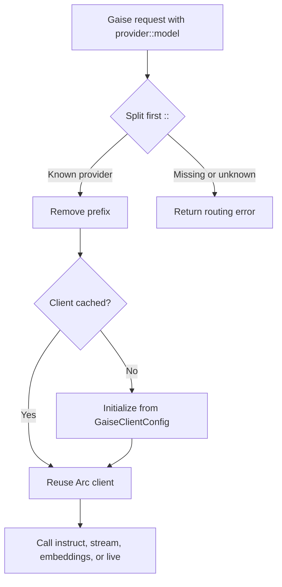
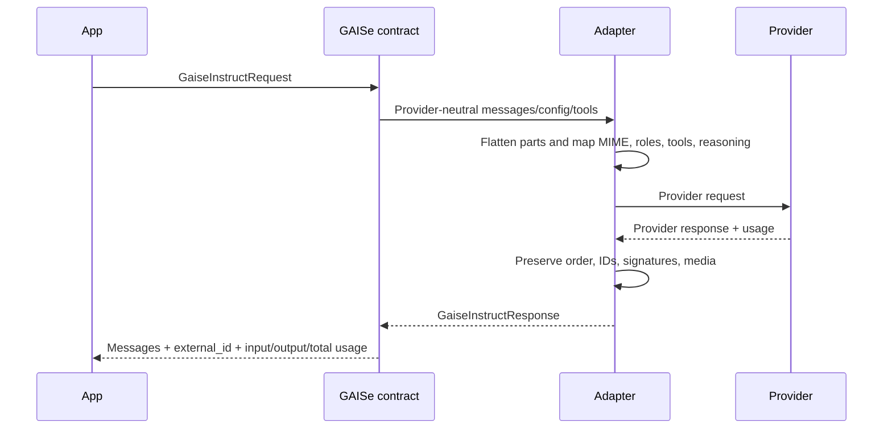
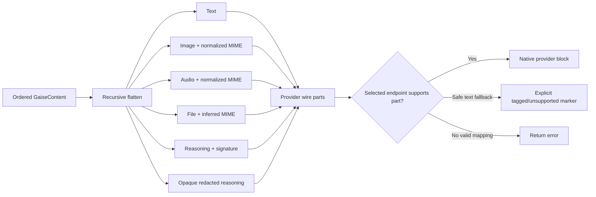
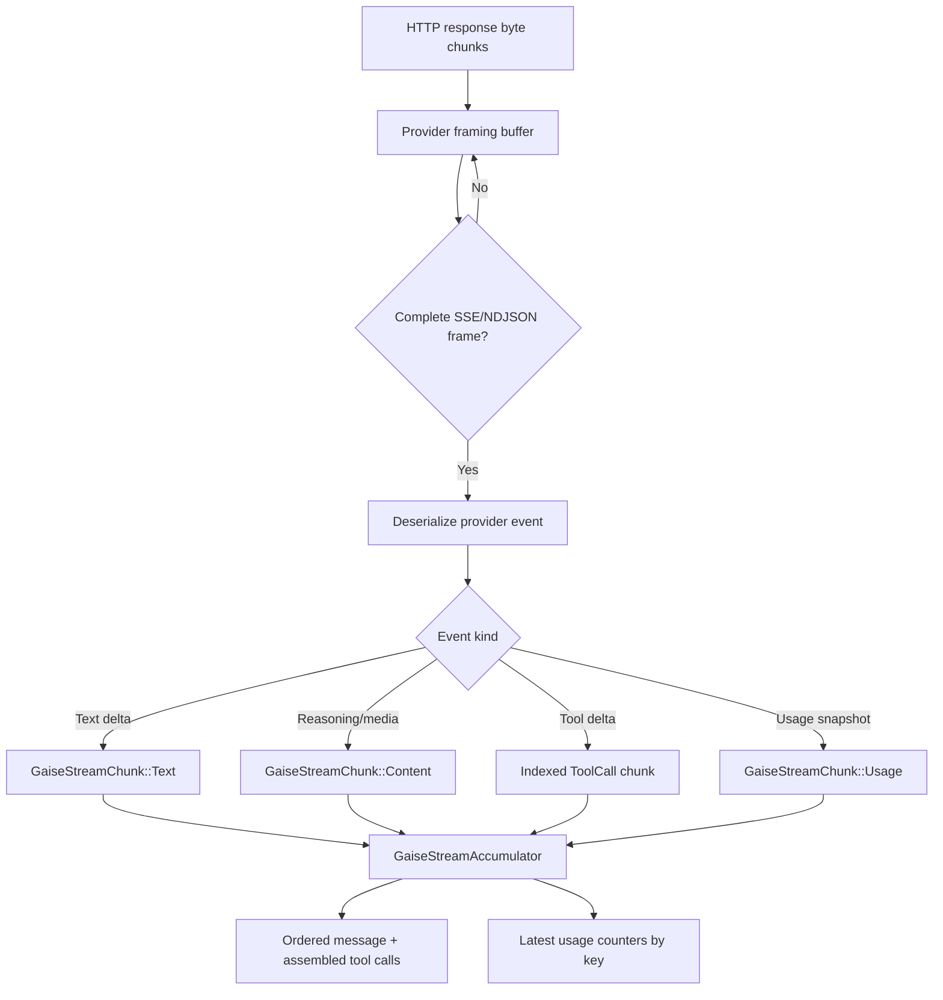
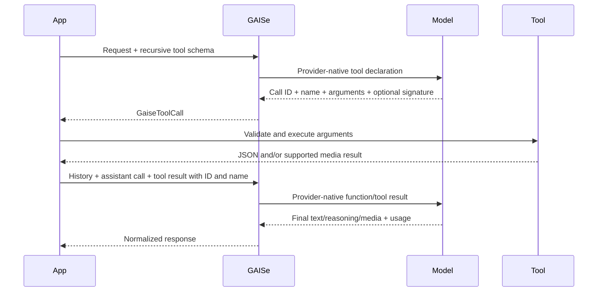
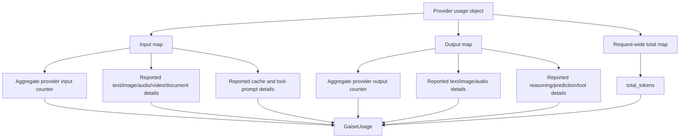
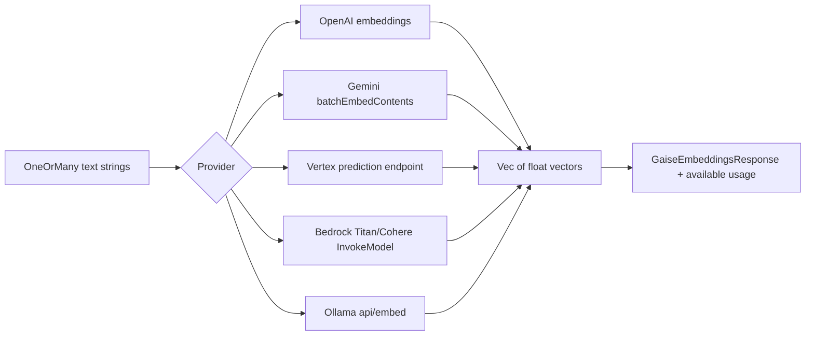
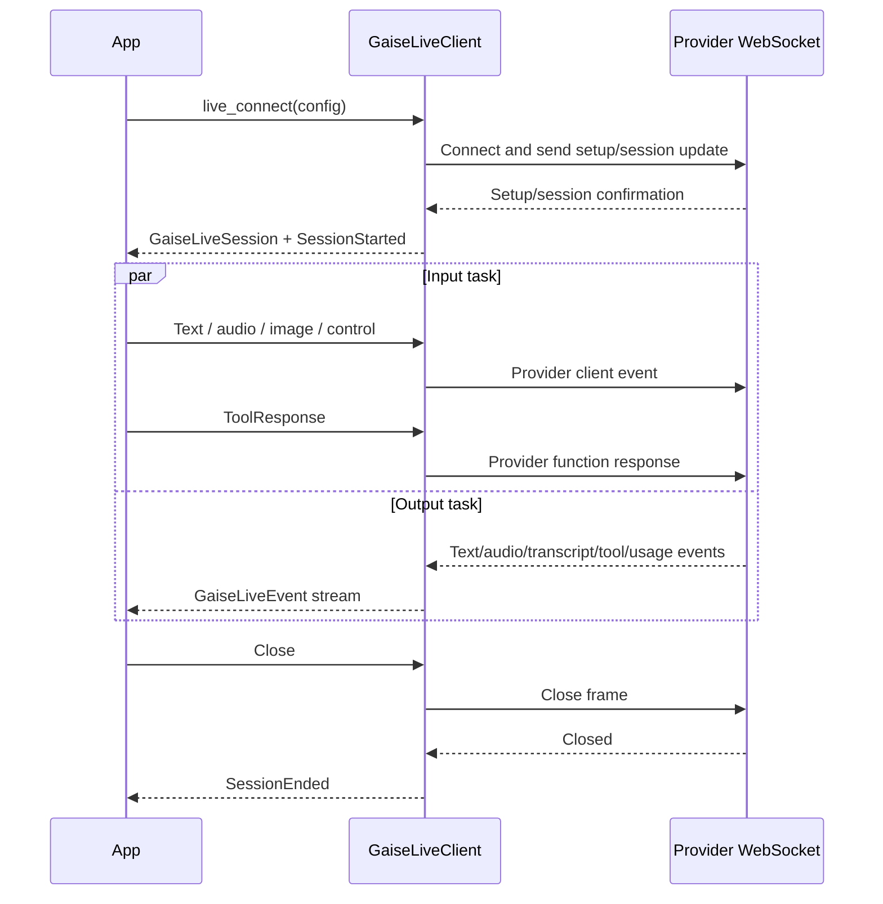
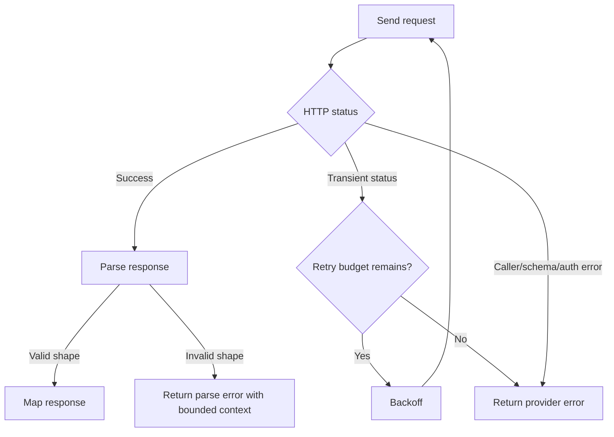

# Request flows

These diagrams describe the current implementation boundaries.

## Client routing

## Non-streaming instruct

## Multimodal mapping

Adapters do not silently discard unsupported content. Whether they can use a text marker or must fail depends on the provider's valid message schema.

## Streaming

The raw transport chunks are not assumed to align with SSE lines or JSON objects. Buffers retain an incomplete trailing frame until the next network chunk.

## Tool-call loop

Parallel streaming tool calls are correlated by their provider index. Gemini/Vertex names and thought signatures must be preserved alongside IDs.

## Usage normalization

Detail counters overlap aggregates. Missing modality detail stays missing; it is never inferred from content type or aggregate tokens.

## Embeddings

Anthropic has no embeddings branch. The common embedding input is currently text-only.

## Live session

OpenAI uses the current GA nested audio/session shape. Gemini uses `setup`, `realtimeInput`, and `toolResponse`; images are sent as realtime video frames. A setup error or early socket close is surfaced instead of being reported as a started session.

## Retry and errors

Retries are adapter-specific and limited to transient classes. Invalid inputs, authentication failures, and unsupported content are not made to look successful.

