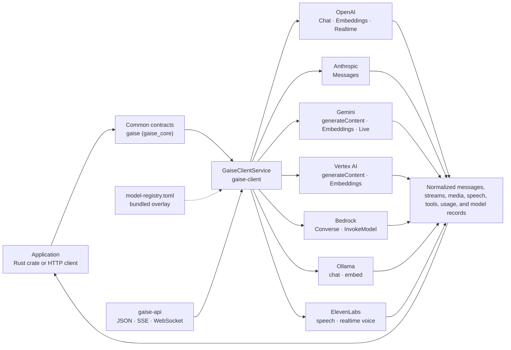
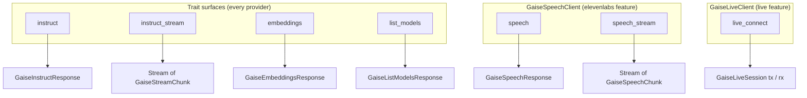

# GAISe wiki

GAISe (Generative AI Service) is a Rust workspace that maps one provider-neutral contract onto seven vendor APIs — OpenAI, Anthropic, Google Gemini, Google Vertex AI, Amazon Bedrock, Ollama, and ElevenLabs — for chat (`instruct`), streaming, embeddings, text-to-speech, model discovery, and live/realtime sessions. This wiki documents the implementation as audited on **2026-09-04**; every page links to the source it describes.

## Pages

| Page | What it covers |
|---|---|
| [**api.md**](api.md) | The HTTP surface of [`gaise-api`](../gaise-api/): every route, request/response JSON, SSE and WebSocket framing, errors, configuration — with a sequence diagram per route. |
| [**sdk.md**](sdk.md) | Using GAISe from Rust: crates and features, the `GaiseClientService` router, direct provider clients, every core contract, streaming accumulation, live sessions, model discovery, logging, testing. |
| [**capabilities.md**](capabilities.md) | What each adapter can and cannot do: operations, modalities, tools, per-family parameter compatibility, reasoning, generation controls, streaming, live, speech, embeddings, usage counters, and the model-discovery rules (tri-state support, provenance, registry overlay, vocabulary). |
| [**reasoning.md**](reasoning.md) | The universal thinking/reasoning vocabulary (`none`…`ultra` + aliases), the resolution rules, the per-vendor mapping, and a generated model × level matrix showing exactly what each provider receives. |
| [**embeddings.md**](embeddings.md) | Every embedding model per provider — dimensions, token and batch limits, task types, normalization, lifecycle — with best practices per vendor and the `task` / `dimensions` / `normalize` contract. |
| [**limits.md**](limits.md) | Every model's documented context window, max output, per-input token limit, embedding dimensions, and character budget — one typed `limits` object, a generated model × limits matrix, and `GET /v1/models/limits` to serve it without credentials. |
| [**models.md**](models.md) | Every model in the bundled registry (215 entries), per vendor, with modalities, operations, reasoning values, lifecycle dates, and GAISe support notes; plus the retirement calendar and maintenance procedure. |
| [**flows.md**](flows.md) | Mermaid diagrams of routing, instruct, multimodal mapping, streaming, tool loops, usage normalization, embeddings, model discovery, live sessions, and retries. |
| [**examples.md**](examples.md) | Rust request examples for text, media, files, reasoning, generated images, tools, streaming, embeddings, discovery, and live. |
| [**releasing.md**](releasing.md) | Version synchronization, package verification, and crates.io publish order. |

### Vendors

| Vendor | Provider key | Crate | Surfaces |
|---|---|---|---|
| [**OpenAI**](vendor-openai.md) | `openai` | [`gaise-provider-openai`](../gaise-provider-openai/) | Chat Completions, Embeddings, Realtime (`live`), `GET /v1/models` |
| [**Anthropic Claude**](vendor-anthropic.md) | `anthropic` | [`gaise-provider-anthropic`](../gaise-provider-anthropic/) | Messages, `GET /v1/models` |
| [**Google Gemini API**](vendor-gemini.md) | `gemini` | [`gaise-provider-gemini`](../gaise-provider-gemini/) | generateContent, Embeddings, Live (`live`), `models.list` |
| [**Google Vertex AI**](vendor-vertexai.md) | `vertexai` | [`gaise-provider-vertexai`](../gaise-provider-vertexai/) | generateContent, Embeddings, Model Garden listing |
| [**Amazon Bedrock**](vendor-bedrock.md) | `bedrock` | [`gaise-provider-bedrock`](../gaise-provider-bedrock/) | Converse/ConverseStream, InvokeModel embeddings, `ListFoundationModels` |
| [**Ollama**](vendor-ollama.md) | `ollama` | [`gaise-provider-ollama`](../gaise-provider-ollama/) | `/api/chat`, `/api/embed`, `/api/tags` |
| [**ElevenLabs**](vendor-elevenlabs.md) | `elevenlabs` | [`gaise-provider-elevenlabs`](../gaise-provider-elevenlabs/) | Text-to-speech, streaming speech, realtime voice (`live`), `GET /v1/models` |

Each vendor page follows the same outline — configuration, request mapping (roles, modalities, tools, generation config, model-family rules), response mapping, streaming, usage counters, embeddings, live, model discovery, the vendor's model table, limitations, flow diagrams, tests, and sources — so the same question can be answered in the same place for every provider.

## Start here

- **Calling the HTTP API?** [api.md](api.md) → pick a model from [models.md](models.md) → import [`gaise_postman_collection.json`](../gaise_postman_collection.json).
- **Embedding the Rust crates?** [sdk.md#crates-and-features](sdk.md#crates-and-features) → [sdk.md#the-router-gaiseclientservice](sdk.md#the-router-gaiseclientservice) → [examples.md](examples.md).
- **Does provider X support Y?** [capabilities.md](capabilities.md), then the vendor page's "Limitations and explicit fallbacks".
- **Which embedding model, and how should I call it?** [embeddings.md](embeddings.md) — per-model limits, document-vs-query task types, Matryoshka dimensions, normalization.
- **Which reasoning level should I send?** [reasoning.md](reasoning.md) — one vocabulary, `ultra` for "the most this model offers", and a matrix of what each model receives.
- **Will model Z accept this parameter?** [capabilities.md#parameter-compatibility-by-family](capabilities.md#parameter-compatibility-by-family) and the vendor page's "Parameter compatibility" table — the adapters filter requests to what each family accepts.
- **Which models exist and when do they retire?** [models.md](models.md) and `GET /v1/models` ([api.md#get-v1models](api.md#get-v1models)).
- **How big is model Z's context window?** [limits.md](limits.md) — the matrix, the `limits` object on every `GET /v1/models` record, and `GET /v1/models/limits` ([api.md#get-v1modelslimits](api.md#get-v1modelslimits)) for the registry figures without credentials.
- **Extending an adapter?** The vendor page's "Request mapping" and "Tests" sections, then the [design rules](#design-rules) below and [models.md#maintaining-the-registry](models.md#maintaining-the-registry).

## Architecture





## Design rules

1. The common contract describes content; each adapter maps only the shapes its provider endpoint supports, and says so explicitly when it cannot ([capabilities.md#explicit-fallbacks-and-refusals](capabilities.md#explicit-fallbacks-and-refusals)).
2. Preserve content order, tool-call IDs and names, reasoning signatures, and opaque redacted reasoning across turns.
3. Return provider-reported usage without inventing modality counts; keep request-wide totals separate from output ([capabilities.md#usage-counters](capabilities.md#usage-counters)).
4. Model support and endpoint support are different questions. A model feature is not claimed until the selected GAISe adapter maps it; `list_models` reports `unknown` rather than guessing ([capabilities.md#model-discovery](capabilities.md#model-discovery)).
5. Gemini API and Vertex AI lifecycles are separate; Bedrock lifecycle is AWS's, not the model vendor's ([models.md](models.md)).
6. Live, credentialed, local-model, and billable provider checks are opt-in. Normal validation uses fixtures and serialization tests ([sdk.md#testing-your-integration](sdk.md#testing-your-integration)).

## Repository map

| Path | Responsibility | Wiki |
|---|---|---|
| [`gaise-core/`](../gaise-core/) | Contracts, `GaiseClient`/`GaiseLiveClient`, stream accumulator, logging, bundled registry ([`model-registry.toml`](../gaise-core/model-registry.toml), [`registry.rs`](../gaise-core/src/registry.rs)) | [sdk.md](sdk.md#core-contracts), [models.md](models.md) |
| [`gaise-client/`](../gaise-client/) | Feature-gated router, `GaiseClientConfig`, aggregate model listing | [sdk.md](sdk.md#the-router-gaiseclientservice) |
| [`gaise-provider-*/`](../) | Provider request/response mapping and transport | [vendor pages](#vendors) |
| [`gaise-api/`](../gaise-api/) | Axum JSON, SSE, WebSocket server | [api.md](api.md) |
| [`gaise-chatbot/`](../gaise-chatbot/) | Minimal CLI example | [sdk.md](sdk.md) |
| [`gaise_postman_collection.json`](../gaise_postman_collection.json) | Ready-to-run HTTP requests for every route and vendor | [api.md](api.md) |
| [`API_DOCUMENTATION.md`](../API_DOCUMENTATION.md) | Short wire-contract summary at the repo root | [api.md](api.md) |
| [`.claude/agents/model-audit.md`](../.claude/agents/model-audit.md) | Agent definition that re-audits the registry | [models.md#maintaining-the-registry](models.md#maintaining-the-registry) |

## Build and test

```powershell
cargo build --workspace
cargo fmt --all -- --check
cargo clippy --workspace --all-targets --all-features -- -D warnings
cargo test --workspace --all-targets --all-features
cargo run -p gaise --example models_page > wiki/models.md   # regenerate the model catalog page
cargo run -p gaise --example registry_json   # dump the registry as JSON (vendor-page tables, tooling)
cargo run -p gaise --example limits_matrix   # regenerate the matrix in limits.md
```

The suite is hermetic: tests that need credentials, a provider API, or a running Ollama are `#[ignore]`d with a reason.
