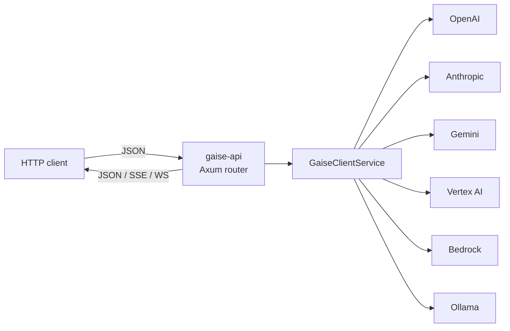
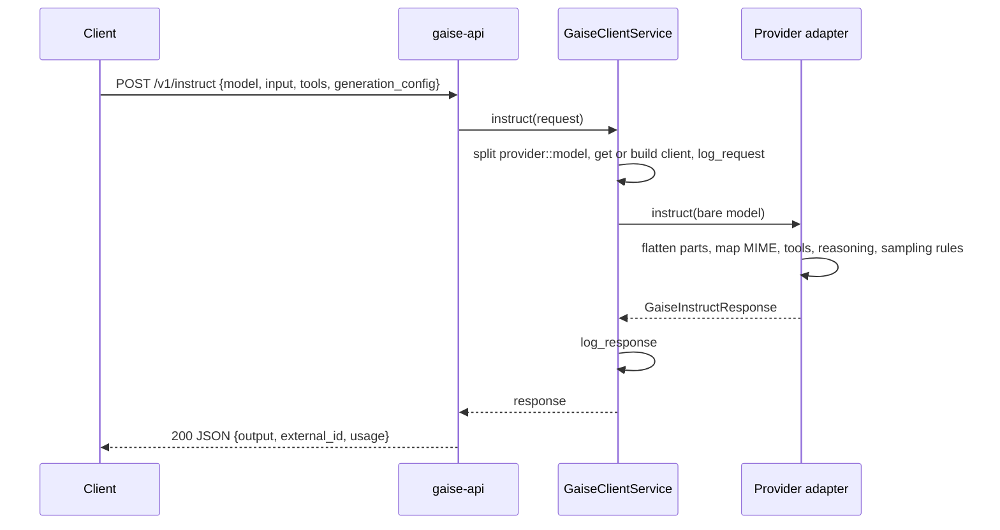
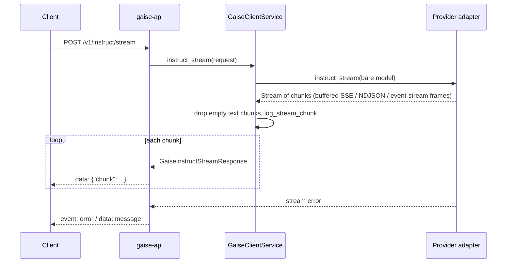
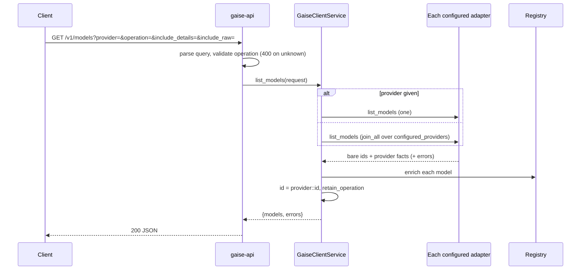
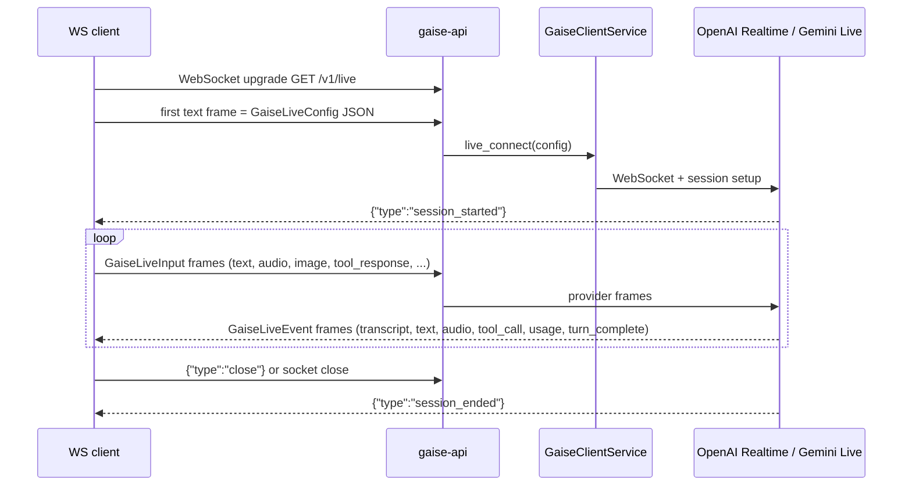

# HTTP API

> Part of the [GAISe wiki](README.md) · [Rust SDK](sdk.md) · [Capabilities](capabilities.md) · [Models](models.md) · [Flows](flows.md) · [Examples](examples.md) · Vendors: [OpenAI](vendor-openai.md) · [Anthropic](vendor-anthropic.md) · [Gemini](vendor-gemini.md) · [Vertex AI](vendor-vertexai.md) · [Bedrock](vendor-bedrock.md) · [Ollama](vendor-ollama.md)

[`gaise-api`](../gaise-api/) exposes the common contracts over JSON, Server-Sent Events, and an optional WebSocket. It is a thin Axum layer over [`GaiseClientService`](sdk.md#the-router-gaiseclientservice): every route deserializes a core contract, calls the router, and serializes the result — no provider logic lives here ([`gaise-api/src/lib.rs`](../gaise-api/src/lib.rs)). The Postman collection [`gaise_postman_collection.json`](../gaise_postman_collection.json) contains a ready-made request for every route and vendor below.

## Contents

- [Running the server](#running-the-server)
- [Model routing](#model-routing)
- [Route summary](#route-summary)
- [`POST /v1/instruct`](#post-v1instruct)
- [`POST /v1/instruct/stream`](#post-v1instructstream)
- [`POST /v1/embeddings`](#post-v1embeddings)
- [`GET /v1/models`](#get-v1models)
- [`GET /v1/models/{provider}::{id}`](#get-v1modelsproviderid)
- [`GET /v1/live`](#get-v1live)
- [Wire types](#wire-types)
- [Errors](#errors)
- [Configuration](#configuration)

## Running the server

```powershell
$env:OPENAI_API_KEY = "..."
$env:ANTHROPIC_API_KEY = "..."
cargo run -p gaise-api            # listens on 0.0.0.0:3000 (GAISE_PORT overrides)
cargo run -p gaise-api --features live   # adds GET /v1/live
```

[`Dockerfile`](../Dockerfile) and [`DockerfileARM`](../DockerfileARM) build the same binary; [`main.rs`](../gaise-api/src/main.rs) reads the [environment](#configuration) into `GaiseClientConfig` and installs `ConsoleGaiseLogger`.



## Model routing

Every request names a model as `provider::model-id`; the router strips the prefix and forwards the bare ID ([sdk.md#routing](sdk.md#routing)).

| Example | Provider page |
|---|---|
| `openai::gpt-5.6` | [OpenAI](vendor-openai.md) |
| `anthropic::claude-opus-5` | [Anthropic](vendor-anthropic.md) |
| `gemini::gemini-3.6-flash` | [Gemini](vendor-gemini.md) |
| `vertexai::gemini-3.5-flash` | [Vertex AI](vendor-vertexai.md) |
| `bedrock::us.anthropic.claude-sonnet-5` | [Bedrock](vendor-bedrock.md) |
| `ollama::qwen3:8b` | [Ollama](vendor-ollama.md) |

GAISe does not restrict IDs to an allowlist. Use [`GET /v1/models`](#get-v1models) for live discovery and [models.md](models.md) for lifecycle guidance.

## Route summary

| Method | Path | Body | Returns | Handler |
|---|---|---|---|---|
| `POST` | `/v1/instruct` | `GaiseInstructRequest` | `GaiseInstructResponse` | [`handle_instruct`](../gaise-api/src/lib.rs) |
| `POST` | `/v1/instruct/stream` | `GaiseInstructRequest` | SSE of `GaiseInstructStreamResponse` | [`handle_instruct_stream`](../gaise-api/src/lib.rs) |
| `POST` | `/v1/embeddings` | `GaiseEmbeddingsRequest` | `GaiseEmbeddingsResponse` | [`handle_embeddings`](../gaise-api/src/lib.rs) |
| `GET` | `/v1/models` | query | `GaiseListModelsResponse` | [`handle_list_models`](../gaise-api/src/lib.rs) |
| `GET` | `/v1/models/{provider}::{id}` | query | `GaiseModel` | [`handle_get_model`](../gaise-api/src/lib.rs) |
| `GET` | `/v1/live` | WebSocket | `GaiseLiveEvent` frames | [`handle_live_ws`](../gaise-api/src/lib.rs) (`live` feature) |

## `POST /v1/instruct`

Generates one or more assistant messages.



Request:

```json
{
  "model": "gemini::gemini-3.6-flash",
  "correlation_id": "request-123",
  "generation_config": { "max_tokens": 4096, "thinking_effort": "medium", "include_thoughts": true },
  "input": { "role": "user", "content": { "type": "text", "text": "Explain Rayleigh scattering." } }
}
```

Response:

```json
{
  "output": [{
    "role": "assistant",
    "content": [
      { "type": "reasoning", "text": "I should explain the wavelength dependence clearly.", "signature": "provider-opaque-signature" },
      { "type": "text", "text": "Shorter wavelengths are scattered more strongly..." }
    ]
  }],
  "external_id": "provider-response-id",
  "usage": {
    "input": { "prompt_tokens": 12, "text_tokens": 12 },
    "output": { "candidates_tokens": 87, "text_tokens": 70, "reasoning_tokens": 17 },
    "total": { "total_tokens": 99 }
  }
}
```

`input`, message `content`, and `output` are `OneOrMany` — one object or an array. Usage has independent `input`/`output`/`total` maps whose values may overlap; never sum a map ([capabilities.md#usage-counters](capabilities.md#usage-counters)).

### Generation configuration

| Field | Type | Meaning |
|---|---|---|
| `temperature`, `top_p`, `top_k` | number | Sampling, dropped for fixed-sampling families |
| `max_tokens` | integer | Output budget |
| `thinking_tokens` | integer | Manual reasoning budget where supported |
| `thinking_effort` | string | `none`, `minimal`, `low`, `medium`, `high`, `xhigh`, `max` (per-model sets in [models.md](models.md)) |
| `include_thoughts` | boolean | Request returned thought summaries |
| `response_modalities` | string[] | e.g. `["TEXT", "IMAGE"]` (Gemini/Vertex) |
| `image_config.aspect_ratio`, `image_config.image_size` | string | e.g. `16:9`, `2K` |
| `input_image_detail` | string | OpenAI `auto`/`low`/`high`/`original` |
| `input_media_resolution` | string | Gemini/Vertex `low`/`medium`/`high` or `MEDIA_RESOLUTION_*` |
| `cache_key` | string | Prompt-cache hint where supported |

Mapping per provider: [capabilities.md#generation-controls](capabilities.md#generation-controls).

### Content objects

Byte data is an array of integers 0–255.

```json
{ "type": "text", "text": "hello" }
{ "type": "image", "data": [137, 80, 78, 71], "format": "image/png" }
{ "type": "audio", "data": [82, 73, 70, 70], "format": "audio/wav" }
{ "type": "file", "data": [37, 80, 68, 70], "name": "report.pdf" }
{ "type": "reasoning", "text": "A provider-returned summary", "signature": "opaque-value-to-preserve" }
{ "type": "redacted_reasoning", "data": [111, 112, 97, 113] }
{ "type": "parts", "parts": [ { "type": "text", "text": "Describe this:" }, { "type": "image", "data": [1, 2, 3], "format": "png" } ] }
```

`redacted_reasoning` is opaque — replay it byte-for-byte. Nested `parts` are flattened in order. What each provider accepts: [capabilities.md#modalities-by-provider](capabilities.md#modalities-by-provider); full request bodies for images, audio, files, and generated images: [examples.md](examples.md).

### Tool calling

```json
{
  "model": "anthropic::claude-sonnet-5",
  "tool_config": { "mode": "auto" },
  "tools": [{
    "name": "get_weather",
    "description": "Get current weather",
    "parameters": {
      "type": "object",
      "properties": {
        "location": { "type": "string", "description": "City and country" },
        "options": { "type": "object", "properties": { "units": { "type": "string" } } }
      },
      "required": ["location"]
    }
  }],
  "input": { "role": "user", "content": { "type": "text", "text": "Weather in London?" } }
}
```

The assistant message carries `tool_calls`:

```json
{ "id": "call-123", "type": "function", "function": { "name": "get_weather", "arguments": "{\"location\":\"London\"}" }, "thought_signature": "optional-provider-signature" }
```

Return the result as a `tool` message with **both** `tool_call_id` and `tool_name` (Gemini/Vertex require the name):

```json
{ "role": "tool", "tool_call_id": "call-123", "tool_name": "get_weather", "content": { "type": "text", "text": "{\"temperature\":18}" } }
```

`tool_config.mode` is honoured only where the adapter maps it ([capabilities.md#tools](capabilities.md#tools)).

## `POST /v1/instruct/stream`

Same body as `/v1/instruct`; the response is `text/event-stream`. Each `data:` line is one `GaiseInstructStreamResponse`.



```text
data: {"chunk":{"text":"The"},"external_id":"response-1"}

data: {"chunk":{"content":{"type":"reasoning","text":"...","signature":"sig"}}}

data: {"chunk":{"tool_call":{"index":0,"id":"call-1","name":"get_weather","arguments":"{","thought_signature":null}}}

data: {"chunk":{"usage":{"input":{"prompt_tokens":10},"output":{"completion_tokens":5},"total":{"total_tokens":15}}}}
```

| Chunk | Meaning |
|---|---|
| `text` | Text delta |
| `content` | Complete reasoning or media part |
| `tool_call` | Indexed tool-call delta; concatenate `arguments` per `index` |
| `usage` | Cumulative usage snapshot (replace, don't add) |

Errors after the stream has started arrive as an SSE `event: error`. Accumulation rules: [sdk.md#streaming](sdk.md#streaming); parser behaviour: [flows.md#streaming](flows.md#streaming).

## `POST /v1/embeddings`

```json
{ "model": "openai::text-embedding-3-small", "correlation_id": "embed-123", "input": ["First document", "Second document"] }
```

```json
{
  "output": [[0.0123, -0.0456, 0.0789], [0.0987, -0.0654, 0.0321]],
  "external_id": "provider-response-id",
  "usage": { "input": { "prompt_tokens": 4 }, "total": { "total_tokens": 4 } }
}
```

`input` is one string or an array. The contract is text-only; usage is present only when the provider reports it ([capabilities.md#embeddings](capabilities.md#embeddings)).

## `GET /v1/models`

Lists the models reachable through every configured provider, normalized to [`GaiseModel`](capabilities.md#the-common-record) and enriched from the bundled registry.



| Query | Meaning |
|---|---|
| `provider` | One provider key (`openai`, `anthropic`, `gemini`, `vertexai`, `bedrock`, `ollama`, or a custom `add_client` key). Omit to fan out. |
| `operation` | Keep only models whose `operations` include `instruct`, `instruct_stream`, `embeddings`, or `live`. |
| `include_details` | Per-model detail calls where they cost extra (Ollama `/api/show`). Default `false`. |
| `include_raw` | Attach the provider's native record as `raw`. Default `false`. |
| `correlation_id` | Logged. |

```json
{
  "models": [
    {
      "id": "anthropic::claude-opus-5",
      "provider": "anthropic",
      "display_name": "Claude Opus 5",
      "created_at": "2026-07-24T00:00:00Z",
      "status": "active",
      "retirement_not_before": "2027-07-24",
      "capabilities": {
        "input": ["text", "image", "file"], "output": ["text"],
        "operations": ["instruct", "instruct_stream"],
        "tools": "supported", "reasoning": "supported",
        "reasoning_values": ["low", "medium", "high", "xhigh", "max"],
        "structured_output": "supported",
        "sources": ["provider", "registry"]
      },
      "limits": { "max_input_tokens": 1000000, "max_output_tokens": 128000 }
    },
    {
      "id": "openai::text-embedding-3-small",
      "provider": "openai",
      "created_at": "2024-01-22T18:43:17Z",
      "status": "active",
      "capabilities": {
        "input": ["text"], "output": ["embedding"], "operations": ["embeddings"],
        "tools": "unsupported", "reasoning": "unsupported", "structured_output": "unknown",
        "sources": ["provider", "heuristic", "registry"]
      },
      "limits": {}
    }
  ],
  "errors": [ { "provider": "ollama", "message": "error sending request for url (http://localhost:11434/api/tags)" } ]
}
```

Semantics (details in [capabilities.md#model-discovery](capabilities.md#model-discovery)):

- `tools`, `reasoning`, `structured_output` are `supported` / `unsupported` / `unknown`; empty `input`/`output` means unknown.
- `operations` lists the GAISe routes that can drive the model; image-generation, TTS, and transcription models have an empty list.
- `sources` is provenance: `provider`, `registry`, `heuristic`.
- Without `provider`, failures are reported per provider in `errors` (omitted when empty) and never hide other providers. With `provider`, a failure is HTTP 500.
- Bedrock lists foundation models and cross-region inference profiles (`us.`, `global.` …), which inherit the foundation model's capabilities.
- Which providers take part is decided by [`configured_providers`](../gaise-client/src/lib.rs): a key + URL for the SaaS providers, SA + URL for Vertex, `BEDROCK_REGION` for Bedrock, `OLLAMA_URL` for Ollama, plus any custom clients.

## `GET /v1/models/{provider}::{id}`

Returns the single enriched record for one routable ID, or 404 when the provider's listing does not contain it. `include_details` and `include_raw` apply. The ID must contain `::` (400 otherwise).

```http
GET /v1/models/ollama::qwen3:8b?include_details=true
```

## `GET /v1/live`

Available when built with `--features live`. The WebSocket proxies the common live protocol to OpenAI Realtime or Gemini Live.



1. The first text frame must be a [`GaiseLiveConfig`](sdk.md#live) (`model`, `system_instruction`, `voice`, `modalities`, `tools`, `generation_config`, `vad_config`, `transcription`). An invalid config returns `{"type":"error"}` and closes.
2. Subsequent frames are `GaiseLiveInput` variants: `text`, `audio`, `image`, `tool_response`, `activity_start`, `activity_end`, `audio_stream_end`, `clear_audio`, `cancel_response`, `close`.
3. Server frames are `GaiseLiveEvent` variants: `session_started`, `text`, `audio`, `transcript`, `reasoning`, `tool_call`, `tool_call_cancelled`, `turn_complete`, `interrupted`, `usage`, `error`, `session_ended`.

OpenAI Realtime takes 24 kHz PCM and PNG/JPEG stills; Gemini Live takes audio and image/video frames. Unsupported operations produce an `error` event. Full wire examples: [examples.md#live--realtime](examples.md#live--realtime); provider differences: [capabilities.md#live--realtime](capabilities.md#live--realtime).

## Wire types

Every JSON shape is the serde form of a core contract — the field-level reference is [sdk.md#core-contracts](sdk.md#core-contracts). Serialization conventions:

- Optional outbound fields are omitted, never `null`.
- Enums are `snake_case` strings (`instruct_stream`, `redacted_reasoning`).
- `OneOrMany<T>` accepts an object or an array and serializes whichever was stored.
- Byte fields are integer arrays.

## Errors

| Status | When |
|---|---|
| `400` | Unknown `operation` query value; `GET /v1/models/{id}` without `::`; malformed JSON (Axum rejection) |
| `404` | `GET /v1/models/{id}` not present in the provider's listing |
| `500` | Routing failure (`Model name must be in the format 'provider::model'`, `Unknown or disabled provider`, `… not configured`) or any provider error, with the provider's message as the body |
| SSE `event: error` | Provider error after a stream has started |
| WS `{"type":"error"}` | Invalid live config or unsupported live operation |

Provider error bodies are passed through verbatim (`OpenAI API error: …`, `Anthropic API error: …`, Ollama messages reformatted by [`format_ollama_error`](../gaise-provider-ollama/src/ollama_client.rs)).

## Configuration

| Variable | Description | Default |
|---|---|---|
| `GAISE_PORT` | Listen port | `3000` |
| `OPENAI_API_KEY`, `OPENAI_API_URL`, `OPENAI_API_TIER` | OpenAI credential, base URL, optional service tier | URL `https://api.openai.com/v1` |
| `ANTHROPIC_API_KEY`, `ANTHROPIC_API_URL` | Anthropic credential, base URL | URL `https://api.anthropic.com/v1` |
| `GEMINI_API_KEY`, `GEMINI_API_URL` | Gemini credential, base URL | URL `https://generativelanguage.googleapis.com/v1beta` |
| `VERTEXAI_SA_PATH`, `VERTEXAI_API_URL`, `VERTEXAI_API_TIER` | Service-account JSON path, `{{MODEL}}` URL template, optional tier | none |
| `BEDROCK_REGION` + AWS credential chain | Region passed into the SDK builder | SDK resolution |
| `OLLAMA_URL` | Ollama endpoint | `http://localhost:11434` |

Per-vendor configuration details are on each [vendor page](README.md#vendors).
