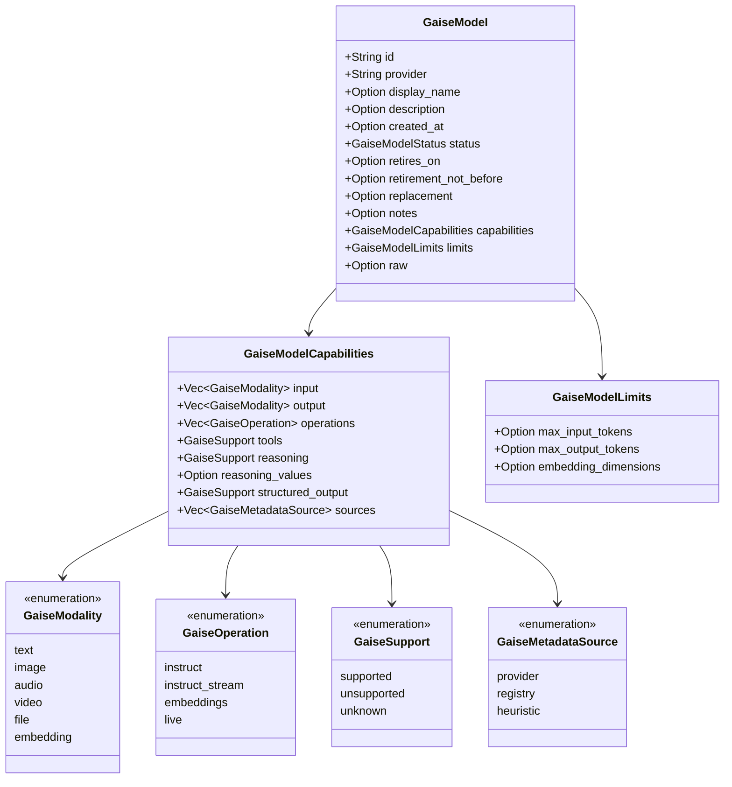

# Capabilities

> Part of the [GAISe wiki](README.md) · [Models](models.md) · [HTTP API](api.md) · [Rust SDK](sdk.md) · [Flows](flows.md) · [Examples](examples.md) · Vendors: [OpenAI](vendor-openai.md) · [Anthropic](vendor-anthropic.md) · [Gemini](vendor-gemini.md) · [Vertex AI](vendor-vertexai.md) · [Bedrock](vendor-bedrock.md) · [Ollama](vendor-ollama.md)

"Supported" on this page means **the current adapter maps the capability on its stated API surface**. A provider or model may offer more through an endpoint GAISe does not wrap (OpenAI Responses/Images, Bedrock Mantle, Vertex Live). Model-level support is a separate question answered per model by [`list_models`](#model-discovery) and the [model tables](models.md).

## Contents

- [Operations by provider](#operations-by-provider)
- [Modalities by provider](#modalities-by-provider)
- [Tools](#tools)
- [Reasoning controls](#reasoning-controls)
- [Generation controls](#generation-controls)
- [Streaming](#streaming)
- [Live / realtime](#live--realtime)
- [Embeddings](#embeddings)
- [Usage counters](#usage-counters)
- [Model discovery](#model-discovery)
  - [What each provider reports](#what-each-provider-reports) · [The common record](#the-common-record) · [Overlay rules](#overlay-rules) · [Registry vocabulary](#registry-vocabulary)
- [Explicit fallbacks and refusals](#explicit-fallbacks-and-refusals)

## Operations by provider

| Operation | OpenAI | Anthropic | Gemini | Vertex AI | Bedrock | Ollama |
|---|---|---|---|---|---|---|
| `instruct` | Chat Completions | Messages | `generateContent` | `generateContent` | `Converse` | `/api/chat` |
| `instruct_stream` | Chat SSE | Messages SSE | `streamGenerateContent?alt=sse` | `streamGenerateContent?alt=sse` | `ConverseStream` | `/api/chat` NDJSON |
| `embeddings` | `/embeddings` | — | `batchEmbedContents` | `:predict` | `InvokeModel` (Titan, Cohere) | `/api/embed` |
| `live` | Realtime WS (`live` feature) | — | Live WS (`live` feature) | — | — | — |
| `list_models` | `GET /models` | `GET /models` | `GET /models` | Model Garden `v1beta1` | `ListFoundationModels` + `ListInferenceProfiles` | `/api/tags` (+ `/api/show`) |

Source: [`gaise-client/src/lib.rs`](../gaise-client/src/lib.rs) and each provider's client module linked from the [vendor pages](README.md#vendors).

## Modalities by provider

How each [`GaiseContent`](sdk.md#content) variant is carried on the wire, and what happens when the endpoint cannot represent it.

| Content | OpenAI Chat | Anthropic Messages | Gemini API | Vertex AI | Bedrock Converse | Ollama |
|---|---|---|---|---|---|---|
| `Text` | `text` part | `text` block | `text` part | `text` part | `text` block | message content |
| `Image` in | `image_url` data URL + `detail` | `image` base64 source | `inlineData` | `inlineData` | `image` block | `images` field |
| `Image` out | not mapped (Images/Responses) | n/a | `inlineData` → `Image` | `inlineData` → `Image` | mapped where the model returns it | not normalized |
| `Audio` in | `input_audio` where the model permits | explicit unsupported marker | `inlineData` | `inlineData` | `audio` block where permitted | explicit unsupported marker |
| `Audio` out | not mapped | n/a | `inlineData` → `Audio` | `inlineData` → `Audio` | non-stream blocks where exposed | not exposed |
| `File` | UTF-8 → tagged text; binary → explicit limitation | PDF/text `document`; other binary → explicit marker | inline MIME data or text | inline MIME data or text | `document` block + required companion text | UTF-8 → tagged text |
| `Reasoning` / `RedactedReasoning` | returned reasoning usage only | `thinking` / `redacted_thinking` with signatures | thought parts + `thoughtSignature` | thought parts + `thoughtSignature` | `reasoningContent` text/signature/redacted | `thinking` text |
| `Parts` | flattened in order | flattened in order | flattened in order | flattened in order | flattened in order | flattened in order |

MIME normalization lives in [`gaise_content.rs`](../gaise-core/src/contracts/gaise_content.rs). Provider detail and line references: [OpenAI](vendor-openai.md#content-modalities) · [Anthropic](vendor-anthropic.md#content-modalities) · [Gemini](vendor-gemini.md#content-modalities) · [Vertex AI](vendor-vertexai.md#content-modalities) · [Bedrock](vendor-bedrock.md#content-modalities) · [Ollama](vendor-ollama.md#content-modalities). The mapping algorithm is drawn in [flows.md#multimodal-mapping](flows.md#multimodal-mapping).

## Tools

| Aspect | OpenAI | Anthropic | Gemini / Vertex | Bedrock | Ollama |
|---|---|---|---|---|---|
| Schema | `function.parameters` JSON schema, nested | `input_schema`, nested | `functionDeclarations.parameters`, nested | `toolSpec.inputSchema.json` Document, nested | `function.parameters`, nested |
| Parallel calls | Indexed deltas assembled by the accumulator | Multiple `tool_use` blocks | Multiple `functionCall` parts | Multiple `toolUse` blocks | Model-dependent |
| Result message | `tool` role + `tool_call_id` | `tool_result` by ID; text/image/document content | `functionResponse` needs **name** (+ID) | `toolResult` by ID; text/image/document | `tool` role text |
| Opaque signatures | — | thinking signatures replayed | `thoughtSignature` on calls replayed | reasoning signatures replayed | — |
| `tool_config.mode` | not mapped on Chat ([note](vendor-openai.md#tools-and-tool-results)) | not mapped ([note](vendor-anthropic.md#limitations-and-explicit-fallbacks)) | Gemini: not mapped; Vertex: `toolConfig.functionCallingConfig.mode` | not mapped ([note](vendor-bedrock.md#limitations-and-explicit-fallbacks)) | not mapped |
| Family rule | GPT-5.6 Chat + function tools forces `reasoning_effort: "none"` | — | — | — | — |

Tool-result messages carry `tool_call_id` and `tool_name`; keep both so the same conversation replays on every provider. Loop diagram: [sdk.md#tools](sdk.md#tools).

## Reasoning controls

| Provider | Control | `thinking_effort` | `thinking_tokens` | `include_thoughts` | Returned thoughts |
|---|---|---|---|---|---|
| OpenAI | `reasoning_effort` (sent whenever configured; no family allowlist) | `none`…`max` per model | — | — | reasoning token usage |
| Anthropic | `thinking.type` adaptive or enabled + `output_config.effort` | `low`…`max` per model | `budget_tokens` (manual families) | `thinking.display` summarized/omitted | `thinking` + signature, `redacted_thinking` |
| Gemini 2.5 | `thinkingConfig.thinkingBudget` | approximated | budget | `includeThoughts` (default on when reasoning requested) | thought parts + signature |
| Gemini 3.x / Vertex 3.x | `thinkingConfig.thinkingLevel` | `minimal`/`low`/`medium`/`high` per family | — | `includeThoughts` | thought parts + signature |
| Bedrock Claude | `additionalModelRequestFields.thinking` adaptive/enabled | effort where supported | `budget_tokens` | `display` | `reasoningContent` |
| Bedrock Nova | Nova reasoning fields | — | budget | — | `reasoningContent` |
| Ollama | `think` | GPT-OSS `low`/`medium`/`high` | — | — | `thinking` |

Family rules (adaptive-only, fixed sampling, manual budgets) are listed per vendor: [Anthropic](vendor-anthropic.md#model-family-rules) · [Bedrock](vendor-bedrock.md#model-family-rules) · [Gemini](vendor-gemini.md#model-family-rules) · [OpenAI](vendor-openai.md#model-family-rules). Accepted values per model are in the `reasoning_values` column of [models.md](models.md).

## Generation controls

| `GaiseGenerationConfig` | OpenAI | Anthropic | Gemini / Vertex | Bedrock | Ollama |
|---|---|---|---|---|---|
| `temperature` | `temperature` | `temperature` (dropped on fixed-sampling families) | `temperature` (dropped on 3.5/3.6) | `inferenceConfig.temperature` (dropped for reasoning/fixed families) | `options.temperature` |
| `top_p` | `top_p` | `top_p` (rules by family) | `topP` | `inferenceConfig.topP` | `options.top_p` |
| `top_k` | — | `top_k` | `topK` | — | `options.top_k` |
| `max_tokens` | `max_completion_tokens` | `max_tokens` (default 4096) | `maxOutputTokens` | `inferenceConfig.maxTokens` | `options.num_predict` |
| `response_modalities` | — | — | `responseModalities` | — | — |
| `image_config` | — | — | `responseFormat.image` | — | — |
| `input_image_detail` | `image_url.detail` | — | — | — | — |
| `input_media_resolution` | — | — | `mediaResolution` | — | — |
| `cache_key` | `prompt_cache_key` | — (ephemeral `cache_control` instead) | — | — | — |
| service tier | `service_tier` from `OPENAI_API_TIER` | — | Vertex headers from `VERTEXAI_API_TIER` | — | — |

Exact field names and conditions: vendor pages under "Generation config".

## Streaming

| Provider | Framing | Chunks emitted | Split-frame fixture |
|---|---|---|---|
| OpenAI | SSE `data:` lines | Text, ToolCall (indexed deltas), Usage | [`openai_client.rs` tests](../gaise-provider-openai/src/openai_client.rs) |
| Anthropic | SSE events (`content_block_delta`, …) | Text, Content (reasoning), ToolCall, Usage | see [vendor note](vendor-anthropic.md#tests) |
| Gemini / Vertex | SSE `data:` JSON | Text, Content (thoughts, media), ToolCall, Usage | provider tests |
| Bedrock | AWS event stream | Text, Content (reasoning, images), ToolCall, Usage | [`bedrock_client.rs` tests](../gaise-provider-bedrock/src/bedrock_client.rs) |
| Ollama | NDJSON | Text, Content (thinking), ToolCall, Usage | [`ollama_client.rs` tests](../gaise-provider-ollama/src/ollama_client.rs) |

All parsers buffer partial frames so arbitrary TCP chunk boundaries cannot corrupt events; [`GaiseStreamAccumulator`](sdk.md#streaming) reassembles the ordered message. Diagram: [flows.md#streaming](flows.md#streaming).

## Live / realtime

| Capability | OpenAI Realtime | Gemini Live |
|---|---|---|
| Example model | `gpt-realtime-2.1` | `gemini-3.1-flash-live-preview` |
| Text in/out | Yes | Yes |
| Audio in/out | 24 kHz PCM in; configured voice/format out | Realtime audio in; native audio out |
| Image / video frame in | PNG/JPEG still image | `video` frame |
| Tools | Calls, cancellations, responses | Calls, cancellations, responses |
| Reasoning | Effort configuration; no reasoning usage subcounter in the current schema | Thinking config, returned thought event, reasoning usage |
| Transcription | Configurable in/out | Configurable in/out |
| Manual activity | Commit / request response when VAD off | `activityStart` / `activityEnd` when automatic detection off |
| Clear / cancel | Supported | Explicit unsupported error |
| Vertex AI / Bedrock | — | — (Vertex Live and Nova Sonic are listed but not driven) |

Protocol: [sdk.md#live](sdk.md#live) · wire: [examples.md#live--realtime](examples.md#live--realtime) · [vendor-openai](vendor-openai.md#live--realtime) · [vendor-gemini](vendor-gemini.md#live--realtime).

## Embeddings

| Provider | Endpoint | Models (registry) | Usage |
|---|---|---|---|
| OpenAI | `POST /embeddings` | `text-embedding-3-large`, `-small` | `prompt_tokens`, `total_tokens` |
| Gemini | `batchEmbedContents` | `gemini-embedding-2` (multimodal on the vendor side; text in GAISe) | none reported |
| Vertex AI | `:predict` | `gemini-embedding-2`, `gemini-embedding-001`, legacy `text-embedding-*` | input tokens, billable characters |
| Bedrock | `InvokeModel` | Titan `amazon.titan-embed-*`, Cohere `cohere.embed-*` | Titan input tokens; Cohere none |
| Ollama | `POST /api/embed` | any `embedding`-capable tag | `prompt_eval_count` |
| Anthropic | — | — | — |

The contract is text-only; an absent usage map means the endpoint did not report one — GAISe never estimates.

## Usage counters

| Surface | Input keys | Output keys | Total |
|---|---|---|---|
| OpenAI Chat | `prompt_tokens`, `audio_tokens`, `cached_tokens`, cache-write | `completion_tokens`, `audio_tokens`, `reasoning_tokens`, accepted/rejected prediction | `total_tokens` |
| OpenAI Realtime | aggregate + text/image/audio/cache, `transcription_*` | aggregate + text/audio, `transcription_*` | turn and transcription totals |
| Anthropic | `input_tokens` (uncached), `effective_input_tokens`, cache read/create + TTL | `output_tokens`, reasoning | web fetch/search requests; no token total |
| Gemini / Vertex generateContent | prompt, cache, tool + per-modality | candidates, reasoning + per-modality | `total_tokens` |
| Gemini Live | prompt, cache, tool + modality | response, reasoning + modality | total |
| Vertex embeddings | input tokens, billable characters | — | input total |
| Bedrock Converse | `input_tokens`, `effective_input_tokens`, cache read/write + TTL | `output_tokens` | provider total |
| Ollama | `prompt_eval_count` | `eval_count` | derived prompt + completion |

Counters keep provider names inside the three maps; an absent modality counter means "not reported", not zero. Exact key lists: vendor pages under "Usage counters".

## Model discovery

### What each provider reports

| Provider | Endpoint | Identity / lifecycle | Capability metadata | Limits | Left for the registry |
|---|---|---|---|---|---|
| Anthropic | `GET /v1/models` (cursor) | id, display name, created | `image_input`, `pdf_input`, `thinking` types, `effort` levels, `structured_outputs` | input/output tokens | dates, replacement |
| Bedrock | `ListFoundationModels`, `ListInferenceProfiles` | id, ARN, name, provider, ACTIVE/LEGACY | `TEXT`/`IMAGE`/`EMBEDDING` modalities, streaming, inference types | — | documents, tools, reasoning |
| Ollama | `/api/tags`, `/api/show` (opt-in) | tag, digest, modified, family/size/quant | `completion`, `vision`, `tools`, `embedding`, `thinking` | context length, embedding length | nothing |
| Gemini | `GET /v1beta/models` (page token) | name, version, display, description | `supportedGenerationMethods` → operations, `thinking` | input/output tokens | modalities, thinking levels |
| OpenAI | `GET /v1/models` | id, created, owned_by, `shutdown_date` | — (name heuristics) | — | everything |
| Vertex AI | `GET …/v1beta1/publishers/{p}/models` | name, versionId, launchStage | — (name heuristics) | — | everything |

Catalog modules: [openai](../gaise-provider-openai/src/contracts/catalog.rs) · [anthropic](../gaise-provider-anthropic/src/contracts/catalog.rs) · [gemini](../gaise-provider-gemini/src/contracts/catalog.rs) · [vertexai](../gaise-provider-vertexai/src/contracts/catalog.rs) · [bedrock](../gaise-provider-bedrock/src/catalog.rs) · [ollama](../gaise-provider-ollama/src/contracts/catalog.rs).

### The common record

[`GaiseModel`](../gaise-core/src/contracts/gaise_model.rs):

- `GaiseSupport` is tri-state. `unknown` means no source made a claim; it is never coerced to `unsupported`.
- Empty `input` / `output` means unknown — every model has at least one modality, so emptiness cannot mean "none".
- `operations` is what GAISe can drive, not what the vendor sells: an image-generation model lists `output: [image]` with `operations: []`.
- `sources` is the provenance trail in application order.

### Overlay rules

Applied by [`RegistryModel::overlay`](../gaise-core/src/registry.rs) through [`GaiseClientService::list_provider_models`](../gaise-client/src/lib.rs):

| Field | Rule | Why |
|---|---|---|
| `input`, `output` | **Union** — registry may add, never removes | Provider vocabularies are incomplete (Bedrock cannot say "document"; Gemini says nothing) |
| `operations` | Fill when empty; an explicit registry `operations = []`/list override replaces a *heuristic* claim | A provider that says "no streaming" is believed; a name guess is not |
| `tools`, `reasoning`, `structured_output` | Fill only when `unknown` | Explicit provider `unsupported` wins |
| `reasoning_values` | Fill when absent | Anthropic reports them; others do not |
| `status`, `retires_on`, `retirement_not_before`, `replacement`, `notes` | Fill when absent | Lifecycle is rarely in a model API |
| `sources` | `registry` appended when anything applied | Auditability |

Lookup order in [`ModelRegistry::find`](../gaise-core/src/registry.rs): exact id or alias → `*` glob → dated snapshot (`-YYYY-MM-DD`, `-YYYYMMDD`) or Bedrock version suffix (`-v1:0`, `:0`) → longest pattern wins; Bedrock inference-profile prefixes (`us.`, `eu.`, `apac.`, `ap.`, `jp.`, `au.`, `ca.`, `il.`, `global.`, `us-gov.`) are stripped first. The router filters by `operation` **after** the overlay so registry-supplied operations count.

### Registry vocabulary

[`model-registry.toml`](../gaise-core/model-registry.toml) keeps one flat `capabilities` list per entry; [`classify_capabilities`](../gaise-core/src/registry.rs) splits it:

| Term | Effect |
|---|---|
| `text` | input text, output text; with no `realtime` → `instruct` (+ `instruct_stream` when `streaming`) |
| `image_input`, `audio_input`, `video_input`, `files` | input modality |
| `image_output`, `audio_output` | output modality |
| `embeddings` | input text, output embedding, `embeddings` operation |
| `multimodal_embeddings` | adds image/audio/video input to an embeddings entry |
| `realtime` | `live` operation (instead of instruct) |
| `streaming` | `instruct_stream` |
| `tools` | tools supported (absent ⇒ unsupported when any term is listed) |
| `reasoning`, `adaptive_reasoning`, `manual_reasoning` | reasoning supported; the variant is kept as a feature |
| `image_editing` | feature only |
| `operations = [...]` (separate key) | overrides the derived operations; `[]` = describable but not drivable |

Unknown terms, unmapped `status` values, or broken lookups fail `cargo test -p gaise --lib registry`.

## Explicit fallbacks and refusals

GAISe never silently drops content. Depending on the destination schema an adapter either emits an explicit text marker or returns an error:

| Situation | Behaviour |
|---|---|
| Binary file to OpenAI Chat | Error naming the Responses `input_file` limitation |
| Audio to Anthropic or Ollama | Explicit unsupported text marker |
| Office/unknown binary to Anthropic | Explicit unsupported marker |
| Document without text to Bedrock | Companion text block added |
| Unsupported modality in a tool result | Marker or error per provider |
| Live operation a provider lacks (Gemini clear/cancel) | `error` event |
| Model listing on a client without a catalog (custom `add_client`, Bedrock `with_client`) | "not supported" error, reported per provider in aggregate listings |

Per-vendor lists: "Limitations and explicit fallbacks" on each [vendor page](README.md#vendors).
