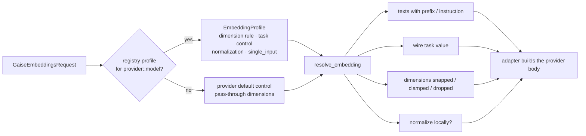

# Embeddings

> Part of the [GAISe wiki](README.md) · [Capabilities](capabilities.md#embeddings) · [Models](models.md) · [HTTP API](api.md#post-v1embeddings) · [Rust SDK](sdk.md#embeddings) · Vendors: [OpenAI](vendor-openai.md) · [Gemini](vendor-gemini.md) · [Vertex AI](vendor-vertexai.md) · [Bedrock](vendor-bedrock.md) · [Ollama](vendor-ollama.md)

Every embedding model GAISe can drive, what each one needs to perform well, and the practices that hold across all of them. Facts are from the official model pages audited **2026-08-20**; numbers you cannot afford to get wrong (dimensions, token limits, task types) carry their source.

## Contents

- [The contract](#the-contract)
- [How a request is resolved](#how-a-request-is-resolved)
- [Model matrix](#model-matrix)
- [Practices that apply to every model](#practices-that-apply-to-every-model)
- [OpenAI](#openai)
- [Google Gemini API](#google-gemini-api)
- [Google Vertex AI](#google-vertex-ai)
- [Amazon Bedrock](#amazon-bedrock)
- [Ollama (local)](#ollama-local)
- [Anthropic](#anthropic)
- [Choosing a model](#choosing-a-model)
- [What GAISe does not do](#what-gaise-does-not-do)

## The contract

Embeddings are standardised the same way [reasoning](reasoning.md) is: one canonical vocabulary with aliases and an escape hatch, one resolver in core, per-model profiles as data, every adapter going through the resolver, and a [generated matrix](#model-matrix) so the page cannot drift from the code.

[`GaiseEmbeddingsRequest`](../gaise-core/src/contracts/gaise_embeddings_request.rs):

| Field | Meaning | Resolved to |
|---|---|---|
| `model` | `provider::model` | — |
| `input` | one string or an array | batched where the provider allows, looped otherwise (Bedrock, Vertex `gemini-embedding-001`) |
| `task` | what the vectors are for — see the vocabulary below | the model's **task control**: a wire field (`taskType`, `input_type`, `embeddingPurpose`), a prompt instruction, a per-side text prefix, a query-only instruction, or nothing |
| `dimensions` | requested vector length | the model's **dimension rule**: clamped into a range, snapped to the nearest of a discrete set (ties upward), or dropped for fixed-size models; forwarded untouched for unknown models |
| `normalize` | unit-length vectors | `true` → native flag where one exists (Titan V2), local L2 otherwise; `false` → raw; unset → provider output, plus local L2 only when `dimensions` truncated a vector the provider leaves un-normalized (`gemini-embedding-001`, Cohere v4, Titan image, Nova) |

**Task vocabulary** ([`GaiseEmbeddingTask`](../gaise-core/src/contracts/gaise_embeddings_request.rs)) — canonical names with the aliases the parser accepts (case-insensitive; `-` and spaces read as `_`):

| Canonical | Aliases | Gemini / Vertex `taskType` | Cohere `input_type` | Nova `embeddingPurpose` | Google instruction | Side |
|---|---|---|---|---|---|---|
| `document` (default) | `retrieval_document`, `search_document`, `index`, `passage`, `generic_index` | `RETRIEVAL_DOCUMENT` | `search_document` | `GENERIC_INDEX` | `title: none \| text: …` | document |
| `query` | `retrieval_query`, `search_query`, `search`, `generic_retrieval`, `text_retrieval` | `RETRIEVAL_QUERY` | `search_query` | `TEXT_RETRIEVAL` | `task: search result \| query: …` | query |
| `classification` | `classify` | `CLASSIFICATION` | `classification` | `CLASSIFICATION` | `task: classification \| text: …` | — |
| `clustering` | `cluster` | `CLUSTERING` | `clustering` | `CLUSTERING` | `task: clustering \| text: …` | — |
| `similarity` | `semantic_similarity`, `sts`, `sentence_similarity` | `SEMANTIC_SIMILARITY` | `search_document` | `GENERIC_INDEX` | `task: sentence similarity \| text: …` | document |
| `code_query` | `code_retrieval_query`, `code`, `code_retrieval` | `CODE_RETRIEVAL_QUERY` | `search_query` | `TEXT_RETRIEVAL` | `task: code retrieval \| query: …` | query |
| `fact_verification` | `fact`, `fact_checking` | `FACT_VERIFICATION` | `search_query` | `TEXT_RETRIEVAL` | `task: fact checking \| query: …` | query |
| `question_answering` | `qa` | `QUESTION_ANSWERING` | `search_query` | `TEXT_RETRIEVAL` | `task: question answering \| query: …` | query |
| anything else | — | upper-cased verbatim | verbatim | upper-cased verbatim (`IMAGE_RETRIEVAL`, `GENERIC_RETRIEVAL`, …) | `task: {value} \| text: …` | document |

"Side" is what prefix-style models (nomic, mxbai, Arctic, Qwen3) key on: query-side tasks get the query prefix or instruction, everything else the document form. Unknown strings become a **custom** task: forwarded to providers with a task field, ignored by the rest — that is how you reach vendor values GAISe has no name for.

[`GaiseEmbeddingsResponse`](../gaise-core/src/contracts/gaise_embeddings_response.rs) returns `output: Vec<Vec<f32>>` in input order and `usage` only when the provider reports token counts (OpenAI, Vertex, Titan; not Gemini, Cohere, Nova, or Ollama beyond `prompt_eval_count`).

```json
{ "model": "gemini::gemini-embedding-001", "task": "query", "dimensions": 768, "input": "how do I rotate an API key?" }
```

## How a request is resolved

Every adapter calls one function, [`resolve_embedding`](../gaise-core/src/contracts/gaise_embeddings_request.rs), with the request, the model's profile, and the provider's default task control:



Profiles live in [`model-registry.toml`](../gaise-core/model-registry.toml) as an `[models.embedding]` table per entry and are read through [`ModelRegistry::embedding_profile`](../gaise-core/src/registry.rs):

```toml
[[models]]
provider = "ollama"
model = "nomic-embed-text:*"
capabilities = ["embeddings"]
[models.embedding]
default_dimensions = 768
dimension_rule = { range = { min = 64, max = 768 } }   # or "fixed", or { set = [256, 512, 1024] }
max_input_tokens = 8192
normalized_output = true
normalizes_truncation = true
task_control = { prefix = { query = "search_query: ", document = "search_document: ", classification = "classification: ", clustering = "clustering: " } }
```

| Profile field | Meaning |
|---|---|
| `default_dimensions` | vector length without `dimensions`; surfaces as `limits.embedding_dimensions` in [`GET /v1/models`](api.md#get-v1models) |
| `dimension_rule` | `"fixed"` (drop `dimensions`), `{ range = { min, max } }` (clamp), `{ set = [...] }` (snap to nearest, ties upward) |
| `max_input_tokens`, `max_batch` | documented limits; surfaced as `limits.max_input_tokens`, not enforced |
| `normalized_output` / `normalizes_truncation` | whether full-size / reduced vectors come back unit-length — decides whether GAISe runs L2 locally |
| `task_control` | `"none"`, `"task_type"`, `"input_type"`, `"embedding_purpose"`, `"prompt_instruction"`, `{ prefix = {...} }`, `{ query_instruction = "..." }` |
| `single_input` | one input per provider call (Vertex `gemini-embedding-001`) |

A model without a profile is not rejected: the adapter's provider default applies (`taskType` on Gemini/Vertex, `input_type` on Cohere, `embeddingPurpose` on Nova, nothing elsewhere), `dimensions` is forwarded for the API to validate, and no prefix is added. Add a profile when a vendor ships a model; the adapters need no change.

## Model matrix

<!-- Generated by `cargo run -p gaise-client --example embedding_matrix --all-features`; registry audited 2026-08-20 -->

Each row runs the provider's real request builder for `task: document` and `task: query` with `dimensions: 300` (an awkward value on purpose) on the sample text `hi`. **Sent** shows the text after any prefix or instruction; **dims** shows the wire value after snapping/clamping (— = omitted); **local L2** marks where GAISe normalizes the result itself because the provider would not.

### openai

| Model | Dimensions (default / options) | Task control | Document → sent | Query → sent | dims sent | local L2 (doc / query) |
|---|---|---|---|---|---|---|
| `text-embedding-3-large` | 3072 (1–3072) | none (task ignored) | unchanged | unchanged | 300 | no / no |
| `text-embedding-3-small` | 1536 (1–1536) | none (task ignored) | unchanged | unchanged | 300 | no / no |
| `text-embedding-ada-002` | 1536 (fixed) | none (task ignored) | unchanged | unchanged | — | no / no |

### gemini

| Model | Dimensions (default / options) | Task control | Document → sent | Query → sent | dims sent | local L2 (doc / query) |
|---|---|---|---|---|---|---|
| `gemini-embedding-2` | 3072 (128–3072) | prompt instruction | `title: none \| text: hi` | `task: search result \| query: hi` | 300 | no / no |
| `gemini-embedding-001` | 3072 (128–3072) | `taskType` field | `taskType: RETRIEVAL_DOCUMENT` · unchanged | `taskType: RETRIEVAL_QUERY` · unchanged | 300 | yes / yes |

### vertexai

| Model | Dimensions (default / options) | Task control | Document → sent | Query → sent | dims sent | local L2 (doc / query) |
|---|---|---|---|---|---|---|
| `gemini-embedding-2` | 3072 (128–3072) | prompt instruction | — (not drivable: not yet: Vertex serves it via :embedContent on the aiplatform.{location}.rep.googleapis.com host, which the adapter does not call; use gemini::gemini-embedding-2) | — | — | — |
| `gemini-embedding-001` | 3072 (1–3072) | `taskType` field | `task_type: RETRIEVAL_DOCUMENT` · unchanged | `task_type: RETRIEVAL_QUERY` · unchanged | 300 | yes / yes |
| `text-embedding-005` | 768 (1–768) | `taskType` field | `task_type: RETRIEVAL_DOCUMENT` · unchanged | `task_type: RETRIEVAL_QUERY` · unchanged | 300 | yes / yes |
| `multimodalembedding@001` | 1408 (128 / 256 / 512 / 1408) | none (task ignored) | — (not drivable: not yet: uses the image/video embedding request schema) | — | — | — |

### bedrock

| Model | Dimensions (default / options) | Task control | Document → sent | Query → sent | dims sent | local L2 (doc / query) |
|---|---|---|---|---|---|---|
| `amazon.nova-2-multimodal-embeddings-v1:0` | 3072 (256 / 384 / 1024 / 3072) | `embeddingPurpose` field (required) | `embeddingPurpose: GENERIC_INDEX` · unchanged | `embeddingPurpose: TEXT_RETRIEVAL` · unchanged | 256 | yes / yes |
| `amazon.titan-embed-text-v2:0` | 1024 (256 / 512 / 1024) | none (task ignored) | unchanged | unchanged | 256 | no / no |
| `amazon.titan-embed-text-v1` | 1536 (fixed) | none (task ignored) | unchanged | unchanged | — | no / no |
| `amazon.titan-embed-image-v1` | 1024 (256 / 384 / 1024) | none (task ignored) | unchanged | unchanged | 256 | yes / yes |
| `cohere.embed-v4:0` | 1536 (256 / 512 / 1024 / 1536) | `input_type` field (required) | `input_type: search_document` · unchanged | `input_type: search_query` · unchanged | 256 | yes / yes |
| `cohere.embed-english-v3` | 1024 (fixed) | `input_type` field (required) | `input_type: search_document` · unchanged | `input_type: search_query` · unchanged | — | no / no |
| `cohere.embed-*` | per tag (fixed) | `input_type` field (required) | `input_type: search_document` · unchanged | `input_type: search_query` · unchanged | — | no / no |

### ollama

| Model | Dimensions (default / options) | Task control | Document → sent | Query → sent | dims sent | local L2 (doc / query) |
|---|---|---|---|---|---|---|
| `embeddinggemma:*` | 768 (128 / 256 / 512 / 768) | prompt instruction | `title: none \| text: hi` | `task: search result \| query: hi` | 256 | no / no |
| `nomic-embed-text:*` | 768 (64–768) | text prefix per side | `search_document: hi` | `search_query: hi` | 300 | no / no |
| `nomic-embed-text-v2-moe:*` | 768 (256–768) | text prefix per side | `search_document: hi` | `search_query: hi` | 300 | no / no |
| `qwen3-embedding:*` | per tag (32–4096) | query instruction | unchanged | `Instruct: Given a web search query, retrieve relevant passages that answer the query\nQuery:hi` | 300 | no / no |
| `mxbai-embed-large:*` | 1024 (fixed) | query instruction | unchanged | `Represent this sentence for searching relevant passages: hi` | — | no / no |
| `bge-m3:*` | 1024 (fixed) | none (task ignored) | unchanged | unchanged | — | no / no |
| `bge-large:*` | 1024 (fixed) | query instruction | unchanged | `Represent this sentence for searching relevant passages: hi` | — | no / no |
| `all-minilm:*` | 384 (fixed) | none (task ignored) | unchanged | unchanged | — | no / no |
| `snowflake-arctic-embed:*` | per tag (fixed) | query instruction | unchanged | `Represent this sentence for searching relevant passages: hi` | — | no / no |
| `snowflake-arctic-embed2:*` | 1024 (256 / 1024) | query instruction | unchanged | `query: hi` | 256 | no / no |
| `granite-embedding:*` | per tag (fixed) | none (task ignored) | unchanged | unchanged | — | no / no |
| `paraphrase-multilingual:*` | 768 (fixed) | none (task ignored) | unchanged | unchanged | — | no / no |

Regenerate after changing a profile or a builder: `cargo run -p gaise-client --example embedding_matrix --all-features` ([`embedding_matrix.rs`](../gaise-client/examples/embedding_matrix.rs)) and paste the output here. The per-provider `parameter_matrix_tests` pin the same behaviour.

## Practices that apply to every model

1. **Never compare vectors from different models — or different versions of the same model.** Vector spaces are not aligned. Store `model` (and `dimensions`) alongside every vector, and re-embed the whole corpus when you change either. Plan for retirements: the [lifecycle calendar](models.md#lifecycle-calendar) lists embedding models with published shutdown dates.
2. **Embed the two sides of retrieval differently when the model supports it.** Asymmetric models (Gemini/Vertex task types, Cohere `input_type`, nomic's prefixes) are trained to map short queries and long passages into the same region; sending everything as `document` quietly costs recall. In GAISe that is `task: "document"` at index time and `task: "query"` at search time.
3. **Use cosine similarity (or dot product on normalized vectors).** Most providers return unit-length vectors; where they do not (truncated `gemini-embedding-001`, some Ollama tags, Titan V2 with `normalize: false`), set `normalize: true` so dot product and cosine agree and your vector store's metric does not matter.
4. **Pick dimensions deliberately.** Matryoshka models (OpenAI text-embedding-3, Gemini Embedding, Titan V2, Cohere v4, embeddinggemma, Qwen3-Embedding, Arctic 2) let you trade storage and query latency for a small quality loss — 512–1024 dimensions keep most of the quality of 3072 for typical retrieval. Choose once per index; changing it means re-embedding.
5. **Chunk to the model, not to the limit.** Limits range from 256 tokens (all-MiniLM) to 32k (Qwen3-Embedding). Retrieval quality usually peaks well below the maximum (a few hundred tokens per chunk with overlap); long inputs are silently truncated by some providers (Vertex `autoTruncate`, Ollama `truncate`) and rejected by others (OpenAI 8,192-token items, Cohere v3 512 tokens).
6. **Batch.** OpenAI accepts up to 2,048 inputs / 300k tokens per call, Gemini `batchEmbedContents` many requests, Vertex up to 250 texts, Cohere up to 96. Fewer, larger calls are cheaper in latency and rate-limit budget. GAISe batches where the provider batches and loops one-by-one on Bedrock.
7. **Normalize text before embedding.** Strip boilerplate, collapse whitespace, keep the language the model was trained on (English-only models degrade sharply on other languages), and keep units/dates in a consistent form — embeddings are sensitive to surface noise.
8. **Keep the raw text.** You will re-embed; store the chunk text and its provenance next to the vector.
9. **Measure.** Build a small labelled set of (query, expected document) pairs and compute recall@k before switching models or dimensions; vendor leaderboards do not transfer to your corpus.
10. **Mind the bill.** Embedding cost is per input token; truncated dimensions do not reduce token cost, only storage. Usage counters come back where the provider reports them.

## OpenAI

Route: `openai::<model>` → `POST /v1/embeddings` ([vendor-openai.md](vendor-openai.md#embeddings)). Source: [embeddings guide](https://developers.openai.com/api/docs/guides/embeddings), [API reference](https://developers.openai.com/api/reference/resources/embeddings/methods/create), model pages.

| Model | Dimensions (default) | Selectable | Max tokens / item | Batch | Normalized | Task param | Price / 1M tokens | Status |
|---|---|---|---|---|---|---|---|---|
| `text-embedding-3-large` | 3072 | any ≤ 3072 via `dimensions` | 8,192 | 2,048 items / 300k tokens per request | yes | — | $0.13 | active |
| `text-embedding-3-small` | 1536 | any ≤ 1536 | 8,192 | same | yes | — | $0.02 | active |
| `text-embedding-ada-002` | 1536 | no | 8,192 | same | yes | — | $0.10 | older; no retirement published |

What GAISe sends ([`openai_embed_request`](../gaise-provider-openai/src/openai_client.rs)): `dimensions` (clamped to the model ceiling, dropped for ada-002), the input array as one request. `task` is ignored (OpenAI has no task parameter). Usage: `prompt_tokens`, `total_tokens`.

Best practices:

- **Use `text-embedding-3-small` unless you have measured a gap.** It is 6.5× cheaper than large and within a few MTEB points; large earns its cost on multilingual or long-tail corpora ("most capable … for both english and non-english tasks").
- **Shorten with `dimensions`, not by slicing.** The API output stays unit-length; if you ever truncate locally, re-normalize (OpenAI's own guide shows why).
- **Cosine = dot product here.** Vectors are normalized to length 1, so use whichever your store computes fastest; rankings are identical.
- **Batch up to 2,048 inputs** but respect the 300k-token-per-request cap and the 8,192-token item limit (items are rejected, not truncated). Empty strings are rejected.
- **Don't start new work on `ada-002`.** It cannot shorten, costs 5× small, and is the obvious next retirement; its space is incompatible with the 3-series.
- Training cutoff is September 2021 for all three — proper nouns coined later embed poorly.

## Google Gemini API

Route: `gemini::<model>` → `batchEmbedContents` ([vendor-gemini.md](vendor-gemini.md#embeddings)). Sources: [embeddings guide](https://ai.google.dev/gemini-api/docs/embeddings), [model page](https://ai.google.dev/gemini-api/docs/models/gemini-embedding-2), [reference](https://ai.google.dev/api/embeddings), [deprecations](https://ai.google.dev/gemini-api/docs/deprecations), [pricing](https://ai.google.dev/gemini-api/docs/pricing).

| Model | Dimensions (default) | Selectable | Max tokens / item | Modalities (vendor) | Normalized (full / truncated) | Task | Price / 1M | Lifecycle |
|---|---|---|---|---|---|---|---|---|
| `gemini-embedding-2` | 3072 | 128–3072 (recommended 768 / 1536 / 3072) | 8,192 shared across modalities, silently truncated | text, image, video, audio, PDF | yes / **yes** (auto) | **prompt instruction**, `taskType` rejected | text $0.20 (batch $0.10); image $0.45; audio $6.50; video $12.00 | stable (GA 2026-04-22) |
| `gemini-embedding-001` | 3072 | 128–3072 | 2,048 | text | yes / **no** | `taskType` (8 values) | $0.15 (batch $0.075) | deprecated → shutdown **2028-05-14** |
| `embedding-2-preview` | — | — | — | — | — | — | — | retired 2026-08-10 |

What GAISe sends ([`gemini_embed_request`](../gaise-provider-gemini/src/contracts/models.rs)): one `requests[]` entry per input (so embedding-2 returns one vector per input rather than one aggregated vector); `taskType` from `task` on embedding-001; on embedding-2 the task is applied as Google's documented instruction prefix (`task: search result | query: …`, `title: none | text: …`, `task: classification | text: …`); `outputDimensionality` clamped to 128–3072; truncated embedding-001 vectors are normalized locally. No usage is reported by this endpoint.

Best practices:

- **Always set `task`.** Google: "Specifying the right task type helps optimize the embeddings for the intended relationships." Index with `document`, search with `query`; use `code_query` for natural-language-to-code search.
- **Prefer `gemini-embedding-2` for new indexes**; it re-normalizes truncated outputs itself, covers 100+ languages, and outlives 001. Its space is **incompatible** with 001 — never mix, and plan a full re-embed before 2028-05-14.
- **Pick 768 or 1536 dimensions** for most retrieval; Google's own recommendation list stops at those plus 3072.
- **Watch the 8,192-token shared budget** on embedding-2: long documents are silently cut, so chunk before you send. PDFs count 258 tokens per page; GAISe's contract is text-only, so image/audio/video inputs are out of scope here.
- **Give documents a title when you have one.** The instruction format is `title: {title} | text: {content}`; GAISe uses `title: none` — prefix your own title into the text if it matters.
- Free tier exists for both models; batch mode halves the price.

## Google Vertex AI

Route: `vertexai::<model>` → `:predict` via the `{{MODEL}}` URL template ([vendor-vertexai.md](vendor-vertexai.md#embeddings)). Sources: [text embeddings API](https://docs.cloud.google.com/vertex-ai/generative-ai/docs/model-reference/text-embeddings-api), [get text embeddings](https://docs.cloud.google.com/vertex-ai/generative-ai/docs/embeddings/get-text-embeddings), [embedding-2 card](https://docs.cloud.google.com/gemini-enterprise-agent-platform/models/gemini/embedding-2), [model versions](https://docs.cloud.google.com/vertex-ai/generative-ai/docs/learn/model-versions), [task types](https://docs.cloud.google.com/vertex-ai/generative-ai/docs/embeddings/task-types).

| Model | Dimensions (default) | Selectable | Max tokens / item | Texts / request | Task | Languages | Lifecycle | GAISe |
|---|---|---|---|---|---|---|---|---|
| `gemini-embedding-2` | 3072 | 128–3072, normalized at all sizes | 8,192 shared | — | prompt instruction | 100+ | GA 2026-04-22 | **not reachable** (needs `:embedContent` on the `.rep.` host) |
| `gemini-embedding-001` | 3072 | ≤ 3072 (truncated vectors **not** normalized) | 2,048 | **1** | `task_type` | ~100 | ≥ 2028-05-20 | native; GAISe loops one text per call |
| `text-embedding-005` | 768 | ≤ 768 | 2,048 | 250 | `task_type` incl. `CODE_RETRIEVAL_QUERY` | English + code | retires **2027-04-01** | native |
| `text-multilingual-embedding-002` | 768 | ≤ 768 | 2,048 | 250 | `task_type` | 100+ | retires 2027-04-01 | native |
| `text-embedding-004` | 768 | ≤ 768 | 2,048 | 250 | `task_type` | — | retires 2027-04-01; no longer in the supported-model table | native (legacy) |
| `multimodalembedding@001` | 1408 | 128 / 256 / 512 / 1408 (text + image) | 32 text tokens | — | — | English | retires 2027-04-01 | out of scope (image/video API) |

What GAISe sends ([`vertex_embed_request`](../gaise-provider-vertexai/src/contracts/models.rs)): per-instance `task_type` (defaults to Vertex's `RETRIEVAL_QUERY` when omitted — set `task: document` when indexing), `outputDimensionality` clamped to 768 for the text-embedding family and 3072 for Gemini Embedding, `autoTruncate: true`, one text per call for `gemini-embedding-001`; truncated non-embedding-2 vectors are normalized locally. Usage: `token_count` per prediction summed across calls, plus billable characters.

Best practices:

- **Respect the per-request envelope**: 250 texts, 20,000 tokens total (a 400, not a truncation), 2,048 tokens per text (silently truncated). GAISe batches one call per request; split large corpora yourself.
- **Set `task` explicitly.** Vertex defaults to `RETRIEVAL_QUERY`, which is the wrong side for indexing.
- **Plan the migration now**: the whole `text-embedding-*` / `text-multilingual-*` / `multimodalembedding@001` family retires 2027-04-01. `gemini-embedding-001` is guaranteed until 2028-05-20; `gemini-embedding-2` is the target, but from GAISe you must reach it via `gemini::` until the Vertex adapter grows an `:embedContent` path.
- Vertex and Gemini API **lifecycles differ** (001: 2028-05-20 vs 2028-05-14) — keep them separate in your own records as the registry does.
- Pricing on Vertex is per 1,000 input **characters**, not tokens; budget accordingly.

## Amazon Bedrock

Route: `bedrock::<model>` → `InvokeModel`, one input per call ([vendor-bedrock.md](vendor-bedrock.md#embeddings)). Sources: [Titan overview](https://docs.aws.amazon.com/bedrock/latest/userguide/titan-embedding-models.html), [Titan parameters](https://docs.aws.amazon.com/bedrock/latest/userguide/model-parameters-titan-embed-text.html), [Cohere v3](https://docs.aws.amazon.com/bedrock/latest/userguide/model-parameters-embed-v3.html), [Cohere v4](https://docs.aws.amazon.com/bedrock/latest/userguide/model-parameters-embed-v4.html), [Nova embeddings schema](https://docs.aws.amazon.com/nova/latest/userguide/embeddings-schema.html), model cards.

| Model | Dimensions (default) | Selectable | Max input | Type parameter | Normalized | Modalities | GAISe |
|---|---|---|---|---|---|---|---|
| `amazon.titan-embed-text-v2:0` | 1024 | 256 / 512 / 1024 | 8,192 tokens / 50,000 chars | — | `normalize` (default true) | text | native: `dimensions` snapped, `normalize` forwarded |
| `amazon.titan-embed-text-v1` | 1536 | no | 8,192 tokens | — | unverified | text | native (text only) |
| `amazon.titan-embed-image-v1` | 1024 | 256 / 384 / 1024 | 256 text tokens; 25 MB image | — | unverified | text, image | text only (no image path); `dimensions` → `embeddingConfig.outputEmbeddingLength` |
| `cohere.embed-v4:0` | 1536 | 256 / 512 / 1024 / 1536 | 128k tokens incl. images; 96 items | `input_type` **required** | unverified | text, image | native: `task` → `input_type`, `dimensions` → `output_dimension` |
| `cohere.embed-english-v3`, `cohere.embed-multilingual-v3` | 1024 | no | 512 tokens per text; 96 texts | `input_type` **required** | unverified | text (+1 image) | native: `task` → `input_type` |
| `amazon.nova-2-multimodal-embeddings-v1:0` | 3072 | 256 / 384 / 1024 / 3072 | 8,192 chars text; 30 s audio/video sync | `embeddingPurpose` **required** | unverified | text, image, audio, video, document | text via the `SINGLE_EMBEDDING` schema: `task` → `embeddingPurpose` (`query` = `TEXT_RETRIEVAL`; pass `generic_retrieval` / `image_retrieval` as a custom task for mixed indexes), `dimensions` → `embeddingDimension`, `truncationMode: END` |

What GAISe sends per family is in [`embedding_bodies`](../gaise-provider-bedrock/src/bedrock_client.rs) (one InvokeModel body per input). Usage: Titan `inputTextTokenCount` summed; Cohere and Nova report none. All Bedrock embedding models are InvokeModel-only and throttled by requests per minute, not tokens.

Best practices:

- **Cohere needs the right `input_type` on both sides** — `search_document` when indexing, `search_query` when searching (Cohere: passages "should be embedded with `input_type="search_document"`" and queries "by setting `input_type="search_query"`"). Until this change GAISe sent `search_document` for everything; re-embed queries if you relied on it.
- **Titan V2 is the cheap default for English text**: 8,192-token inputs, three sizes, native normalization. Leave `normalize` on unless you need raw magnitudes.
- **Cohere v3 truncates at 512 tokens** (`truncate: END` default) — chunk to ~400 tokens. v4 takes 128k tokens but the same chunking advice applies for retrieval quality.
- **Region and profile IDs matter**: `cohere.embed-v4:0` has `us.`/`eu.`/`global.` profiles, Titan is in-region only. List with `GET /v1/models?provider=bedrock&operation=embeddings`.
- **RPM throttling** means batching inside one call helps less than on other providers; GAISe's one-input-per-call loop is the documented shape for Titan, and Cohere's 96-per-call batching is a future optimization.
- Bedrock list prices were not machine-verifiable from the docs at audit time; confirm in the console before sizing a corpus.

## Ollama (local)

Route: `ollama::<tag>` → `POST /api/embed` ([vendor-ollama.md](vendor-ollama.md#embeddings)). Sources: [Ollama embed API](https://docs.ollama.com/api/embed), [embeddings capability](https://docs.ollama.com/capabilities/embeddings), model library pages (dimensions come from the upstream model cards — Ollama does not print them).

| Tag | Dimensions | Context | Matryoshka | Languages | Required prefix / instruction |
|---|---|---|---|---|---|
| `embeddinggemma` (300m) | 768 (512 / 256 / 128) | 2,048 | yes | 100+ | `task: search result \| query: …` / `title: none \| text: …` |
| `nomic-embed-text` (v1.5) | 768 (64–768) | 8,192 (`num_ctx`) | yes | English | `search_document: ` / `search_query: ` / `clustering: ` / `classification: ` |
| `nomic-embed-text-v2-moe` | 768 (256–768) | 512 | yes | ~100 | `search_query: ` / `search_document: ` |
| `qwen3-embedding` 0.6b / 4b / 8b | 1024 / 2560 / 4096 (32–4096) | 32k / 40k / 40k | yes | 100+ | queries: `Instruct: {task}\nQuery:{q}` |
| `mxbai-embed-large` | 1024 | 512 | yes | English | queries: `Represent this sentence for searching relevant passages: ` |
| `bge-m3` | 1024 | 8,192 | no | 100+ | none |
| `bge-large` | 1024 | 512 | no | English | optional query instruction |
| `all-minilm` 22m / 33m | 384 | 256 | no | English | none |
| `snowflake-arctic-embed` 22m–335m | 384–1024 | 512 (137m: 2,048) | no | English | queries: `Represent this sentence for searching relevant passages: ` |
| `snowflake-arctic-embed2` | 1024 (→ 256) | 8,192 | yes | 74 | queries: `query: ` |
| `granite-embedding` 30m / 278m | 384 / 768 | 512 | no | English / 12 | none |
| `paraphrase-multilingual` | 768 | 128 | no | 50+ | none |

What GAISe sends ([`ollama_embed_request`](../gaise-provider-ollama/src/ollama_client.rs)): the input array in one call, `truncate: true`, `dimensions` snapped to the tag's Matryoshka sizes and dropped for fixed-size tags (Ollama ≥ 0.11.11 truncates and re-normalizes; older servers ignore it). `/api/embed` already returns L2-normalized vectors. **`task` applies each family's documented convention from the table above** — nomic's `search_query: ` / `search_document: ` prefixes, the mxbai / Arctic / bge-large query instruction, Qwen3's `Instruct: … Query:` form, Arctic 2's `query: `, EmbeddingGemma's `task: … | query: …` — and leaves text untouched when `task` is unset or the tag has no convention. Usage: `prompt_eval_count`.

Best practices:

- **Set `task` on both sides.** nomic, mxbai, Arctic and Qwen3 are asymmetric; GAISe adds the right prefix or instruction only when it knows which side it is embedding. If you already prepend prefixes yourself, stop — or leave `task` unset so they are not doubled.
- **Match context to the tag.** `all-minilm` sees 256 word pieces and `paraphrase-multilingual` 128 — anything longer is silently truncated. Use `bge-m3`, `nomic-embed-text`, `qwen3-embedding`, or `arctic-embed2` for long chunks; set `options.num_ctx` if the default is lower than the model allows.
- **Use `dimensions` only on Matryoshka-trained tags** (`embeddinggemma`, `qwen3-embedding`, `nomic`, `mxbai`, `arctic-embed2`); truncating others loses quality.
- **Pin the tag digest.** `latest` moves; a re-pulled model is a new vector space. `GET /v1/models?provider=ollama&include_details=true` reports context and embedding length per installed tag.
- `embeddinggemma` and `qwen3-embedding:0.6b` are the best small multilingual defaults; `all-minilm` is only for throwaway prototypes.

## Anthropic

Anthropic has no embeddings API ("Anthropic does not offer its own embedding model") and recommends [Voyage AI](https://platform.claude.com/docs/en/build-with-claude/embeddings). GAISe has no Voyage adapter; `anthropic::…` embeddings return an explicit error. For reference, Voyage's current line (`voyage-4-large`, `voyage-4`, `voyage-4-lite`, `voyage-code-3`, `voyage-context-4` …) offers 1024 default / 256–2048 selectable dimensions, 32k–120k token contexts, a required `input_type` of `query`/`document`, unit-length outputs, and batches of up to 1,000 inputs — a natural next adapter if you need it.

## Choosing a model

| Need | Start with | Because |
|---|---|---|
| General English RAG, lowest cost | `openai::text-embedding-3-small` or `bedrock::amazon.titan-embed-text-v2:0` | cheap, 8k inputs, shortenable, normalized |
| Multilingual corpus | `gemini::gemini-embedding-2` or `openai::text-embedding-3-large` | 100+ languages; embedding-2 also accepts task instructions |
| Code search | `gemini::gemini-embedding-2` (`task: code_query`) or `vertexai::text-embedding-005` | explicit code-retrieval task type |
| Documents and images in one index (vendor-side) | Cohere v4 / Nova MM embeddings (`task: generic_retrieval` for mixed queries) / embedding-2 | multimodal models — text input only through GAISe today |
| Air-gapped / on-device | `ollama::embeddinggemma` or `ollama::qwen3-embedding:0.6b` | small, multilingual, Matryoshka |
| Long chunks (4k+ tokens) | `ollama::qwen3-embedding`, `ollama::bge-m3`, Cohere v4 | 8k–128k contexts |

## What GAISe does not do

- Image / audio / video / PDF embedding inputs (the contract is `OneOrMany<String>`), so multimodal models are text-only here.
- Vertex `gemini-embedding-2` (`:embedContent` on the `.rep.` host) and Vertex `multimodalembedding@001` — listed in the registry with empty operations.
- Cohere 96-item batching on Bedrock (one input per call today).
- Qwen3-Embedding's per-task instruction text: GAISe sends the model card's generic web-search instruction for every query-side task.
- Binary / int8 output types (Titan `embeddingTypes`, Cohere `embedding_types`, Voyage `output_dtype`).
- Dimension and token **cost** estimates; use the returned usage where the provider supplies it.

Keep this page in step with the profiles in [`gaise-core/model-registry.toml`](../gaise-core/model-registry.toml), the resolver in [`gaise_embeddings_request.rs`](../gaise-core/src/contracts/gaise_embeddings_request.rs), and the builders: [`openai_embed_request`](../gaise-provider-openai/src/openai_client.rs), [`gemini_embed_request`](../gaise-provider-gemini/src/contracts/models.rs), [`vertex_embed_request`](../gaise-provider-vertexai/src/contracts/models.rs), [`embedding_bodies`](../gaise-provider-bedrock/src/bedrock_client.rs), [`ollama_embed_request`](../gaise-provider-ollama/src/ollama_client.rs). Regenerate the [matrix](#model-matrix) whenever any of them changes.
