# Flows

> Part of the [GAISe wiki](README.md) · [HTTP API](api.md) · [Rust SDK](sdk.md) · [Capabilities](capabilities.md) · [Models](models.md) · [Examples](examples.md) · Vendors: [OpenAI](vendor-openai.md) · [Anthropic](vendor-anthropic.md) · [Gemini](vendor-gemini.md) · [Vertex AI](vendor-vertexai.md) · [Bedrock](vendor-bedrock.md) · [Ollama](vendor-ollama.md) · [ElevenLabs](vendor-elevenlabs.md)

These diagrams describe the current implementation boundaries. Route-level sequences (one per HTTP endpoint) are in [api.md](api.md); vendor-specific sequences (auth, endpoint paths, event names) are on each vendor page under "Flow".

## Contents

- [Client routing](#client-routing)
- [Non-streaming instruct](#non-streaming-instruct)
- [Multimodal mapping](#multimodal-mapping)
- [Streaming](#streaming)
- [Tool-call loop](#tool-call-loop)
- [Usage normalization](#usage-normalization)
- [Embeddings](#embeddings)
- [Model discovery](#model-discovery)
- [Speech](#speech)
- [Live session](#live-session)
- [Retry and errors](#retry-and-errors)

## Client routing

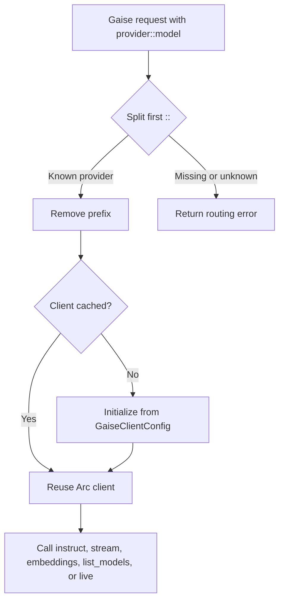

Source: [`GaiseClientService::get_client`](../gaise-client/src/lib.rs). Construction details per provider: [sdk.md#direct-provider-clients](sdk.md#direct-provider-clients).

## Non-streaming instruct

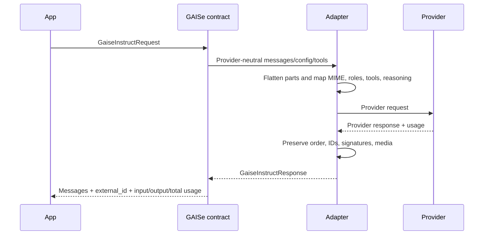

## Multimodal mapping

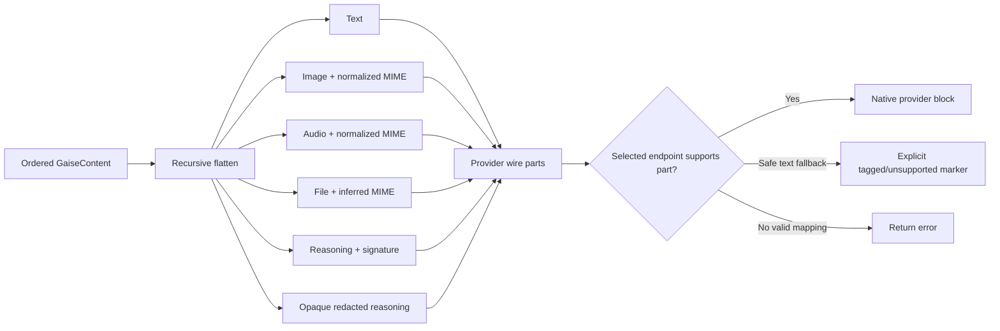

Adapters do not silently discard unsupported content. Whether they can use a text marker or must fail depends on the provider's valid message schema — see the per-provider table in [capabilities.md#modalities-by-provider](capabilities.md#modalities-by-provider) and MIME helpers in [`gaise_content.rs`](../gaise-core/src/contracts/gaise_content.rs).

## Streaming

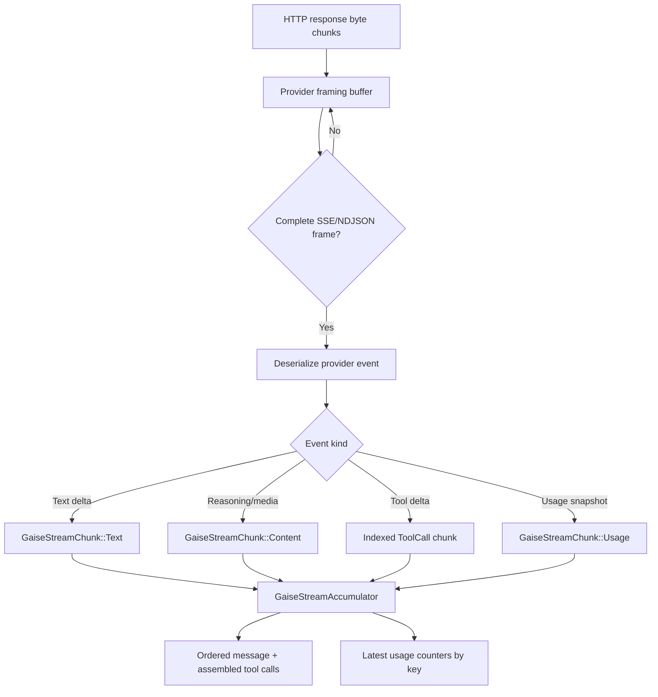

The raw transport chunks are not assumed to align with SSE lines or JSON objects. Buffers retain an incomplete trailing frame until the next network chunk. Chunk variants and the accumulator API: [sdk.md#streaming](sdk.md#streaming); framing per provider: [capabilities.md#streaming](capabilities.md#streaming).

## Tool-call loop

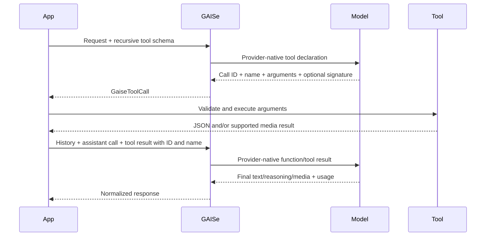

Parallel streaming tool calls are correlated by their provider index. Gemini/Vertex names and thought signatures must be preserved alongside IDs.

## Usage normalization

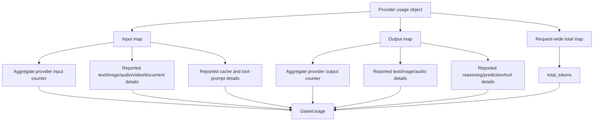

Detail counters overlap aggregates. Missing modality detail stays missing; it is never inferred from content type or aggregate tokens.

## Embeddings

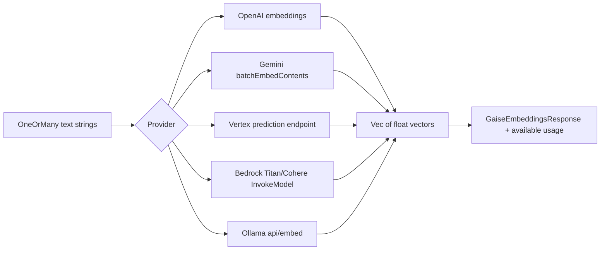

Anthropic has no embeddings branch. The common embedding input is currently text-only. Models and usage per provider: [capabilities.md#embeddings](capabilities.md#embeddings).

## Model discovery

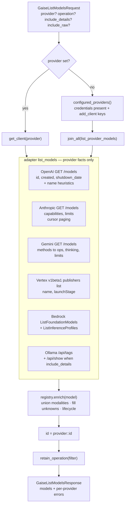

Provider failures inside a fan-out become entries in `errors`; a single-provider request propagates the error. Enrichment runs before the operation filter so registry-supplied operations count. Sources: [`gaise-client/src/lib.rs`](../gaise-client/src/lib.rs), [`gaise-core/src/registry.rs`](../gaise-core/src/registry.rs); semantics: [capabilities.md#model-discovery](capabilities.md#model-discovery); HTTP: [api.md#get-v1models](api.md#get-v1models).

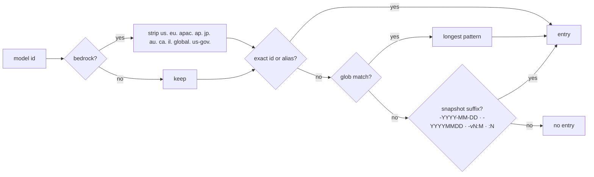

## Speech

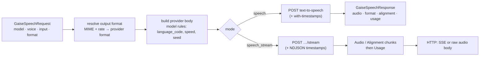

Realtime voice is the [live session](#live-session) flow with text in and audio out ([vendor-elevenlabs.md#live--realtime](vendor-elevenlabs.md#live--realtime)). Sources: [`gaise_speech.rs`](../gaise-core/src/contracts/gaise_speech.rs), [`elevenlabs_client.rs`](../gaise-provider-elevenlabs/src/elevenlabs_client.rs); HTTP: [api.md#post-v1speech](api.md#post-v1speech).

## Live session

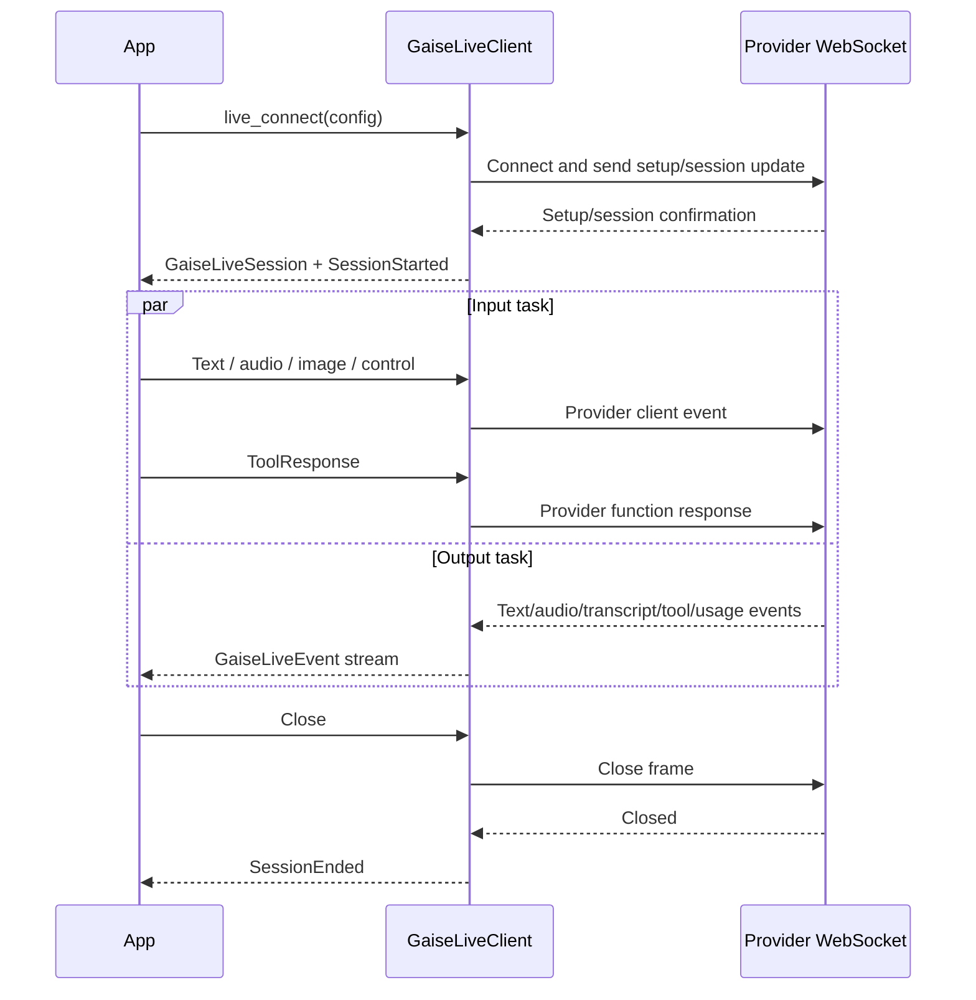

OpenAI uses the current GA nested audio/session shape. Gemini uses `setup`, `realtimeInput`, and `toolResponse`; images are sent as realtime video frames. ElevenLabs sessions carry text in and audio out over `stream-input` (or text-to-dialogue for `eleven_v3*`). A setup error or early socket close is surfaced instead of being reported as a started session. Contracts: [sdk.md#live](sdk.md#live); WebSocket route: [api.md#get-v1live](api.md#get-v1live); providers: [vendor-openai.md#live--realtime](vendor-openai.md#live--realtime), [vendor-gemini.md#live--realtime](vendor-gemini.md#live--realtime).

## Retry and errors

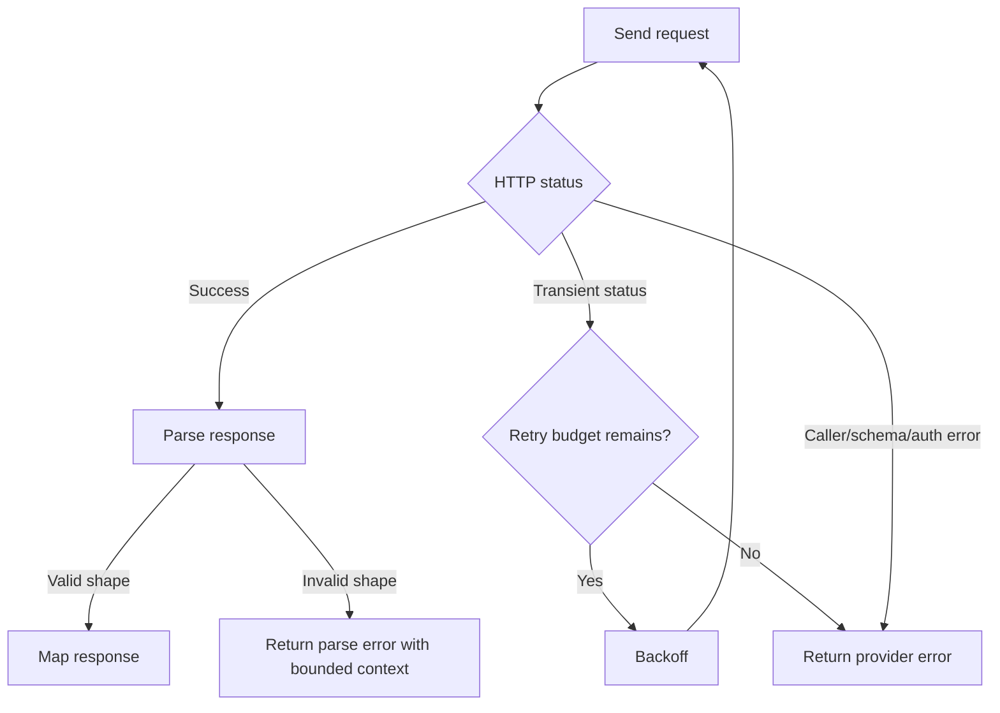

Retries are adapter-specific and limited to transient classes: today only OpenAI retries (429/5xx/transport, plus one retry of the GPT-5.6 function-tool `reasoning_effort` incompatibility — [`send_with_retry`](../gaise-provider-openai/src/openai_client.rs)). Invalid inputs, authentication failures, and unsupported content are not made to look successful. HTTP status mapping: [api.md#errors](api.md#errors).

