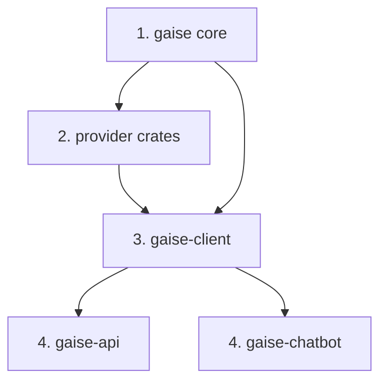

# Releasing GAISe

GAISe is a layered Cargo workspace. Local builds use `path` dependencies, but a packaged crate is verified against the registry `version` requirement. A stale internal version can therefore compile perfectly in the workspace and fail only during `cargo package` or `cargo publish`.

## Version synchronization

Before packaging a release:

1. Set `[workspace.package].version` in the root `Cargo.toml`.
2. Set every internal entry under `[workspace.dependencies]` to that same version.
3. Regenerate `Cargo.lock` and confirm every local `gaise*` package has the release version.
4. Run the offline workspace checks before contacting a registry.

For release 0.2.0, both the workspace package version and all internal dependency requirements must be `0.2.0`. Leaving an internal requirement at `0.1.2` makes a provider tarball compile against the old registry core, which does not contain the current multimodal, reasoning, tool-signature, and usage contracts.

## Dependency and publish order



Publish in dependency layers:

1. `gaise` (the package in `gaise-core`).
2. `gaise-provider-anthropic`, `gaise-provider-bedrock`, `gaise-provider-gemini`, `gaise-provider-ollama`, `gaise-provider-openai`, and `gaise-provider-vertexai`.
3. `gaise-client`.
4. `gaise-api` and `gaise-chatbot`.

Wait until crates.io's index exposes each completed layer before verifying or publishing its dependants. Published versions are immutable; source for an existing version cannot be replaced.

## Local checks

These checks use local fixtures and do not call provider APIs:

```powershell
cargo fmt --all -- --check
cargo check --workspace --all-targets --all-features --locked --offline
cargo clippy --workspace --all-targets --all-features --locked --offline -- -D warnings
cargo test --workspace --all-features --lib --locked --offline
cargo test --workspace --all-features --test mapping_tests --locked --offline
```

Package the core first:

```powershell
cargo package -p gaise
```

Full registry-equivalent verification of a provider requires the matching core version to be visible in the registry. Before that point, a Cargo patch override can still compile the extracted provider tarball against the matching local core:

```powershell
cargo package -p gaise-provider-openai --config "patch.crates-io.gaise.path='D:/absolute/path/to/gaise/gaise-core'"
```

Use `cargo package --no-verify` when only the tarball contents need inspection. The workspace checks above validate the complete codebase using its normal local paths.

`cargo publish --dry-run` performs package extraction and compilation without uploading. A real `cargo publish` mutates crates.io and should only be run deliberately by a release owner. It never runs provider inference, but it is still an irreversible external release action.
