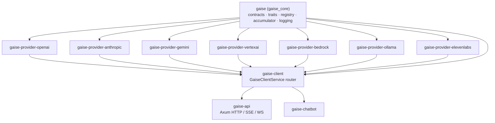
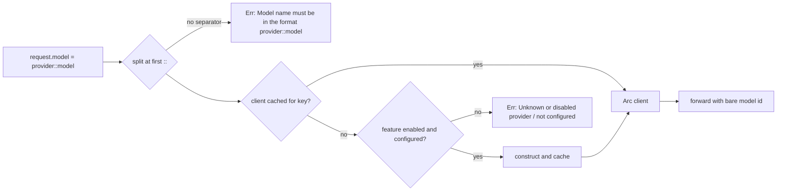
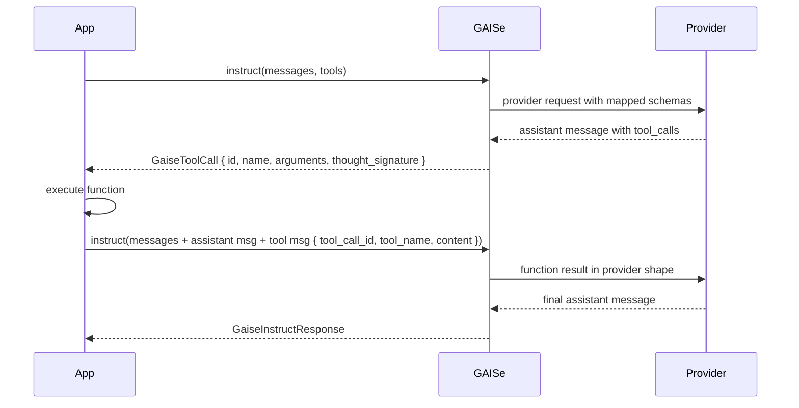
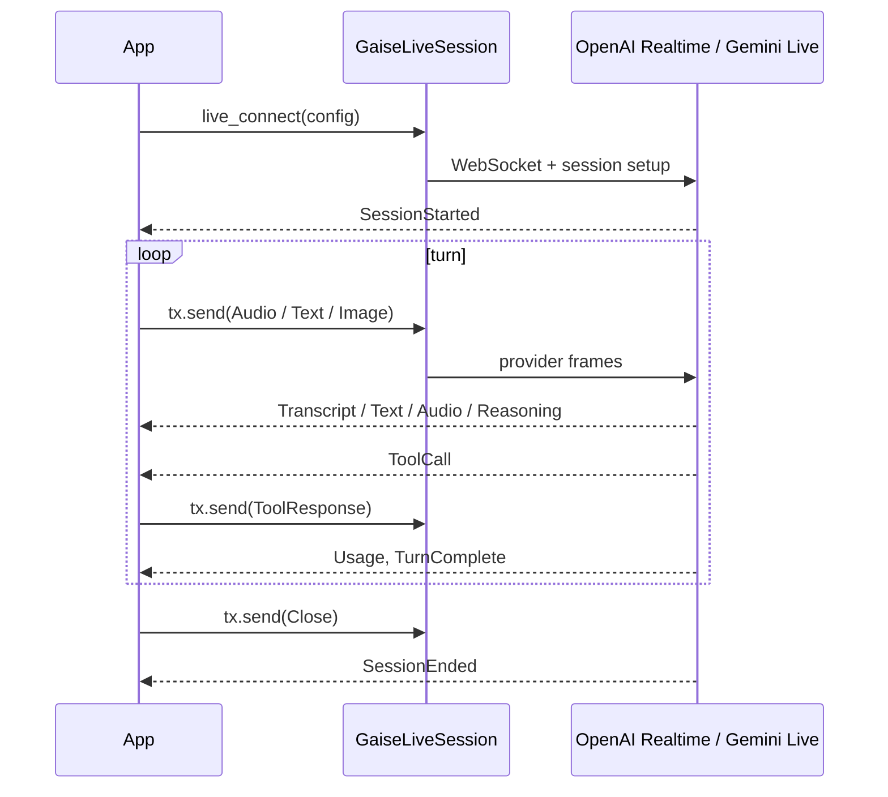
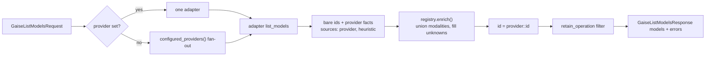

# Rust SDK

> Part of the [GAISe wiki](README.md) · [HTTP API](api.md) · [Capabilities](capabilities.md) · [Models](models.md) · [Flows](flows.md) · [Examples](examples.md) · Vendors: [OpenAI](vendor-openai.md) · [Anthropic](vendor-anthropic.md) · [Gemini](vendor-gemini.md) · [Vertex AI](vendor-vertexai.md) · [Bedrock](vendor-bedrock.md) · [Ollama](vendor-ollama.md) · [ElevenLabs](vendor-elevenlabs.md)

GAISe is consumed as a set of Rust crates. [`gaise`](../gaise-core/) (library name `gaise_core`) defines the provider-neutral contracts and the [`GaiseClient`](../gaise-core/src/lib.rs) / [`GaiseLiveClient`](../gaise-core/src/lib.rs) traits; six `gaise-provider-*` crates implement them; [`gaise-client`](../gaise-client/) routes `provider::model` strings to whichever adapters are compiled in; [`gaise-api`](../gaise-api/) wraps the router in HTTP (see [api.md](api.md)).

## Contents

- [Crates and features](#crates-and-features)
- [Choosing an entry point](#choosing-an-entry-point)
- [The router: `GaiseClientService`](#the-router-gaiseclientservice)
- [Direct provider clients](#direct-provider-clients)
- [Core contracts](#core-contracts)
  - [`OneOrMany`](#oneormany) · [Instruct request](#instruct-request) · [Messages](#messages) · [Content](#content) · [Generation config](#generation-config) · [Tools](#tools) · [Responses](#responses) · [Streaming](#streaming) · [Usage](#usage) · [Embeddings](#embeddings) · [Speech](#speech) · [Live](#live)
- [Model discovery](#model-discovery)
- [Per-request connection overrides](#per-request-connection-overrides)
- [Logging](#logging)
- [Error handling and retries](#error-handling-and-retries)
- [Testing your integration](#testing-your-integration)
- [Releasing](#releasing)

## Crates and features



| Crate | Path | Purpose |
|---|---|---|
| `gaise` | [`gaise-core/`](../gaise-core/) | Contracts ([`contracts/`](../gaise-core/src/contracts/)), traits ([`lib.rs`](../gaise-core/src/lib.rs)), bundled model registry ([`registry.rs`](../gaise-core/src/registry.rs), [`model-registry.toml`](../gaise-core/model-registry.toml)), stream accumulator, logging |
| `gaise-client` | [`gaise-client/`](../gaise-client/) | Feature-gated router, `GaiseClientConfig`, aggregate `list_models` |
| `gaise-provider-openai` | [`gaise-provider-openai/`](../gaise-provider-openai/) | Chat Completions, Embeddings, Realtime (`live`) — [vendor page](vendor-openai.md) |
| `gaise-provider-anthropic` | [`gaise-provider-anthropic/`](../gaise-provider-anthropic/) | Messages — [vendor page](vendor-anthropic.md) |
| `gaise-provider-gemini` | [`gaise-provider-gemini/`](../gaise-provider-gemini/) | generateContent, Embeddings, Live (`live`) — [vendor page](vendor-gemini.md) |
| `gaise-provider-vertexai` | [`gaise-provider-vertexai/`](../gaise-provider-vertexai/) | Vertex generateContent, Embeddings — [vendor page](vendor-vertexai.md) |
| `gaise-provider-bedrock` | [`gaise-provider-bedrock/`](../gaise-provider-bedrock/) | Converse/ConverseStream, InvokeModel embeddings — [vendor page](vendor-bedrock.md) |
| `gaise-provider-ollama` | [`gaise-provider-ollama/`](../gaise-provider-ollama/) | Local chat and embeddings — [vendor page](vendor-ollama.md) |
| `gaise-provider-elevenlabs` | [`gaise-provider-elevenlabs/`](../gaise-provider-elevenlabs/) | Text-to-speech, streaming speech, realtime voice (`live`) — [vendor page](vendor-elevenlabs.md) |
| `gaise-api` | [`gaise-api/`](../gaise-api/) | HTTP server — [api.md](api.md) |
| `gaise-chatbot` | [`gaise-chatbot/`](../gaise-chatbot/) | Minimal CLI example |

```toml
[dependencies]
gaise-core = { package = "gaise", version = "0.2" }
gaise-client = { version = "0.2", default-features = false, features = ["openai", "anthropic", "live"] }
```

[`gaise-client`](../gaise-client/Cargo.toml) enables all seven providers by default. The `live` feature adds `GaiseLiveClient` support for whichever of `openai` and `gemini` are also enabled.

| Feature | Pulls in | Surfaces |
|---|---|---|
| `openai` | `gaise-provider-openai` | Chat Completions, Embeddings, `GET /v1/models` |
| `anthropic` | `gaise-provider-anthropic` | Messages, `GET /v1/models` |
| `gemini` | `gaise-provider-gemini` | generateContent, batchEmbedContents, `models.list` |
| `vertexai` | `gaise-provider-vertexai` | generateContent, `:predict` embeddings, Model Garden listing |
| `bedrock` | `gaise-provider-bedrock` | Converse, ConverseStream, InvokeModel, `ListFoundationModels` |
| `ollama` | `gaise-provider-ollama` | `/api/chat`, `/api/embed`, `/api/tags` |
| `elevenlabs` | `gaise-provider-elevenlabs` | Text-to-speech, `GET /v1/models`, `GaiseSpeechClient` on the router |
| `live` | `openai?/live`, `gemini?/live`, `elevenlabs?/live` | OpenAI Realtime, Gemini Live, ElevenLabs realtime voice |

## Choosing an entry point

| Use | When |
|---|---|
| [`GaiseClientService`](#the-router-gaiseclientservice) | You pick providers at runtime, want `provider::model` routing, aggregate model listing, and a single logger hook. |
| [Direct provider client](#direct-provider-clients) | You want the smallest dependency set, raw model IDs, or a provider-specific constructor option (`with_version`, `with_clients`). |
| [`gaise-api`](api.md) | Non-Rust consumers; the same contracts over JSON/SSE/WebSocket. |

Both entry points implement the same trait:

```rust
#[async_trait]
pub trait GaiseClient: Send + Sync {
    async fn instruct(&self, request: &GaiseInstructRequest) -> Result<GaiseInstructResponse, BoxErr>;
    async fn instruct_stream(&self, request: &GaiseInstructRequest) -> Result<Pin<Box<dyn Stream<Item = Result<GaiseInstructStreamResponse, BoxErr>> + Send>>, BoxErr>;
    async fn embeddings(&self, request: &GaiseEmbeddingsRequest) -> Result<GaiseEmbeddingsResponse, BoxErr>;
    /// Default body returns "not supported" so custom clients keep compiling.
    async fn list_models(&self, request: &GaiseListModelsRequest) -> Result<GaiseListModelsResponse, BoxErr>;
}

#[async_trait]
pub trait GaiseSpeechClient: Send + Sync {
    async fn speech(&self, request: &GaiseSpeechRequest) -> Result<GaiseSpeechResponse, BoxErr>;
    async fn speech_stream(&self, request: &GaiseSpeechRequest) -> Result<Pin<Box<dyn Stream<Item = Result<GaiseSpeechStreamResponse, BoxErr>> + Send>>, BoxErr>;
}
```

Source: [`gaise-core/src/lib.rs`](../gaise-core/src/lib.rs). `GaiseClientService` implements `GaiseSpeechClient` when the `elevenlabs` feature is on.

## The router: `GaiseClientService`

```rust
use gaise_client::{GaiseClientConfig, GaiseClientService};
use gaise_core::GaiseClient;

let service = GaiseClientService::new(GaiseClientConfig {
    openai_api_url: Some("https://api.openai.com/v1".into()),
    openai_api_key: std::env::var("OPENAI_API_KEY").ok(),
    anthropic_api_url: Some("https://api.anthropic.com/v1".into()),
    anthropic_api_key: std::env::var("ANTHROPIC_API_KEY").ok(),
    gemini_api_url: Some("https://generativelanguage.googleapis.com/v1beta".into()),
    gemini_api_key: std::env::var("GEMINI_API_KEY").ok(),
    vertexai_api_url: std::env::var("VERTEXAI_API_URL").ok(),
    vertexai_sa: service_account, // Option<ServiceAccount>
    bedrock_region: Some("eu-west-2".into()),
    ollama_url: Some("http://localhost:11434".into()),
    elevenlabs_api_key: std::env::var("ELEVENLABS_API_KEY").ok(),
    elevenlabs_api_url: None,
    logger: None,
});

let response = service.instruct(&request).await?;
let stream = service.instruct_stream(&request).await?;
let embeddings = service.embeddings(&embedding_request).await?;
let catalog = service.list_models(&GaiseListModelsRequest::default()).await?;
let clip = service.speech(&speech_request).await?;   // feature = "elevenlabs"
```

Config fields are conditionally compiled by feature ([`GaiseClientConfig`](../gaise-client/src/lib.rs)). Clients are built lazily on first use and cached per provider key ([`get_client`](../gaise-client/src/lib.rs)); [`add_client`](../gaise-client/src/lib.rs) registers any `Arc<dyn GaiseClient>` under a custom key, which then participates in routing and aggregate listing.

### Routing



| Routed ID | Provider receives |
|---|---|
| `openai::gpt-5.6-terra` | `gpt-5.6-terra` |
| `anthropic::claude-opus-5` | `claude-opus-5` |
| `gemini::gemini-3.6-flash` | `gemini-3.6-flash` |
| `vertexai::gemini-3.5-flash` | `gemini-3.5-flash` |
| `bedrock::us.anthropic.claude-sonnet-5` | `us.anthropic.claude-sonnet-5` |
| `ollama::qwen3:8b` | `qwen3:8b` |

The router also strips empty text chunks from streams and, when a logger is configured, logs every request, response, stream chunk, and listing. With the `live` feature it implements `GaiseLiveClient` for `openai::gpt-realtime-*` and `gemini::*-live-*` models ([`get_live_client`](../gaise-client/src/lib.rs)).

### Environment variables

[`gaise-api/src/main.rs`](../gaise-api/src/main.rs) shows the canonical mapping from environment to `GaiseClientConfig`:

| Variable | Field | Notes |
|---|---|---|
| `OPENAI_API_KEY`, `OPENAI_API_URL` | `openai_api_key`, `openai_api_url` | URL defaults to `https://api.openai.com/v1`; `OPENAI_API_TIER` is read by the provider crate ([vendor-openai](vendor-openai.md#configuration)) |
| `ANTHROPIC_API_KEY`, `ANTHROPIC_API_URL` | `anthropic_api_key`, `anthropic_api_url` | URL defaults to `https://api.anthropic.com/v1` |
| `GEMINI_API_KEY`, `GEMINI_API_URL` | `gemini_api_key`, `gemini_api_url` | URL defaults to `https://generativelanguage.googleapis.com/v1beta` |
| `VERTEXAI_SA_PATH`, `VERTEXAI_API_URL` | `vertexai_sa`, `vertexai_api_url` | Service-account JSON path; URL is a `{{MODEL}}` template; `VERTEXAI_API_TIER` optional ([vendor-vertexai](vendor-vertexai.md#configuration)) |
| `BEDROCK_REGION` | `bedrock_region` | Passed into the SDK builder; credentials from the AWS chain ([vendor-bedrock](vendor-bedrock.md#configuration)) |
| `OLLAMA_URL` | `ollama_url` | Defaults to `http://localhost:11434` for routing; must be set to be included in aggregate listing |
| `ELEVENLABS_API_KEY`, `ELEVENLABS_API_URL` | `elevenlabs_api_key`, `elevenlabs_api_url` | URL defaults to `https://api.elevenlabs.io`; regional residency hosts allowed ([vendor-elevenlabs](vendor-elevenlabs.md#configuration)) |

## Direct provider clients

Direct clients take raw provider model IDs.

```rust
use gaise_provider_openai::openai_client::GaiseClientOpenAI;
let openai = GaiseClientOpenAI::new("https://api.openai.com/v1".into(), std::env::var("OPENAI_API_KEY")?);

use gaise_provider_anthropic::anthropic_client::GaiseClientAnthropic;
let anthropic = GaiseClientAnthropic::new("https://api.anthropic.com/v1".into(), std::env::var("ANTHROPIC_API_KEY")?)
    .with_version("2023-06-01".into());

use gaise_provider_gemini::gemini_client::GaiseClientGemini;
let gemini = GaiseClientGemini::new("https://generativelanguage.googleapis.com/v1beta".into(), std::env::var("GEMINI_API_KEY")?);

use gaise_provider_vertexai::{contracts::ServiceAccount, vertexai_client::GaiseClientVertexAI};
let sa: ServiceAccount = serde_json::from_str(&std::fs::read_to_string(std::env::var("VERTEXAI_SA_PATH")?)?)?;
let vertex = GaiseClientVertexAI::new(
    &sa,
    "https://us-central1-aiplatform.googleapis.com/v1/projects/PROJECT/locations/us-central1/publishers/google/models/{{MODEL}}".into(),
).await?;

use gaise_provider_bedrock::bedrock_client::GaiseClientBedrock;
let bedrock = GaiseClientBedrock::new_with_region(Some("eu-west-2".into())).await;

use gaise_provider_ollama::ollama_client::GaiseClientOllama;
let ollama = GaiseClientOllama::new("http://localhost:11434".into());

use gaise_provider_elevenlabs::elevenlabs_client::GaiseClientElevenLabs;
let elevenlabs = GaiseClientElevenLabs::new("https://api.elevenlabs.io".into(), std::env::var("ELEVENLABS_API_KEY")?);
```

Live clients: [`GaiseClientOpenAILive::new(base_url, key)`](../gaise-provider-openai/src/openai_live_client.rs) and [`GaiseClientGeminiLive::new(base_url, key)`](../gaise-provider-gemini/src/gemini_live_client.rs) behind each crate's `live` feature.

Constructor details, extra env vars, and per-provider options are on the vendor pages: [OpenAI](vendor-openai.md#configuration) · [Anthropic](vendor-anthropic.md#configuration) · [Gemini](vendor-gemini.md#configuration) · [Vertex AI](vendor-vertexai.md#configuration) · [Bedrock](vendor-bedrock.md#configuration) · [Ollama](vendor-ollama.md#configuration) · [ElevenLabs](vendor-elevenlabs.md#configuration).

## Core contracts

All types live in [`gaise_core::contracts`](../gaise-core/src/contracts/mod.rs); the usual import is `use gaise_core::contracts::*;`.

### `OneOrMany`

`OneOrMany<T>` ([`mod.rs`](../gaise-core/src/contracts/mod.rs)) accepts a single value or a vector — in JSON, an object or an array — and is used for request messages and message content.

### Instruct request

[`GaiseInstructRequest`](../gaise-core/src/contracts/gaise_instruct_request.rs):

| Field | Type | Notes |
|---|---|---|
| `model` | `String` | `provider::model` through the router, bare ID through a direct client |
| `input` | `OneOrMany<GaiseMessage>` | Ordered conversation |
| `generation_config` | `Option<GaiseGenerationConfig>` | See [Generation config](#generation-config) |
| `tools` | `Option<Vec<GaiseTool>>` | See [Tools](#tools) |
| `tool_config` | `Option<GaiseToolConfig>` | `mode` such as `auto`, `any`/`required`, `none` — mapped per provider |
| `correlation_id` | `Option<String>` | Echoed to the logger |
| `connection` | `Option<GaiseConnection>` | Per-request endpoint/credential override ([below](#per-request-connection-overrides)) |

### Messages

[`GaiseMessage`](../gaise-core/src/contracts/gaise_message.rs):

| Field | Purpose |
|---|---|
| `role` | `system`, `user`, `assistant`, or `tool` |
| `content` | `OneOrMany<GaiseContent>`, order preserved |
| `tool_calls` | Assistant-requested function calls (`GaiseToolCall { id, function: { name, arguments }, thought_signature }`) |
| `tool_call_id` | Provider call ID when this message returns a tool result |
| `tool_name` | Function name; **required** for Gemini/Vertex function responses, optional elsewhere |

System messages are lifted into each provider's top-level system shape; multiple system blocks keep their order.

### Content

[`GaiseContent`](../gaise-core/src/contracts/gaise_content.rs):

| Variant | Fields | Use |
|---|---|---|
| `Text` | `text` | Prompts and returned text |
| `Image` | `data`, `format` | Image input, or generated image output |
| `Audio` | `data`, `format` | Audio input, or returned audio where mapped |
| `File` | `data`, `name` | Documents; MIME inferred from the extension by [`file_media_type`](../gaise-core/src/contracts/gaise_content.rs) |
| `Reasoning` | `text`, `signature` | Provider-returned thought summary; keep the signature for later turns |
| `RedactedReasoning` | `data` | Opaque encrypted reasoning — replay unchanged, never display |
| `Parts` | `parts` | Nesting; adapters flatten recursively in order |

Byte fields serialize as integer arrays in JSON. `format` accepts a MIME type or shorthand (`png`, `jpeg`, `wav`, `mp3`, …) normalized by [`image_media_type`](../gaise-core/src/contracts/gaise_content.rs) / [`audio_media_type`](../gaise-core/src/contracts/gaise_content.rs). What each provider does with each variant is tabulated in [capabilities.md](capabilities.md#modalities-by-provider).

### Generation config

[`GaiseGenerationConfig`](../gaise-core/src/contracts/gaise_generation_config.rs) — every field optional; adapters omit controls the selected model cannot accept rather than sending invalid combinations.

| Field | Meaning | Notes |
|---|---|---|
| `temperature`, `top_p`, `top_k` | Sampling | Dropped where the family rejects them: Claude Opus 5/4.7/4.8, Sonnet 5, Fable/Mythos 5; every Gemini 3.x; GPT-5.x unless effort is `none`; either/or on Claude 4.5 and Nova v1 ([capabilities.md#parameter-compatibility-by-family](capabilities.md#parameter-compatibility-by-family)) |
| `max_tokens` | Output budget | OpenAI `max_completion_tokens`, Anthropic `max_tokens`, Gemini `maxOutputTokens`, Ollama `num_predict` |
| `thinking_tokens` | Manual reasoning budget | Anthropic `budget_tokens`, Gemini 2.5 `thinkingBudget`, Bedrock Claude/Nova budgets |
| `thinking_effort` | `none`, `auto`, `minimal`, `low`, `medium`, `high`, `xhigh`, `max`, `ultra` (+ aliases such as `off`, `adaptive`, `extra_high`, `ultracode`) | Resolved per family through [`GaiseReasoningEffort`](../gaise-core/src/contracts/gaise_reasoning.rs): `ultra` = the most the model offers, unsupported levels snap to the nearest, custom strings pass through. Full mapping: [reasoning.md](reasoning.md) |
| `include_thoughts` | Ask for thought summaries | Anthropic `thinking.display`, Gemini `includeThoughts` (defaults on when reasoning requested) |
| `response_modalities` | `TEXT`, `IMAGE`, `AUDIO` | Gemini/Vertex `responseModalities` |
| `image_config` | `aspect_ratio`, `image_size` | Gemini/Vertex `responseFormat.image` |
| `input_image_detail` | `auto`, `low`, `high`, `original` | OpenAI image URL `detail` |
| `input_media_resolution` | `low`, `medium`, `high`, `MEDIA_RESOLUTION_*` | Gemini/Vertex |
| `cache_key` | Stable cache hint | OpenAI `prompt_cache_key`; Anthropic uses ephemeral cache control instead |

Per-provider field mappings: [OpenAI](vendor-openai.md#generation-config) · [Anthropic](vendor-anthropic.md#generation-config) · [Gemini](vendor-gemini.md#generation-config) · [Vertex AI](vendor-vertexai.md#generation-config) · [Bedrock](vendor-bedrock.md#generation-config) · [Ollama](vendor-ollama.md#generation-config).

### Tools

[`GaiseTool`](../gaise-core/src/contracts/gaise_tool_parameter.rs) has `name`, `description`, and a recursive [`GaiseToolParameter`](../gaise-core/src/contracts/gaise_tool_parameter.rs) schema (`type`, `description`, `properties: BTreeMap`, `items`, `required`, `enum`) — deterministic ordering, nested objects and arrays.

```rust
let tool = GaiseTool {
    name: "lookup".into(),
    description: Some("Look up an item".into()),
    parameters: Some(GaiseToolParameter {
        r#type: Some("object".into()),
        properties: Some(BTreeMap::from([(
            "ids".into(),
            GaiseToolParameter {
                r#type: Some("array".into()),
                items: Some(Box::new(GaiseToolParameter { r#type: Some("string".into()), ..Default::default() })),
                ..Default::default()
            },
        )])),
        required: Some(vec!["ids".into()]),
        ..Default::default()
    }),
};
```

Tool-call loop:



Return results as a `tool` role message carrying both `tool_call_id` and `tool_name`, and replay the assistant message (including `thought_signature`) unchanged.

### Responses

[`GaiseInstructResponse`](../gaise-core/src/contracts/gaise_instruct_response.rs): `output: Vec<GaiseMessage>`, `external_id: Option<String>` (provider response ID), `usage: Option<GaiseUsage>`.

### Streaming

`instruct_stream` yields [`GaiseInstructStreamResponse`](../gaise-core/src/contracts/gaise_instruct_stream_response.rs) items whose `chunk` is a [`GaiseStreamChunk`](../gaise-core/src/contracts/gaise_instruct_stream_response.rs):

| Variant | Payload |
|---|---|
| `Text(String)` | Text delta |
| `Content(GaiseContent)` | Complete reasoning / media part |
| `ToolCall { index, id, name, arguments, thought_signature }` | Indexed, incrementally assembled function call |
| `Usage(GaiseUsage)` | Cumulative usage snapshot |

[`GaiseStreamAccumulator`](../gaise-core/src/contracts/gaise_instruct_stream_response.rs) (`new` → `push` → `finish`) preserves order, coalesces adjacent text/reasoning, assembles parallel tool calls by index, and keeps the latest usage counters.

```rust
use futures_util::StreamExt;
let mut stream = service.instruct_stream(&request).await?;
let mut acc = GaiseStreamAccumulator::new();
while let Some(item) = stream.next().await {
    let item = item?;
    if let GaiseStreamChunk::Text(t) = &item.chunk { print!("{t}"); }
    acc.push(&item);
}
let message = acc.finish();
```

All parsers tolerate SSE/NDJSON frames split across arbitrary byte boundaries ([flows.md#streaming](flows.md#streaming)).

### Usage

[`GaiseUsage`](../gaise-core/src/contracts/gaise_usage.rs) has three independent maps — `input`, `output`, `total` — keyed by provider-native counter names. Values inside a map may overlap (an aggregate includes its modality, reasoning, and cache subsets), so never sum a map. `total_tokens` belongs in `total`. Per-provider counter names: [capabilities.md#usage-counters](capabilities.md#usage-counters).

### Embeddings

[`GaiseEmbeddingsRequest`](../gaise-core/src/contracts/gaise_embeddings_request.rs) (`model`, `input: OneOrMany<String>`, `task: Option<GaiseEmbeddingTask>`, `dimensions`, `normalize`, `correlation_id`, `connection`) → [`GaiseEmbeddingsResponse`](../gaise-core/src/contracts/gaise_embeddings_response.rs) (`output: Vec<Vec<f32>>`, `external_id`, `usage`). Embed corpus text with `task: Document` and queries with `task: Query` (`GaiseEmbeddingTask::parse` accepts aliases and turns unknown vendor values into `Custom`); use `dimensions` for Matryoshka models; set `normalize: true` when you mix dot-product and cosine. Adapters resolve all three through [`resolve_embedding`](../gaise-core/src/contracts/gaise_embeddings_request.rs) and the model's [`EmbeddingProfile`](../gaise-core/src/contracts/gaise_embeddings_request.rs) from the registry (`gaise_core::registry::embedding_profile(provider, model)`), so prefixes, wire task fields, dimension snapping, and local normalization are applied consistently — see [embeddings.md](embeddings.md#how-a-request-is-resolved). The contract is text-only even where a provider sells multimodal embeddings. Per-model limits and practices: [embeddings.md](embeddings.md).

### Speech

[`GaiseSpeechRequest`](../gaise-core/src/contracts/gaise_speech.rs) (`model`, `input`, `voice`, `format`, `sample_rate`, `language`, `voice_settings`, `instructions`, `seed`, `include_alignment`) → [`GaiseSpeechResponse`](../gaise-core/src/contracts/gaise_speech.rs) (`audio` bytes, `format` MIME, `sample_rate`, `external_id`, `alignment`, `usage`). `speech_stream` yields [`GaiseSpeechStreamResponse`](../gaise-core/src/contracts/gaise_speech.rs) items whose `chunk` is `Audio { data, format, sample_rate }`, `Alignment(GaiseSpeechAlignment)`, or `Usage(GaiseUsage)`.

```rust
use gaise_core::GaiseSpeechClient;
use gaise_core::contracts::{GaiseSpeechChunk, GaiseSpeechRequest, GaiseVoiceSettings};

let request = GaiseSpeechRequest {
    model: "elevenlabs::eleven_flash_v2_5".into(),
    voice: Some(voice_id),
    input: "Welcome to GAISe.".into(),
    format: Some("audio/pcm".into()),
    sample_rate: Some(24_000),
    voice_settings: Some(GaiseVoiceSettings { stability: Some(0.5), ..Default::default() }),
    ..Default::default()
};
let clip = service.speech(&request).await?;            // clip.audio, clip.format
let mut stream = service.speech_stream(&request).await?;
while let Some(item) = stream.next().await {
    if let GaiseSpeechChunk::Audio { data, .. } = item?.chunk { player.write(&data); }
}
```

Realtime text-in/audio-out reuses [Live](#live): `live_connect` with `voice` set, send `GaiseLiveInput::Text` fragments, receive `GaiseLiveEvent::Audio` (+ `Transcript`), send `AudioStreamEnd` to flush. Provider: [vendor-elevenlabs.md](vendor-elevenlabs.md).

### Live

Behind the `live` feature, [`GaiseLiveClient::live_connect`](../gaise-core/src/lib.rs) takes a [`GaiseLiveConfig`](../gaise-core/src/contracts/gaise_live_config.rs) (model, system instruction, voice, `modalities`, tools, generation config, VAD, transcription) and returns a [`GaiseLiveSession`](../gaise-core/src/contracts/gaise_live_session.rs) with a `tx` channel of [`GaiseLiveInput`](../gaise-core/src/contracts/gaise_live_input.rs) and an `rx` stream of [`GaiseLiveEvent`](../gaise-core/src/contracts/gaise_live_event.rs).



Inputs: `Text`, `Audio { data, sample_rate }`, `Image`, `ToolResponse`, `ActivityStart`/`ActivityEnd`, `AudioStreamEnd`, `ClearAudio`, `CancelResponse`, `Close`. ElevenLabs sessions are text-in/audio-out only ([vendor-elevenlabs](vendor-elevenlabs.md#live--realtime)). Events: `session_started`, `text`, `audio`, `transcript`, `reasoning`, `tool_call`, `tool_call_cancelled`, `turn_complete`, `interrupted`, `usage`, `error`, `session_ended`. Operations a provider cannot perform produce an `error` event, never a silent success. Provider differences: [vendor-openai](vendor-openai.md#live--realtime) · [vendor-gemini](vendor-gemini.md#live--realtime); wire examples: [examples.md#live--realtime](examples.md#live--realtime).

## Model discovery

```rust
use gaise_core::contracts::{GaiseListModelsRequest, GaiseOperation};

// Everything the configured providers can list, enriched and routable.
let all = service.list_models(&GaiseListModelsRequest::default()).await?;
for m in &all.models {
    println!("{:<45} {:?} in={:?} out={:?}", m.id, m.capabilities.operations, m.capabilities.input, m.capabilities.output);
}
for e in &all.errors {
    eprintln!("{}: {}", e.provider, e.message);
}

// Only embedding models from one provider.
let embed = service.list_models(&GaiseListModelsRequest {
    provider: Some("openai".into()),
    operation: Some(GaiseOperation::Embeddings),
    ..Default::default()
}).await?;
```

[`GaiseModel`](../gaise-core/src/contracts/gaise_model.rs) fields: `id` (routable), `provider`, `display_name`, `description`, `created_at`, `status`, `retires_on`, `retirement_not_before`, `replacement`, `notes`, `capabilities` (`input`, `output`, `operations` — `instruct`, `instruct_stream`, `embeddings`, `speech`, `live` — `tools`, `reasoning`, `reasoning_values`, `structured_output`, `sources`), `limits` (`context_window`, `max_input_tokens`, `max_output_tokens`, `max_input_characters`, `embedding_dimensions` — see [limits.md](limits.md)), `raw`.



Rules (enforced in [`gaise-client/src/lib.rs`](../gaise-client/src/lib.rs) and [`registry.rs`](../gaise-core/src/registry.rs)):

- `GaiseSupport` is tri-state; empty modality lists mean *unknown*. Check `capabilities.sources` to see whether a claim is provider-reported, registry-filled, or heuristic.
- The registry may add modalities but never removes one; operations and flags are filled only when unknown (an explicit registry `operations = []` override beats a name heuristic).
- Aggregate listings never fail because one provider failed — read `errors`. A single-provider request propagates the error.
- `include_details` triggers extra per-model calls (Ollama `/api/show`); `include_raw` attaches the provider's native record.
- Direct clients return bare IDs and no registry overlay; call [`gaise_core::registry::enrich`](../gaise-core/src/registry.rs) yourself if you need it.
- `limits` is filled field by field: a provider-reported `context_window` or `max_output_tokens` is kept and the registry supplies only what is still `None` ([`GaiseModelLimits::fill`](../gaise-core/src/contracts/gaise_model.rs)).

For the documented limits without a provider round-trip, read the registry directly — [`gaise_core::registry::limits_matrix(provider)`](../gaise-core/src/registry.rs) returns a [`GaiseModelLimitsMatrix`](../gaise-core/src/contracts/gaise_model.rs) (`audited_on`, one [`GaiseModelLimitsEntry`](../gaise-core/src/contracts/gaise_model.rs) per entry with `id`, `status`, `operations`, and the limits), which is what `GET /v1/models/limits` serves:

```rust
use gaise_core::registry::{ModelRegistry, limits_matrix};

let anthropic = limits_matrix(Some("anthropic"));
for row in &anthropic.models {
    println!("{} → {:?} / {:?}", row.id, row.limits.context_window, row.limits.max_output_tokens);
}
// One model, including wildcard and snapshot resolution:
let entry = ModelRegistry::bundled().find("bedrock", "us.anthropic.claude-opus-5-v1:0");
let window = entry.and_then(|e| e.context_window); // Some(1_000_000)
```

What each provider API can report is tabulated in [capabilities.md#model-discovery](capabilities.md#model-discovery); the full catalog is in [models.md](models.md).

## Per-request connection overrides

[`GaiseConnection`](../gaise-core/src/contracts/gaise_connection.rs) (`api_url`, `api_key`, `region`, `service_account`) can be attached to any request as `connection`. `GaiseClientService` resolves `(provider, connection)` to a client — the override wins field-by-field over `GaiseClientConfig`, and distinct connections are cached separately ([`get_client_with`](../gaise-client/src/lib.rs), [`get_live_client_with`](../gaise-client/src/lib.rs), [`get_speech_client_with`](../gaise-client/src/lib.rs)).

```rust
use gaise_core::contracts::GaiseConnection;

let request = GaiseInstructRequest {
    model: "anthropic::claude-opus-5".into(),
    connection: Some(GaiseConnection {
        api_key: Some(tenant.anthropic_key.clone()),
        ..Default::default()
    }),
    ..request
};
let response = service.instruct(&request).await?; // no env vars involved
```

The service never forwards `connection` to adapters and redacts it in logs ([`redact_secrets`](../gaise-core/src/contracts/gaise_connection.rs)); tests: [`connection_override_tests.rs`](../gaise-client/tests/connection_override_tests.rs). Direct provider clients take the URL and key in their constructors instead.

## Logging

[`IGaiseLogger`](../gaise-core/src/logging.rs) has `log_request`, `log_response`, and `log_stream_chunk`. Pass an `Arc<dyn IGaiseLogger>` in `GaiseClientConfig.logger`; [`ConsoleGaiseLogger`](../gaise-core/src/logging.rs) prints JSON to stdout. Responses log the full payload plus usage; listings log counts and per-provider errors, not the whole catalog.

## Error handling and retries

All trait methods return `Box<dyn std::error::Error + Send + Sync>`. Provider HTTP errors surface with the provider's body text (`"OpenAI API error: …"`, `"Anthropic API error: …"`, Ollama errors reformatted by [`format_ollama_error`](../gaise-provider-ollama/src/ollama_client.rs)). Unsupported content produces an explicit error or an explicit text marker — never silent omission ([flows.md#multimodal-mapping](flows.md#multimodal-mapping)). OpenAI retries 429/5xx and transport errors with backoff ([`send_with_retry`](../gaise-provider-openai/src/openai_client.rs)) and retries the GPT-5.6 function-tool `reasoning_effort` incompatibility once with `none`. Other adapters do not retry.

## Testing your integration

The workspace suite is hermetic — fixtures and serialization tests only:

```powershell
cargo fmt --all -- --check
cargo clippy --workspace --all-targets --all-features -- -D warnings
cargo test --workspace --all-targets --all-features
```

Provider-specific fixture tests live under each crate's `tests/` and `src/contracts/*` modules; routing and listing tests in [`gaise-client/tests/`](../gaise-client/tests/); HTTP route tests in [`gaise-api/tests/`](../gaise-api/tests/). Tests that need credentials or a running Ollama are `#[ignore]`d with a reason — do not run them without authorizing external traffic.

To fake a provider in your own tests, implement `GaiseClient` and register it with `add_client` (see [`list_models_tests.rs`](../gaise-client/tests/list_models_tests.rs)).

## Releasing

Version synchronization, package verification (including the bundled `model-registry.toml`), and the crates.io publish order are in [releasing.md](releasing.md).
