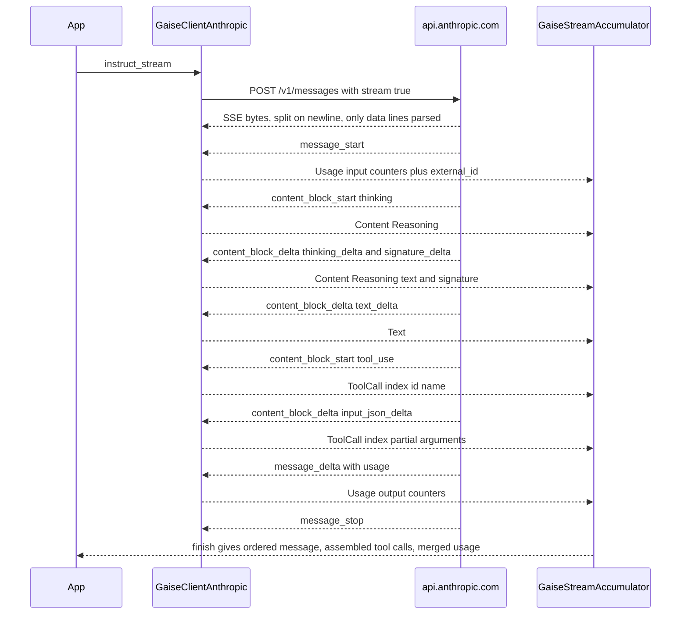

# Anthropic Claude (`anthropic`)

> Part of the [GAISe wiki](README.md) · [Models](models.md#anthropic) · [Capabilities](capabilities.md) · [HTTP API](api.md) · [Rust SDK](sdk.md) · [Flows](flows.md) · [Examples](examples.md)

The `anthropic` adapter drives the Anthropic **Messages API** (`POST /v1/messages`) for `instruct` and `instruct_stream`, and the **Models API** (`GET /v1/models`) for `list_models`. It deliberately does not implement `embeddings` (Anthropic has no embeddings endpoint; the call returns an error) and has no live/realtime surface. Batches, Files, structured outputs, server tools (web search/fetch), citations, and the 1-hour cache TTL request option are not mapped. The crate is `gaise-provider-anthropic`, enabled in `gaise-client` by the `anthropic` Cargo feature (on by default).

## At a glance

| Crate | Feature flag | Client type | Instruct surface | Streaming surface | Embeddings surface | Live surface | Model listing surface |
|---|---|---|---|---|---|---|---|
| [`gaise-provider-anthropic`](../gaise-provider-anthropic/Cargo.toml) | [`anthropic`](../gaise-client/Cargo.toml#L34) (in `default`) | [`GaiseClientAnthropic`](../gaise-provider-anthropic/src/anthropic_client.rs#L66) | `POST {api_url}/messages` — [`instruct`](../gaise-provider-anthropic/src/anthropic_client.rs#L792) | `POST {api_url}/messages` with `"stream": true`, SSE — [`instruct_stream`](../gaise-provider-anthropic/src/anthropic_client.rs#L722) | Not supported — [`embeddings`](../gaise-provider-anthropic/src/anthropic_client.rs#L867) returns `Err` | None | `GET {api_url}/models?limit=1000[&after_id=…]` — [`list_models`](../gaise-provider-anthropic/src/anthropic_client.rs#L840), [`catalog.rs`](../gaise-provider-anthropic/src/contracts/catalog.rs) |

Wire types live in [`contracts/models.rs`](../gaise-provider-anthropic/src/contracts/models.rs) (Messages) and [`contracts/catalog.rs`](../gaise-provider-anthropic/src/contracts/catalog.rs) (Models API).

## Configuration

| Env var (read by [`gaise-api/src/main.rs`](../gaise-api/src/main.rs#L17)) | `GaiseClientConfig` field ([`gaise-client/src/lib.rs`](../gaise-client/src/lib.rs#L64)) | Default | Notes |
|---|---|---|---|
| `ANTHROPIC_API_URL` | `anthropic_api_url: Option<String>` | `https://api.anthropic.com/v1` ([`get_client`](../gaise-client/src/lib.rs#L165)) | Base URL including the `/v1` segment; the adapter appends `/messages` and `/models`. |
| `ANTHROPIC_API_KEY` | `anthropic_api_key: Option<String>` | none — `get_client` fails with `Anthropic API Key not configured` | Sent as the `x-api-key` header. The router lists `anthropic` in [`configured_providers`](../gaise-client/src/lib.rs#L222) only when the key is set. |

The provider crate itself reads no environment variables (no `std::env::var` calls). Routing IDs take the form `anthropic::claude-sonnet-5`.

Constructor ([`GaiseClientAnthropic::new`](../gaise-provider-anthropic/src/anthropic_client.rs#L501)):

```rust
use gaise_provider_anthropic::anthropic_client::GaiseClientAnthropic;

let client = GaiseClientAnthropic::new(
    "https://api.anthropic.com/v1".to_string(),
    std::env::var("ANTHROPIC_API_KEY")?,
)
// Optional. "2023-06-01" is the built-in default.
.with_version("2023-06-01".to_string());
```

Headers on every request ([`instruct`](../gaise-provider-anthropic/src/anthropic_client.rs#L800), [`instruct_stream`](../gaise-provider-anthropic/src/anthropic_client.rs#L743), [`list_models_page`](../gaise-provider-anthropic/src/anthropic_client.rs#L535)):

| Header | Value |
|---|---|
| `x-api-key` | the configured API key |
| `anthropic-version` | `2023-06-01` unless overridden with [`with_version`](../gaise-provider-anthropic/src/anthropic_client.rs#L510) |
| `content-type` | `application/json` (POST only) |

No `anthropic-beta` header is sent. Non-2xx responses are returned as `Anthropic API error: {body}` with no retry.

## Request mapping

The whole request conversion is [`impl From<&GaiseInstructRequest> for AnthropicRequest`](../gaise-provider-anthropic/src/anthropic_client.rs#L301); the serialized shape is [`AnthropicRequest`](../gaise-provider-anthropic/src/contracts/models.rs#L4). Every optional outbound field uses `skip_serializing_if = "Option::is_none"`.

### Roles and system prompts

| Common input | Wire result | Source |
|---|---|---|
| `role: "system"` messages | Removed from `messages`. Their text (`Text` and text inside `Parts`, collected by [`collect_text`](../gaise-provider-anthropic/src/anthropic_client.rs#L161)) is joined with `"\n\n"` into one top-level `system: [{ "type": "text", "text": …, "cache_control": { "type": "ephemeral" } }]` block. Non-text content in a system message is dropped. `system` is omitted when no system text exists. | [L313](../gaise-provider-anthropic/src/anthropic_client.rs#L313), [L414](../gaise-provider-anthropic/src/anthropic_client.rs#L414) |
| `role: "user"` / `"assistant"` | Passed through unchanged. | [L395](../gaise-provider-anthropic/src/anthropic_client.rs#L395) |
| `role: "tool"` or any message with `tool_call_id` | Sent as `role: "user"` wrapping a single `tool_result` block. | [L380](../gaise-provider-anthropic/src/anthropic_client.rs#L380), [L396](../gaise-provider-anthropic/src/anthropic_client.rs#L396) |
| `content: None` | Empty string content (`""`), later promoted to a block if it is the last message. | [L351](../gaise-provider-anthropic/src/anthropic_client.rs#L351) |
| Single `Text` block | Serialized as a bare string; any other shape is a block array. | [L339](../gaise-provider-anthropic/src/anthropic_client.rs#L339) |

Prompt-cache breakpoints (`cache_control: {"type": "ephemeral"}`, 5-minute TTL; [`AnthropicCacheControl`](../gaise-provider-anthropic/src/contracts/models.rs#L33)) are placed at three stable boundaries, unconditionally:

1. The **last tool** definition ([`map_tools`](../gaise-provider-anthropic/src/anthropic_client.rs#L290)) so the tool prefix stays cached when the system prompt changes.
2. The single **system block** ([L418](../gaise-provider-anthropic/src/anthropic_client.rs#L418)).
3. The **last content block of the last message** ([L425](../gaise-provider-anthropic/src/anthropic_client.rs#L425)). A bare-string message is promoted to a one-element text block array for this. `thinking` and `redacted_thinking` blocks cannot carry a marker ([`set_cache_control`](../gaise-provider-anthropic/src/contracts/models.rs#L150) is a no-op for them), so a trailing reasoning block leaves that message unmarked.

Tool `input_schema.properties` are `BTreeMap`s so the tools block is byte-stable across turns ([`AnthropicInputSchema`](../gaise-provider-anthropic/src/contracts/models.rs#L188)).

### Content modalities

All mapping is in [`append_anthropic_content`](../gaise-provider-anthropic/src/anthropic_client.rs#L73); `Parts` are flattened recursively in order.

| `GaiseContent` | Wire shape | Fallback / error | Source |
|---|---|---|---|
| `Text { text }` | `{"type":"text","text":…}` | — | [L75](../gaise-provider-anthropic/src/anthropic_client.rs#L75) |
| `Image { data, format }` | `{"type":"image","source":{"type":"base64","media_type":…,"data":<base64>}}` when the normalized MIME ([`image_media_type`](../gaise-core/src/contracts/gaise_content.rs#L58)) is `image/jpeg`, `image/png`, `image/gif`, or `image/webp` | Any other MIME (for example `image/bmp`) becomes a text block `[Unsupported image type for Anthropic Messages: {media_type}]` | [L79](../gaise-provider-anthropic/src/anthropic_client.rs#L79) |
| `File { data, name }` — `.pdf` (by [`file_media_type`](../gaise-core/src/contracts/gaise_content.rs#L8)) | `{"type":"document","source":{"type":"base64","media_type":"application/pdf","data":<base64>},"title":name}` | — | [L102](../gaise-provider-anthropic/src/anthropic_client.rs#L102) |
| `File` — any other name whose bytes are valid UTF-8 (`.txt`, `.md`, `.csv`, `.json`, no extension, …) | `{"type":"document","source":{"type":"text","media_type":"text/plain","data":<utf-8 text>},"title":name}`. `media_type` is always `text/plain` because the text document source accepts only that value. | — | [L112](../gaise-provider-anthropic/src/anthropic_client.rs#L112) |
| `File` — non-UTF-8 binary (`.docx`, `.xlsx`, `.pptx`, images-as-files, …) | text block `[Unsupported binary document for Anthropic Messages; convert to PDF or text: {name or "document"}]` | explicit marker | [L124](../gaise-provider-anthropic/src/anthropic_client.rs#L124) |
| `Audio { format, .. }` | text block `[Unsupported audio input for Anthropic Messages: {format or "unknown"}]` — audio bytes are never sent | explicit marker | [L134](../gaise-provider-anthropic/src/anthropic_client.rs#L134) |
| `Reasoning { text, signature }` | `{"type":"thinking","thinking":text,"signature":signature}` (`signature` omitted when `None`) | — | [L141](../gaise-provider-anthropic/src/anthropic_client.rs#L141) |
| `RedactedReasoning { data }` | `{"type":"redacted_thinking","data":<bytes as UTF-8 string>}`; non-UTF-8 bytes are base64-encoded | — | [L147](../gaise-provider-anthropic/src/anthropic_client.rs#L147) |
| `Parts { parts }` | Each part mapped in order into the same block list | — | [L153](../gaise-provider-anthropic/src/anthropic_client.rs#L153) |

Image `format` is optional; a missing or unrecognized shorthand normalizes to `image/jpeg`. Office formats are inferred by extension but still go through the UTF-8 test, so a real `.docx` hits the binary marker.

### Tools and tool results

| Aspect | Behavior | Source |
|---|---|---|
| Tool definition | `GaiseTool` → `{ "name", "description"?, "input_schema": { "type": "object", "properties": {…}, "required": […] } }` via [`impl From<GaiseTool> for AnthropicTool`](../gaise-provider-anthropic/src/anthropic_client.rs#L237). | [L237](../gaise-provider-anthropic/src/anthropic_client.rs#L237) |
| Schema recursion | `map_param` copies `type`, `description`, `items`, nested `properties`, and `required` recursively. Missing `type` defaults to `"string"`; the legacy type `"text"` is rewritten to `"string"`; missing `description` becomes `""`. | [L239](../gaise-provider-anthropic/src/anthropic_client.rs#L239) |
| Top-level `required` | Taken from `parameters.required`, defaulting to `[]`. | [L274](../gaise-provider-anthropic/src/anthropic_client.rs#L274) |
| `tool_config.mode` / `tool_choice` | **Not mapped.** `AnthropicRequest` has no `tool_choice` field; Anthropic's default (`auto`) applies. | [`models.rs#L4`](../gaise-provider-anthropic/src/contracts/models.rs#L4) |
| Assistant `tool_calls` | Each call becomes a `tool_use` block `{ "id", "name", "input" }` appended after the message's content blocks. `arguments` is parsed as JSON; unparsable or absent arguments become `{}`. | [L355](../gaise-provider-anthropic/src/anthropic_client.rs#L355) |
| Tool result message | `tool_call_id` → `tool_result.tool_use_id`. The message content (text or multimodal blocks, including images and documents) becomes `tool_result.content`. `tool_name` is accepted but not used on the wire — Anthropic resolves by ID alone. | [L380](../gaise-provider-anthropic/src/anthropic_client.rs#L380) |
| Parallel calls | Multiple `tool_use` blocks in one assistant message are supported; each streams under its own content-block `index`. | [L364](../gaise-provider-anthropic/src/anthropic_client.rs#L364), [L654](../gaise-provider-anthropic/src/anthropic_client.rs#L654) |
| Cache marker | The last tool carries `cache_control: {"type":"ephemeral"}`. | [`map_tools`](../gaise-provider-anthropic/src/anthropic_client.rs#L290) |

### Generation config

Sampling rules are evaluated in the request converter ([L442](../gaise-provider-anthropic/src/anthropic_client.rs#L442)–[L496](../gaise-provider-anthropic/src/anthropic_client.rs#L496)); reasoning rules in [`anthropic_reasoning_config`](../gaise-provider-anthropic/src/anthropic_client.rs#L173). `thinking_enabled` below means the adapter decided to send a `thinking` object.

| `GaiseGenerationConfig` field | Provider field | Notes / conditions |
|---|---|---|
| `max_tokens` | `max_tokens` | Required by Anthropic; defaults to **4096** when `None` ([L474](../gaise-provider-anthropic/src/anthropic_client.rs#L474)). |
| `temperature` | `temperature` | Omitted when the model is a fixed-sampling family **or** `thinking_enabled` ([L480](../gaise-provider-anthropic/src/anthropic_client.rs#L480)). |
| `top_p` | `top_p` | Omitted for fixed-sampling families. With `thinking_enabled`, forwarded only if `0.95 <= top_p <= 1.0`. For exclusive-sampling families, dropped when `temperature` is also set. Otherwise forwarded ([L461](../gaise-provider-anthropic/src/anthropic_client.rs#L461)). |
| `top_k` | `top_k` | Omitted when fixed-sampling or `thinking_enabled` ([L484](../gaise-provider-anthropic/src/anthropic_client.rs#L484)). |
| `thinking_effort` | `output_config.effort` | Lower-cased and sent only for effort-capable families (adaptive families, `claude-opus-4-5`, `claude-mythos-preview`); ignored elsewhere ([L206](../gaise-provider-anthropic/src/anthropic_client.rs#L206)). Also triggers `thinking: {"type":"adaptive"}` on adaptive families. |
| `thinking_tokens` | `thinking.budget_tokens` with `thinking.type: "enabled"` | Only for Claude models that are **not** adaptive (`model.contains("claude")`, non-4.6+ families). On adaptive families it merely switches adaptive thinking on; the budget is not forwarded ([L214](../gaise-provider-anthropic/src/anthropic_client.rs#L214)). Not sent for non-Claude IDs. |
| `include_thoughts` | `thinking.display` | `Some(true)` → `"summarized"`, `Some(false)` → `"omitted"` ([L198](../gaise-provider-anthropic/src/anthropic_client.rs#L198)). Attached only when a `thinking` object is emitted; on adaptive families it alone is enough to emit `thinking: {"type":"adaptive","display":…}`. |
| `response_modalities` | — | Not mapped (Messages is text-only output). |
| `image_config` | — | Not mapped. |
| `input_image_detail` | — | Not mapped (OpenAI-only). |
| `input_media_resolution` | — | Not mapped (Gemini/Vertex-only). |
| `cache_key` | — | Not mapped. Caching uses the unconditional `cache_control` breakpoints described above. |
| stop sequences | — | No common field; `stop_sequences` is never sent. |
| service tier / `anthropic-beta` | — | Not mapped. |
| `stream` | `stream` | `false` for `instruct`, `true` for `instruct_stream` ([L495](../gaise-provider-anthropic/src/anthropic_client.rs#L495), [L741](../gaise-provider-anthropic/src/anthropic_client.rs#L741)). |

### Model-family rules

Matching is case-insensitive `contains` on the model ID, so dated snapshots and any future suffix match. An unknown Claude ID (for example `claude-haiku-4-5-20251001`) falls into the manual-budget path; a non-Claude ID gets no thinking object at all.

| Rule | Families (substring match) | Effect | Source |
|---|---|---|---|
| `adaptive_only` | `claude-fable-5`, `claude-mythos-5`, `claude-opus-5`, `claude-opus-4-8`, `claude-opus-4-7`, `claude-sonnet-5`, `claude-mythos-preview` | Never emit `type: "enabled"` / `budget_tokens`. Any of `thinking_effort`, `thinking_tokens`, `include_thoughts` → `thinking: {"type":"adaptive", "display"?}`. | [L181](../gaise-provider-anthropic/src/anthropic_client.rs#L181) |
| `adaptive` | `adaptive_only` ∪ `claude-opus-4-6`, `claude-sonnet-4-6` | Same adaptive emission; because the adaptive branch is tested first, a `thinking_tokens` budget on 4.6 models is also upgraded to adaptive (manual budgets are deprecated there). | [L192](../gaise-provider-anthropic/src/anthropic_client.rs#L192) |
| `supports_effort` | `adaptive` ∪ `claude-opus-4-5`, `claude-mythos-preview` | `thinking_effort` → `output_config.effort`. Opus 4.5 gets effort without adaptive thinking (its budget still goes through `budget_tokens`). | [L196](../gaise-provider-anthropic/src/anthropic_client.rs#L196) |
| Manual budget | any other ID containing `claude` (Opus/Sonnet/Haiku 4.5, 3.x, …) | `thinking_tokens` → `thinking: {"type":"enabled","budget_tokens":n,"display"?}`; `thinking_effort` alone emits nothing. | [L224](../gaise-provider-anthropic/src/anthropic_client.rs#L224) |
| `fixed_sampling` | `claude-opus-4-7`, `claude-opus-4-8`, `claude-opus-5`, `claude-sonnet-5`, `claude-fable-5`, `claude-mythos-5`, `claude-mythos-preview` | `temperature`, `top_p`, `top_k` are never sent, whatever the caller set. | [L443](../gaise-provider-anthropic/src/anthropic_client.rs#L443) |
| `exclusive_sampling` | `claude-opus-4-5`, `claude-sonnet-4-5`, `claude-haiku-4-5` | `temperature` wins: `top_p` is dropped when both are set. `top_k` is still forwarded. | [L450](../gaise-provider-anthropic/src/anthropic_client.rs#L450) |
| Thinking sampling | any model with `thinking_enabled` | `temperature` and `top_k` dropped; `top_p` kept only in `[0.95, 1.0]`. | [L461](../gaise-provider-anthropic/src/anthropic_client.rs#L461) |

Worked examples (from [`mapping_tests.rs`](../gaise-provider-anthropic/tests/mapping_tests.rs)):

| Model | Config | `thinking` | `output_config` | Sampling sent |
|---|---|---|---|---|
| `claude-sonnet-4-6` | `thinking_effort: high`, temp 0.4, top_p 0.97, top_k 20 | `{"type":"adaptive"}` | `{"effort":"high"}` | `top_p: 0.97` only |
| `claude-sonnet-4-5-20250929` | `thinking_effort: medium`, `thinking_tokens: 10000` | `{"type":"enabled","budget_tokens":10000}` | none | — |
| `claude-opus-4-8` | `include_thoughts: false` | `{"type":"adaptive","display":"omitted"}` | none | — |
| `claude-opus-5` | effort `xhigh`, temp/top_p/top_k set | `{"type":"adaptive"}` | `{"effort":"xhigh"}` | none |
| `claude-sonnet-4-5-20250929` | temp 0.4, top_p 0.8 | none | none | `temperature: 0.4` |

## Response mapping

Non-streaming responses deserialize into [`AnthropicResponse`](../gaise-provider-anthropic/src/contracts/models.rs#L208) and are mapped by [`map_from_anthropic_content`](../gaise-provider-anthropic/src/anthropic_client.rs#L553) inside [`instruct`](../gaise-provider-anthropic/src/anthropic_client.rs#L792).

| Provider element | Common result |
|---|---|
| `role` | `GaiseMessage.role` (always `assistant` from Anthropic). |
| `content[].type == "text"` | `GaiseContent::Text`, order preserved. |
| `content[].type == "thinking"` | `GaiseContent::Reasoning { text, signature }` — the `signature` is kept verbatim for replay. |
| `content[].type == "redacted_thinking"` | `GaiseContent::RedactedReasoning { data }` (string bytes, replayed byte-for-byte). |
| `content[].type == "tool_use"` | `GaiseToolCall { id, type: "function", function: { name, arguments: <input serialized as JSON string> }, thought_signature: None }` in `tool_calls`. |
| `content` with one block | `OneOrMany::One`; several blocks → `OneOrMany::Many`; none → `content: None`. |
| `id` | `GaiseInstructResponse.external_id`. |
| `usage` | See [Usage counters](#usage-counters). |
| `stop_reason`, `stop_sequence`, `model` | Deserialized but **not mapped** (the common response has no finish-reason field). |
| Other block types (`server_tool_use`, `web_search_tool_result`, citations, …) | Not deserialized; unknown `type` values make the response fail to parse. |
| Generated media | None — Messages does not return images or audio. |

The response is always a single `GaiseMessage` (`OneOrMany::One`). There is no retry logic; HTTP errors surface as `Anthropic API error: {body}`.

## Streaming

[`instruct_stream`](../gaise-provider-anthropic/src/anthropic_client.rs#L722) posts the same request with `"stream": true` and reads the body as SSE.

- **Framing:** bytes are appended to a `Vec<u8>` buffer and split on `\n` ([L760](../gaise-provider-anthropic/src/anthropic_client.rs#L760)). Frames split across arbitrary byte chunks are reassembled; partial trailing lines stay buffered. Only lines starting with `data:` are parsed (into [`AnthropicStreamResponse`](../gaise-provider-anthropic/src/contracts/models.rs#L262)); `event:` lines and blanks are ignored. A `data:` line that fails to parse yields one `Err` item and the stream continues.
- **Event mapping** ([`map_anthropic_stream_response`](../gaise-provider-anthropic/src/anthropic_client.rs#L616)):

| SSE `type` | Condition | `GaiseStreamChunk` | `external_id` |
|---|---|---|---|
| `message_start` | always | `Usage { input: map_input_usage, output: None, total: server-tool counters }` | `message.id` |
| `content_block_start` | `content_block.type == "tool_use"` | `ToolCall { index: <content block index>, id, name, arguments: None }` | `None` |
| `content_block_start` | `thinking` with non-empty text or a signature | `Content(Reasoning { text, signature })` | `None` |
| `content_block_start` | `redacted_thinking` | `Content(RedactedReasoning { data })` | `None` |
| `content_block_delta` | `delta.text` | `Text(text)` | `None` |
| `content_block_delta` | `delta.thinking` or `delta.signature` | `Content(Reasoning { text: thinking or "", signature })` — a `signature_delta` arrives as an empty-text reasoning chunk carrying the signature | `None` |
| `content_block_delta` | `delta.partial_json` | `ToolCall { index, arguments: Some(partial_json) }` | `None` |
| `message_delta` | `usage` present | `Usage { input: None, output: map_output_usage, total: server-tool counters }` | `None` |
| `ping`, `content_block_stop`, `message_stop`, `error`, unknown | — | nothing emitted | — |

- **Tool-call assembly:** `index` is Anthropic's content-block index, so the `GaiseStreamAccumulator` keys each call by that index; `id`/`name` arrive on `content_block_start` and `arguments` concatenate from `input_json_delta` frames. `thought_signature` is always `None` on Anthropic.
- **Reasoning assembly:** consecutive `Reasoning` chunks are coalesced by the accumulator and the last non-`None` signature wins, so the final message carries the complete `thinking` text plus its signature for replay.
- **Usage snapshots:** two usage events per message — input counters at `message_start`, cumulative output counters at `message_delta`. The accumulator replaces keys rather than summing, so the final `usage` is the union. `stop_reason` in `message_delta` is ignored.

## Usage counters

Produced by [`map_input_usage`](../gaise-provider-anthropic/src/anthropic_client.rs#L15), [`map_output_usage`](../gaise-provider-anthropic/src/anthropic_client.rs#L48), and [`map_request_usage`](../gaise-provider-anthropic/src/anthropic_client.rs#L57) from [`AnthropicUsage`](../gaise-provider-anthropic/src/contracts/models.rs#L221).

| Map | Key | Source field | Emitted when |
|---|---|---|---|
| `input` | `input_tokens` | `usage.input_tokens` (Anthropic's **uncached** count) | always |
| `input` | `cache_read_input_tokens` | `usage.cache_read_input_tokens` | value > 0 |
| `input` | `cache_creation_input_tokens` | `usage.cache_creation_input_tokens` | value > 0 |
| `input` | `effective_input_tokens` | `input_tokens + cache_read_input_tokens + cache_creation_input_tokens` | either cache counter > 0 |
| `input` | `cache_creation_1h_input_tokens` | `usage.cache_creation.ephemeral_1h_input_tokens` | `cache_creation` object present |
| `input` | `cache_creation_5m_input_tokens` | `usage.cache_creation.ephemeral_5m_input_tokens` | `cache_creation` object present |
| `output` | `output_tokens` | `usage.output_tokens` | always |
| `output` | `reasoning_tokens` | `usage.output_tokens_details.thinking_tokens` | `output_tokens_details` present |
| `total` | `web_fetch_requests` | `usage.server_tool_use.web_fetch_requests` | `server_tool_use` present |
| `total` | `web_search_requests` | `usage.server_tool_use.web_search_requests` | `server_tool_use` present |

There is no aggregate `total_tokens`; `total` is `None` unless server-tool counters are reported. No image/audio token breakdown is invented.

## Embeddings

Not supported. [`embeddings`](../gaise-provider-anthropic/src/anthropic_client.rs#L867) returns `Err("Anthropic does not support embeddings API")` without making a request. Anthropic has no embeddings endpoint; route embedding work to another provider.

## Live / realtime

Not supported. The crate implements only `GaiseClient`; there is no `GaiseLiveClient` implementation and no WebSocket surface.

## Model discovery

[`list_models`](../gaise-provider-anthropic/src/anthropic_client.rs#L840) calls [`list_models_page`](../gaise-provider-anthropic/src/anthropic_client.rs#L516): `GET {api_url}/models?limit=1000`, then follows cursor pagination with `&after_id={last_id}` (percent-encoded) while `has_more` is true, stopping if `last_id` does not advance. With the 1000-item cap this is normally one request. Each record is mapped by [`map_anthropic_model`](../gaise-provider-anthropic/src/contracts/catalog.rs#L108); the `operation` filter is applied via `retain_operation`.

| `GaiseModel` field | Provenance | Detail |
|---|---|---|
| `id`, `display_name`, `created_at` | provider | `created_at` is RFC 3339 as returned. |
| `limits.max_input_tokens` / `max_output_tokens` | provider | From `max_input_tokens` / `max_tokens`; `0` is treated as unknown. |
| `status` | adapter constant | Always `active` — the Models API lists only callable models, so retired IDs never appear. |
| `capabilities.input` | provider + constant | `text` always; `image` when `capabilities.image_input.supported`; `file` when `capabilities.pdf_input.supported`. |
| `capabilities.output`, `operations`, `tools` | adapter constant | `text`; `instruct` + `instruct_stream`; `tools: supported` for every Messages model. |
| `capabilities.reasoning` | provider | `capabilities.thinking.supported` (tri-state; `unknown` when the object is absent). |
| `capabilities.reasoning_values` | provider | Effort levels from `capabilities.effort.{low,medium,high,xhigh,max}.supported`, only when `effort.supported`. |
| `capabilities.structured_output` | provider | `capabilities.structured_outputs.supported`. |
| `capabilities.sources` | — | `[provider]`, plus `registry` after the router overlay. |
| `retires_on`, `retirement_not_before`, `replacement`, `notes` | registry | Filled by [`ModelRegistry::enrich`](../gaise-core/src/registry.rs#L525) in the router; the API reports no lifecycle dates. |
| `raw` | provider | The native record when `include_raw` is set. Unknown capability keys are preserved in [`AnthropicModelCapabilities.extra`](../gaise-provider-anthropic/src/contracts/catalog.rs#L99). |

There are no heuristics from the model name and no opt-in detail calls (`include_details` is ignored). `thinking.types.adaptive/enabled` are parsed but not surfaced on the common record. Tests: [`catalog.rs#L162`](../gaise-provider-anthropic/src/contracts/catalog.rs#L162) (`maps_capabilities_limits_and_effort`, `tolerates_missing_capabilities_object`).

## Models

From `gaise-core/model-registry.toml` (audited 2026-08-20), entries with `provider = "anthropic"`. The registry is advisory; arbitrary IDs are accepted. Dates are the direct Claude API lifecycle — Bedrock-hosted Claude is tracked separately.

| Model | Aliases | Status | Dates (shutdown_date / retirement_not_before) | Input | Output | Operations | Reasoning values | GAISe support | Notes |
|---|---|---|---|---|---|---|---|---|---|
| `claude-fable-5` | — | `active` | — / 2027-06-09 | text, image, file | text | instruct, instruct_stream | low, medium, high, xhigh, max | native | Adaptive thinking is always on and cannot be disabled; only the effort level is configurable. Non-default temperature/top_p/top_k are rej… |
| `claude-mythos-5` | — | `limited_availability` | — / — | text, image, file | text | instruct, instruct_stream | low, medium, high, xhigh, max | native when account access exists | Adaptive thinking is always on and cannot be disabled. |
| `claude-opus-5` | — | `active` | — / 2027-07-24 | text, image, file | text | instruct, instruct_stream | low, medium, high, xhigh, max | native | Released 2026-07-24; Anthropic's recommended default model. Adaptive-only thinking, on by default (disabling is accepted only at effort hi… |
| `claude-opus-4-8` | — | `active` | — / 2027-05-28 | text, image, file | text | instruct, instruct_stream | low, medium, high, xhigh, max | native | — |
| `claude-opus-4-7` | — | `active` | — / 2027-04-16 | text, image, file | text | instruct, instruct_stream | low, medium, high, xhigh, max | native | — |
| `claude-opus-4-6` | — | `active` | — / 2027-02-05 | text, image, file | text | instruct, instruct_stream | low, medium, high, max | native | — |
| `claude-opus-4-5-20251101` | `claude-opus-4-5` | `active` | — / 2026-11-24 | text, image, file | text | instruct, instruct_stream | low, medium, high | native | — |
| `claude-sonnet-5` | — | `active` | — / 2027-06-30 | text, image, file | text | instruct, instruct_stream | low, medium, high, xhigh, max | native | — |
| `claude-sonnet-4-6` | — | `active` | — / 2027-02-17 | text, image, file | text | instruct, instruct_stream | low, medium, high, max | native | — |
| `claude-sonnet-4-5-20250929` | `claude-sonnet-4-5` | `active` | — / 2026-09-29 | text, image, file | text | instruct, instruct_stream | — | native | — |
| `claude-haiku-4-5-20251001` | `claude-haiku-4-5` | `active` | — / 2026-10-15 | text, image, file | text | instruct, instruct_stream | — | native | Manual thinking budget; no adaptive thinking or effort parameter. |
| `claude-opus-4-1-20250805` | — | `retired` | 2026-08-05 / — | — | — | — | — | — | Replacement `claude-opus-4-8`. |
| `claude-opus-4-20250514` | — | `retired` | 2026-06-15 / — | — | — | — | — | — | Replacement `claude-opus-4-8`. |
| `claude-sonnet-4-20250514` | — | `retired` | 2026-06-15 / — | — | — | — | — | — | Replacement `claude-sonnet-4-6`. |
| `claude-mythos-preview` | — | `deprecated` | — / — | text, image, file | text | instruct, instruct_stream | — | — | Deprecated in favour of claude-mythos-5; no retirement date is published. Invitation-only (Project Glasswing). Replacement `claude-mythos-5`. |

Registry capability terms map as `adaptive_reasoning` / `manual_reasoning` → reasoning supported, `files` → file input, `streaming` → `instruct_stream`.

## Limitations and explicit fallbacks

- `embeddings` returns an error; no request is made.
- Audio input is never sent; it is replaced by the text marker `[Unsupported audio input for Anthropic Messages: {format}]`.
- Images other than JPEG/PNG/GIF/WebP become `[Unsupported image type for Anthropic Messages: {media_type}]`.
- Non-PDF, non-UTF-8 files (Office, archives, binary) become `[Unsupported binary document for Anthropic Messages; convert to PDF or text: {name}]`; UTF-8 files are always sent as `text/plain` documents regardless of extension.
- Non-text content inside a `system` message is dropped; only its text reaches the `system` block.
- `tool_config` / tool choice, stop sequences, `cache_key`, `response_modalities`, `image_config`, `input_image_detail`, `input_media_resolution`, and service tiers are not mapped.
- `thinking_effort` on manual-budget families (Sonnet 4.5, Haiku 4.5, 3.x) is silently ignored; `thinking_tokens` on adaptive families is converted to adaptive thinking with no budget.
- Fixed-sampling families silently drop `temperature`, `top_p`, and `top_k`; thinking-enabled requests drop `temperature`/`top_k` and out-of-range `top_p`.
- `tool_name` on tool-result messages is not sent (Anthropic resolves by `tool_use_id`).
- `stop_reason` is not surfaced; unknown response block types (server tools, citations) cause a parse error rather than partial output.
- Stream `error` events are ignored rather than turned into `Err` items; only malformed `data:` lines produce errors.
- Cache breakpoints are unconditional (three ephemeral markers per request) and cannot be turned off or switched to the 1-hour TTL.
- No retries, no `anthropic-beta` headers, and no Batches/Files API support.

## Flow

Non-streaming `instruct`:

```mermaid
sequenceDiagram
    participant App
    participant Router as GaiseClientService
    participant Adapter as GaiseClientAnthropic
    participant API as api.anthropic.com

    App->>Router: instruct with model anthropic::claude-sonnet-5
    Router->>Router: strip prefix, reuse or build client from ANTHROPIC_API_URL and ANTHROPIC_API_KEY
    Router->>Adapter: GaiseInstructRequest
    Adapter->>Adapter: lift system messages into one system block with ephemeral cache_control
    Adapter->>Adapter: flatten Parts, map text, image, document, thinking, redacted_thinking, tool_use, tool_result
    Adapter->>Adapter: anthropic_reasoning_config selects adaptive or enabled thinking and output_config.effort
    Adapter->>Adapter: apply fixed, exclusive, and thinking sampling rules; mark last tool and last block
    Adapter->>API: POST /v1/messages with x-api-key, anthropic-version, stream false
    API-->>Adapter: 200 JSON message with content blocks, id, usage
    Adapter->>Adapter: map text, thinking plus signature, redacted_thinking, tool_use to GaiseMessage
    Adapter-->>Router: GaiseInstructResponse with external_id and usage maps
    Router-->>App: response
```

Streaming `instruct_stream`:



## Tests

All tests are hermetic; the crate has no `#[ignore]` live tests.

| File | Coverage |
|---|---|
| [`tests/mapping_tests.rs`](../gaise-provider-anthropic/tests/mapping_tests.rs) | `test_mapping_tool_request` and `test_mapping_array_tool_request` (tool schema incl. nested `items`); `test_mapping_text_request` (last-block cache marker, temperature, `max_tokens`); `test_mapping_system_message` (single `system` block with `ephemeral` marker); `test_mapping_multimodal_request` (text + image blocks); `test_mapping_thinking_effort` (Sonnet 4.6 → adaptive + `output_config.effort`); `test_mapping_thinking_with_budget` (Sonnet 4.5 → `enabled` + `budget_tokens`, no effort); `test_mapping_no_thinking`; `test_mapping_pdf_document_uses_anthropic_document_block_without_http` (serialized `document` JSON); `test_mapping_all_supported_effort_values_without_http` (`low`/`medium`/`high`/`max`); `test_mapping_thought_display_without_http` (`summarized`/`omitted`); `test_mapping_model_specific_sampling_rules_without_http` (fixed, Fable, Opus 5, exclusive, thinking, legacy sampling); `test_mapping_multimodal_tool_result_uses_user_role_without_http`; `test_mapping_redacted_reasoning_is_replayed_verbatim_without_http`. |
| [`src/anthropic_client.rs#L875`](../gaise-provider-anthropic/src/anthropic_client.rs#L875) (unit tests) | `maps_redacted_reasoning_response_without_http` (response → `RedactedReasoning`); `maps_cache_reasoning_and_server_tool_usage_without_fabricated_modalities` (all usage counter keys, no invented image/audio counters). |
| [`src/contracts/catalog.rs#L162`](../gaise-provider-anthropic/src/contracts/catalog.rs#L162) (unit tests) | `maps_capabilities_limits_and_effort` (Models API fixture → modalities, effort values, limits, `active` status, provider source); `tolerates_missing_capabilities_object`. |

Gap worth knowing: there is no split-frame SSE fixture for the Anthropic stream parser; the line buffer in `instruct_stream` and `map_anthropic_stream_response` are not covered by a hermetic test in this crate.

## Sources

Official documentation (from `model-registry.toml` and `CLAUDE.md`):

- Model catalog: <https://platform.claude.com/docs/en/about-claude/models/overview>
- Model deprecations / lifecycle: <https://platform.claude.com/docs/en/about-claude/model-deprecations>
- Models API (`GET /v1/models`): <https://platform.claude.com/docs/en/api/models-list>
- Extended thinking troubleshooting: <https://platform.claude.com/docs/en/build-with-claude/thinking-troubleshooting>
- Effort parameter: <https://platform.claude.com/docs/en/build-with-claude/effort>

Source files cited:

- [`../gaise-provider-anthropic/src/anthropic_client.rs`](../gaise-provider-anthropic/src/anthropic_client.rs) — client, request/response/stream mapping, usage.
- [`../gaise-provider-anthropic/src/contracts/models.rs`](../gaise-provider-anthropic/src/contracts/models.rs) — Messages wire types.
- [`../gaise-provider-anthropic/src/contracts/catalog.rs`](../gaise-provider-anthropic/src/contracts/catalog.rs) — Models API types and mapping.
- [`../gaise-provider-anthropic/tests/mapping_tests.rs`](../gaise-provider-anthropic/tests/mapping_tests.rs) — hermetic mapping tests.
- [`../gaise-provider-anthropic/Cargo.toml`](../gaise-provider-anthropic/Cargo.toml), [`../gaise-provider-anthropic/README.md`](../gaise-provider-anthropic/README.md)
- [`../gaise-client/src/lib.rs`](../gaise-client/src/lib.rs), [`../gaise-client/Cargo.toml`](../gaise-client/Cargo.toml) — router config and feature flag.
- [`../gaise-api/src/main.rs`](../gaise-api/src/main.rs) — environment variables.
- [`../gaise-core/src/contracts/gaise_content.rs`](../gaise-core/src/contracts/gaise_content.rs), [`../gaise-core/src/contracts/gaise_generation_config.rs`](../gaise-core/src/contracts/gaise_generation_config.rs), [`../gaise-core/src/contracts/gaise_instruct_stream_response.rs`](../gaise-core/src/contracts/gaise_instruct_stream_response.rs), [`../gaise-core/src/contracts/gaise_model.rs`](../gaise-core/src/contracts/gaise_model.rs), [`../gaise-core/src/registry.rs`](../gaise-core/src/registry.rs) — common contracts and registry overlay.
- [`../gaise-core/model-registry.toml`](../gaise-core/model-registry.toml) — model inventory.
