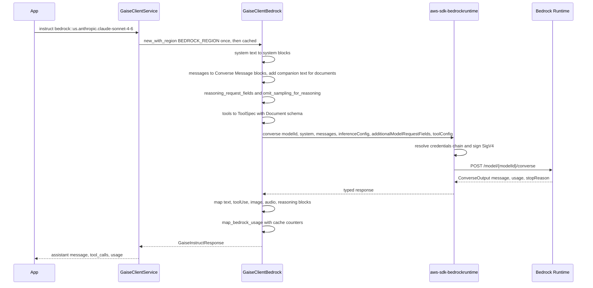
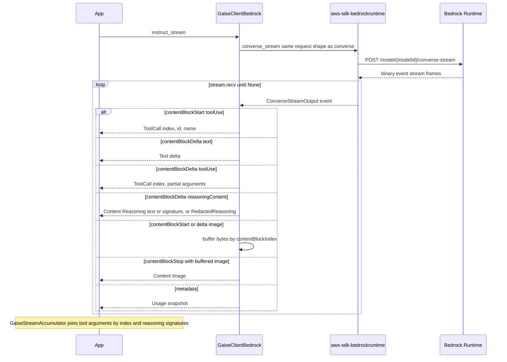

# Amazon Bedrock (`bedrock`)

> Part of the [GAISe wiki](README.md) · [Models](models.md#bedrock) · [Capabilities](capabilities.md) · [HTTP API](api.md) · [Rust SDK](sdk.md) · [Flows](flows.md) · [Examples](examples.md)

The `bedrock` adapter drives Amazon Bedrock through the official AWS SDKs rather than hand-built HTTP. `instruct` and `instruct_stream` call **Converse** and **ConverseStream** on `aws-sdk-bedrockruntime`; `embeddings` calls **InvokeModel** with the Titan or Cohere request bodies; `list_models` calls **ListFoundationModels** and **ListInferenceProfiles** on the `aws-sdk-bedrock` control-plane client. The adapter deliberately does not wrap `InvokeModelWithBidirectionalStream` (Nova Sonic), the `bedrock-mantle` Messages endpoint (Mythos 5), guardrails, `toolChoice`, or explicit `cachePoint` blocks. It is enabled in `gaise-client` by the `bedrock` Cargo feature, which is part of the default feature set.

## At a glance

| Crate | Feature flag | Client type | Instruct surface | Streaming surface | Embeddings surface | Live surface | Model listing surface |
|---|---|---|---|---|---|---|---|
| [`gaise-provider-bedrock`](../gaise-provider-bedrock/Cargo.toml) | [`bedrock`](../gaise-client/Cargo.toml#L33) | [`GaiseClientBedrock`](../gaise-provider-bedrock/src/bedrock_client.rs#L153) | [`Converse`](../gaise-provider-bedrock/src/bedrock_client.rs#L762) | [`ConverseStream`](../gaise-provider-bedrock/src/bedrock_client.rs#L929) | [`InvokeModel`](../gaise-provider-bedrock/src/bedrock_client.rs#L1149) | Not supported | [`ListFoundationModels` + `ListInferenceProfiles`](../gaise-provider-bedrock/src/bedrock_client.rs#L732) via [`catalog.rs`](../gaise-provider-bedrock/src/catalog.rs) |

There is no `contracts/` module: the SDK's own types (`aws_sdk_bedrockruntime::types::*`, `aws_smithy_types::Document`) are used directly, and the conversion helpers live as private functions in [`bedrock_client.rs`](../gaise-provider-bedrock/src/bedrock_client.rs).

## Configuration

| Variable | Read by | Maps to | Default |
|---|---|---|---|
| `BEDROCK_REGION` | [`gaise-api/src/main.rs#L16`](../gaise-api/src/main.rs#L16) | [`GaiseClientConfig.bedrock_region`](../gaise-client/src/lib.rs#L61) | None in GAISe; the AWS SDK's own region resolution (`AWS_REGION`, profile config) applies when unset |
| `AWS_ACCESS_KEY_ID`, `AWS_SECRET_ACCESS_KEY`, `AWS_SESSION_TOKEN`, `AWS_PROFILE`, IMDS/SSO/web-identity | `aws-config` default provider chain | SigV4 signing inside the SDK | SDK behavior; GAISe never reads these itself |

The crate contains no `std::env::var` calls. The router builds the client with [`GaiseClientBedrock::new_with_region(config.bedrock_region.clone())`](../gaise-client/src/lib.rs#L160) and lists `bedrock` in [`configured_providers`](../gaise-client/src/lib.rs#L234) only when `bedrock_region` is set, so an aggregate `list_models` never waits on an unconfigured AWS chain.

Constructors ([`bedrock_client.rs#L160-L209`](../gaise-provider-bedrock/src/bedrock_client.rs#L160-L209)):

| Constructor | Control-plane client | Notes |
|---|---|---|
| `new().await` | present | Delegates to `new_with_region(None)` |
| `new_with_region(Option<String>).await` | present | Region passed into the `aws_config` loader via [`loader.region(Region::new(region))`](../gaise-provider-bedrock/src/bedrock_client.rs#L183-L185); process environment is never mutated |
| `with_client(BedrockClient)` | **`None`** | Wraps a runtime client; `list_models` returns an error |
| `with_clients(BedrockClient, aws_sdk_bedrock::Client)` | present | Supply both when you build your own SDK clients |

```rust
use gaise_provider_bedrock::GaiseClientBedrock;

let client = GaiseClientBedrock::new_with_region(Some("us-east-1".to_string())).await;
// model IDs are raw Bedrock IDs or inference-profile IDs, e.g. "us.anthropic.claude-sonnet-4-6"
```

HTTP transport: [`new_with_region`](../gaise-provider-bedrock/src/bedrock_client.rs#L171-L193) builds a `hyper-rustls` connector with **bundled WebPKI roots**, `https_only`, HTTP/1 and HTTP/2, and installs it through `aws_smithy_runtime::client::http::hyper_014::HyperClientBuilder` (the call is annotated `#[allow(deprecated)]`). This avoids platform certificate-store failures on minimal Windows and container images. Endpoints are the SDK defaults for the resolved region (`bedrock-runtime.<region>.amazonaws.com`, `bedrock.<region>.amazonaws.com`); there is no base-URL override field in `GaiseClientConfig`. Auth is SigV4 performed by the SDK; no header is set by GAISe. The crate does not use `IGaiseLogger`.

## Request mapping

### Roles and system prompts

| GAISe role | Converse shape | Source |
|---|---|---|
| `system` | Appended to top-level `system: [SystemContentBlock::Text]`; `Text` and nested `Parts` only, every other variant is silently dropped | [`append_system_content`](../gaise-provider-bedrock/src/bedrock_client.rs#L438-L453), [`instruct#L774-L791`](../gaise-provider-bedrock/src/bedrock_client.rs#L774-L791) |
| `user` | `Message { role: user, content: [...] }` | [`map_gaise_message_to_bedrock#L657-L661`](../gaise-provider-bedrock/src/bedrock_client.rs#L657-L661) |
| `assistant` | `Message { role: assistant, content: [...] }`; `tool_calls` become trailing `ContentBlock::ToolUse` blocks | [`#L676-L694`](../gaise-provider-bedrock/src/bedrock_client.rs#L676-L694) |
| any role with `tool_call_id` | `Message { role: user, content: [ContentBlock::ToolResult] }` | [`#L602-L655`](../gaise-provider-bedrock/src/bedrock_client.rs#L602-L655) |
| other roles | Dropped (`None`) | [`#L660`](../gaise-provider-bedrock/src/bedrock_client.rs#L660) |

A message whose mapped content is empty is dropped ([`#L716-L718`](../gaise-provider-bedrock/src/bedrock_client.rs#L716-L718)). When a message contains a `Document` block but no `Text` block, the neutral text `"Process the attached document."` is inserted first because Converse rejects document-only messages ([`#L696-L714`](../gaise-provider-bedrock/src/bedrock_client.rs#L696-L714)).

### Content modalities

All mapping is in [`map_gaise_content_to_bedrock`](../gaise-provider-bedrock/src/bedrock_client.rs#L470-L537). `Parts` is flattened recursively in order.

| `GaiseContent` | Wire shape | Format handling | Fallback / error |
|---|---|---|---|
| `Text` | `ContentBlock::Text` | — | — |
| `Image { data, format }` | `ContentBlock::Image { format, source: Bytes }` | [`bedrock_image_format`](../gaise-provider-bedrock/src/bedrock_client.rs#L65-L75): `png`, `jpeg`/`jpg`, `webp`, `gif` with or without `image/` prefix | Unknown or `None` format defaults to `Jpeg`; no error |
| `Audio { data, format }` | `ContentBlock::Audio { format, source: Bytes }` | [`bedrock_audio_format`](../gaise-provider-bedrock/src/bedrock_client.rs#L77-L95): `wav`, `flac`, `ogg`, `opus`, `webm`, `m4a`, `mp4`, case-insensitive, MIME or bare | Unknown defaults to `Mp3`; model acceptance is left to Bedrock |
| `File { data, name }` | `ContentBlock::Document { name, format, source: Bytes }` | [`bedrock_document_format`](../gaise-provider-bedrock/src/bedrock_client.rs#L97-L118) by extension: `pdf`, `csv`, `docx`, `doc`, `xlsx`, `xls`, `html`/`htm`, `md`/`markdown`; [`bedrock_document_name`](../gaise-provider-bedrock/src/bedrock_client.rs#L122-L151) uses the file stem, keeps ASCII alphanumerics, whitespace, `-`, `(`, `)`, `[`, `]`, replaces everything else with `-`, caps at 200 chars, falls back to `document` | Unknown extension becomes `Txt`; a companion text block is added when none exists (see above) |
| `Reasoning { text, signature }` | `ContentBlock::ReasoningContent(ReasoningText { text, signature })` | Signature replayed verbatim | — |
| `RedactedReasoning { data }` | `ContentBlock::ReasoningContent(RedactedContent(Blob))` | Bytes replayed verbatim | — |
| `Parts` | Flattened | — | — |

No `video` variant exists in `GaiseContent`, so Nova video input is not mapped.

### Tools and tool results

- **Declaration** ([`instruct#L823-L842`](../gaise-provider-bedrock/src/bedrock_client.rs#L823-L842)): each `GaiseTool` becomes `Tool::ToolSpec { name, description, inputSchema: Json(Document) }` inside `toolConfig.tools`. [`tool_input_schema`](../gaise-provider-bedrock/src/bedrock_client.rs#L455-L468) serializes `GaiseToolParameter` (recursive `properties` as a sorted `BTreeMap`, `items`, `required`, `description`) to JSON, inserts `"type": "object"` and `"properties": {}` when absent, and converts through [`to_document`](../gaise-provider-bedrock/src/bedrock_client.rs#L267-L292) (`serde_json::Value` to `aws_smithy_types::Document`; integers map to `NegInt`/`PosInt`, other numbers to `Float`).
- **`tool_choice`**: not mapped. `GaiseInstructRequest.tool_config` is never read and `toolConfig.toolChoice` is never set; Bedrock's default (auto) applies.
- **Assistant tool calls on replay** ([`#L676-L694`](../gaise-provider-bedrock/src/bedrock_client.rs#L676-L694)): `ToolUseBlock { toolUseId: id, name, input: Document }`. Arguments that fail to parse as JSON become `{}`.
- **Tool results** ([`#L602-L655`](../gaise-provider-bedrock/src/bedrock_client.rs#L602-L655)): keyed by `tool_call_id` alone; `tool_name` is ignored because Converse resolves by `toolUseId`. Content goes through [`map_tool_result_content`](../gaise-provider-bedrock/src/bedrock_client.rs#L539-L597): text that parses as JSON becomes `ToolResultContentBlock::Json`, otherwise `Text`; images and files become `Image`/`Document` blocks with the same format and name helpers; `Reasoning` is downgraded to its text; `RedactedReasoning` becomes the marker `[Redacted reasoning cannot be used as a tool result]`; `Audio` becomes the marker `[Audio tool results are not supported by Bedrock Converse]`. An empty result sends a single empty `Text` block, and a document-only result is prefixed with `"Tool result document attached."` ([`#L633-L640`](../gaise-provider-bedrock/src/bedrock_client.rs#L633-L640)).
- **Parallel calls**: every `ToolUse` block in the response is collected in order; streaming keys deltas by `contentBlockIndex`.

### Generation config

Sampling fields are built into `inferenceConfig` at [`instruct#L803-L817`](../gaise-provider-bedrock/src/bedrock_client.rs#L803-L817) (identical code in [`instruct_stream#L978-L992`](../gaise-provider-bedrock/src/bedrock_client.rs#L978-L992)). Reasoning fields are emitted as `additionalModelRequestFields` ([`#L819-L821`](../gaise-provider-bedrock/src/bedrock_client.rs#L819-L821)).

| `GaiseGenerationConfig` field | Bedrock field | Conditions |
|---|---|---|
| `temperature` | `inferenceConfig.temperature` | Omitted when `None` or when [`omit_sampling_for_reasoning`](../gaise-provider-bedrock/src/bedrock_client.rs#L412-L436) is true |
| `top_p` | `inferenceConfig.topP` | Same rule as `temperature` |
| `top_k` | — | Not mapped (`InferenceConfiguration` has no `topK`) |
| `max_tokens` | `inferenceConfig.maxTokens` | Cast to `i32` |
| stop sequences | — | No common field; not mapped |
| `thinking_effort` | Claude adaptive: `additionalModelRequestFields.output_config.effort`; Opus 4.5: `output_config.effort`; Nova: `reasoningConfig.maxReasoningEffort` | See [`reasoning_request_fields`](../gaise-provider-bedrock/src/bedrock_client.rs#L323-L410); passed through verbatim (`low`…`max`) |
| `thinking_tokens` | `thinking.budget_tokens` with `thinking.type: "enabled"` | Manual Claude families and Opus 4.5 (only alongside an effort); on adaptive Claude it only triggers `thinking.type: "adaptive"` and the budget is dropped |
| `include_thoughts` | `thinking.display` = `"summarized"` (true) / `"omitted"` (false) | Emitted whenever a `thinking` object is emitted; on adaptive Claude `include_thoughts` alone is enough to trigger adaptive thinking |
| `response_modalities` | — | Not mapped |
| `image_config` | — | Not mapped |
| `input_image_detail` | — | Not mapped (OpenAI only) |
| `input_media_resolution` | — | Not mapped |
| `cache_key` | — | Not mapped; no `cachePoint` block is emitted. Cache counters are still read from usage when Bedrock applies caching |
| service tier / `performanceConfig` | — | Not mapped |
| guardrails | — | Not mapped |

### Model-family rules

All rules are substring matches on the lower-cased model ID, so inference-profile prefixes (`us.`, `eu.`, `apac.`, `jp.`, `au.`, `in.`, `global.`, `us-gov.`, …) and `-vN:M` suffixes do not matter; `anthropic.claude-fable-5-1` and `anthropic.claude-mythos-5-1` (2026-09-01) therefore inherit the Fable 5 / Mythos 5 rows.

| Rule | Families | Effect | Source |
|---|---|---|---|
| Adaptive-only Claude | `anthropic.claude-mythos-5` (incl. `-5-1`), `-fable-5` (incl. `-5-1`), `-opus-5`, `-opus-4-8`, `-opus-4-7`, `-sonnet-5`, `-mythos-preview` | `thinking.type: "adaptive"` (+ `display`, + `output_config.effort`) when any of effort, `thinking_tokens`, or `include_thoughts` is set; manual budget never emitted | [`#L331-L359`](../gaise-provider-bedrock/src/bedrock_client.rs#L331-L359) |
| Adaptive-capable Claude 4.6 | `anthropic.claude-opus-4-6`, `-sonnet-4-6` | Same adaptive shape as above | [`#L342-L345`](../gaise-provider-bedrock/src/bedrock_client.rs#L342-L345) |
| Opus 4.5 | `anthropic.claude-opus-4-5` | `output_config.effort` when effort is set; `thinking.type: "enabled"` + `budget_tokens` (+ `display`) only when `thinking_tokens` is also set | [`#L361-L377`](../gaise-provider-bedrock/src/bedrock_client.rs#L361-L377) |
| Manual-budget Claude | any other `anthropic.claude` (Sonnet 4.5, Haiku 4.5, 4.x, 3.x, and 4.6 without effort) | `thinking.type: "enabled"` + `budget_tokens` (+ `display`) when `thinking_tokens` is set; effort alone produces nothing | [`#L381-L395`](../gaise-provider-bedrock/src/bedrock_client.rs#L381-L395) |
| Reasoning Nova | `amazon.nova-2`, `amazon.nova-lite-1-5`, `amazon.nova-pro-1-5` | `reasoningConfig: { type: "enabled", maxReasoningEffort: effort }` when effort is set | [`#L397-L407`](../gaise-provider-bedrock/src/bedrock_client.rs#L397-L407) |
| Fixed-sampling Claude | `-fable-5`, `-mythos-5`, `-mythos-preview`, `-opus-5`, `-opus-4-7`, `-opus-4-8`, `-sonnet-5` | `temperature` and `topP` always omitted | [`omit_sampling_for_reasoning#L418-L428`](../gaise-provider-bedrock/src/bedrock_client.rs#L418-L428) |
| Claude with thinking enabled | any `anthropic.claude` whose reasoning fields contain a `thinking` object | `temperature` and `topP` omitted | [`#L429-L434`](../gaise-provider-bedrock/src/bedrock_client.rs#L429-L434) |
| Nova high effort | any `amazon.nova` with `thinking_effort == "high"` | `temperature` and `topP` omitted | [`#L435`](../gaise-provider-bedrock/src/bedrock_client.rs#L435) |
| Embedding family | model ID contains `titan` or `cohere` | Selects the InvokeModel body shape; anything else is an error | [`embeddings#L1165-L1176`](../gaise-provider-bedrock/src/bedrock_client.rs#L1165-L1176) |

Any other model (Titan text, Llama, Mistral, OpenAI GPT-5.6 / gpt-oss, xAI Grok, DeepSeek, Qwen, …) receives no `additionalModelRequestFields` and full sampling, so their provider-specific reasoning controls (Grok's always-on effort, GPT-5.6's `reasoning_effort`) are not mapped on Converse. The Nova 2 user guide now documents `reasoningConfig` (`type: enabled`, `maxReasoningEffort: low|medium|high`, off by default) for Nova 2 Lite as the registry records, so the adapter's emission is verified rather than forward-compatible; it also warns that `temperature`/`topP`/`topK` cannot accompany `maxReasoningEffort: high`, which the "Nova high effort" rule already covers.

### Parameter compatibility (audited 2026-09-04)

[`claude_rules`](../gaise-provider-bedrock/src/bedrock_client.rs), [`sampling_plan`](../gaise-provider-bedrock/src/bedrock_client.rs), [`resolved_max_tokens`](../gaise-provider-bedrock/src/bedrock_client.rs), and [`additional_request_fields`](../gaise-provider-bedrock/src/bedrock_client.rs) enforce the table; the `claude_family_parameter_matrix_without_aws_client` and `nova_and_claude_sampling_rules_without_aws_client` unit tests pin it.

| Family | `inferenceConfig` sampling | `top_k` | Thinking (`additionalModelRequestFields`) | Effort | `maxTokens` cap |
|---|---|---|---|---|---|
| Claude Fable 5.1, Mythos 5.1, Opus 5, Fable 5, Mythos 5, Opus 4.8, Opus 4.7, Sonnet 5 | never sent (Fable 5.1 card: temperature 1.0 or unset, top_p 0.99 or unset, never both, no top_k) | never sent | adaptive only; `none` → `disabled` (omitted on always-on Fable/Mythos) | low … max (AWS's own effort table lists `xhigh`/`max` for fewer families than the direct API; the adapter follows the direct API) | 128k |
| Claude Opus 4.6, Sonnet 4.6 | sent when thinking is off | `top_k` in AMRF when thinking is off | adaptive; `xhigh` → `max` | low, medium, high, max | 128k |
| Claude Opus 4.5 | either temperature or topP | as above | `enabled` + budget ≥ 1024, `maxTokens` raised above it | low, medium, high + `anthropic_beta: ["effort-2025-11-24"]` | 64k |
| Claude Sonnet 4.5, Haiku 4.5 | either temperature or topP | as above | `enabled` + budget | dropped | 64k |
| Nova 2 Lite | both accepted; dropped when `maxReasoningEffort` is `high` | `inferenceConfig.topK` in AMRF (≤ 128) | `reasoningConfig` | low, medium, high | 65,000 |
| Nova Pro / Lite / Micro v1 | either temperature or topP; temperature 0 → 0.00001 | as above | `reasoningConfig` (Pro/Lite) | low, medium, high | 5,000 |
| Nova Premier | as Nova v1 | as above | — | — | 25,000 |

Thinking on any Claude model also drops temperature/topP (AWS: "Thinking isn't compatible with temperature, top_p, or top_k modifications"). Sources: Converse `InferenceConfiguration`, Claude adaptive/extended-thinking pages, Nova request schema, model cards.

## Response mapping

Handled in [`instruct#L844-L926`](../gaise-provider-bedrock/src/bedrock_client.rs#L844-L926). The response is always a single `assistant` `GaiseMessage` with `content: Some(Many(...))` or `None` when empty.

| Converse block | GAISe |
|---|---|
| `ContentBlock::Text` | `GaiseContent::Text` |
| `ContentBlock::ToolUse { toolUseId, name, input }` | `GaiseToolCall { id, type: "function", function: { name, arguments: JSON string via from_document }, thought_signature: None }` in `tool_calls` |
| `ContentBlock::Image { format, source: Bytes }` | `GaiseContent::Image { data, format: "image/<format>" }` |
| `ContentBlock::Audio { format, source: Bytes }` | `GaiseContent::Audio { data, format: "audio/<format>" }` |
| `ReasoningContent::ReasoningText { text, signature }` | `GaiseContent::Reasoning { text, signature }` |
| `ReasoningContent::RedactedContent(blob)` | `GaiseContent::RedactedReasoning { data }` |
| other blocks (`Document`, `Video`, `CachePoint`, …) | Dropped |

- `stopReason`: not mapped.
- `external_id`: always `None` (Converse has no response ID field the adapter reads).
- `output` other than `ConverseOutput::Message` returns `"Unexpected output type from Bedrock"`; a missing output returns `"No output from Bedrock"`.
- Retries: none in the adapter; the SDK's default retry policy from `aws_config::defaults(BehaviorVersion::latest())` applies. SDK errors are propagated as `Box<dyn Error>`.

## Streaming

`instruct_stream` ([`#L929-L1147`](../gaise-provider-bedrock/src/bedrock_client.rs#L929-L1147)) builds the same request as `instruct`, calls `converse_stream()`, and drains `response.stream.recv()` inside an `async_stream::stream!` block. Framing is the AWS binary event stream, decoded by `aws-sdk-bedrockruntime`; the adapter does not buffer bytes itself and therefore carries no split-frame fixture. A `recv()` error is yielded as `Err` and the stream ends.

| `ConverseStreamOutput` event | `GaiseStreamChunk` | Source |
|---|---|---|
| `ContentBlockStart` / `ToolUse { toolUseId, name }` | `ToolCall { index: contentBlockIndex, id, name, arguments: None }` | [`#L1038-L1049`](../gaise-provider-bedrock/src/bedrock_client.rs#L1038-L1049) |
| `ContentBlockStart` / `Image { format }` | Registers an in-memory buffer keyed by `contentBlockIndex` | [`#L1050-L1055`](../gaise-provider-bedrock/src/bedrock_client.rs#L1050-L1055) |
| `ContentBlockDelta` / `Text` | `Text(delta)` | [`#L1061-L1066`](../gaise-provider-bedrock/src/bedrock_client.rs#L1061-L1066) |
| `ContentBlockDelta` / `ToolUse { input }` | `ToolCall { index, arguments: Some(partial JSON) }`; the core accumulator concatenates by index | [`#L1067-L1078`](../gaise-provider-bedrock/src/bedrock_client.rs#L1067-L1078) |
| `ContentBlockDelta` / `ReasoningContent::Text` | `Content(Reasoning { text, signature: None })`; empty deltas skipped | [`#L1081-L1091`](../gaise-provider-bedrock/src/bedrock_client.rs#L1081-L1091) |
| `ContentBlockDelta` / `ReasoningContent::Signature` | `Content(Reasoning { text: "", signature })`; merged onto the preceding reasoning part by `GaiseStreamAccumulator` | [`#L1092-L1100`](../gaise-provider-bedrock/src/bedrock_client.rs#L1092-L1100) |
| `ContentBlockDelta` / `ReasoningContent::RedactedContent` | `Content(RedactedReasoning { data })` | [`#L1101-L1108`](../gaise-provider-bedrock/src/bedrock_client.rs#L1101-L1108) |
| `ContentBlockDelta` / `Image { source: Bytes }` | Appended to the buffer for that index | [`#L1112-L1118`](../gaise-provider-bedrock/src/bedrock_client.rs#L1112-L1118) |
| `ContentBlockStop` | Emits `Content(Image { data, format: "image/<format>" })` if a buffer exists for that index | [`#L1122-L1132`](../gaise-provider-bedrock/src/bedrock_client.rs#L1122-L1132) |
| `Metadata { usage }` | `Usage(map_bedrock_usage)` — a snapshot, emitted once at the end | [`#L1133-L1140`](../gaise-provider-bedrock/src/bedrock_client.rs#L1133-L1140) |
| `MessageStart`, `MessageStop`, other | Ignored; streaming `stopReason` is not mapped | [`#L1141`](../gaise-provider-bedrock/src/bedrock_client.rs#L1141) |

Every chunk has `external_id: None`. Streamed audio deltas are not mapped.

## Usage counters

Produced by [`map_bedrock_usage`](../gaise-provider-bedrock/src/bedrock_client.rs#L19-L56) from `TokenUsage`; negative SDK values clamp to 0.

| Map | Key | Source | Present when |
|---|---|---|---|
| `input` | `input_tokens` | `inputTokens` | always |
| `input` | `cache_read_input_tokens` | `cacheReadInputTokens` | reported |
| `input` | `cache_write_input_tokens` | `cacheWriteInputTokens` | reported |
| `input` | `cache_write_<ttl>_input_tokens` (e.g. `cache_write_1h_input_tokens`) | `cacheDetails[].ttl` / `inputTokens` | each detail entry |
| `input` | `effective_input_tokens` | `inputTokens + cacheRead + cacheWrite` | only when cache counters change the sum |
| `output` | `output_tokens` | `outputTokens` | always |
| `total` | `total_tokens` | `totalTokens` (provider-reported) | always |

Embeddings ([`#L1214-L1224`](../gaise-provider-bedrock/src/bedrock_client.rs#L1214-L1224)): Titan returns `input.input_tokens` and `total.total_tokens` summed from each response's `inputTextTokenCount`; Cohere returns `usage: None` because its Bedrock response carries no token count and GAISe never estimates locally.

## Embeddings

[`embeddings`](../gaise-provider-bedrock/src/bedrock_client.rs) issues **one `InvokeModel` call per input string** with `contentType: application/json`, using the bodies from [`embedding_bodies`](../gaise-provider-bedrock/src/bedrock_client.rs). Requests go through the shared resolver described in [embeddings.md](embeddings.md#how-a-request-is-resolved): the model's `[models.embedding]` profile in [`model-registry.toml`](../gaise-core/model-registry.toml) decides how `task`, `dimensions`, and `normalize` are expressed, and the [generated matrix](embeddings.md#model-matrix) shows the wire result per model.

| Model ID contains | Request body | Response field read | Usage |
|---|---|---|---|
| `titan-embed-text-v2` | `{ "inputText", "dimensions"? (256/512/1024), "normalize"? }` | `embedding: [f64]` | `inputTextTokenCount` summed across calls |
| `titan-embed-image` | `{ "inputText", "embeddingConfig": { "outputEmbeddingLength" }? (256/384/1024) }` | `embedding` | `inputTextTokenCount` |
| other `titan-embed` | `{ "inputText" }` | `embedding` | `inputTextTokenCount` |
| `cohere.embed` | `{ "texts": ["<input>"], "input_type", "output_dimension"? (v4: 256/512/1024/1536) }` | `embeddings[0]: [f64]` | None |
| `nova-2-multimodal-embeddings` | `{ "schemaVersion": "nova-multimodal-embed-v1", "taskType": "SINGLE_EMBEDDING", "singleEmbeddingParams": { "embeddingPurpose", "embeddingDimension"? (256/384/1024/3072), "text": { "truncationMode": "END", "value" } } }` | `embeddings[0].embedding` | None |
| anything else | — | — | Error `Unsupported embedding model: <id>` |

- `task` → Cohere `input_type` (`search_document` default, `search_query` for query-side tasks, `classification`, `clustering`) and Nova `embeddingPurpose` (`GENERIC_INDEX` default, `TEXT_RETRIEVAL` for query-side tasks, `CLASSIFICATION`, `CLUSTERING`; pass `generic_retrieval` / `image_retrieval` as a custom task to search a mixed index). Titan has no task concept.
- `normalize` is Titan V2's native flag (forwarded as given); elsewhere `normalize: true` and truncated Cohere v4 / Titan image / Nova vectors are L2-normalized locally.
- Inference-profile prefixes (`us.`, `eu.`, `global.`, …) are stripped before the registry lookup, so `us.cohere.embed-v4:0` resolves to the v4 profile.
- Values are narrowed to `f32`. Cohere `embedding_types` and image input, Nova image/audio/video input, and Titan image input are not mapped. `external_id` is `None`.

## Live / realtime

Not supported. `amazon.nova-2-sonic-v1:0` requires `InvokeModelWithBidirectionalStream`, which this crate does not wrap; the `live` feature of `gaise-client` covers OpenAI Realtime and Gemini Live only.

## Model discovery

[`list_models`](../gaise-provider-bedrock/src/bedrock_client.rs#L732-L760) requires the control-plane client; with `with_client` it returns `"Bedrock model listing requires a control-plane client; construct with new_with_region or with_clients"`.

1. [`list_foundation_models`](../gaise-provider-bedrock/src/bedrock_client.rs#L212-L228): one `ListFoundationModels` call (no pagination, no filters); each `FoundationModelSummary` is copied into the SDK-independent [`BedrockModelSummary`](../gaise-provider-bedrock/src/catalog.rs#L19-L36).
2. [`list_inference_profiles`](../gaise-provider-bedrock/src/bedrock_client.rs#L231-L265): `ListInferenceProfiles` with `typeEquals: SYSTEM_DEFINED`, `maxResults: 1000`, looping on `nextToken` (stops on a repeated token). A failure here is reported as a `GaiseProviderError { provider: "bedrock", message: "inference profiles unavailable: …" }` in `errors` rather than failing the listing.
3. `retain_operation(request.operation)` filters the merged list. `include_details` is not used (no `GetFoundationModel` calls). `include_raw` attaches the SDK-independent summary/profile struct as `raw`.

| Field | Provider-sourced ([`map_foundation_model`](../gaise-provider-bedrock/src/catalog.rs#L122-L168)) | Heuristic | Registry-filled |
|---|---|---|---|
| `display_name`, `description` | `modelName`, `providerName` | — | — |
| `status` | `modelLifecycle.status`: `ACTIVE` → Active, `LEGACY` → Legacy, else Unknown | — | dates, `replacement` |
| `input` modalities | `TEXT`, `IMAGE` (the `EMBEDDING` input token is dropped) | — | documents, audio, video (overlay may add, never remove) |
| `output` modalities | `TEXT`, `IMAGE`, `EMBEDDING` | — | — |
| `operations` | `Embeddings` when output has `EMBEDDING`; else `Instruct` when text in and text out, plus `InstructStream` when `responseStreamingSupported` | — | — |
| `tools`, `reasoning` | `Unknown` (not reported by the API) | — | yes |
| `notes` | `inference types: …` when neither `ON_DEMAND` nor `INFERENCE_PROFILE` is offered | — | `gaise_support` / `notes` |
| `capabilities.sources` | `provider` | — | `registry` |

[`map_inference_profiles`](../gaise-provider-bedrock/src/catalog.rs#L173-L217) keeps profiles whose status is `ACTIVE` (or absent), resolves the first `modelArns` entry through [`model_id_from_arn`](../gaise-provider-bedrock/src/catalog.rs#L102-L110) to a listed foundation model, clones its capabilities under the profile ID (`us.…`, `eu.…`, `global.…`, `apac.…`, `jp.…`, `au.…`), uses the profile name as `display_name`, and prefixes `notes` with `cross-region inference profile` (`application inference profile` / `inference profile` for other types). Profiles whose base model is not in the regional list are kept with identity only. The registry overlay in [`gaise-core/src/registry.rs`](../gaise-core/src/registry.rs#L375-L382) strips the same prefixes (`global.`, `us.`, `eu.`, `apac.`, `ap.`, `jp.`, `au.`, `ca.`, `il.`, `us-gov.`) and matches `-vN:M` / `-YYYYMMDD-vN:M` suffixes ([`#L431-L443`](../gaise-core/src/registry.rs#L413-L446)) so `us.anthropic.claude-opus-4-6-v1:0` resolves to the `anthropic.claude-opus-4-6-v1` entry. Tests: [`catalog.rs#L219-L351`](../gaise-provider-bedrock/src/catalog.rs#L219-L351).

**Limits.** Neither `ListFoundationModels` nor `ListInferenceProfiles` reports token limits, so `limits.context_window` / `limits.max_output_tokens` come entirely from the registry's Bedrock model-card figures (which can differ from the vendor's direct API — Sonnet 4.6 is capped at 64K output on Bedrock). See [limits.md](limits.md) and `GET /v1/models/limits?provider=bedrock`.

## Models

From the 2026-09-04 registry audit; advisory only. Dates are AWS Bedrock lifecycle dates and are independent of the direct Claude API. Availability depends on region and inference profile.

| Model | Aliases | Status | Dates | Input | Output | Operations | Reasoning values | GAISe support | Notes |
|---|---|---|---|---|---|---|---|---|---|
| `anthropic.claude-fable-5-1` | — | `active` | — | text, image, file | text | instruct, instruct_stream | `low`, `medium`, `high`, `xhigh`, `max` | native via Converse | Launched 2026-09-01. Profiles us. and global. only (no in-region id on bedrock-runtime); us. includes GovCloud. Adaptive thinking always on;… |
| `anthropic.claude-mythos-5-1` | — | `limited_availability` | — | text, image, file | text | instruct, instruct_stream | `low`, `medium`, `high`, `xhigh`, `max` | native via Converse when access exists | Launched 2026-09-01 as a gated preview (Anthropic trusted-access programs). Unlike Mythos 5 it is served on bedrock-runtime (Converse, Invok… |
| `anthropic.claude-opus-5` | — | `active` | — | text, image, file | text | instruct, instruct_stream | `low`, `medium`, `high`, `xhigh`, `max` | native via Converse | Launched 2026-07-24. Profiles: us., eu., au., global. Access is gated ('See Access' on the Bedrock model-access page). Adaptive thinking on… |
| `anthropic.claude-fable-5` | — | `active` | — | text, image, file | text | instruct, instruct_stream | `low`, `medium`, `high`, `xhigh`, `max` | native via Converse | Launched 2026-06-09. Profiles us. and global. on bedrock-runtime (the us-east-1 in-region id exists on bedrock-mantle only). Requires the aw… |
| `anthropic.claude-opus-4-8` | — | `active` | — | text, image, file | text | instruct, instruct_stream | `low`, `medium`, `high`, `xhigh`, `max` | native via Converse | Launched 2026-05-28. Profiles: us., eu., jp., au., global. Prompt-cache minimum 1,024 tokens (the earlier 4,096 figure applied to Opus 4.7).… |
| `anthropic.claude-sonnet-5` | — | `active` | — | text, image, file | text | instruct, instruct_stream | `low`, `medium`, `high`, `xhigh`, `max` | native via Converse | Launched 2026-06-30. Profiles: us., eu., au., global. Adaptive thinking is on by default even when the thinking field is omitted (AWS correc… |
| `anthropic.claude-opus-4-7` | — | `active` | — | text, image, file | text | instruct, instruct_stream | `low`, `medium`, `high`, `xhigh`, `max` | native via Converse | Launched 2026-04-16. Profiles: us., eu., jp., au., global. thinking.type adaptive only; temperature, top_p, and top_k are no longer supporte… |
| `anthropic.claude-sonnet-4-6` | — | `active` | — | text, image, file | text | instruct, instruct_stream | `low`, `medium`, `high`, `max` | native via Converse | Launched 2026-02-17. Profiles: us., eu., au., jp., global.; in-region eu-west-2 added. Structured outputs supported. The Bedrock model card… |
| `anthropic.claude-opus-4-6-v1` | — | `active` | — | text, image, file | text | instruct, instruct_stream | `low`, `medium`, `high`, `max` | native via Converse | Launched 2026-02-05. Profiles: us., eu., au., global.; in-region eu-west-2 added. Last Bedrock id with the -v1 suffix. AWS's effort table al… |
| `anthropic.claude-opus-4-5-20251101-v1:0` | — | `active` | — | text, image, file | text | instruct, instruct_stream | `low`, `medium`, `high` | native via Converse | Profiles: us., eu., global. EOL floor (2026-03-25) has passed without a Legacy announcement. |
| `anthropic.claude-sonnet-4-5-20250929-v1:0` | — | `active` | not before 2026-09-29 | text, image, file | text | instruct, instruct_stream | manual budget | native via Converse | Profiles: us., eu., au., jp., global. |
| `anthropic.claude-haiku-4-5-20251001-v1:0` | `anthropic.claude-haiku-4-5` | `active` | not before 2026-10-01 | text, image, file | text | instruct, instruct_stream | manual budget | native via Converse | The suffix-less anthropic.claude-haiku-4-5 id serves the Messages API on bedrock-runtime and bedrock-mantle; the dated -v1:0 id is the Invok… |
| `anthropic.claude-mythos-5` | — | `limited_availability` | — | text, image, file | text | — | adaptive | not reachable: Messages API on bedrock-mantle only; Converse and InvokeModel are not supported | us-east-1 preview; requires provider_data_share data retention. Superseded by anthropic.claude-mythos-5-1, which is served on bedrock-runtim… |
| `anthropic.claude-mythos-preview` | — | `limited_availability` | — | text, image, file | text | — | `low`, `medium`, `high`, `max` | not reachable: Messages API on bedrock-mantle only | Invitation only; AWS lifecycle 'Preview' (us-east-1, ap-southeast-4). Deprecated on the Claude API in favour of Mythos 5.1. Prompt-cache min… |
| `amazon.nova-2-lite-v1:0` | — | `active` | — | text, image, video, file | text | instruct, instruct_stream | `low`, `medium`, `high` | native via Converse | The only Converse-capable Nova 2 model. Profiles: us., eu., jp., global. Extended thinking via additionalModelRequestFields.reasoningConfig… |
| `amazon.nova-2-sonic-v1:0` | — | `active` | — | text, audio | text, audio | — | — | not supported: InvokeModelWithBidirectionalStream only | — |
| `amazon.nova-2-multimodal-embeddings-v1:0` | — | `active` | — | text, image, audio, video | embedding | embeddings | — | text embeddings via InvokeModel (SINGLE_EMBEDDING schema); image/audio/video input not mapped | us-east-1 and us-gov-west-1 (GovCloud since 2026-08-12). Text, image, audio, video, and document input; async invocation (SEGMENTED_EMBEDDIN… |
| `amazon.nova-pro-v1:0` | — | `active` | — | text, image, video, file | text | instruct, instruct_stream | — | native via Converse | Bedrock model card: 300K context, 5K max output (the Nova user guide's spec table says 10K; the request schema caps maxTokens at 5K). Accept… |
| `amazon.nova-lite-v1:0` | — | `active` | — | text, image, video, file | text | instruct, instruct_stream | — | native via Converse | Bedrock model card: 300K context, 5K max output (the Nova user guide's spec table says 10K; the request schema caps maxTokens at 5K). Accept… |
| `amazon.nova-micro-v1:0` | — | `active` | — | text | text | instruct, instruct_stream | — | native via Converse | Text only. Bedrock model card: 128K context, 5K max output (the Nova user guide's spec table says 10K; the request schema caps maxTokens at… |
| `amazon.nova-*` | — | `dynamic_active_family` | — | text, image, video, file | text | instruct, instruct_stream | — | Converse where the regional catalog lists the model | Nova Pro/Lite/Micro (v1) remain Active (EOL floor 2025-12-04 passed without a Legacy announcement); Nova Pro has us./eu./apac. profiles, Lit… |
| `amazon.titan-embed-text-v2:0` | — | `active` | — | text | embedding | embeddings | — | native via InvokeModel | In-region only. 8,192 tokens / 50,000 characters per text; one text per call; `normalize` is a native flag. |
| `amazon.titan-embed-text-v1` | — | `active` | — | text | embedding | embeddings | — | native via InvokeModel | First-generation Titan text embeddings; fixed 1536 dimensions, one text per call. |
| `amazon.titan-embed-image-v1` | — | `active` | — | text, image, audio, video | embedding | embeddings | — | text input via InvokeModel; no image path | Text + image embeddings in one space; 256 text tokens, 25 MB images; one input per call. |
| `amazon.titan-embed-*` | — | `dynamic_active_family` | — | text | embedding | embeddings | — | native via InvokeModel | Catch-all for Titan embedding ids not listed above; verify with ListFoundationModels. |
| `cohere.embed-v4:0` | — | `active` | — | text, image, audio, video | embedding | embeddings | — | native via InvokeModel | Launched 2025-04-15; text and image input; profiles us., eu., global. `input_type` is required; 96 inputs per call. |
| `cohere.embed-english-v3` | `cohere.embed-multilingual-v3` | `active` | — | text | embedding | embeddings | — | native via InvokeModel | Fixed 1024 dimensions, 512 tokens per text, 96 texts per call; `input_type` is required. |
| `cohere.embed-*` | — | `dynamic_active_family` | — | text | embedding | embeddings | — | native via InvokeModel | Catch-all for other Cohere embed ids; `input_type` is always required. |
| `openai.gpt-5.6-sol` | — | `active` | — | text, image | text | instruct, instruct_stream | supported | Converse text, images, and tools; reasoning effort is not mapped on Converse | Model launch 2026-07-13; Converse plus geo/global cross-region inference on bedrock-runtime since 2026-08-17. Profiles us., global. (no in-r… |
| `openai.gpt-5.6-terra` | — | `active` | — | text, image | text | instruct, instruct_stream | supported | Converse text, images, and tools; reasoning effort is not mapped on Converse | Converse on bedrock-runtime since 2026-08-17. Profiles us., global., in. (India, ap-south-1/ap-south-2, 2026-08-18); GovCloud in August 2026… |
| `openai.gpt-5.6-luna` | — | `active` | — | text, image | text | instruct, instruct_stream | supported | Converse text, images, and tools; reasoning effort is not mapped on Converse | Converse on bedrock-runtime since 2026-08-17. Profiles us., global., in.; GovCloud in August 2026. The only GPT-5.6 variant with structured… |
| `openai.gpt-5.6-cyber` | — | `limited_availability` | — | text, image | text | — | supported | not reachable: Responses API on bedrock-mantle only (us-east-2), Trusted Access for Cyber | OpenAI Daybreak Red on Bedrock, 2026-08-12. |
| `openai.gpt-oss-120b-1:0` | — | `active` | — | text | text | instruct, instruct_stream | supported | native via Converse; reasoning effort is not mapped on Converse | Open-weight; Converse, InvokeModel, Chat Completions, and Responses on bedrock-runtime; us-gov. profile in GovCloud. |
| `openai.gpt-oss-20b-1:0` | — | `active` | — | text | text | instruct, instruct_stream | supported | native via Converse; reasoning effort is not mapped on Converse | — |
| `xai.grok-4.6` | — | `active` | — | text, image | text | instruct, instruct_stream | `low`, `medium`, `high`, `xhigh` | Converse text, images, and tools; reasoning content and effort are Responses-API only | Launched 2026-08-18 (GovCloud 2026-08-28). Profiles us., global.; in-region us-west-2 on bedrock-mantle. Reasoning is always active (default… |
| `deepseek.v3.2` | — | `active` | — | text | text | instruct, instruct_stream | supported | native via Converse | Launched 2025-12-01; Converse, InvokeModel, Chat Completions; structured outputs supported. |
| `mistral.mistral-large-3-675b-instruct` | — | `active` | — | text, image | text | instruct, instruct_stream | — | native via Converse | Converse, InvokeModel, Chat Completions; structured outputs supported. |
| `meta.llama4-maverick-17b-instruct-v1:0` | — | `active` | — | text, image | text | instruct, instruct_stream | — | native via Converse | us. profile; structured outputs not supported. |
| `qwen.qwen3-coder-next` | — | `active` | — | text | text | instruct, instruct_stream | supported | native via Converse | Launched 2026-02-04. |
| `zai.glm-5` | — | `active` | — | text | text | instruct, instruct_stream | supported | native via Converse | Launched 2026-02-11. |
| `moonshotai.kimi-k2.5` | — | `active` | — | text, image | text | instruct, instruct_stream | supported | native via Converse | Launched 2026-01-27; images up to 3 MB. |
| `nvidia.nemotron-super-3-120b` | — | `active` | — | text | text | instruct, instruct_stream | supported | native via Converse | Launched 2026-03-11; us-gov. profile in GovCloud. |
| `minimax.minimax-m2.5` | — | `active` | — | text | text | instruct, instruct_stream | supported | native via Converse | Launched 2026-02-12. |
| `google.gemma-4-*` | — | `active` | — | text, image, video | text | — | — | not reachable: Gemma 4 is served on bedrock-mantle only (no Converse) | google.gemma-4-31b, google.gemma-4-26b-a4b, google.gemma-4-e2b. |
| `twelvelabs.marengo-embed-3-0-v1:0` | — | `active` | — | text, image, audio, video | embedding | — | — | not supported: the InvokeModel embedding builder covers Titan, Cohere, and Nova schemas only | Launched 2025-10-29; text, image, audio, and video input; us. and eu. profiles; sync InvokeModel and StartAsyncInvoke. |
| `anthropic.claude-opus-4-1-20250805-v1:0` | — | `legacy` | shutdown 2027-01-08 | unknown | unknown | — | — | — | Legacy since 2026-07-08; public extended access (higher pricing) from 2026-10-08. us. profile only. Replacement `anthropic.claude-opus-4-8`. |
| `anthropic.claude-sonnet-4-20250514-v1:0` | — | `legacy` | shutdown 2026-10-14 | unknown | unknown | — | — | — | Legacy since 2026-04-14; extended-access pricing applies since 2026-07-14. Replacement `anthropic.claude-sonnet-5`. |
| `anthropic.claude-3-haiku-20240307-v1:0` | — | `legacy` | shutdown 2026-09-10 | unknown | unknown | — | — | — | Legacy since 2026-03-10; extended access from 2026-06-10; EOL 2026-09-10 in commercial and GovCloud regions. Replacement `anthropic.claude-h… |
| `anthropic.claude-3-5-haiku-20241022-v1:0` | — | `retired` | shutdown 2026-06-19 | unknown | unknown | — | — | — | AWS EOL date 2026-06-19 has passed; the card still reads Legacy and the id still appears in the API-compatibility matrix, so invocability is… |
| `ai21.jamba-1-5-*` | — | `legacy` | shutdown 2026-11-26 | unknown | unknown | — | — | — | ai21.jamba-1-5-large-v1:0 and ai21.jamba-1-5-mini-v1:0. Legacy since 2026-05-26; extended access from 2026-08-26. |
| `twelvelabs.marengo-embed-2-7-v1:0` | — | `legacy` | shutdown 2026-11-30 | text, image, audio, video | embedding | — | — | not supported: no InvokeModel embedding builder for this schema | Legacy since 2026-05-29; extended access from 2026-08-29. Replacement `twelvelabs.marengo-embed-3-0-v1:0`. |
| `amazon.nova-premier-v1:0` | — | `legacy` | shutdown 2026-09-14 | unknown | unknown | — | — | — | Replacement `amazon.nova-2-lite-v1:0`. |
| `amazon.nova-sonic-v1:0` | — | `legacy` | shutdown 2026-09-14 | unknown | unknown | — | — | — | Replacement `amazon.nova-2-sonic-v1:0`. |
| `amazon.nova-reel-v1:*` | — | `legacy` | shutdown 2026-09-30 | unknown | unknown | — | — | — | — |
| `amazon.nova-canvas-v1:0` | — | `legacy` | shutdown 2026-09-30 | unknown | unknown | — | — | — | — |
| `cohere.command-r-*` | — | `retired` | shutdown 2026-08-19 | unknown | unknown | — | — | — | cohere.command-r-v1:0 and cohere.command-r-plus-v1:0. |

Third-party Converse families (OpenAI GPT-5.6 and gpt-oss, xAI Grok 4.6, DeepSeek V3.2, Mistral Large 3, Llama 4 Maverick, Qwen3 Coder Next, GLM 5, Kimi K2.5, Nemotron 3 Super, MiniMax M2.5) were added on 2026-09-04 with the limits printed on their model cards; their `tools` flag reflects the family's documented function calling, not a per-card Converse matrix, because AWS no longer publishes one. The adapter's own reasoning rules also recognize `amazon.nova-lite-1-5` and `amazon.nova-pro-1-5`, which have no registry entry. Lifecycle rows past their EOL date (Cohere Command R/R+, Claude 3.5 Haiku) are kept as `retired` so old ids keep resolving.

## Limitations and explicit fallbacks

- Model listing is unavailable when the client was built with `with_client`; the error names `new_with_region` / `with_clients` ([`#L215-L217`](../gaise-provider-bedrock/src/bedrock_client.rs#L215-L217)).
- Embeddings accept only model IDs containing `titan` or `cohere`; anything else returns `Unsupported embedding model` ([`#L1175`](../gaise-provider-bedrock/src/bedrock_client.rs#L1175)).
- Audio inside a tool result becomes the text marker `[Audio tool results are not supported by Bedrock Converse]`; redacted reasoning inside a tool result becomes `[Redacted reasoning cannot be used as a tool result]` ([`#L577-L595`](../gaise-provider-bedrock/src/bedrock_client.rs#L577-L595)).
- Document-only messages and tool results receive an injected companion text block (`Process the attached document.` / `Tool result document attached.`) because Converse requires one.
- Document names are rewritten (stem only, punctuation replaced, 200-char cap, `document` fallback); unknown extensions are sent as `txt`.
- Unknown image formats default to `jpeg`, unknown audio formats to `mp3`; Bedrock validates the bytes.
- System messages keep only `Text` (and nested `Parts`); image/audio/file/reasoning in a system message are dropped without error.
- Roles other than `system`, `user`, `assistant`, or a tool-result message are dropped; messages with no mappable content are dropped.
- `tool_config.mode`, `top_k`, stop sequences, `response_modalities`, `image_config`, `input_image_detail`, `input_media_resolution`, `cache_key`, guardrails, and `performanceConfig` are not mapped.
- `stopReason`, `external_id`, and streamed `MessageStop` metadata are not surfaced.
- `thinking_tokens` on adaptive-only Claude families is silently converted to adaptive thinking with no budget.
- Temperature and top-p are dropped for fixed-sampling Claude, any Claude request with a `thinking` object, and Nova at `high` effort; `max_tokens` is always kept.
- No live adapter: Nova Sonic and other bidirectional-stream models are not routable.
- Region must be supplied via `GaiseClientConfig.bedrock_region` or the SDK's own resolution; the adapter never sets `AWS_REGION`.

## Flow

Non-streaming `instruct`:



Streaming `instruct_stream`:



## Tests

All tests are hermetic; none constructs an AWS client or loads credentials, and there are no `#[ignore]` live tests in this crate.

| File | Covers |
|---|---|
| [`src/bedrock_client.rs#L1234-L1468`](../gaise-provider-bedrock/src/bedrock_client.rs#L1234-L1468) | Adaptive Claude effort → `thinking.type: adaptive` + `output_config.effort` for `low`/`medium`/`high`/`max`; Nova `reasoningConfig`; manual Claude `budget_tokens`; Titan receives no reasoning fields; Fable 5 `thinking_tokens` → adaptive without budget; `thinking.display` `summarized`/`omitted`; Opus 5 follows Opus 4.7/4.8 rules; sampling omission for fixed-sampling Claude, manual thinking, and Nova `high` (but not `low`); empty tool schema gains `type: object` + `properties: {}`; nested system `Parts` flatten; image MIME → `ImageFormat` with `jpeg` default; redacted reasoning bytes; document format case-insensitivity and name sanitization (`quarterly.report (final).pdf` → `quarterly-report (final)`, `...pdf` → `document`); usage mapping including `effective_input_tokens`, `cache_write_1h_input_tokens`, and no fabricated modality counters; Titan `inputTextTokenCount` parsing without estimation |
| [`src/catalog.rs#L219-L351`](../gaise-provider-bedrock/src/catalog.rs#L219-L351) | `TEXT`/`IMAGE`/`EMBEDDING` modality mapping; `Instruct`/`InstructStream`/`Embeddings` operation derivation; `ACTIVE`/`LEGACY` status; `PROVISIONED`-only note; `include_raw`; inference profiles inherit foundation capabilities, take the profile name, get the `cross-region inference profile` note, skip `INACTIVE` profiles, and list unknown base models with identity only; `model_id_from_arn` |
| [`tests/mapping_tests.rs`](../gaise-provider-bedrock/tests/mapping_tests.rs) | Serializes a `GaiseInstructRequest` for `amazon.titan-text-express-v1` without initializing the SDK (guards against credential-chain probing in CI) |
| [`gaise-core/src/registry.rs#L659-L896`](../gaise-core/src/registry.rs#L659-L896) | Bedrock lookups through inference-profile prefixes, `-vN:M` suffixes, dated snapshots, and `*` globs (`us.anthropic.claude-opus-5-v1:0`, `global.amazon.nova-2-lite-v1:0`, `amazon.nova-reel-v1:1`, `cohere.embed-english-v3`) |

## Sources

Official documentation:

- Model catalog and per-model cards: <https://docs.aws.amazon.com/bedrock/latest/userguide/model-cards.html>
- Model lifecycle: <https://docs.aws.amazon.com/bedrock/latest/userguide/model-lifecycle.html>
- API compatibility by model: <https://docs.aws.amazon.com/bedrock/latest/userguide/models-api-compatibility.html>
- `FoundationModelSummary` reference: <https://docs.aws.amazon.com/bedrock/latest/APIReference/API_FoundationModelSummary.html>
- Discovery APIs named in the registry: `ListFoundationModels`, `GetFoundationModel`, `ListInferenceProfiles`

Source files:

- [`../gaise-provider-bedrock/src/bedrock_client.rs`](../gaise-provider-bedrock/src/bedrock_client.rs)
- [`../gaise-provider-bedrock/src/catalog.rs`](../gaise-provider-bedrock/src/catalog.rs)
- [`../gaise-provider-bedrock/src/lib.rs`](../gaise-provider-bedrock/src/lib.rs)
- [`../gaise-provider-bedrock/tests/mapping_tests.rs`](../gaise-provider-bedrock/tests/mapping_tests.rs)
- [`../gaise-provider-bedrock/Cargo.toml`](../gaise-provider-bedrock/Cargo.toml)
- [`../gaise-provider-bedrock/README.md`](../gaise-provider-bedrock/README.md)
- [`../gaise-client/src/lib.rs`](../gaise-client/src/lib.rs)
- [`../gaise-client/Cargo.toml`](../gaise-client/Cargo.toml)
- [`../gaise-api/src/main.rs`](../gaise-api/src/main.rs)
- [`../gaise-core/src/registry.rs`](../gaise-core/src/registry.rs)
- [`../gaise-core/model-registry.toml`](../gaise-core/model-registry.toml)
- [`../gaise-core/src/contracts/gaise_content.rs`](../gaise-core/src/contracts/gaise_content.rs)
- [`../gaise-core/src/contracts/gaise_generation_config.rs`](../gaise-core/src/contracts/gaise_generation_config.rs)
- [`../gaise-core/src/contracts/gaise_instruct_stream_response.rs`](../gaise-core/src/contracts/gaise_instruct_stream_response.rs)
- [`../gaise-core/src/contracts/gaise_usage.rs`](../gaise-core/src/contracts/gaise_usage.rs)
- [`../gaise-core/src/contracts/gaise_model.rs`](../gaise-core/src/contracts/gaise_model.rs)
