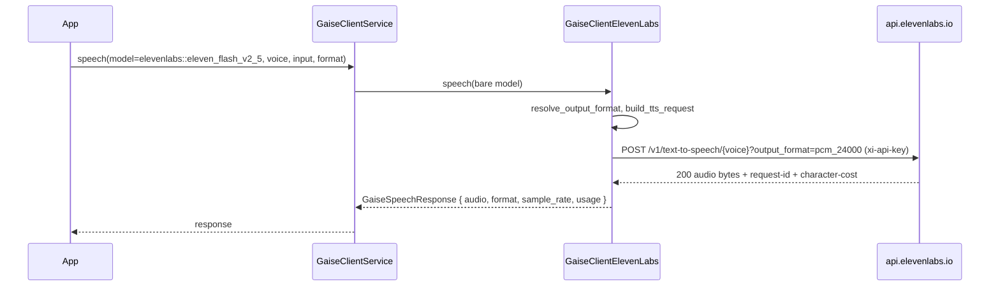
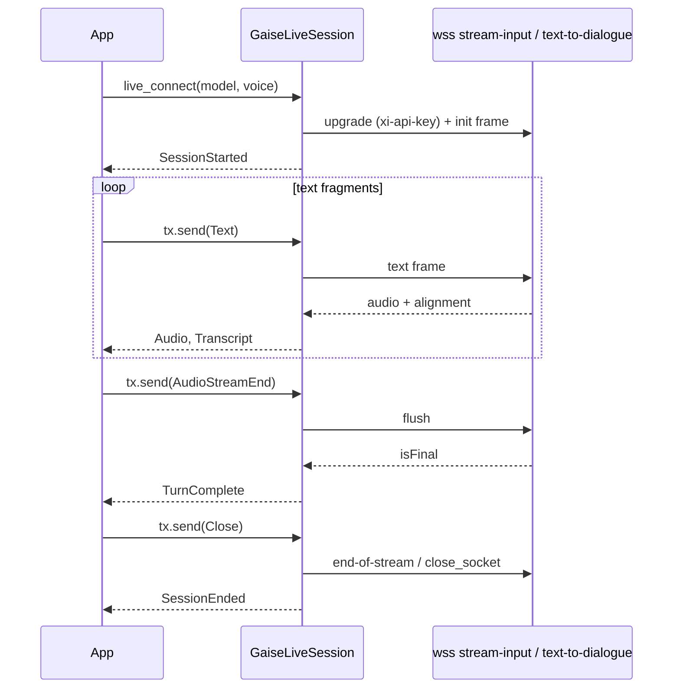

# ElevenLabs (`elevenlabs`)

> Part of the [GAISe wiki](README.md) · [Models](models.md#elevenlabs) · [Capabilities](capabilities.md) · [HTTP API](api.md) · [Rust SDK](sdk.md) · [Flows](flows.md) · [Examples](examples.md)

The `gaise-provider-elevenlabs` crate drives ElevenLabs **text-to-speech**: complete clips (`speech`), chunked audio as it is rendered (`speech_stream`), realtime voice over WebSocket (`live_connect`, feature `live`), and model discovery (`list_models`). It deliberately has no chat or embeddings surface — `instruct` and `embeddings` return explicit "not supported" errors — and it does not wrap speech-to-text, speech-to-speech, music, or Agents. Enabled by the `elevenlabs` feature of [`gaise-client`](../gaise-client/Cargo.toml) (on by default).

## At a glance

| Crate | Feature flag | Client type | Speech surface | Streaming surface | Live surface | Model listing surface |
|---|---|---|---|---|---|---|
| [`gaise-provider-elevenlabs`](../gaise-provider-elevenlabs/Cargo.toml) | `elevenlabs` in [`gaise-client`](../gaise-client/Cargo.toml); crate-level `live` for WebSockets | [`GaiseClientElevenLabs`](../gaise-provider-elevenlabs/src/elevenlabs_client.rs) | `POST /v1/text-to-speech/{voice_id}` and `/with-timestamps` | `POST …/stream` (chunked bytes) and `…/stream/with-timestamps` (NDJSON) | `wss://…/v1/text-to-speech/{voice_id}/stream-input`; `wss://…/v1/text-to-dialogue/stream-input` for `eleven_v3*` | `GET /v1/models` (+ `GET /v2/voices` helper) |

## Configuration

| Variable | Read by | Default | Purpose |
|---|---|---|---|
| `ELEVENLABS_API_KEY` | [`gaise-api/src/main.rs`](../gaise-api/src/main.rs) → `GaiseClientConfig.elevenlabs_api_key` | none; `get_speech_client("elevenlabs")` errors with "ElevenLabs API Key not configured" | Sent as the `xi-api-key` header on every HTTP request and WebSocket handshake |
| `ELEVENLABS_API_URL` | `GaiseClientConfig.elevenlabs_api_url` | `https://api.elevenlabs.io` ([`DEFAULT_API_URL`](../gaise-provider-elevenlabs/src/elevenlabs_client.rs)) | Base URL; regional residency hosts (`api.eu.residency.elevenlabs.io`, `api.in.…`, `api.sg.…`, `api.us.elevenlabs.io`) work unchanged, and `https://` is rewritten to `wss://` for live sessions |

`configured_providers()` lists `elevenlabs` only when the key is set, so aggregate model listings never wait on it otherwise.

```rust
use gaise_provider_elevenlabs::elevenlabs_client::GaiseClientElevenLabs;

let client = GaiseClientElevenLabs::new(
    "https://api.elevenlabs.io".to_string(),
    std::env::var("ELEVENLABS_API_KEY")?,
);
let voices = client.list_voices().await?; // GET /v2/voices, paginated
```

The crate reads no other environment variables.

## Request mapping

### Voice selection

Every speech request needs a voice id. It is taken from [`GaiseSpeechRequest.voice`](sdk.md#speech) (or `GaiseLiveConfig.voice` for live sessions) and travels in the URL path. There is **no default voice**: ElevenLabs' premade voices are account-gated and retire on 2026-12-31, so [`voice_for`](../gaise-provider-elevenlabs/src/elevenlabs_client.rs) returns an explicit error instead of guessing. Discover ids with [`list_voices`](../gaise-provider-elevenlabs/src/elevenlabs_client.rs).

### Output format

[`resolve_output_format`](../gaise-provider-elevenlabs/src/contracts/models.rs) maps the provider-neutral `format` + `sample_rate` onto an ElevenLabs `output_format` query parameter and records the MIME type returned to callers:

| `format` | `sample_rate` | `output_format` | Returned MIME |
|---|---|---|---|
| _none_ / `audio/mpeg` / `mp3` | _none_ or other | `mp3_44100_128` | `audio/mpeg` |
| `audio/mpeg` | `22050` / `24000` | `mp3_22050_32` / `mp3_24000_48` | `audio/mpeg` |
| `audio/pcm` / `pcm` | 8000–48000 (default 24000) | `pcm_{rate}` | `audio/pcm` |
| `audio/wav` / `wav` | as PCM | `wav_{rate}` | `audio/wav` |
| `audio/opus` / `opus` | — | `opus_48000_64` | `audio/opus` |
| `audio/basic` / `ulaw` | — | `ulaw_8000` | `audio/basic` |
| `alaw` | — | `alaw_8000` | `audio/alaw` |
| provider-native (`pcm_16000`, `mp3_44100_192`, …) | — | passed through | derived from the codec |

Unsupported MIME types (`audio/flac`) and PCM rates outside the documented set are rejected client-side. Plan gating (192 kbps MP3 and 44.1 kHz PCM/WAV need higher tiers) is left to the API.

### Body

[`build_tts_request`](../gaise-provider-elevenlabs/src/contracts/models.rs) serializes [`ElevenLabsTtsRequest`](../gaise-provider-elevenlabs/src/contracts/models.rs):

| `GaiseSpeechRequest` | Wire field | Notes |
|---|---|---|
| `input` | `text` | Per-model character limits apply (v3 5,000; multilingual_v2 10,000; flash_v2_5 40,000) |
| `model` | `model_id` | Bare model id after routing |
| `language` | `language_code` | **Omitted for `eleven_multilingual_v2`**, which rejects it ([`model_accepts_language_code`](../gaise-provider-elevenlabs/src/contracts/models.rs)) |
| `voice_settings.stability` / `similarity` / `style` / `speaker_boost` / `speed` | `voice_settings.stability` / `similarity_boost` / `style` / `use_speaker_boost` / `speed` | `speed` clamped to 0.7–1.2; `style` and speaker boost are v2+ features — check `can_use_style` from `list_models` |
| `seed` | `seed` | Clamped to `u32::MAX`; best-effort determinism |
| `include_alignment` | selects `/with-timestamps` | Returns character timing alongside audio |
| `instructions` | — | Not mapped; ElevenLabs v3 takes delivery hints as audio tags inside `text` |

Request stitching (`previous_text`, `previous_request_ids`), pronunciation dictionaries, and text normalization flags are not mapped.

### Model-family rules

| Rule | Source |
|---|---|
| `eleven_v3*` realtime uses the **text-to-dialogue** WebSocket; all other models use `stream-input` ([`model_uses_dialogue_websocket`](../gaise-provider-elevenlabs/src/contracts/models.rs)) | ElevenLabs API reference: "this endpoint does not support the eleven_v3 model" |
| `eleven_multilingual_v2` rejects `language_code` | TTS reference |
| `eleven_turbo_v2_5` / `eleven_turbo_v2` are deprecated in favour of the Flash equivalents | Models overview |
| `eleven_v3` has no request stitching | Request-stitching guide |

## Response mapping

- `speech` without alignment: the response body is the encoded audio; `format`/`sample_rate` echo the resolved output format; `external_id` is the `request-id` header.
- `speech` with alignment: `/with-timestamps` JSON → base64 audio decoded, `alignment` (or `normalized_alignment` when the former is absent) mapped to [`GaiseSpeechAlignment`](sdk.md#speech) in seconds.
- Usage: `input.characters` = character count of the text; `total.character_cost` = the `character-cost` response header when present ([`usage_from`](../gaise-provider-elevenlabs/src/elevenlabs_client.rs)).
- Errors: the `detail` envelope is parsed whether it is an object (`status`/`code` + `message`) or a FastAPI validation array ([`format_error`](../gaise-provider-elevenlabs/src/contracts/models.rs)).

## Streaming

| Mode | Endpoint | Framing | Chunks emitted |
|---|---|---|---|
| `include_alignment: false` | `POST …/stream` | Raw chunked bytes of the chosen format | `Audio` per network chunk, then one `Usage` |
| `include_alignment: true` | `POST …/stream/with-timestamps` | Newline-delimited JSON, optional `data:` prefix tolerated | `Audio` + `Alignment` per frame, then `Usage` |

[`LineBuffer`](../gaise-provider-elevenlabs/src/elevenlabs_client.rs) reassembles frames split across TCP chunks and flushes an unterminated tail at end of stream. Over HTTP, [`POST /v1/speech/audio`](api.md#post-v1speechaudio) forwards only the `Audio` chunks as a raw body.

## Usage counters

| Map | Key | Source |
|---|---|---|
| input | `characters` | length of `input` |
| total | `character_cost` | `character-cost` header |

## Embeddings

Not supported — `embeddings` returns "ElevenLabs does not offer text embeddings".

## Live / realtime

`live_connect` opens a text-in / audio-out session. Output is always `pcm_24000` (events carry `sample_rate: 24000`, matching OpenAI Realtime) with `sync_alignment=true` so every audio frame can also yield a transcript.

| `GaiseLiveInput` | `stream-input` frame | text-to-dialogue frame |
|---|---|---|
| `Text { text }` | `{"text": "<text> "}` (trailing space enforced) | `{"inputs":[{"text","voice_id"}]}` |
| `AudioStreamEnd` / `ActivityEnd` | `{"text":" ","flush":true}` | `{"flush":true}` |
| `Close` | `{"text":""}` (end of stream) | `{"close_socket":true}` |
| `ActivityStart` | ignored | ignored |
| `Audio`, `Image`, `ToolResponse`, `ClearAudio`, `CancelResponse` | `error` event — not applicable to TTS | same |

| Server frame | `GaiseLiveEvent` |
|---|---|
| `audio` (base64) | `Audio { data, sample_rate: 24000 }` |
| `alignment` / `normalizedAlignment` (`chars`, `charStartTimesMs`, `charDurationsMs`) | `Transcript { role: "assistant", text }` |
| `isFinal: true` / `is_final_audio_for_turn: true` | `TurnComplete` |
| `message` / `error` / abnormal close | `Error { message }` |
| socket closed | `SessionEnded` |

Mapping functions: [`stream_input_events`](../gaise-provider-elevenlabs/src/elevenlabs_client.rs), [`dialogue_events`](../gaise-provider-elevenlabs/src/elevenlabs_client.rs), URL construction in [`live_url`](../gaise-provider-elevenlabs/src/elevenlabs_client.rs). The first frame carries `chunk_length_schedule: [120, 160, 250, 290]` (stream-input) or `voices: [voice]` (dialogue). Conversational agents (audio in) are not wrapped.

## Model discovery

`GET /v1/models` → [`map_elevenlabs_model`](../gaise-provider-elevenlabs/src/contracts/models.rs). Provider-sourced: id, name, description, `can_do_text_to_speech` (→ input `text`, output `audio`, operations `speech` + `live`), `can_do_voice_conversion` (→ input `audio`), `requires_alpha_access` (→ `preview`), `maximum_text_length_per_request` (→ notes). Tools, reasoning, and structured output are `unsupported`. The registry overlay adds lifecycle notes and the `eleven_v3_conversational` live-only override.

**Limits.** `maximum_text_length_per_request` is provider-sourced and becomes `limits.max_input_characters` (also echoed in `notes`); speech models have no token window. The documented per-model character budgets are in [limits.md](limits.md).

## Models

| Model | Aliases | Status | Dates | Input | Output | Operations | Reasoning values | GAISe support | Notes |
|---|---|---|---|---|---|---|---|---|---|
| `eleven_v3` | — | `active` | — | text | audio | speech, live | — | speech via /v1/text-to-speech; realtime via the text-to-dialogue WebSocket | Flagship, 70+ languages, 5,000 characters per request on /v1/text-to-speech; the text-to-dialogue endpoints (GAISe's realtime path for v3) d… |
| `eleven_v3_conversational` | — | `active` | — | text | text, audio | live | — | realtime only via the text-to-dialogue WebSocket (one voice) | ~280 ms latency variant of v3 for realtime use. |
| `eleven_multilingual_v2` | — | `active` | — | text | audio | speech, live | — | native | Default model; 29 languages; 10,000 characters per request. language_code is documented as not supported (ignored) for multilingual_v2, so t… |
| `eleven_flash_v2_5` | — | `active` | — | text | audio | speech, live | — | native | ~75 ms latency, 32 languages, 40,000 characters per request, accepts language_code. Numbers are not normalized by default. |
| `eleven_flash_v2` | — | `active` | — | text | audio | speech, live | — | native | English only; 30,000 characters per request. |
| `eleven_turbo_v2_5` | — | `deprecated` | — | text | audio | speech, live | — | native while available | Functionally equivalent to eleven_flash_v2_5; no shutdown date published. Character limit as for the functionally equivalent eleven_flash_v2… |
| `eleven_turbo_v2` | — | `deprecated` | — | text | audio | speech, live | — | native while available | Character limit as for the functionally equivalent eleven_flash_v2. Replacement `eleven_flash_v2`. |
| `eleven_multilingual_sts_v2` | `eleven_english_sts_v2` | `active` | — | audio | audio | — | — | not supported: speech-to-speech has no GAISe surface | — |
| `scribe_v2` | `scribe_v2_realtime` | `active` | — | text, audio | text | — | — | not supported: speech-to-text has no GAISe surface yet | scribe_v2_realtime is listed as its own model (~150 ms, 90+ languages); scribe_v1 is deprecated with no shutdown date. |
| `eleven_ttv_v3` | `eleven_multilingual_ttv_v2` | `active` | — | text | text, audio | — | — | not supported: voice design (/v1/text-to-voice/design) has no GAISe surface | Text-to-voice design models; the endpoint defaults to eleven_multilingual_ttv_v2 and takes 100-1,000 characters of description. |
| `music_v2` | — | `active` | — | text | text, audio | — | — | not supported: music generation (/v1/music) has no GAISe surface | Studio-grade music with composition plans, audio reference, and inpainting; superseded as the flagship by music_v2_5 (2026-09). Section dura… |
| `music_v2_5` | — | `active` | — | text | text, audio | — | — | not supported: music generation (/v1/music) has no GAISe surface | Most advanced music model (listed by 2026-09-12; /v1/music/compose model_id enum music_v1, music_v2, music_v2_5). Section durations are alwa… |
| `music_v1` | — | `deprecated` | — | text | text, audio | — | — | not supported: music generation (/v1/music) has no GAISe surface | Listed under Deprecated models by 2026-09-12 (outclassed by music_v2 and music_v2_5); still the /v1/music default; no shutdown date publishe… |
| `eleven_text_to_sound_v2` | — | `active` | — | text | text, audio | — | — | not supported: sound effects (/v1/sound-generation) have no GAISe surface | 0.5-30 s effects with optional looping. |

Full generated table: [models.md#elevenlabs](models.md#elevenlabs).

## Limitations and explicit fallbacks

- No default voice; a missing `voice` is an error, never a silent pick.
- `instructions` is not mapped (use v3 audio tags in the text).
- Live sessions accept text only; audio/image/tool inputs and clear/cancel produce `error` events.
- Speech-to-text, speech-to-speech, music, voice design, and Agents are out of scope.
- Alignment from `/stream/with-timestamps` is parsed defensively (`data:` prefix or bare JSON) because the framing is documented only through the official SDKs.
- Plan-gated formats and concurrency limits surface as API errors (`429 rate_limit_error`).

## Flow





## Tests

- [`contracts/models.rs`](../gaise-provider-elevenlabs/src/contracts/models.rs) unit tests: output-format resolution, request body rules, timestamp-frame parsing, error envelopes, model mapping, WebSocket alignment conversion.
- [`elevenlabs_client.rs`](../gaise-provider-elevenlabs/src/elevenlabs_client.rs) unit tests: NDJSON line buffering across chunk boundaries, frame → chunk mapping, voice requirement, base-URL normalization.
- Router and HTTP: [`gaise-client/tests/speech_tests.rs`](../gaise-client/tests/speech_tests.rs), [`gaise-api/tests/speech_route_tests.rs`](../gaise-api/tests/speech_route_tests.rs).
- No live tests; nothing in the suite contacts ElevenLabs.

## Sources

- API reference: <https://elevenlabs.io/docs/api-reference/text-to-speech/convert>, <https://elevenlabs.io/docs/api-reference/text-to-speech/stream>, <https://elevenlabs.io/docs/api-reference/text-to-speech/v-1-text-to-speech-voice-id-stream-input>, <https://elevenlabs.io/docs/api-reference/text-to-dialogue/ttd-websocket>, <https://elevenlabs.io/docs/api-reference/models/list>, <https://elevenlabs.io/docs/api-reference/voices/search>
- Models and limits: <https://elevenlabs.io/docs/overview/models>; errors: <https://elevenlabs.io/docs/eleven-api/resources/errors>
- Source: [`elevenlabs_client.rs`](../gaise-provider-elevenlabs/src/elevenlabs_client.rs), [`contracts/models.rs`](../gaise-provider-elevenlabs/src/contracts/models.rs), [`gaise_speech.rs`](../gaise-core/src/contracts/gaise_speech.rs), [`gaise-client/src/lib.rs`](../gaise-client/src/lib.rs), [`gaise-api/src/lib.rs`](../gaise-api/src/lib.rs)
