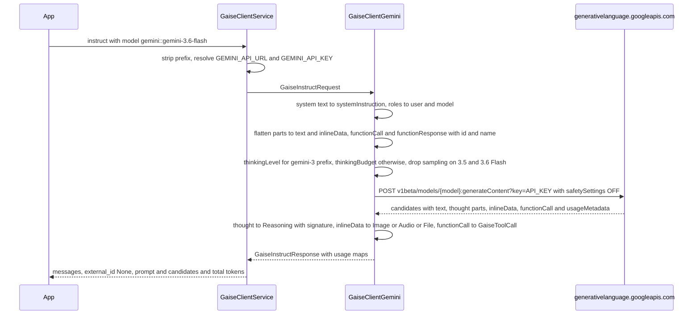
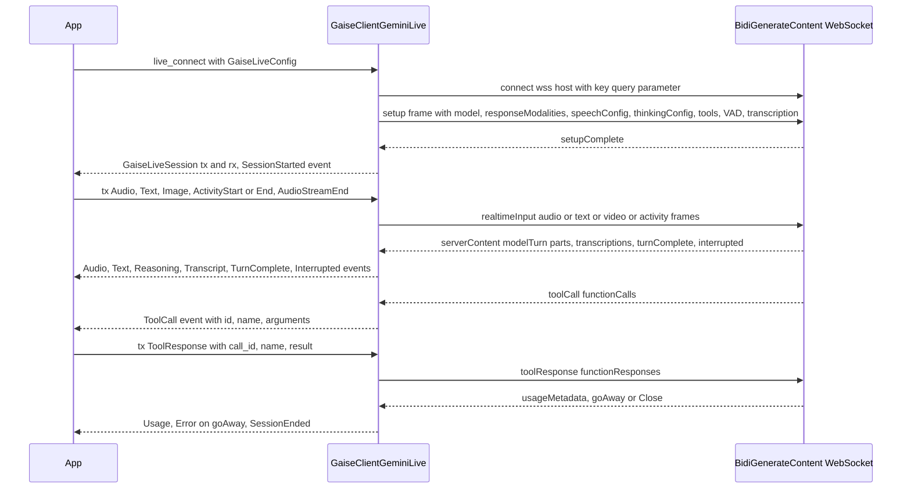

# Google Gemini API (`gemini`)

> Part of the [GAISe wiki](README.md) · [Models](models.md#gemini) · [Capabilities](capabilities.md) · [HTTP API](api.md) · [Rust SDK](sdk.md) · [Flows](flows.md) · [Examples](examples.md)

The `gemini` adapter drives the Google AI Gemini API (`generativelanguage.googleapis.com`, `v1beta`). `instruct` posts to `models/{model}:generateContent`, `instruct_stream` to `models/{model}:streamGenerateContent?alt=sse`, `embeddings` to `models/{model}:batchEmbedContents`, and `list_models` pages through `GET /models`. Behind the crate's `live` feature, a second client opens the `BidiGenerateContent` WebSocket for Live sessions. The adapter deliberately does not wrap `predict`/`predictLongRunning` (Imagen, Veo), `cachedContents`, `countTokens`, file uploads, or text-to-speech. Enable it in `gaise-client` with the `gemini` feature (on by default) and add `live` for the WebSocket client.

## At a glance

| Crate | Feature flag | Client type | Instruct surface | Streaming surface | Embeddings surface | Live surface | Model listing surface |
|---|---|---|---|---|---|---|---|
| [`gaise-provider-gemini`](../gaise-provider-gemini/Cargo.toml) | `gemini` in [`gaise-client`](../gaise-client/Cargo.toml#L35); crate feature `live` for WebSockets | [`GaiseClientGemini`](../gaise-provider-gemini/src/gemini_client.rs#L76), [`GaiseClientGeminiLive`](../gaise-provider-gemini/src/gemini_live_client.rs#L101) | `POST models/{model}:generateContent` in [`instruct`](../gaise-provider-gemini/src/gemini_client.rs#L826) | `POST models/{model}:streamGenerateContent?alt=sse` in [`instruct_stream`](../gaise-provider-gemini/src/gemini_client.rs#L760) | `POST models/{model}:batchEmbedContents` in [`embeddings`](../gaise-provider-gemini/src/gemini_client.rs#L868) | `wss://{host}/ws/google.ai.generativelanguage.v1beta.GenerativeService.BidiGenerateContent` in [`live_connect`](../gaise-provider-gemini/src/gemini_live_client.rs#L298) | `GET /models?pageSize=1000` in [`list_models_page`](../gaise-provider-gemini/src/gemini_client.rs#L649), mapped by [`catalog.rs`](../gaise-provider-gemini/src/contracts/catalog.rs) |

## Configuration

| Env var (read by [`gaise-api/src/main.rs`](../gaise-api/src/main.rs#L19)) | `GaiseClientConfig` field ([`gaise-client/src/lib.rs`](../gaise-client/src/lib.rs#L70)) | Default | Notes |
|---|---|---|---|
| `GEMINI_API_URL` | `gemini_api_url: Option<String>` | `https://generativelanguage.googleapis.com/v1beta` ([`get_client`](../gaise-client/src/lib.rs#L184)) | Base URL including the API version segment. The Live client derives `wss://{host}` from it ([L305–L319](../gaise-provider-gemini/src/gemini_live_client.rs#L305)). |
| `GEMINI_API_KEY` | `gemini_api_key: Option<String>` | none; `get_client` fails with `Gemini API Key not configured` | [`configured_providers`](../gaise-client/src/lib.rs#L226) lists `gemini` only when this is set. |

- Authentication is the API key passed as the `?key=` query parameter on every HTTP and WebSocket URL. No `Authorization` or `x-goog-api-key` header is sent.
- The provider crate itself reads no environment variables (no `std::env::var` in `gaise-provider-gemini/src`).
- `reqwest::Client::new()` is used with default timeouts; no retry or backoff layer exists.

```rust
use gaise_provider_gemini::gemini_client::GaiseClientGemini;

let client = GaiseClientGemini::new(
    "https://generativelanguage.googleapis.com/v1beta".to_string(),
    std::env::var("GEMINI_API_KEY")?,
);
```

The Live constructor has the same shape: [`GaiseClientGeminiLive::new(api_url, api_key)`](../gaise-provider-gemini/src/gemini_live_client.rs#L107). Through the router, `gemini::gemini-3.6-flash` selects this adapter and `get_live_client("gemini")` selects the Live client ([L508–L520](../gaise-client/src/lib.rs#L508)).

## Request mapping

The whole outbound conversion is [`impl From<&GaiseInstructRequest> for GeminiRequest`](../gaise-provider-gemini/src/gemini_client.rs#L453); wire types live in [`contracts/models.rs`](../gaise-provider-gemini/src/contracts/models.rs#L22).

### Roles and system prompts

| GAISe role | Gemini `contents[].role` | Source |
|---|---|---|
| `system` | removed from `contents`; text collected into top-level `systemInstruction.parts[]` | [L465–L477](../gaise-provider-gemini/src/gemini_client.rs#L465), [`append_system_text`](../gaise-provider-gemini/src/gemini_client.rs#L361) |
| `user` | `user` | [`map_gaise_role_to_gemini`](../gaise-provider-gemini/src/gemini_client.rs#L388) |
| `assistant` | `model` | same |
| `tool` (or any message with `tool_call_id`) | `user` carrying one `functionResponse` part | [L484–L525](../gaise-provider-gemini/src/gemini_client.rs#L484) |
| anything else | passed through verbatim | same |

Only `Text` (including `Text` nested in `Parts`) survives inside a system message; image, audio, file, and reasoning parts in a system message are dropped (`_ => {}` at [L372](../gaise-provider-gemini/src/gemini_client.rs#L372)). Multiple system messages are concatenated in order into one `systemInstruction`. `systemInstruction` is omitted when no system text exists.

### Content modalities

Handled by [`append_content_part`](../gaise-provider-gemini/src/gemini_client.rs#L209); `Parts` is flattened recursively and order is preserved.

| `GaiseContent` | Wire shape | Fallback / error |
|---|---|---|
| `Text { text }` | `{ "text": … }` ([L211](../gaise-provider-gemini/src/gemini_client.rs#L211)) | — |
| `Image { data, format }` | `{ "inlineData": { "mimeType", "data": base64 } }` with MIME from [`image_media_type`](../gaise-core/src/contracts/gaise_content.rs#L58) ([L215](../gaise-provider-gemini/src/gemini_client.rs#L215)) | Unknown shorthand normalizes to `image/jpeg`; no size or model check. |
| `Audio { data, format }` | `inlineData` with MIME from [`audio_media_type`](../gaise-core/src/contracts/gaise_content.rs#L72) ([L222](../gaise-provider-gemini/src/gemini_client.rs#L222)) | Unknown shorthand normalizes to `audio/mpeg`. |
| `File { data, name }` | `inlineData` when [`supports_inline_file`](../gaise-provider-gemini/src/gemini_client.rs#L109) accepts the inferred MIME: `application/pdf`, `application/json`, `application/rtf`, `application/xml`, or any `text/*` ([L229](../gaise-provider-gemini/src/gemini_client.rs#L229)) | Other UTF-8 bytes (YAML, TOML, extensionless text, and similar) become a `text` part `<attached_document name="…">…</attached_document>`; non-UTF-8 binary becomes the text marker `[Unsupported inline binary document for Gemini generateContent: {name}]`. Nothing is silently dropped. |
| `Reasoning { text, signature }` | `{ "text", "thought": true, "thoughtSignature" }` ([L257](../gaise-provider-gemini/src/gemini_client.rs#L257)) | — |
| `RedactedReasoning` | text marker `[Encrypted reasoning retained only on its source provider]` ([L263](../gaise-provider-gemini/src/gemini_client.rs#L263)) | Opaque blocks from other providers are never replayed as Gemini data. |
| `Parts { parts }` | recursively appended ([L267](../gaise-provider-gemini/src/gemini_client.rs#L267)) | — |

MIME inference for files uses the shared [`file_media_type`](../gaise-core/src/contracts/gaise_content.rs#L8) by extension. There is no `fileData`/Files API upload path: every payload is inline base64.

### Tools and tool results

- Declarations: `tools: [{ "functionDeclarations": [...] }]` from [`From<&Vec<GaiseTool>> for GeminiToolSet`](../gaise-provider-gemini/src/gemini_client.rs#L438). A single tool set is emitted; Google built-in tools (search, code execution) are not mapped.
- Schema: [`map_tool_parameter`](../gaise-provider-gemini/src/gemini_client.rs#L403) copies `type` (`text` is rewritten to `string`), `description`, recursive `properties` (from a `BTreeMap`, so output is deterministic), `items`, and `required`. Enum and other JSON Schema keywords are not part of the common contract and are not mapped.
- Tool names are passed verbatim; hyphens are preserved ([test](../gaise-provider-gemini/tests/mapping_tests.rs#L403)).
- `tool_config` / tool choice: not mapped. No `toolConfig.functionCallingConfig` is sent, so Gemini uses its default `AUTO` mode.
- Assistant `tool_calls` become `functionCall` parts `{ "id", "name", "args" }` on the `model` turn ([L539–L556](../gaise-provider-gemini/src/gemini_client.rs#L539)). `id` is omitted when empty; `args` is omitted when the argument string is not valid JSON. `thought_signature` is re-emitted as `thoughtSignature` on the same part.
- Tool results: any message with role `tool` or a `tool_call_id` becomes a `user` content with one `functionResponse` part ([L484–L525](../gaise-provider-gemini/src/gemini_client.rs#L484)):
  - `id` = `tool_call_id` (optional on the wire, [`GeminiFunctionResponse`](../gaise-provider-gemini/src/contracts/models.rs#L83)).
  - `name` = `tool_name`, falling back to `tool_call_id`, then the empty string. Gemini requires the name, so callers should keep `tool_name` from the returned `GaiseToolCall`.
  - `response` = the joined text parts parsed as JSON; non-object JSON and plain strings are wrapped as `{ "result": … }`, empty text becomes `{}` ([`function_response_value`](../gaise-provider-gemini/src/gemini_client.rs#L376)).
  - `parts` = inline media gathered by [`collect_function_response_content`](../gaise-provider-gemini/src/gemini_client.rs#L291): PNG/JPEG/WebP images and PDF or `text/plain` files become `{ "inlineData": { "mimeType", "displayName", "data" } }`; the field is omitted when there is no media. Other image types, audio, and unsupported binaries become explicit text markers; other UTF-8 files become tagged text.
  - Each tool-result message produces its own `user` content; parallel results are not merged into one turn.
- Parallel calls: every `functionCall` part in a candidate maps to one `GaiseToolCall`; in streams each part becomes a `ToolCall` chunk whose `index` is the part position inside the candidate.

### Generation config

`generationConfig` is omitted entirely when `generation_config` is `None`; every field below uses `skip_serializing_if = "Option::is_none"` ([`GeminiGenerationConfig`](../gaise-provider-gemini/src/contracts/models.rs#L113)). Mapping is at [L572–L622](../gaise-provider-gemini/src/gemini_client.rs#L572).

| `GaiseGenerationConfig` | Gemini field | Notes |
|---|---|---|
| `temperature` | `generationConfig.temperature` | Omitted for fixed-sampling families ([`model_uses_fixed_sampling`](../gaise-provider-gemini/src/gemini_client.rs#L86)). |
| `top_p` | `generationConfig.topP` | Same fixed-sampling rule. |
| `top_k` | `generationConfig.topK` | Same fixed-sampling rule. |
| `max_tokens` | `generationConfig.maxOutputTokens` | — |
| stop sequences | — | Not in the common contract; `stopSequences` not mapped. |
| `thinking_effort` | `generationConfig.thinkingConfig.thinkingLevel` | Gemini 3.x only: value is upper-cased verbatim (`low` → `LOW`, `minimal` → `MINIMAL`); no alias normalization, so `xhigh`/`max` are forwarded as-is and rejected by the API. Ignored (not mapped) for non-3.x models. |
| `thinking_tokens` | `thinkingConfig.thinkingBudget` (non-3.x) or `thinkingConfig.thinkingLevel` (3.x) | On 3.x, used only when `thinking_effort` is absent and converted by [`thinking_level_from_tokens`](../gaise-provider-gemini/src/gemini_client.rs#L100): 0–2000 → `LOW`, 2001–12000 → `MEDIUM`, above → `HIGH`. On 2.5, passed as `thinkingBudget` (`0` disables thinking where the model allows it). |
| `include_thoughts` | `thinkingConfig.includeThoughts` | Emitted only when a `thinkingConfig` is built; defaults to `true` when reasoning was requested but `include_thoughts` is `None` ([L581](../gaise-provider-gemini/src/gemini_client.rs#L581), [L587](../gaise-provider-gemini/src/gemini_client.rs#L587)). `include_thoughts` alone, with no effort or budget, produces no `thinkingConfig`. |
| `response_modalities` | `generationConfig.responseModalities` | Each value upper-cased (`image` → `IMAGE`). |
| `image_config` | `generationConfig.responseFormat.image { aspectRatio, imageSize }` | Current REST shape ([`GeminiResponseFormatConfig`](../gaise-provider-gemini/src/contracts/models.rs#L147)). The legacy `imageConfig` wire field exists only for deserializing old fixtures and is never emitted ([L606–L616](../gaise-provider-gemini/src/gemini_client.rs#L606)). |
| `input_media_resolution` | `generationConfig.mediaResolution` | Upper-cased and prefixed with `MEDIA_RESOLUTION_` when missing ([`normalize_media_resolution`](../gaise-provider-gemini/src/gemini_client.rs#L91)). |
| `input_image_detail` | — | Not mapped (OpenAI-only). |
| `cache_key` | — | Not mapped; `cachedContent` is not used. |
| service tier | — | Not mapped; no equivalent on this API. |
| `candidateCount` | — | Always omitted ([L598](../gaise-provider-gemini/src/gemini_client.rs#L598)). |
| `safetySettings` | always sent | Four categories (`HARM_CATEGORY_HATE_SPEECH`, `HARM_CATEGORY_DANGEROUS_CONTENT`, `HARM_CATEGORY_SEXUALLY_EXPLICIT`, `HARM_CATEGORY_HARASSMENT`) at threshold `OFF`, not configurable ([`GeminiSafetySetting::defaults`](../gaise-provider-gemini/src/contracts/models.rs#L189), [L634](../gaise-provider-gemini/src/gemini_client.rs#L634)). |

`correlation_id` on the request is not forwarded to Gemini (no equivalent header).

### Model-family rules

| Rule | Predicate | Effect | Source |
|---|---|---|---|
| Thinking level vs budget | model ID (lower-cased) starts with `gemini-3` | `thinkingLevel` from effort, or from tokens via thresholds; `thinkingBudget` is never sent. Any other ID (2.5, `-latest` aliases, unknown) takes the `thinkingBudget` path and ignores `thinking_effort`. | [`model_uses_thinking_level`](../gaise-provider-gemini/src/gemini_client.rs#L82), [L573–L589](../gaise-provider-gemini/src/gemini_client.rs#L573) |
| Fixed sampling | starts with `gemini-3.5-flash` or `gemini-3.6-flash` | `temperature`, `topP`, `topK` omitted even when configured. Covers `gemini-3.5-flash-lite`; does not cover 3.7 Flash, 3.1 Pro, or image models. | [`model_uses_fixed_sampling`](../gaise-provider-gemini/src/gemini_client.rs#L86), [L591–L596](../gaise-provider-gemini/src/gemini_client.rs#L591) |
| Live thinking level | `GaiseLiveConfig.model` starts with `gemini-3` | Same split for the Live `setup.generationConfig.thinkingConfig`, with extra effort normalization: `none`/`off`/`disabled` → `MINIMAL`, `xhigh`/`max` → `HIGH`; token thresholds add `0` → `MINIMAL`. | [L227–L251](../gaise-provider-gemini/src/gemini_live_client.rs#L227), [`normalize_live_thinking_level`](../gaise-provider-gemini/src/gemini_live_client.rs#L25), [`live_thinking_level_from_tokens`](../gaise-provider-gemini/src/gemini_live_client.rs#L15) |
| Catalog status | ID contains `preview` or `-exp` | `GaiseModelStatus::Preview`, otherwise `Active` | [`map_google_model`](../gaise-provider-gemini/src/contracts/catalog.rs#L73) |
| Catalog image heuristic | `generateContent` model whose ID contains `image` but not `embedding` | Adds `Image` input/output with a `Heuristic` source | [L103–L108](../gaise-provider-gemini/src/contracts/catalog.rs#L103) |

No rule gates image input, audio input, tools, or `responseModalities` by model; the API returns its own error for unsupported combinations.

### Parameter compatibility (audited 2026-08-20)

[`model_uses_fixed_sampling`](../gaise-provider-gemini/src/gemini_client.rs), [`thinking_levels_for`](../gaise-provider-gemini/src/gemini_client.rs), [`normalize_thinking_level`](../gaise-provider-gemini/src/gemini_client.rs), and [`thinking_budget_for`](../gaise-provider-gemini/src/gemini_client.rs) enforce the table; [`tests/parameter_matrix_tests.rs`](../gaise-provider-gemini/tests/parameter_matrix_tests.rs) pins it.

| Family | `temperature` / `topP` / `topK` | Thinking control | Accepted levels / budget | `none` effort |
|---|---|---|---|---|
| Gemini 3.7 Flash, 3.1 Pro | never sent (deprecated on all 3.x; 3.6+ ignore or 400) | `thinkingLevel` | LOW, MEDIUM, HIGH (`minimal` → LOW) | → LOW (cannot disable) |
| Gemini 3.6, 3.5, 3.5-Lite, 3.1-Lite, 3 Flash preview | never sent | `thinkingLevel` | MINIMAL, LOW, MEDIUM, HIGH | → MINIMAL |
| 3.1 Flash Image, 3.1 Flash-Lite Image | never sent | `thinkingLevel` | MINIMAL, HIGH (LOW → MINIMAL, MEDIUM → HIGH) | → MINIMAL |
| 3 Pro Image | never sent | `thinkingLevel` | HIGH only | → HIGH |
| Gemini 2.5 Pro | accepted | `thinkingBudget` | 128–32,768 (cannot disable: 0 → 128) | → 128 |
| Gemini 2.5 Flash | accepted | `thinkingBudget` | 0–24,576 | → 0 |
| Gemini 2.5 Flash-Lite | accepted | `thinkingBudget` | 0 or 512–24,576 | → 0 |

On 2.5, an effort without a budget is approximated (`low` 2,048, `medium` 8,192, `high` 24,576, `minimal` 512); `xhigh`/`max` map to HIGH on 3.x. `thinkingLevel` and `thinkingBudget` are never sent together. Sources: changelog 2026-07-21, thinking guide, generateContent reference, model pages.

## Response mapping

[`map_from_gemini_content`](../gaise-provider-gemini/src/gemini_client.rs#L670) converts every candidate that has `content` into one `GaiseMessage`; multiple candidates yield `OneOrMany::Many` ([L848–L859](../gaise-provider-gemini/src/gemini_client.rs#L848)).

| Gemini part | GAISe result |
|---|---|
| `role: "model"` | `assistant` ([`map_gemini_role_to_gaise`](../gaise-provider-gemini/src/gemini_client.rs#L396)); missing role defaults to `assistant`. |
| `{ text }` | `GaiseContent::Text` |
| `{ text, thought: true, thoughtSignature }` | `GaiseContent::Reasoning { text, signature }`; the signature is preserved for replay. |
| `{ inlineData }` | [`map_inline_data`](../gaise-provider-gemini/src/gemini_client.rs#L129): `image/*` → `Image { format: mime }`, `audio/*` → `Audio { format: mime }`, anything else → `File { name: "response.{ext}" }` via [`response_file_name`](../gaise-provider-gemini/src/gemini_client.rs#L117) (`pdf`, `json`, `csv`, `html`, `md`, else `bin`). A part whose base64 fails to decode is skipped. |
| `{ functionCall: { id, name, args }, thoughtSignature }` | `GaiseToolCall { id: id or name, type: "function", function: { name, arguments: args as JSON string }, thought_signature }`. When Gemini omits `id`, the function name is used as the call ID. |
| `finishReason` | Parsed into [`GeminiCandidate`](../gaise-provider-gemini/src/contracts/models.rs#L228) but not surfaced on the common response. |
| `usageMetadata` | [`map_usage`](../gaise-provider-gemini/src/gemini_client.rs#L38); see [Usage counters](#usage-counters). |

- `external_id` is always `None`; Gemini `responseId` is not read.
- Non-2xx HTTP → `Err("Gemini API error: {body}")` with no retry ([L839–L842](../gaise-provider-gemini/src/gemini_client.rs#L839)). Safety blocks surface as candidates without `content` and therefore produce an empty `Many` output rather than an error.
- Single-part content is returned as `OneOrMany::One`, otherwise `Many`; a content-less candidate yields `content: None`.

## Streaming

- Framing: SSE from `streamGenerateContent?alt=sse`. [`instruct_stream`](../gaise-provider-gemini/src/gemini_client.rs#L760) keeps a `Vec<u8>` buffer across network chunks, splits on `\n`, and only processes lines beginning with `data:`; `event:`, comments, and blank lines are ignored ([L794–L821](../gaise-provider-gemini/src/gemini_client.rs#L794)). A partial trailing line waits for the next chunk, so frames split at arbitrary byte offsets are reassembled. Each `data:` line must hold one complete `GeminiResponse` JSON object; multi-line `data:` fields are not concatenated. A line that fails to parse yields an `Err` item and the stream continues.
- Mapping: [`map_stream_response`](../gaise-provider-gemini/src/gemini_client.rs#L149) walks every candidate part in order.

| Part | `GaiseStreamChunk` |
|---|---|
| `functionCall` | `ToolCall { index: part position, id: id or name, name, arguments: full args JSON, thought_signature }`. Gemini sends complete calls, so there is no delta assembly; the accumulator keys by `index`. |
| `text` with `thought: true` | `Content(Reasoning { text, signature })` |
| `text` | `Text(text)` |
| `inlineData` | `Content(Image / Audio / File)` via `map_inline_data` |
| `usageMetadata` on the frame | `Usage(map_usage(...))`. Gemini reports cumulative usage on frames that carry it; the accumulator keeps the latest value per key. |

`external_id` is `None` on every chunk. There is no `[DONE]` sentinel; the stream ends when the HTTP body closes.

## Usage counters

Produced by [`map_usage`](../gaise-provider-gemini/src/gemini_client.rs#L38) from `usageMetadata`. Modality breakdowns use [`modality_key`](../gaise-provider-gemini/src/gemini_client.rs#L16): `MODALITY_` is stripped and the name lower-cased (`TEXT` → `text_tokens`, `IMAGE` → `image_tokens`, `AUDIO`, `VIDEO`, `DOCUMENT`).

| Bucket | Key | Gemini source |
|---|---|---|
| input | `prompt_tokens` | `promptTokenCount` (already includes cached tokens) |
| input | `cached_tokens` | `cachedContentTokenCount` |
| input | `tool_prompt_tokens` | `toolUsePromptTokenCount` |
| input | `{modality}_tokens` | `promptTokensDetails[]` |
| input | `cached_{modality}_tokens` | `cacheTokensDetails[]` |
| input | `tool_{modality}_tokens` | `toolUsePromptTokensDetails[]` |
| output | `candidates_tokens` | `candidatesTokenCount` |
| output | `reasoning_tokens` | `thoughtsTokenCount` |
| output | `{modality}_tokens` | `candidatesTokensDetails[]` |
| total | `total_tokens` | `totalTokenCount` |

Live sessions use [`map_live_usage`](../gaise-provider-gemini/src/gemini_live_client.rs#L64) with the same input keys; the output aggregate is `response_tokens` (from `responseTokenCount`) plus `reasoning_tokens` and `{modality}_tokens` from `responseTokensDetails[]`. Empty buckets are `None`, never empty maps.

## Embeddings

[`embeddings`](../gaise-provider-gemini/src/gemini_client.rs#L868) posts [`GeminiBatchEmbedRequest`](../gaise-provider-gemini/src/contracts/models.rs#L266) to `models/{model}:batchEmbedContents?key=…`. Every input string becomes one `requests[]` entry `{ "model": "models/{model}", "content": { "parts": [{ "text": … }] } }`. The response's `embeddings[].values` are returned in order as `Vec<Vec<f32>>`.

- Text only: the common request carries `OneOrMany<String>`, so the multimodal input of `gemini-embedding-2` is not reachable through this surface.
- `taskType`, `title`, and `outputDimensionality` are not mapped.
- `usage` is `None`; `batchEmbedContents` returns no token counts. `external_id` is `None`.

## Live / realtime

Feature `live` compiles [`gemini_live_client.rs`](../gaise-provider-gemini/src/gemini_live_client.rs) and [`contracts/live_models.rs`](../gaise-provider-gemini/src/contracts/live_models.rs). [`live_connect`](../gaise-provider-gemini/src/gemini_live_client.rs#L298) converts the configured HTTP base URL to `wss://{host}/ws/google.ai.generativelanguage.v1beta.GenerativeService.BidiGenerateContent?key=…` (`ws://` when the base URL is not `https`), connects with `tokio-tungstenite`, sends one `setup` frame from [`build_setup_message`](../gaise-provider-gemini/src/gemini_live_client.rs#L158), and blocks until `setupComplete` arrives; an `error` frame or socket close before that fails the call. It then spawns a send loop and a receive loop joined by `mpsc` channels of depth 256 and returns a `GaiseLiveSession { tx, rx }`.

Setup mapping ([`GeminiLiveSetupConfig`](../gaise-provider-gemini/src/contracts/live_models.rs#L14)):

| `GaiseLiveConfig` | `setup.` field | Notes |
|---|---|---|
| `model` | `model: "models/{id}"` | — |
| `modalities` | `generationConfig.responseModalities` | `Text` → `TEXT`, `Audio` → `AUDIO`; empty list defaults to `["AUDIO"]`. |
| `voice` | `generationConfig.speechConfig.voiceConfig.prebuiltVoiceConfig.voiceName` | — |
| `generation_config.temperature/top_p/top_k/max_tokens` | `generationConfig.temperature/topP/topK/maxOutputTokens` | No fixed-sampling omission on the Live path. |
| `generation_config.thinking_*` / `include_thoughts` | `generationConfig.thinkingConfig` | Built only when effort, tokens, or `include_thoughts` is set; `includeThoughts` is passed as given (no default `true` here). |
| `generation_config.input_media_resolution` | `generationConfig.mediaResolution` | Same `MEDIA_RESOLUTION_` normalization. |
| `system_instruction` | `systemInstruction.parts[{ text }]` | — |
| `tools` | `tools[{ functionDeclarations }]` | Same recursive schema mapper. |
| `vad_config` | `realtimeInputConfig.automaticActivityDetection { disabled, startOfSpeechSensitivity, endOfSpeechSensitivity, prefixPaddingMs, silenceDurationMs }` | `high`/`low` map to `START_SENSITIVITY_*`/`END_SENSITIVITY_*`; anything else is `MEDIUM`. |
| `transcription.input` / `.output` | `inputAudioTranscription: {}` / `outputAudioTranscription: {}` | — |
| `tool_config`, `correlation_id` | — | Not mapped. |

Client inputs (send loop, [L375–L532](../gaise-provider-gemini/src/gemini_live_client.rs#L375)):

| `GaiseLiveInput` | Wire frame |
|---|---|
| `Audio { data, sample_rate }` | `realtimeInput.audio { mimeType: "audio/pcm;rate={sample_rate}", data }` |
| `Image { data, mime_type, detail }` | `realtimeInput.video { mimeType, data }`; `detail` is ignored |
| `Text { text }` | `realtimeInput.text` (valid mid-session; `clientContent` is only for seeding history and is not used) |
| `ToolResponse { call_id, name, result }` | `toolResponse.functionResponses[{ id, name, response }]`; non-object results wrap as `{ "result": … }` |
| `ActivityStart` / `ActivityEnd` | `realtimeInput.activityStart: {}` / `realtimeInput.activityEnd: {}` |
| `AudioStreamEnd` | `realtimeInput.audioStreamEnd: true` |
| `ClearAudio`, `CancelResponse` | Not supported: emits `GaiseLiveEvent::Error { "Gemini Live does not expose this realtime control" }` and continues |
| `Close` | Closes the WebSocket sink and ends the send loop |

Server events (receive loop, [L535–L700](../gaise-provider-gemini/src/gemini_live_client.rs#L535), frames parsed as [`GeminiLiveServerMessage`](../gaise-provider-gemini/src/contracts/live_models.rs#L224)):

| Wire | `GaiseLiveEvent` |
|---|---|
| session established | `SessionStarted { session_id, model }`; `session_id` is a local timestamp hex from [`uuid_simple`](../gaise-provider-gemini/src/gemini_live_client.rs#L713), not a Gemini ID |
| `serverContent.modelTurn.parts[].text` | `Text { text }`, or `Reasoning { text, signature }` when `thought: true` |
| `serverContent.modelTurn.parts[].inlineData` | `Audio { data, sample_rate }`; rate parsed from `rate=` in `mimeType`, default 24000. Non-audio inline data is also emitted as `Audio`. |
| `serverContent.inputTranscription.text` / `outputTranscription.text` | `Transcript { role: "user" }` / `Transcript { role: "assistant" }` |
| `serverContent.turnComplete: true` | `TurnComplete` |
| `serverContent.interrupted: true` | `Interrupted` |
| `serverContent.generationComplete` | parsed, not mapped |
| `toolCall.functionCalls[]` | one `ToolCall { id, function: { name, arguments } }` per call |
| `toolCallCancellation.ids` | `ToolCallCancelled { ids }` |
| `usageMetadata` | `Usage(...)` when any bucket is present |
| `goAway` | `Error { "Server requested disconnect (goAway)" }` then `SessionEnded`; `timeLeft` is not surfaced |
| `error` | `Error { "Gemini Live error: …" }` |
| WebSocket `Close` | `SessionEnded`; binary frames are ignored |

## Model discovery

- Endpoint: `GET {api_url}/models?pageSize=1000&key=…`, following `nextPageToken` via `&pageToken=` until it is absent, empty, or repeats ([`list_models_page`](../gaise-provider-gemini/src/gemini_client.rs#L649), [`list_models`](../gaise-provider-gemini/src/gemini_client.rs#L735)). No opt-in detail calls exist; `include_details` is ignored.
- Mapping: [`map_gemini_model`](../gaise-provider-gemini/src/contracts/catalog.rs#L60) → [`map_google_model`](../gaise-provider-gemini/src/contracts/catalog.rs#L65) (shared with Vertex AI). The `models/` prefix is stripped by [`gemini_model_id`](../gaise-provider-gemini/src/contracts/catalog.rs#L55).

| Field | Source |
|---|---|
| `display_name`, `description`, `limits.max_input_tokens`, `limits.max_output_tokens` | Provider (`displayName`, `description`, `inputTokenLimit`, `outputTokenLimit`; zero limits become `None`) |
| `status` | Derived from the ID: `preview` / `-exp` → `Preview`, else `Active`. Lifecycle dates are not available from the API. |
| `operations`, text modalities | Provider `supportedGenerationMethods`: `generateContent` → `Instruct` + `InstructStream` with text in/out; `embedContent` or `batchEmbedContents` → `Embeddings` with `Embedding` output; `bidiGenerateContent` → `Live` with text+audio in/out. `predict`/`predictLongRunning` map to no operation. |
| `reasoning` | Provider `thinking` flag via `GaiseSupport::from_option` (`Unknown` when absent) |
| image input/output on image-generation models | Heuristic on the ID (`image` and not `embedding`), tagged `GaiseMetadataSource::Heuristic` |
| non-text input modalities, `tools`, `reasoning_values`, lifecycle | Registry overlay applied by the router ([`finish_model`](../gaise-client/src/lib.rs#L286), [`RegistryModel::overlay`](../gaise-core/src/registry.rs#L296)): modalities are unioned, flags and operations filled only where unknown. |
| `raw` | The `GeminiModelInfo` record when `include_raw` is set |

The router clears the operation filter before calling the provider and re-applies it after enrichment ([`list_provider_models`](../gaise-client/src/lib.rs#L254)). Catalog tests: [`maps_methods_to_operations`](../gaise-provider-gemini/src/contracts/catalog.rs#L168).

**Limits.** `inputTokenLimit` and `outputTokenLimit` are provider-sourced and become `limits.context_window` / `limits.max_input_tokens` / `limits.max_output_tokens`; the registry fills them only when the API omits them. The documented figures per model, and where they differ from Vertex AI (`gemini-2.5-flash-image`), are in [limits.md](limits.md).

## Models

From the bundled registry (audited 2026-08-20), entries with `provider = "gemini"`. Dates are Gemini API dates only; Vertex AI has a separate lifecycle. "—" means none recorded.

| Model | Aliases | Status | Dates | Input | Output | Operations | Reasoning values | GAISe support | Notes |
|---|---|---|---|---|---|---|---|---|---|
| `gemini-3.7-flash` | — | stable | — | text, image, audio, video, file | text | instruct, instruct_stream | low, medium, high | native | GA 2026-08-13. thinkingLevel minimal is not supported (default medium). Live API not supported. |
| `gemini-3.6-flash` | — | stable | — | text, image, audio, video, file | text | instruct, instruct_stream | minimal, low, medium, high | native | Released 2026-07-21. Fixed sampling: temperature, top_p, and top_k are deprecated (changelog 2026-07-21) and omitted by… |
| `gemini-3.5-flash` | — | stable | — | text, image, audio, video, file | text | instruct, instruct_stream | minimal, low, medium, high | native | — |
| `gemini-3.5-flash-lite` | — | stable | — | text, image, audio, video, file | text | instruct, instruct_stream | minimal, low, medium, high | native | — |
| `gemini-3.1-flash-lite` | — | stable | shutdown 2027-05-07 | text, image, audio, video, file | text | instruct, instruct_stream | — | native | Thinking is supported; the exact thinkingLevel set is not tabulated in the thinking guide. Replacement `gemini-3.5-flash-lite`. |
| `gemini-3.1-pro-preview` | — | preview | — | text, image, audio, video, file | text | instruct, instruct_stream | low, medium, high | native | No shutdown date announced. A gemini-3.1-pro-preview-customtools variant endpoint exists. |
| `gemini-3-flash-preview` | — | preview | — | text, image, audio, video, file | text | instruct, instruct_stream | minimal, low, medium, high | native | No shutdown date announced. Replacement `gemini-3.6-flash`. |
| `gemini-3.1-flash-live-preview` | — | preview | — | text, image, audio, video | text, audio | live | minimal, low, medium, high | native Live API transport | Released 2026-03-11; no shutdown date announced. |
| `gemini-2.5-flash-native-audio-preview-12-2025` | — | preview_legacy | — | text, audio, video | text, audio | live | — | Live transport; migration recommended | Live guide still documents thinkingBudget (0 disables) for this model. Replacement `gemini-3.1-flash-live-preview`. |
| `gemini-3.1-flash-image` | — | stable | — | text, image, file | text, image | instruct, instruct_stream | minimal, high | native image output through generateContent | Released 2026-05-28. Function calling and structured outputs are not supported. |
| `gemini-3.1-flash-lite-image` | — | stable | — | text, image | text, image | instruct, instruct_stream | minimal, high | native image output through generateContent | Released June 2026; the recommended image model (1K output only). Function calling is supported, unlike the other image… |
| `gemini-3-pro-image` | — | stable | — | text, image | text, image | instruct, instruct_stream | — | native image output through generateContent | Released 2026-05-28. Function calling is not supported. |
| `gemini-embedding-2` | `gemini-embedding-2-preview` | stable | — | text, image, audio, video | embedding | embeddings | — | native | Released 2026-04-22. Text, image, video, audio, and PDF input. The catalog table still shows the -preview endpoint name;… |
| `gemini-3.1-flash-tts-preview` | — | preview | — | text | text, audio | — | — | text-to-speech is outside the instruct surface | Released 2026-04-13; replacement for the 2.5 TTS previews. |
| `gemini-2.5-pro` | — | stable | — | text, image, audio, video, file | text | instruct, instruct_stream | — | native (thinkingBudget mapper path) | No shutdown date announced on the Gemini API deprecations page; the 2026-10 date circulating online is the Vertex AI… |
| `gemini-2.5-flash` | — | stable | — | text, image, audio, video, file | text | instruct, instruct_stream | — | native (thinkingBudget mapper path) | No shutdown date announced on the Gemini API deprecations page. |
| `gemini-2.5-flash-lite` | — | stable | — | text, image, audio, video, file | text | instruct, instruct_stream | — | native (thinkingBudget mapper path) | Released 2025-07-22; thinking is off by default. No shutdown date announced. |
| `gemini-2.5-flash-image` | — | deprecated | shutdown 2026-10-02 | — | — | — | — | — | The deprecations page names gemini-3.1-flash-image-preview (itself shut down 2026-06-25); the GA replacements are… Replacement `gemini-3.1-flash-image`. |
| `gemini-embedding-001` | — | deprecated | shutdown 2028-05-14 | text | embedding | embeddings | — | native | Still listed as callable; the earlier registry date (2026-07-14) was the release date. Replacement `gemini-embedding-2`. |
| `embedding-2-preview` | — | retired | shutdown 2026-08-10 | — | — | — | — | — | Replacement `gemini-embedding-2`. |
| `gemini-2.0-flash` | — | retired | shutdown 2026-06-01 | — | — | — | — | — | Replacement `gemini-3.6-flash`. |
| `gemini-2.0-flash-lite` | — | retired | shutdown 2026-06-01 | — | — | — | — | — | Replacement `gemini-3.1-flash-lite`. |
| `gemini-2.0-flash-live-001` | — | retired | shutdown 2025-12-09 | — | — | — | — | — | Replacement `gemini-3.1-flash-live-preview`. |
| `gemini-live-2.5-flash-preview` | — | retired | shutdown 2025-12-09 | — | — | — | — | — | Replacement `gemini-3.1-flash-live-preview`. |

The registry is advisory: the adapter accepts any model ID and applies the family rules above by prefix, so a new `gemini-3.x` release gets `thinkingLevel` without a code change. See [models-and-lifecycle.md](models.md#gemini) for the narrative lifecycle notes.

## Limitations and explicit fallbacks

- Binary files outside PDF/JSON/RTF/XML/`text/*` are sent as the text marker `[Unsupported inline binary document for Gemini generateContent: {name}]`; UTF-8 files of other types are wrapped in `<attached_document>` text rather than dropped.
- `RedactedReasoning` from other providers is replaced with the marker `[Encrypted reasoning retained only on its source provider]`.
- Non-text content inside `system` messages is dropped; only text reaches `systemInstruction`.
- Tool results: audio becomes `[Unsupported Gemini function-response audio type: …]`, non-PNG/JPEG/WebP images become `[Unsupported Gemini function-response image type: …]`, and non-PDF/plain-text binaries become `[Unsupported binary Gemini function-response document: …]`.
- `thinking_effort` is ignored on non-`gemini-3*` models; `thinking_tokens` is the only reasoning control there. Effort strings are not validated, so unsupported levels reach the API unchanged.
- `include_thoughts` without an effort or budget does not produce a `thinkingConfig`.
- Temperature, `topP`, and `topK` are silently omitted for `gemini-3.5-flash*` and `gemini-3.6-flash*`.
- Not mapped: `tool_config`/tool choice, stop sequences, `candidateCount`, `cachedContent`/`cache_key`, `input_image_detail`, structured output / `responseSchema`, built-in Google tools, Files API references, `finishReason`, `responseId`/`external_id`, `correlation_id`.
- Safety settings are fixed at `OFF` for the four harm categories and cannot be tuned per request.
- Embeddings are text-only with no `taskType`, dimensionality, or usage.
- Live: `ClearAudio` and `CancelResponse` emit an `Error` event; `clientContent` history seeding, `goAway.timeLeft`, `generationComplete`, and `tool_config` are not mapped; the `session_id` is generated locally.
- No retries, backoff, or timeout configuration; HTTP errors propagate as `Gemini API error: {body}`.

## Flow

Non-streaming instruct:



Live session:



## Tests

All tests are hermetic; no test in this crate calls the network and none is marked `#[ignore]`.

- [`tests/mapping_tests.rs`](../gaise-provider-gemini/tests/mapping_tests.rs) (serialization of `GeminiRequest` without HTTP): tool declarations with nested `properties`/`required` ([L9](../gaise-provider-gemini/tests/mapping_tests.rs#L9)) and array `items` ([L104](../gaise-provider-gemini/tests/mapping_tests.rs#L104)); `responseModalities`, `responseFormat.image`, and `mediaResolution` with the legacy `imageConfig` absent ([L61](../gaise-provider-gemini/tests/mapping_tests.rs#L61)); plain text ([L154](../gaise-provider-gemini/tests/mapping_tests.rs#L154)); system-message extraction ([L190](../gaise-provider-gemini/tests/mapping_tests.rs#L190)); multimodal inline data ([L245](../gaise-provider-gemini/tests/mapping_tests.rs#L245)); tool-call then tool-result round trip keeping `id` and `name` ([L285](../gaise-provider-gemini/tests/mapping_tests.rs#L285)); multimodal function responses with inline `parts` ([L352](../gaise-provider-gemini/tests/mapping_tests.rs#L352)); tool-name punctuation ([L403](../gaise-provider-gemini/tests/mapping_tests.rs#L403)); role conversion ([L431](../gaise-provider-gemini/tests/mapping_tests.rs#L431)); `thinkingLevel` from effort with default `includeThoughts: true` ([L460](../gaise-provider-gemini/tests/mapping_tests.rs#L460), [L491](../gaise-provider-gemini/tests/mapping_tests.rs#L491)); `thinkingBudget` on 2.5 ([L516](../gaise-provider-gemini/tests/mapping_tests.rs#L516)); tokens-only on 3.x ([L549](../gaise-provider-gemini/tests/mapping_tests.rs#L549)); no thinking config when nothing is requested ([L577](../gaise-provider-gemini/tests/mapping_tests.rs#L577)); PDF inline data and nested `Parts` image flattening ([L603](../gaise-provider-gemini/tests/mapping_tests.rs#L603)).
- Unit tests in [`gemini_client.rs`](../gaise-provider-gemini/src/gemini_client.rs#L919): stream mapping of reasoning signature, generated image, and tool `thoughtSignature` ([L924](../gaise-provider-gemini/src/gemini_client.rs#L924)); usage totals with modality, cache, tool, and reasoning breakdowns ([L978](../gaise-provider-gemini/src/gemini_client.rs#L978)).
- Catalog unit test in [`catalog.rs`](../gaise-provider-gemini/src/contracts/catalog.rs#L168): method-to-operation mapping, preview status, live audio modalities, image heuristic, and `predict`-only models with no operations.
- [`tests/live_mapping_tests.rs`](../gaise-provider-gemini/tests/live_mapping_tests.rs) (`#![cfg(feature = "live")]`): setup frames for audio defaults ([L13](../gaise-provider-gemini/tests/live_mapping_tests.rs#L13)), tools ([L37](../gaise-provider-gemini/tests/live_mapping_tests.rs#L37)), VAD ([L79](../gaise-provider-gemini/tests/live_mapping_tests.rs#L79)), transcription ([L104](../gaise-provider-gemini/tests/live_mapping_tests.rs#L104)), text modality ([L122](../gaise-provider-gemini/tests/live_mapping_tests.rs#L122)); `realtimeInput` audio ([L139](../gaise-provider-gemini/tests/live_mapping_tests.rs#L139)), video frame and activity markers ([L165](../gaise-provider-gemini/tests/live_mapping_tests.rs#L165)), `toolResponse` ([L202](../gaise-provider-gemini/tests/live_mapping_tests.rs#L202)); server frames for `toolCall` ([L221](../gaise-provider-gemini/tests/live_mapping_tests.rs#L221)), `turnComplete` ([L246](../gaise-provider-gemini/tests/live_mapping_tests.rs#L246)), `interrupted` ([L259](../gaise-provider-gemini/tests/live_mapping_tests.rs#L259)), transcripts ([L272](../gaise-provider-gemini/tests/live_mapping_tests.rs#L272)), and `toolCallCancellation` ([L293](../gaise-provider-gemini/tests/live_mapping_tests.rs#L293)). The Live usage mapper has a unit test at [`gemini_live_client.rs#L726`](../gaise-provider-gemini/src/gemini_live_client.rs#L726).
- Gap: there is no split-frame SSE fixture for `instruct_stream`; the buffering logic is covered only by inspection.

## Sources

Official documentation (from the registry's `providers` entry and the lifecycle page):

- Model catalog: <https://ai.google.dev/gemini-api/docs/models>
- Deprecations and shutdown dates: <https://ai.google.dev/gemini-api/docs/deprecations>
- Thinking guide: <https://ai.google.dev/gemini-api/docs/thinking>
- Changelog: <https://ai.google.dev/gemini-api/docs/changelog>
- `models.list` reference: <https://ai.google.dev/api/models>

Source files cited on this page:

- [`../gaise-provider-gemini/Cargo.toml`](../gaise-provider-gemini/Cargo.toml)
- [`../gaise-provider-gemini/README.md`](../gaise-provider-gemini/README.md)
- [`../gaise-provider-gemini/src/gemini_client.rs`](../gaise-provider-gemini/src/gemini_client.rs)
- [`../gaise-provider-gemini/src/gemini_live_client.rs`](../gaise-provider-gemini/src/gemini_live_client.rs)
- [`../gaise-provider-gemini/src/contracts/models.rs`](../gaise-provider-gemini/src/contracts/models.rs)
- [`../gaise-provider-gemini/src/contracts/live_models.rs`](../gaise-provider-gemini/src/contracts/live_models.rs)
- [`../gaise-provider-gemini/src/contracts/catalog.rs`](../gaise-provider-gemini/src/contracts/catalog.rs)
- [`../gaise-provider-gemini/tests/mapping_tests.rs`](../gaise-provider-gemini/tests/mapping_tests.rs)
- [`../gaise-provider-gemini/tests/live_mapping_tests.rs`](../gaise-provider-gemini/tests/live_mapping_tests.rs)
- [`../gaise-core/src/contracts/gaise_content.rs`](../gaise-core/src/contracts/gaise_content.rs)
- [`../gaise-core/src/contracts/gaise_generation_config.rs`](../gaise-core/src/contracts/gaise_generation_config.rs)
- [`../gaise-core/src/registry.rs`](../gaise-core/src/registry.rs)
- [`../gaise-core/model-registry.toml`](../gaise-core/model-registry.toml)
- [`../gaise-client/src/lib.rs`](../gaise-client/src/lib.rs)
- [`../gaise-client/Cargo.toml`](../gaise-client/Cargo.toml)
- [`../gaise-api/src/main.rs`](../gaise-api/src/main.rs)
