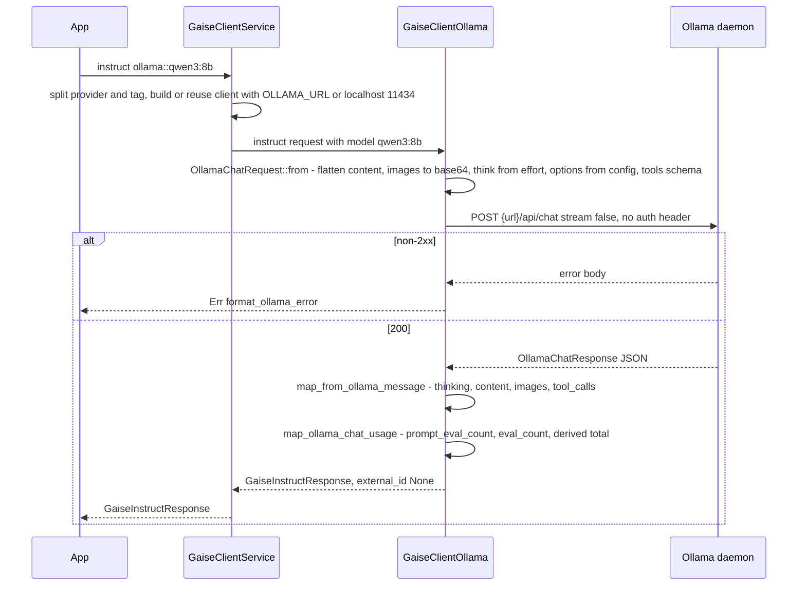
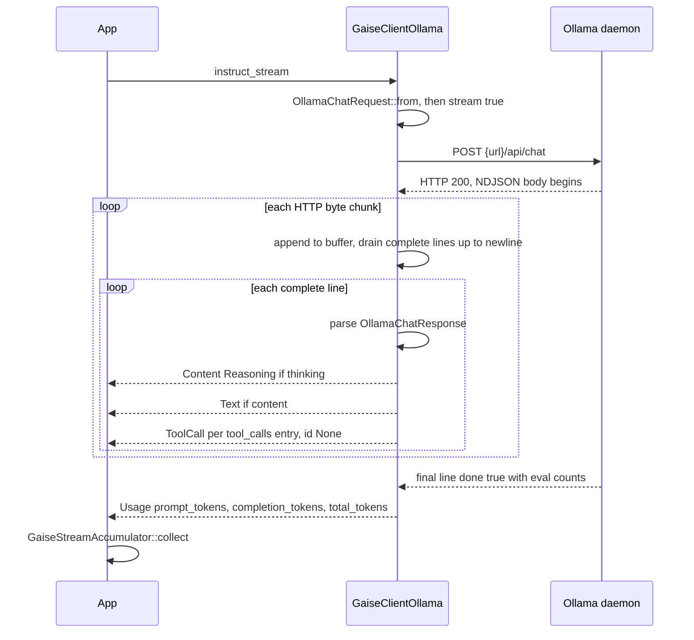

# Ollama (local) (`ollama`)

> Part of the [GAISe wiki](README.md) · [Models](models.md#ollama) · [Capabilities](capabilities.md) · [HTTP API](api.md) · [Rust SDK](sdk.md) · [Flows](flows.md) · [Examples](examples.md)

The `gaise-provider-ollama` crate drives a locally running Ollama daemon over plain HTTP: `instruct` and `instruct_stream` target `POST /api/chat` (JSON body; NDJSON when streaming), `embeddings` targets `POST /api/embed`, and `list_models` reads the installed catalog from `GET /api/tags` with an opt-in `POST /api/show` per tag. There is no live/realtime adapter, no authentication, and no use of the legacy `/api/generate` or `/api/embeddings` endpoints; the OpenAI-compatible `/v1` shim Ollama also exposes is not used. The router enables the adapter through the `ollama` Cargo feature of `gaise-client` (on by default) and routes `ollama::<tag>` model strings to it.

## At a glance

| Crate | Feature flag | Client type | Instruct surface | Streaming surface | Embeddings surface | Live surface | Model listing surface |
|---|---|---|---|---|---|---|---|
| [`gaise-provider-ollama`](../gaise-provider-ollama/Cargo.toml) | `ollama` in [`gaise-client/Cargo.toml`](../gaise-client/Cargo.toml#L30) | [`GaiseClientOllama`](../gaise-provider-ollama/src/ollama_client.rs#L15) | `POST /api/chat`, `stream: false` — [`instruct`](../gaise-provider-ollama/src/ollama_client.rs#L550) | `POST /api/chat`, `stream: true`, NDJSON — [`instruct_stream`](../gaise-provider-ollama/src/ollama_client.rs#L486) | `POST /api/embed` — [`embeddings`](../gaise-provider-ollama/src/ollama_client.rs#L579) | Not supported | `GET /api/tags` + opt-in `POST /api/show` — [`list_models`](../gaise-provider-ollama/src/ollama_client.rs#L436), [`catalog.rs`](../gaise-provider-ollama/src/contracts/catalog.rs) |

Wire types live in [`contracts/models.rs`](../gaise-provider-ollama/src/contracts/models.rs) (chat, embed, tools, options) and [`contracts/catalog.rs`](../gaise-provider-ollama/src/contracts/catalog.rs) (tags, show).

## Configuration

| Variable | Read by | Default | Effect |
|---|---|---|---|
| `OLLAMA_URL` | [`gaise-api/src/main.rs`](../gaise-api/src/main.rs#L11) → [`GaiseClientConfig::ollama_url`](../gaise-client/src/lib.rs#L46) | `http://localhost:11434` when `None` ([`get_client`](../gaise-client/src/lib.rs#L123)) | Base URL of the daemon. Paths are appended as `{url}/api/chat`, `{url}/api/embed`, `{url}/api/tags`, `{url}/api/show`, so pass the origin without a trailing slash. |

- The provider crate itself reads no environment variables (no `std::env::var` calls in `gaise-provider-ollama/`).
- Authentication: none. The adapter uses a default `reqwest::Client` with no headers beyond what `.json()` sets ([`new`](../gaise-provider-ollama/src/ollama_client.rs#L334)). Put a reverse proxy in front of Ollama if you need auth.
- [`configured_providers`](../gaise-client/src/lib.rs#L238) lists `ollama` only when `ollama_url` is explicitly `Some`, so an aggregate `list_models` does not block on a daemon that was never configured; `get_client("ollama")` still works with the localhost default.

```rust
use gaise_core::GaiseClient;
use gaise_provider_ollama::ollama_client::GaiseClientOllama;

let client = GaiseClientOllama::new("http://localhost:11434".to_string());
```

Constructor: `pub fn new(api_url: String) -> Self` ([L334](../gaise-provider-ollama/src/ollama_client.rs#L334)). Through the router, use model IDs such as `ollama::qwen3:8b`; the tag after `::` is sent verbatim as `model`.

## Request mapping

Conversion is the pure `impl From<&GaiseInstructRequest> for OllamaChatRequest` ([L111–L234](../gaise-provider-ollama/src/ollama_client.rs#L111)), testable without HTTP. The outbound body is [`OllamaChatRequest`](../gaise-provider-ollama/src/contracts/models.rs#L5): `model`, `messages[]`, optional `tools`, optional `options`, `stream`, optional `think`. `format` exists on the struct but is always `None` ([L193](../gaise-provider-ollama/src/ollama_client.rs#L193)), so structured output is not mapped.

### Roles and system prompts

- `GaiseMessage.role` is copied verbatim into `OllamaMessage.role` ([L162](../gaise-provider-ollama/src/ollama_client.rs#L162)). There is no top-level system field: a `system` message stays a `{"role":"system","content":…}` entry in `messages`, which is the shape Ollama's chat API expects.
- `user`, `assistant`, and `tool` roles pass through unchanged. No role is rewritten, merged, or rejected.
- Per message the mapper accumulates one `content` string, one `thinking` string, and one `images` array ([L121–L134](../gaise-provider-ollama/src/ollama_client.rs#L121)). Empty strings/arrays are omitted (`None` + `skip_serializing_if`), so a message with only images sends no `content` key.

### Content modalities

All variants are flattened in order by [`append_content`](../gaise-provider-ollama/src/ollama_client.rs#L70); `Parts` recurses ([L95](../gaise-provider-ollama/src/ollama_client.rs#L95)).

| `GaiseContent` variant | Wire shape | Fallback / error when unsupported |
|---|---|---|
| `Text { text }` | Appended to `message.content` ([L77](../gaise-provider-ollama/src/ollama_client.rs#L77)) | — |
| `Image { data, format }` | Base64 (standard alphabet) pushed onto `message.images[]` ([L78](../gaise-provider-ollama/src/ollama_client.rs#L78)). `format` is ignored; Ollama sniffs the bytes. | None at mapping time. A non-vision tag returns an Ollama error or ignores the image; use `/api/show` `vision` capability to check first. |
| `Audio { data, format }` | Not representable | Text marker `[Unsupported audio input for Ollama chat API: {mime or "unknown"}]` appended to `content` ([L104](../gaise-provider-ollama/src/ollama_client.rs#L104)) |
| `File { data, name }` — valid UTF-8 | Tagged text `\n<attached_document name="{name}">\n{text}\n</attached_document>` appended to `content` ([L83](../gaise-provider-ollama/src/ollama_client.rs#L83)); `name` defaults to `document` | — |
| `File { data, name }` — binary | Not representable | Text marker `\n[Unsupported binary document for Ollama chat API: {name}]` ([L90](../gaise-provider-ollama/src/ollama_client.rs#L90)) |
| `Reasoning { text, signature }` | `text` appended to `message.thinking` ([L100](../gaise-provider-ollama/src/ollama_client.rs#L100)); `signature` dropped | — |
| `RedactedReasoning { .. }` | Not representable | Text marker `[Encrypted reasoning retained only on its source provider]` ([L101](../gaise-provider-ollama/src/ollama_client.rs#L101)) |
| `Parts { parts }` | Recursively flattened in order ([L95](../gaise-provider-ollama/src/ollama_client.rs#L95)) | — |

Markers are appended to the visible prompt on purpose so the model and the caller both see that something was dropped; nothing is silently discarded.

### Tools and tool results

Tool definitions: `impl From<GaiseTool> for OllamaTool` ([L20–L68](../gaise-provider-ollama/src/ollama_client.rs#L20)) produces `{"type":"function","function":{"name","description","parameters":{"type":"object","properties":{…},"required":[…]}}}` ([`OllamaTool`](../gaise-provider-ollama/src/contracts/models.rs#L39)).

- Nested schemas: `map_param` recurses through `properties` (as `HashMap`) and `items` (boxed), and copies `required` at every level ([L22–L39](../gaise-provider-ollama/src/ollama_client.rs#L22)); optional nested keys are omitted when `None` ([`OllamaParameterProperty`](../gaise-provider-ollama/src/contracts/models.rs#L59)).
- Type defaults: a missing `type` becomes `"string"`; the legacy value `"text"` is rewritten to `"string"` ([L23–L26](../gaise-provider-ollama/src/ollama_client.rs#L23)). `description` defaults to `""` (Ollama's schema requires the key).
- Top-level `parameters` is always `type: "object"`; a tool with no `parameters` sends empty `properties`/`required` ([L46–L63](../gaise-provider-ollama/src/ollama_client.rs#L46)).
- `tool_choice`: not mapped. `GaiseInstructRequest.tool_config` is ignored; the Ollama request has no tool-choice field.
- Parallel calls: whatever the model returns in `message.tool_calls[]` is passed through; nothing limits or orders them.

Prior assistant tool calls (`GaiseMessage.tool_calls`) are re-serialized as `{"function":{"name","arguments":{…}}}` ([L136–L159](../gaise-provider-ollama/src/ollama_client.rs#L136)). `arguments` is parsed back into a JSON object only when the string starts with `{`; anything else (or a parse failure) becomes `{}` ([L143–L150](../gaise-provider-ollama/src/ollama_client.rs#L143)). `GaiseToolCall.id` and `thought_signature` are dropped — [`OllamaToolCall`](../gaise-provider-ollama/src/contracts/models.rs#L71) has no ID field.

Tool-result messages: a `role: "tool"` message is sent with its flattened `content` (and `images` if the result carried any). `tool_call_id` and `tool_name` are not mapped — [`OllamaMessage`](../gaise-provider-ollama/src/contracts/models.rs#L26) has neither field — so Ollama correlates results by position, which matches its ID-less tool-call shape.

### Generation config

`options` is emitted only when `generation_config` is `Some` ([L183](../gaise-provider-ollama/src/ollama_client.rs#L183)); each inner field uses `skip_serializing_if` ([`OllamaOptions`](../gaise-provider-ollama/src/contracts/models.rs#L82)).

| `GaiseGenerationConfig` field | Ollama field | Notes |
|---|---|---|
| `temperature` | `options.temperature` | Direct copy |
| `top_p` | `options.top_p` | Direct copy |
| `top_k` | `options.top_k` | Direct copy |
| `max_tokens` | `options.num_predict` | Direct copy |
| `thinking_effort` | `think` | Boolean for most tags; level string for GPT-OSS, GLM 5.3, and Granite 4.2 — see [Model-family rules](#model-family-rules) |
| `thinking_tokens` | `think` | Only consulted when `thinking_effort` is `None`: `0` → `false`, `>0` → `true` (or the family's middle level on level families: `"medium"` on GPT-OSS, `"high"` on GLM 5.3 and Granite 4.2) |
| `include_thoughts` | — | Not mapped; Ollama returns `thinking` whenever `think` is on |
| `response_modalities` | — | Not mapped |
| `image_config` | — | Not mapped |
| `input_image_detail` | — | Not mapped |
| `input_media_resolution` | — | Not mapped |
| `cache_key` | — | Not mapped |
| stop sequences | — | Not mapped (no common field; `options.stop` is not emitted) |
| `options.num_ctx` | — | Not mapped |
| `format` (JSON mode / schema) | — | Not mapped; always omitted |
| service tier / cache control | — | Not applicable to a local daemon |
| `correlation_id` | — | Not sent to Ollama (used only for logging in the router) |

### Model-family rules

[`ollama_think_levels`](../gaise-provider-ollama/src/ollama_client.rs) is the only family table: a case-insensitive `contains("gpt-oss")` check plus the `glm-5.3` and `granite4.2` prefixes (added 2026-09-12 from the library pages, which document `reasoning_effort` levels for both) select the level-string form with each family's documented set; every other tag gets a boolean. [`OllamaThink`](../gaise-provider-ollama/src/contracts/models.rs#L19) is `#[serde(untagged)]`, so it serializes as either a JSON boolean or a string.

| Family | `thinking_effort` value | `think` sent | Source |
|---|---|---|---|
| level families: `*gpt-oss*` (`low`, `medium`, `high`), `glm-5.3*` (`low`, `high`, `max`), `granite4.2*` (`low`, `high`) | `false`, `none`, `off`, `disabled`, `0` (case-insensitive) | `false` | [`ollama_think`](../gaise-provider-ollama/src/ollama_client.rs) |
| level families | `auto` | `true` | ″ |
| level families | a canonical level (`minimal` … `ultra`) | the nearest level in the family's set: `minimal` → `low`, `xhigh`/`max`/`ultra` → the family top, `medium` → `high` on GLM 5.3 and Granite 4.2 | ″ |
| level families | any other string | that string, as a level | ″ |
| level families | `None`, `thinking_tokens = Some(0)` | `false` | ″ |
| level families | `None`, `thinking_tokens = Some(n > 0)` | the family's middle level (`"medium"` on GPT-OSS, `"high"` on GLM 5.3 and Granite 4.2) | ″ |
| all other tags | `false`, `none`, `off`, `disabled`, `0` | `false` | ″ |
| all other tags | any other string | `true` | ″ |
| all other tags | `None`, `thinking_tokens = Some(n)` | `n > 0` | ″ |
| any | both `None`, or no `generation_config` | key omitted | ″ |

The adapter does not validate the level string against Ollama's accepted set; an unknown level is forwarded and the daemon decides. Since Ollama v0.33 the daemon accepts `think` as `true`/`false` or exactly `low`, `medium`, `high`, `max` (anything else is rejected at unmarshal); GPT-OSS ignores booleans and needs a level; GLM 5.3 (reasoning always on) and Granite 4.2 document `reasoning_effort` levels and receive the level form since 2026-09-12. Families that document their own effort strings but are not in the table (Muse Glimmer `low`…`xhigh`, Qwen 3.8 `reasoning_effort`) still receive the boolean form from GAISe, which Ollama documents as accepted for "most models". There are no sampling restrictions, no reasoning-family allowlists, and no per-model max-token rules — Ollama accepts `options` for every tag.

## Response mapping

Non-streaming: the body is deserialized as [`OllamaChatResponse`](../gaise-provider-ollama/src/contracts/models.rs#L94) and converted by [`map_from_ollama_message`](../gaise-provider-ollama/src/ollama_client.rs#L383).

| Ollama field | GAISe result | Notes |
|---|---|---|
| `message.role` | `GaiseMessage.role` | Verbatim (normally `assistant`) |
| `message.thinking` | `GaiseContent::Reasoning { text, signature: None }` first in `content` ([L403](../gaise-provider-ollama/src/ollama_client.rs#L403)) | Skipped when empty; Ollama has no signature concept |
| `message.content` | `GaiseContent::Text { text }` ([L409](../gaise-provider-ollama/src/ollama_client.rs#L409)) | Skipped when empty |
| `message.images[]` | `GaiseContent::Image { data, format: None }` per decodable base64 entry ([L412](../gaise-provider-ollama/src/ollama_client.rs#L412)) | Entries that fail base64 decoding are dropped; MIME type is unknown |
| `message.tool_calls[]` | `GaiseToolCall { id: "", type: "function", function: { name, arguments: <JSON string> }, thought_signature: None }` ([L384](../gaise-provider-ollama/src/ollama_client.rs#L384)) | `id` is an empty string because Ollama returns none; `arguments` object is re-serialized to a string |
| `prompt_eval_count` / `eval_count` | `usage` via [`map_ollama_chat_usage`](../gaise-provider-ollama/src/ollama_client.rs#L250) | See [Usage counters](#usage-counters) |
| `done`, `done_reason`, `total_duration`, `load_duration`, `created_at`, `model` | — | Not mapped; `done_reason` is not even deserialized, so there is no finish/stop reason |

- `content` collapses to `None` / `OneOrMany::One` / `OneOrMany::Many` by count ([L422](../gaise-provider-ollama/src/ollama_client.rs#L422)). `tool_call_id`/`tool_name` are always `None` on output.
- `external_id` is always `None` ([L574](../gaise-provider-ollama/src/ollama_client.rs#L574)); Ollama issues no response IDs.
- Errors: any non-2xx status becomes `Err` with the body passed through [`format_ollama_error`](../gaise-provider-ollama/src/ollama_client.rs#L236). A body containing `error parsing tool call` is prefixed with `Ollama failed to parse the model's tool call output. This usually means the model does not support tool calling. Choose an installed tag that advertises tool support in Ollama's model metadata.` followed by `Raw error: …`; everything else becomes `Ollama API error: {body}`. The same helper is used by `/api/tags`, `/api/show`, `/api/embed`, and the stream opener.
- Retries: none. Timeouts: reqwest defaults (none).

## Streaming

- Framing: `stream: true` ([L505](../gaise-provider-ollama/src/ollama_client.rs#L505)) makes Ollama return newline-delimited JSON, one `OllamaChatResponse` per line, final line `done: true`.
- Split-frame buffering ([L518–L545](../gaise-provider-ollama/src/ollama_client.rs#L518)): a `scan` over `bytes_stream()` appends every HTTP chunk to a `Vec<u8>` and drains up to each `\n`, so a JSON object split across TCP chunks, or several objects in one chunk, both parse correctly. Lines are `from_utf8_lossy` + `trim`; blank lines are skipped. A trailing fragment with no terminating newline at EOF is never flushed.
- Errors inside the stream (transport failure, or a line that is not valid `OllamaChatResponse` JSON) are yielded as `Err` items rather than ending the stream ([L524](../gaise-provider-ollama/src/ollama_client.rs#L524), [L538](../gaise-provider-ollama/src/ollama_client.rs#L538)).

Each parsed line is expanded by [`map_stream_response`](../gaise-provider-ollama/src/ollama_client.rs#L277) into zero or more events, in this order:

| Ollama line field | `GaiseStreamChunk` | Notes |
|---|---|---|
| `message.thinking` (non-empty) | `Content(Reasoning { text, signature: None })` | Reasoning deltas arrive before answer text on thinking tags |
| `message.content` (non-empty) | `Text(text)` | Delta text |
| `message.images[]` | `Content(Image { data, format: None })` per decodable entry | Rarely present |
| `message.tool_calls[]` | `ToolCall { index, id: None, name: Some(name), arguments: Some(json_string), thought_signature: None }` | Ollama emits complete tool calls, not argument deltas. `index` is the position inside that line's `tool_calls` array ([L306](../gaise-provider-ollama/src/ollama_client.rs#L306)); there is no cross-line counter, so `GaiseStreamAccumulator` merges calls that share an index across lines. |
| `done: true` with `prompt_eval_count`/`eval_count` | `Usage(GaiseUsage)` | Emitted once, as the last event ([L321](../gaise-provider-ollama/src/ollama_client.rs#L321)) |

`external_id` is `None` on every event. There is no finish-reason event.

## Usage counters

Keys are provider-named, never renamed to a common vocabulary.

| Surface | `usage.input` | `usage.output` | `usage.total` | Source |
|---|---|---|---|---|
| Chat (`instruct`, final stream line) | `prompt_tokens` ← `prompt_eval_count` | `completion_tokens` ← `eval_count` | `total_tokens` = `prompt_eval_count + eval_count` (derived, `checked_add`; present only when both counts are present) | [`map_ollama_chat_usage`](../gaise-provider-ollama/src/ollama_client.rs#L250) |
| Embeddings | `prompt_tokens` ← `prompt_eval_count` | — | `total_tokens` ← `prompt_eval_count` | [`map_ollama_embedding_usage`](../gaise-provider-ollama/src/ollama_client.rs#L269) |

`usage` is `None` when Ollama omits both counts. No `image_tokens`, `audio_tokens`, `reasoning_tokens`, or cache counters are invented — Ollama reports none (unit test at [L620](../gaise-provider-ollama/src/ollama_client.rs#L620) asserts this). Note that Ollama's `prompt_eval_count` can exclude tokens served from its KV cache, so `prompt_tokens` may be lower than the full prompt length.

## Embeddings

[`embeddings`](../gaise-provider-ollama/src/ollama_client.rs) builds [`OllamaEmbedRequest`](../gaise-provider-ollama/src/contracts/models.rs) `{"model","input":[…],"dimensions"?,"truncate":true}` with [`ollama_embed_request`](../gaise-provider-ollama/src/ollama_client.rs) and posts it to `POST /api/embed`. `OneOrMany<String>` input is always sent as an array; `options` is always `None`; `keep_alive` is not set. Requests go through the shared resolver described in [embeddings.md](embeddings.md#how-a-request-is-resolved): the model's `[models.embedding]` profile in [`model-registry.toml`](../gaise-core/model-registry.toml) decides how `task`, `dimensions`, and `normalize` are expressed, and the [generated matrix](embeddings.md#model-matrix) shows the wire result per model.

- `task` applies the installed family's documented prefix convention to the text (Ollama adds none itself): nomic `search_query: ` / `search_document: ` / `classification: ` / `clustering: `; mxbai, bge-large and Arctic v1 prepend `Represent this sentence for searching relevant passages: ` to query-side tasks only; Qwen3-Embedding prepends `Instruct: … Query:`; Arctic 2 prepends `query: `; EmbeddingGemma uses Google's `task: search result | query: …` / `title: none | text: …` form. Tags without a convention (bge-m3, all-minilm, granite, paraphrase-multilingual) and unknown tags are sent unchanged; so is every input when `task` is unset.
- `dimensions` is snapped to the tag's Matryoshka sizes (EmbeddingGemma 128/256/512/768, nomic 64–768, Qwen3 32–4096, Arctic 2 256/1024), dropped for fixed-size tags, and forwarded untouched for unknown tags. Ollama ≥ 0.11.11 truncates and re-normalizes; older servers ignore the field.
- An untagged name (`nomic-embed-text`) resolves to the `name:*` profile, matching Ollama's own `:latest` default.
- `/api/embed` returns L2-normalized vectors, so `normalize` is only applied locally for unknown tags. The response `embeddings: Vec<Vec<f32>>` is returned as `GaiseEmbeddingsResponse.output` in input order, `external_id: None`, usage as above. Any installed tag whose `/api/show` capabilities include `embedding` works; a chat tag will be rejected by the daemon.

## Live / realtime

Not supported. Ollama exposes no realtime/WebSocket session API, the crate has no `live` feature, and the router's `GaiseLiveClient` surface has no `ollama` arm.

## Model discovery

Endpoints: `GET /api/tags` ([`list_tags`](../gaise-provider-ollama/src/ollama_client.rs#L342)) always; `POST /api/show {"model"}` ([`show_model`](../gaise-provider-ollama/src/ollama_client.rs#L359)) only when `GaiseListModelsRequest.include_details` is true. Neither endpoint paginates; `/api/tags` returns the full local catalog in one body. Parse failures include the first 400 characters of the body in the error.

Provider-sourced (from `/api/tags`, [`map_ollama_tag`](../gaise-provider-ollama/src/contracts/catalog.rs#L73)):

- `id` = tag `name` (`qwen3:8b`), `provider` = `ollama`, `created_at` = `modified_at`, `status` = `Active` (an installed tag is by definition current).
- `description` = `"{details.family} {details.parameter_size} {details.quantization_level}"`, for example `qwen3 8.2B Q4_K_M`.
- `capabilities.sources` gets `provider`; `raw` = the tag record when `include_raw`.
- Nothing else: operations, modalities, tools, reasoning all stay *unknown* (empty list / `GaiseSupport::Unknown`) until `/api/show` or the registry fills them.

Provider-sourced (from `/api/show`, [`apply_ollama_show`](../gaise-provider-ollama/src/contracts/catalog.rs#L100)), fetched four tags at a time ([`CONCURRENCY`](../gaise-provider-ollama/src/ollama_client.rs#L451)):

| `capabilities[]` value | Effect |
|---|---|
| `completion` | input `text`, output `text`, operations `instruct` + `instruct_stream` |
| `vision` | input `image` |
| `embedding` | input `text`, output `embedding`, operation `embeddings` |
| `tools` / absent | `tools = Supported` / `Unsupported` (only when the array is non-empty) |
| `thinking` / absent | `reasoning = Supported` / `Unsupported` (only when the array is non-empty) |
| `insert` | Ignored |
| `model_info["*.context_length"]` | `limits.max_input_tokens` |
| `model_info["*.embedding_length"]` | `limits.embedding_dimensions`, embedding models only |

With `include_raw`, the show payload is attached under `raw.show` minus the bulky `template` and `parameters` strings. A failing `/api/show` keeps the tag and appends `GaiseProviderError { provider: "ollama", message: "{tag}: {error}" }` to `errors` instead of failing the listing ([L460](../gaise-provider-ollama/src/ollama_client.rs#L460)).

Heuristic: none. The adapter does not guess capabilities from tag names.

Registry-filled: the router ([`list_provider_models`](../gaise-client/src/lib.rs#L254)) overlays [`model-registry.toml`](../gaise-core/model-registry.toml#L1047) via [`RegistryModel::overlay`](../gaise-core/src/registry.rs#L296) before applying the `operation` filter. The Ollama section carries only family globs (`qwen3:*`, `gpt-oss:*`, …) because the installed catalog is dynamic; a tag matching a glob gains operations, modalities, tool/reasoning flags, and `reasoning_values` where the daemon said nothing, and `capabilities.sources` gains `registry`. A tag that matches no glob and was listed without `include_details` has empty operations and is dropped by an `operation` filter. Ollama's `/api/show` answer wins wherever it spoke: the overlay never removes a modality or overrides a `Supported`/`Unsupported` flag.

Catalog tests: [`maps_tags_and_show_details`](../gaise-provider-ollama/src/contracts/catalog.rs#L152) covers tag mapping, capability flags, context/embedding lengths, raw trimming, and a vision-only show payload.

**Limits.** With `include_details`, `/api/show`'s `<arch>.context_length` becomes `limits.context_window` / `limits.max_input_tokens` and `embedding_length` becomes `limits.embedding_dimensions` for the installed tag, overriding the registry's family figure (recorded at the smallest tag's window, with per-tag variation in the notes). Without it, the registry figure applies. Remember the served window is the request's `num_ctx`, not the trained value. See [limits.md](limits.md).

## Models

Registry entries for `ollama` (audited 2026-09-12). Every entry is a family glob with `status = dynamic_local` (mapped to `Active`); no lifecycle dates exist because Ollama has no central retirement calendar. Which tags actually exist, and their vision/tool/thinking support, comes from the local daemon.

| Model | Aliases | Status | Dates | Input | Output | Operations | Reasoning values | GAISe support | Notes |
|---|---|---|---|---|---|---|---|---|---|
| `qwen3:*` | — | `dynamic_local` | — | text | text | instruct, instruct_stream | `true`, `false` | native | Context 40,960 on the original dense tags (0.6b-32b); the 2507 builds, 4b, 30b, and 235b are 262,144. Ollama serves a smaller default num_ct… |
| `gpt-oss:*` | — | `dynamic_local` | — | text | text | instruct, instruct_stream | `low`, `medium`, `high` | native | Context 131,072 on 20b and 120b. |
| `deepseek-r1:*` | `deepseek-v3.1:*` | `dynamic_local` | — | text | text | instruct, instruct_stream | `true`, `false` | native | Context 131,072 on the distilled tags; deepseek-r1:671b and deepseek-v3.1 are 163,840. The library lists the tools badge for both families (… |
| `gemma4:*` | — | `dynamic_local` | — | text, image, audio | text | instruct, instruct_stream | `true`, `false` | native when the installed tag advertises the capability (/api/show) | Context 131,072 on e2b/e4b; 12b, 26b, and 31b are 262,144. Library badges as of 2026-09-04: vision, tools, thinking, audio, cloud. Audio inp… |
| `qwen3.8:*` | `qwen3.8-flash-next:*` | `dynamic_local` | — | text, image | text | instruct, instruct_stream | `true`, `false` | native | Qwen 3.8 27B (Ollama v0.32.12, 2026-08-14) and the MLX-only Qwen 3.8 Flash Next 125B-A6B (v0.33.1, 2026-08-26); 256K context, vision, tools,… |
| `qwen3.6:*` | — | `dynamic_local` | — | text, image | text | instruct, instruct_stream | `true`, `false` | native | 27b and 35b tags; 256K context; retains reasoning context across turns. |
| `qwen3.5:*` | — | `dynamic_local` | — | text, image | text | instruct, instruct_stream | `true`, `false` | native | 0.8b-122b tags, all 256K context; multimodal; cloud tags available. |
| `muse-glimmer:*` | — | `dynamic_local` | — | text, image | text | instruct, instruct_stream | `true`, `false` | native (boolean thinking toggle) | Meta's 30B open model for local agents (2026-08-10, Apache 2.0); documents reasoning strength low/medium/high/xhigh, which the adapter does… |
| `nemotron-3.5-lightning:*` | — | `dynamic_local` | — | text | text | instruct, instruct_stream | `true`, `false` | native | NVIDIA 30B-A3B MoE for always-on agents (2026-08-11); 1M context on the GGUF tag, 256K on MLX. |
| `laguna-s-2.1:*` | — | `dynamic_local` | — | text | text | instruct, instruct_stream | `true`, `false` | native | Ollama's own 118B-A8B model for long-horizon work (OpenMDW-1.1 licence); tool calling and interleaved thinking, toggled per request. 256K on… |
| `laguna-xs-2.1:*` | — | `dynamic_local` | — | text | text | instruct, instruct_stream | `true`, `false` | native | Ollama's 33B-A3B MoE for local agentic coding (OpenMDW-1.1 licence, 2026-09); 256K on every tag (q4_K_M, q8_0, bf16, mxfp8 MLX); tools and p… |
| `glm-5.3:*` | — | `dynamic_local` | — | text | text | instruct, instruct_stream | `low`, `high`, `max` | native (cloud tag only; served through ollama.com with an API key) | Z.ai GLM-5.3, cloud-only glm-5.3:cloud (open weights 2026-08-28); 1M context; reasoning_effort low/high/max (default max) and clear_thinking… |
| `glm-5.3-flash:*` | — | `dynamic_local` | — | text, image | text | instruct, instruct_stream | `low`, `high`, `max` | native (cloud tag only; served through ollama.com with an API key) | GLM-5.3 Flash, 320B-A18B natively multimodal (MIT), cloud-only glm-5.3-flash:cloud; 1M context; reasoning is always on with effort low/high/… |
| `deepseek-v4.1-flash:*` | — | `dynamic_local` | — | text, image | text | instruct, instruct_stream | `true`, `false` | native (cloud tag only; served through ollama.com with an API key) | DeepSeek V4.1 Flash (2026-09-10), 763B MoE on a 552B backbone with native vision, cloud-only deepseek-v4.1-flash:cloud; 1M context; library… |
| `kimi-k3:*` | — | `dynamic_local` | — | text, image | text | instruct, instruct_stream | `true`, `false` | native (cloud tag only; served through ollama.com with an API key) | Moonshot Kimi K3, 2.81T-parameter open-weight multimodal agentic model, cloud-only kimi-k3:cloud (listed 2026-08); 1M context; no think leve… |
| `granite4.2:*` | — | `dynamic_local` | — | text | text | instruct, instruct_stream | `low`, `high` | native | IBM Granite 4.2 3b/8b/30b (Apache 2.0, 2026-08); 128K context; tool use, structured JSON output, and thinking (enable_thinking true/false, r… |
| `ornith-1.5:*` | — | `dynamic_local` | — | text, image | text | instruct, instruct_stream | — | native | Ornith 1.5 9b/35b/397b (2026-08); 256K context; vision badge only (no tools or thinking badge, unlike the older ornith family). |
| `mistral-medium-3.5:*` | — | `dynamic_local` | — | text, image | text | instruct, instruct_stream | `true`, `false` | native | 128B single-weight model with a configurable reasoning mode; 256K context. |
| `llama4:*` | — | `dynamic_local` | — | text, image | text | instruct, instruct_stream | — | native | Scout 16x17b (10M context) and Maverick 128x17b (1M); vision and tools, no thinking. Context recorded as the family floor. |
| `embeddinggemma:*` | — | `dynamic_local` | — | text | embedding | embeddings | — | native | EmbeddingGemma 300m; Matryoshka 768/512/256/128; 2,048-token context; Google prompt-instruction convention. |
| `nomic-embed-text:*` | — | `dynamic_local` | — | text | embedding | embeddings | — | native | nomic-embed-text v1.5; Matryoshka 64-768; 8,192-token context (raise num_ctx); prefixes are required for good retrieval. |
| `nomic-embed-text-v2-moe:*` | — | `dynamic_local` | — | text | embedding | embeddings | — | native | Multilingual MoE; Matryoshka 256-768; 512-token context. |
| `qwen3-embedding:*` | — | `dynamic_local` | — | text | embedding | embeddings | — | native | 0.6b/4b/8b = 1024/2560/4096 dimensions (Matryoshka 32-4096); 32k context per the model card (the Ollama library serves 4b/8b with a 40K defa… |
| `mxbai-embed-large:*` | — | `dynamic_local` | — | text | embedding | embeddings | — | native | mixedbread mxbai-embed-large-v1; fixed 1024; 512-token context; queries take an instruction. |
| `bge-m3:*` | — | `dynamic_local` | — | text | embedding | embeddings | — | native | BAAI bge-m3; fixed 1024; 8,192-token context; multilingual; no prefix. |
| `bge-large:*` | — | `dynamic_local` | — | text | embedding | embeddings | — | native | BAAI bge-large-en-v1.5; fixed 1024; 512-token context; optional query instruction. |
| `all-minilm:*` | — | `dynamic_local` | — | text | embedding | embeddings | — | native | all-MiniLM-L6/L12; fixed 384; 256-token context; English. |
| `snowflake-arctic-embed:*` | — | `dynamic_local` | — | text | embedding | embeddings | — | native | Arctic-embed v1 22m-335m; 384-1024 dimensions by tag; 512-token context except the 137m (m-long) tag, which accepts 2,048; queries take an i… |
| `snowflake-arctic-embed2:*` | — | `dynamic_local` | — | text | embedding | embeddings | — | native | Arctic-embed 2.0; 1024 dimensions (Matryoshka to 256); 8,192-token context; multilingual; queries take `query: `. |
| `granite-embedding:*` | — | `dynamic_local` | — | text | embedding | embeddings | — | native | IBM Granite 30m (384, English) / 278m (768, 12 languages); 512-token context; no prefix. |
| `paraphrase-multilingual:*` | — | `dynamic_local` | — | text | embedding | embeddings | — | native | paraphrase-multilingual-MiniLM-L12-v2; fixed 768; 128-token context; 50+ languages. |

Any other installed tag is accepted as-is (`ollama::<tag>`); the registry is advisory and does not gate requests.

## Limitations and explicit fallbacks

- Audio input is not representable: an `[Unsupported audio input for Ollama chat API: …]` text marker is sent instead ([L104](../gaise-provider-ollama/src/ollama_client.rs#L104)).
- Binary files (PDF, Office, archives) are not representable: `[Unsupported binary document for Ollama chat API: {name}]` marker ([L90](../gaise-provider-ollama/src/ollama_client.rs#L90)). UTF-8 files are inlined as `<attached_document>` tagged text, which counts against the context window.
- `RedactedReasoning` from another provider becomes a fixed text marker; reasoning signatures are dropped on both directions.
- Images are always forwarded through `images[]`; the adapter cannot know whether the tag has `vision`. Check `list_models` with `include_details` or `/api/show` first.
- Tool calls have no IDs: outbound `GaiseToolCall.id` is dropped, inbound `id` is `""`, and tool-result `tool_call_id`/`tool_name` are not sent. Correlation is positional.
- Tool-call `arguments` that are not a JSON object string are sent as `{}`.
- A model that emits malformed tool-call text makes Ollama fail the request; the adapter surfaces this as the dedicated "does not support tool calling" message from [`format_ollama_error`](../gaise-provider-ollama/src/ollama_client.rs#L236).
- Not mapped: `tool_config`/tool choice, `format` (JSON mode/schema), stop sequences, `num_ctx`, `keep_alive`, `include_thoughts`, `response_modalities`, `image_config`, `input_image_detail`, `input_media_resolution`, `cache_key`, `done_reason`, response IDs, retries.
- Streaming tool-call `index` restarts at 0 on every NDJSON line; accumulate by name if a model spreads calls across lines.
- A trailing partial NDJSON line without `\n` at end of stream is discarded.
- Usage is aggregate only (`prompt_tokens`, `completion_tokens`, derived `total_tokens`); no modality or reasoning breakdown exists.
- Model IDs are arbitrary strings; there is no client-side validation against the installed catalog.

## Flow

Non-streaming instruct:



Streaming instruct:



## Tests

Hermetic (run in the default suite, no daemon required):

| File | Covers |
|---|---|
| [`tests/mapping_tests.rs`](../gaise-provider-ollama/tests/mapping_tests.rs) | Tool schema with `properties`/`required` ([L8](../gaise-provider-ollama/tests/mapping_tests.rs#L8)); array `items` recursion ([L57](../gaise-provider-ollama/tests/mapping_tests.rs#L57)); `temperature`/`num_predict` options ([L112](../gaise-provider-ollama/tests/mapping_tests.rs#L112)); image → `images[]` base64 ([L145](../gaise-provider-ollama/tests/mapping_tests.rs#L145)); nested `Parts` with UTF-8 file tag and binary marker ([L181](../gaise-provider-ollama/tests/mapping_tests.rs#L181)); prior assistant `tool_calls` re-serialization ([L216](../gaise-provider-ollama/tests/mapping_tests.rs#L216)); `think: true` from effort on `qwen3` ([L260](../gaise-provider-ollama/tests/mapping_tests.rs#L260)); `think: false` for `"false"`, GPT-OSS level `"high"`, and the audio marker ([L299](../gaise-provider-ollama/tests/mapping_tests.rs#L299)) |
| [`src/ollama_client.rs`](../gaise-provider-ollama/src/ollama_client.rs#L620) (unit) | Final-line usage mapping: `prompt_tokens`, `completion_tokens`, derived `total_tokens`, no modality keys, `None` when counts are absent |
| [`src/contracts/catalog.rs`](../gaise-provider-ollama/src/contracts/catalog.rs#L152) (unit) | `/api/tags` → `GaiseModel`, `/api/show` capabilities, context/embedding lengths, raw trimming, vision modality |

Not yet covered hermetically: an NDJSON split-frame fixture for the `scan` buffer, and a serialized-JSON assertion for the full `OllamaChatRequest` body (tests inspect the typed struct).

Ignored live tests in [`tests/integration_tests.rs`](../gaise-provider-ollama/tests/integration_tests.rs) require a running daemon at `http://localhost:11434` with `gpt-oss:20b` pulled; they are `#[ignore]` because the default suite must stay hermetic and a local model download is large:

- `test_ollama_instruct_gpt_oss` ([L5](../gaise-provider-ollama/tests/integration_tests.rs#L5)) — plain instruct returns an assistant message.
- `test_ollama_instruct_stream_gpt_oss` ([L43](../gaise-provider-ollama/tests/integration_tests.rs#L43)) — streamed text is non-empty.
- `test_ollama_tool_call_gpt_oss` ([L83](../gaise-provider-ollama/tests/integration_tests.rs#L83)) — non-streaming tool call with name and arguments.
- `test_ollama_tool_call_stream_gpt_oss` ([L147](../gaise-provider-ollama/tests/integration_tests.rs#L147)) — streamed tool call collected via `GaiseStreamAccumulator`.

Run them only with explicit authorization: `cargo test -p gaise-provider-ollama -- --ignored`.

## Sources

Official:

- Catalog: <https://ollama.com/search> (from `model-registry.toml` `[[providers]] key = "ollama"`)
- Lifecycle: dynamic local catalog — no central retirement calendar; discovery is `GET /api/tags`
- API reference: <https://github.com/ollama/ollama/blob/main/docs/api.md> (`/api/chat`, `/api/embed`, `/api/tags`, `/api/show`)

Repository:

- [`../CLAUDE.md`](../CLAUDE.md) — Ollama boundary rules
- [`../gaise-provider-ollama/src/ollama_client.rs`](../gaise-provider-ollama/src/ollama_client.rs)
- [`../gaise-provider-ollama/src/contracts/models.rs`](../gaise-provider-ollama/src/contracts/models.rs)
- [`../gaise-provider-ollama/src/contracts/catalog.rs`](../gaise-provider-ollama/src/contracts/catalog.rs)
- [`../gaise-provider-ollama/tests/mapping_tests.rs`](../gaise-provider-ollama/tests/mapping_tests.rs)
- [`../gaise-provider-ollama/tests/integration_tests.rs`](../gaise-provider-ollama/tests/integration_tests.rs)
- [`../gaise-provider-ollama/README.md`](../gaise-provider-ollama/README.md)
- [`../gaise-provider-ollama/Cargo.toml`](../gaise-provider-ollama/Cargo.toml)
- [`../gaise-client/src/lib.rs`](../gaise-client/src/lib.rs) — `GaiseClientConfig::ollama_url`, `get_client`, `configured_providers`, `list_provider_models`
- [`../gaise-client/Cargo.toml`](../gaise-client/Cargo.toml) — `ollama` feature
- [`../gaise-api/src/main.rs`](../gaise-api/src/main.rs) — `OLLAMA_URL`
- [`../gaise-core/model-registry.toml`](../gaise-core/model-registry.toml) — Ollama family globs
- [`../gaise-core/src/registry.rs`](../gaise-core/src/registry.rs) — glob matching and overlay rules
- [`../gaise-core/src/contracts/gaise_content.rs`](../gaise-core/src/contracts/gaise_content.rs), [`gaise_generation_config.rs`](../gaise-core/src/contracts/gaise_generation_config.rs), [`gaise_message.rs`](../gaise-core/src/contracts/gaise_message.rs), [`gaise_tool_parameter.rs`](../gaise-core/src/contracts/gaise_tool_parameter.rs), [`gaise_instruct_stream_response.rs`](../gaise-core/src/contracts/gaise_instruct_stream_response.rs), [`gaise_usage.rs`](../gaise-core/src/contracts/gaise_usage.rs), [`gaise_model.rs`](../gaise-core/src/contracts/gaise_model.rs)
