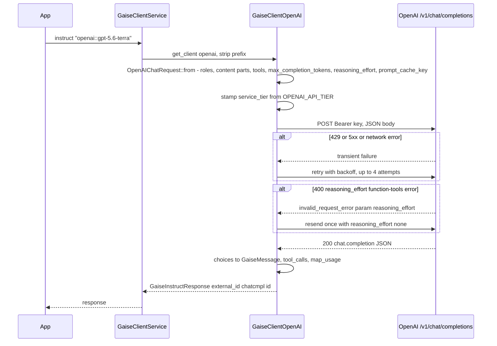
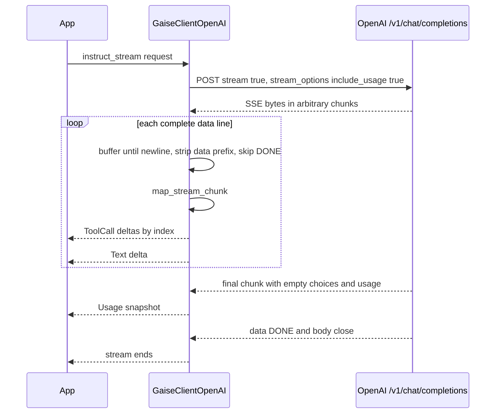

# OpenAI (`openai`)

> Part of the [GAISe wiki](README.md) · [Models](models.md#openai) · [Capabilities](capabilities.md) · [HTTP API](api.md) · [Rust SDK](sdk.md) · [Flows](flows.md) · [Examples](examples.md)

The `gaise-provider-openai` crate drives three OpenAI surfaces: **Chat Completions** (`POST /chat/completions`) for `instruct` and `instruct_stream`, **Embeddings** (`POST /embeddings`) for `embeddings`, and **`GET /models`** for `list_models`. Behind the optional `live` Cargo feature it also drives the GA **Realtime** WebSocket (`wss://…/v1/realtime?model=…`) through `GaiseLiveClient`. It deliberately does **not** target the Responses API, the Images API, or Batch: Responses-style `input_file`, hosted image generation, persisted reasoning, pro mode, hosted tools, and native Chat audio output are out of scope for this adapter. In `gaise-client` the router enables it with the `openai` feature (on by default) and adds the Realtime client with `live`.

## At a glance

| Crate | Feature flag | Client type | Instruct surface | Streaming surface | Embeddings surface | Live surface | Model listing surface |
|---|---|---|---|---|---|---|---|
| [`gaise-provider-openai`](../gaise-provider-openai/Cargo.toml) | `openai` in [`gaise-client`](../gaise-client/Cargo.toml#L32); crate-level `live` for Realtime ([`Cargo.toml#L15`](../gaise-provider-openai/Cargo.toml#L15)) | [`GaiseClientOpenAI`](../gaise-provider-openai/src/openai_client.rs#L94); [`GaiseClientOpenAILive`](../gaise-provider-openai/src/openai_live_client.rs#L118) | Chat Completions, [`instruct`](../gaise-provider-openai/src/openai_client.rs#L598) | Chat Completions SSE, [`instruct_stream`](../gaise-provider-openai/src/openai_client.rs#L519) | Embeddings, [`embeddings`](../gaise-provider-openai/src/openai_client.rs#L628) | Realtime WebSocket, [`live_connect`](../gaise-provider-openai/src/openai_live_client.rs#L284) | `GET /models`, [`list_models`](../gaise-provider-openai/src/openai_client.rs#L689) + [`catalog.rs`](../gaise-provider-openai/src/contracts/catalog.rs) |

## Configuration

| Variable | Read by | Default | Purpose |
|---|---|---|---|
| `OPENAI_API_KEY` | [`gaise-api/src/main.rs#L15`](../gaise-api/src/main.rs#L15) → `GaiseClientConfig.openai_api_key` | none; `get_client("openai")` errors with `OpenAI API Key not configured` ([`lib.rs#L157`](../gaise-client/src/lib.rs#L157)) | Bearer token |
| `OPENAI_API_URL` | [`gaise-api/src/main.rs#L14`](../gaise-api/src/main.rs#L14) → `GaiseClientConfig.openai_api_url` | `https://api.openai.com/v1` for chat/embeddings/models ([`lib.rs#L152`](../gaise-client/src/lib.rs#L152)); `https://api.openai.com` for the live client ([`lib.rs#L528`](../gaise-client/src/lib.rs#L528)) | Base URL; paths `/chat/completions`, `/embeddings`, `/models` are appended verbatim |
| `OPENAI_API_TIER` | the crate itself, once in [`GaiseClientOpenAI::new`](../gaise-provider-openai/src/openai_client.rs#L328) | unset → `service_tier` omitted | Stamped as `service_tier` on every chat request (`flex`, `priority`, `default`, `auto`). Blank/whitespace is treated as unset |

`configured_providers()` lists `openai` only when `openai_api_key` is set ([`lib.rs#L218`](../gaise-client/src/lib.rs#L218)).

Constructors take the URL and key directly; the crate reads no other environment variables.

```rust
use gaise_provider_openai::openai_client::GaiseClientOpenAI;

let client = GaiseClientOpenAI::new(
    "https://api.openai.com/v1".to_string(),
    std::env::var("OPENAI_API_KEY")?,
);

// feature = "live"
use gaise_provider_openai::openai_live_client::GaiseClientOpenAILive;
let live = GaiseClientOpenAILive::new("https://api.openai.com".to_string(), key);
```

Auth is `Authorization: Bearer <key>` on every HTTP request ([`chat_request_builder`](../gaise-provider-openai/src/openai_client.rs#L474), [`embeddings`](../gaise-provider-openai/src/openai_client.rs#L647), [`list_models_raw`](../gaise-provider-openai/src/openai_client.rs#L715)) and on the WebSocket upgrade ([`live_connect`](../gaise-provider-openai/src/openai_live_client.rs#L304)). The live client rewrites `https://`→`wss://` and appends `/v1` when the base does not already end with it ([`#L289-L299`](../gaise-provider-openai/src/openai_live_client.rs#L289-L299)), so both `https://api.openai.com` and `https://api.openai.com/v1` work.

## Request mapping

All chat mapping is the pure conversion `impl From<&GaiseInstructRequest> for OpenAIChatRequest` ([`openai_client.rs#L239`](../gaise-provider-openai/src/openai_client.rs#L239)); wire types live in [`contracts/models.rs`](../gaise-provider-openai/src/contracts/models.rs).

### Roles and system prompts

Roles pass through unchanged: `GaiseMessage.role` becomes `OpenAIMessage.role` ([`#L285-L290`](../gaise-provider-openai/src/openai_client.rs#L285-L290)). There is no system-prompt hoisting; a `system` (or `developer`) message is sent in place as a normal chat message. `OneOrMany::One` input is wrapped into a single-element `messages` array.

A message whose flattened content is exactly one text part is serialized as the string form `"content": "…"`; anything else becomes the parts array ([`#L264-L269`](../gaise-provider-openai/src/openai_client.rs#L264-L269)). Messages with `content: None` (assistant tool-call turns) omit `content`.

### Content modalities

Mapped by [`map_content_parts`](../gaise-provider-openai/src/openai_client.rs#L195); `Parts` is flattened recursively in order ([`#L232-L235`](../gaise-provider-openai/src/openai_client.rs#L232-L235)).

| `GaiseContent` | Wire shape | Fallback / error |
|---|---|---|
| `Text { text }` | `{"type":"text","text":…}` ([`#L197`](../gaise-provider-openai/src/openai_client.rs#L197)) | — |
| `Image { data, format }` | `{"type":"image_url","image_url":{"url":"data:<mime>;base64,…","detail":…}}`; MIME from [`image_media_type`](../gaise-core/src/contracts/gaise_content.rs#L58) (`png`/`jpg`/`gif`/`webp`/`bmp`/`image/*`, default `image/jpeg`); `detail` = lower-cased `input_image_detail` or omitted ([`#L198-L207`](../gaise-provider-openai/src/openai_client.rs#L198-L207)) | No URL passthrough; bytes only |
| `Audio { data, format }` | `{"type":"input_audio","input_audio":{"data":<b64>,"format":"wav"\|"mp3"}}`; [`openai_audio_format`](../gaise-provider-openai/src/openai_client.rs#L154) maps `wav`/`wave`/`audio/wav` → `wav`, everything else → `mp3` ([`#L208-L213`](../gaise-provider-openai/src/openai_client.rs#L208-L213)) | Non-wav formats are labeled `mp3` regardless of actual codec; the model rejects it if wrong |
| `File { data, name }` (UTF-8) | Text part `<attached_document name="…">\n…\n</attached_document>` ([`#L214-L219`](../gaise-provider-openai/src/openai_client.rs#L214-L219)) | Name defaults to `document` |
| `File { data, name }` (binary) | Text part `[Unsupported binary document for OpenAI Chat Completions; use the Responses API input_file feature: <name>]` ([`#L220-L222`](../gaise-provider-openai/src/openai_client.rs#L220-L222)) | Explicit marker, not an error; no `input_file` on Chat |
| `Reasoning { text, .. }` | Text part `<reasoning_summary>\n…\n</reasoning_summary>` ([`#L226-L228`](../gaise-provider-openai/src/openai_client.rs#L226-L228)) | `signature` is dropped; Chat has no reasoning replay |
| `RedactedReasoning { .. }` | Text part `[Encrypted reasoning retained only on its source provider]` ([`#L229-L231`](../gaise-provider-openai/src/openai_client.rs#L229-L231)) | Bytes are never sent |
| `Parts { parts }` | Flattened, order preserved | — |

### Tools and tool results

- `GaiseTool` → `{"type":"function","function":{"name","description","parameters"}}` via [`impl From<GaiseTool> for OpenAITool`](../gaise-provider-openai/src/openai_client.rs#L104). `parameters.type` is always `"object"`; `properties`/`required` default to empty when `GaiseTool.parameters` is `None`.
- [`map_param`](../gaise-provider-openai/src/openai_client.rs#L106) recurses through `properties`, `items`, and `required`; missing `type` defaults to `string`, and `text` is rewritten to `string`. `description` is always emitted (empty string if absent).
- `properties` is a `BTreeMap`, so the serialized tools block is byte-stable across turns for prompt caching ([`models.rs#L108-L110`](../gaise-provider-openai/src/contracts/models.rs#L94-L96)).
- `tool_choice` is **not mapped**: `GaiseInstructRequest.tool_config` is ignored on Chat and `OpenAIChatRequest` has no `tool_choice` field.
- Assistant `tool_calls` are replayed as `{"id","type","function":{"name","arguments"}}` with `arguments` defaulting to `""` ([`#L272-L283`](../gaise-provider-openai/src/openai_client.rs#L272-L283)). `thought_signature` is not sent.
- Tool results: `tool_call_id` passes through on the `tool` message ([`#L289`](../gaise-provider-openai/src/openai_client.rs#L289)); `tool_name` is **not sent** (OpenAI resolves by ID alone) and is returned as `None` ([`#L378`](../gaise-provider-openai/src/openai_client.rs#L378)).
- Parallel calls: non-streaming responses carry the full `tool_calls` array; streaming emits one `GaiseStreamChunk::ToolCall` per delta, keyed by `index` ([`map_stream_chunk`](../gaise-provider-openai/src/openai_client.rs#L60)).

### Generation config

| `GaiseGenerationConfig` | OpenAI field | Notes |
|---|---|---|
| `temperature` | `temperature` | Omitted when `None` ([`#L299`](../gaise-provider-openai/src/openai_client.rs#L299)); no model-family suppression |
| `top_p` | `top_p` | Omitted when `None` ([`#L303`](../gaise-provider-openai/src/openai_client.rs#L303)) |
| `top_k` | — | Not mapped (Chat Completions has no `top_k`) |
| `max_tokens` | `max_completion_tokens` | Never the deprecated `max_tokens` ([`#L304`](../gaise-provider-openai/src/openai_client.rs#L304)) |
| `thinking_effort` | `reasoning_effort` | Passed verbatim (`low`/`medium`/`high`/`xhigh`/… tested) via [`chat_reasoning_effort`](../gaise-provider-openai/src/openai_client.rs#L184); overridden to `"none"` by the GPT-5.6 tools rule. No reasoning-family gate in code: whatever the caller sets is sent, so non-reasoning models will reject it |
| `thinking_tokens` | — | Not mapped on Chat (Realtime maps it to an effort bucket, see below) |
| `include_thoughts` | — | Not mapped; Chat Completions returns no reasoning content |
| `response_modalities` | — | Not mapped (no `modalities`/`audio` output request) |
| `image_config` | — | Not mapped; image generation needs Images/Responses |
| `input_image_detail` | `image_url.detail` | Lower-cased, applied to every image part in the request ([`#L245-L248`](../gaise-provider-openai/src/openai_client.rs#L245-L248), [`#L204`](../gaise-provider-openai/src/openai_client.rs#L204)); `original` passes through unchanged |
| `input_media_resolution` | — | Not mapped (Gemini/Vertex only) |
| `cache_key` | `prompt_cache_key` | ([`#L309`](../gaise-provider-openai/src/openai_client.rs#L309)) |
| — (env `OPENAI_API_TIER`) | `service_tier` | Stamped in `instruct`/`instruct_stream` ([`#L542`](../gaise-provider-openai/src/openai_client.rs#L542), [`#L605`](../gaise-provider-openai/src/openai_client.rs#L605)); omitted when unset |
| — | `stream`, `stream_options.include_usage` | `stream: true` + `{"include_usage": true}` only on `instruct_stream` ([`#L538-L541`](../gaise-provider-openai/src/openai_client.rs#L538-L541)) |

`GaiseGenerationConfig` has no `stop` field, so stop sequences are not mapped. Every optional outbound field uses `skip_serializing_if = "Option::is_none"` ([`models.rs#L19-L42`](../gaise-provider-openai/src/contracts/models.rs#L5-L28)).

### Model-family rules

| Rule | Code | Effect |
|---|---|---|
| GPT-5.6 function tools require `reasoning_effort: "none"` | [`chat_tools_require_none_reasoning`](../gaise-provider-openai/src/openai_client.rs#L170) matches `gpt-5.6` exactly or any `gpt-5.6-*` suffix (Sol/Terra/Luna and dated snapshots); [`has_function_tools`](../gaise-provider-openai/src/openai_client.rs#L177) requires a non-empty `tools` array | `reasoning_effort` is forced to `"none"` regardless of `thinking_effort`; tool-free GPT-5.6 requests and all other families keep the configured effort. Tested in [`mapping_tests.rs#L464`](../gaise-provider-openai/tests/mapping_tests.rs#L464) and [`#L486`](../gaise-provider-openai/tests/mapping_tests.rs#L486) |
| Forward-compatible structured-error retry | [`should_retry_chat_tools_with_none`](../gaise-provider-openai/src/openai_client.rs#L396) | On HTTP 400 with `error.type == "invalid_request_error"`, `error.param == "reasoning_effort"`, and a message containing `function tools`, `reasoning_effort`, and `none`, and only when tools are present and the effort was not already `none`, [`send_chat_with_reasoning_fallback`](../gaise-provider-openai/src/openai_client.rs#L487) resends once with `reasoning_effort: "none"`. Unrelated 400s (bad schema, etc.) are never retried |
| GPT-6 function tools require the Responses API | [`chat_tools_require_responses`](../gaise-provider-openai/src/openai_client.rs) matches any `gpt-6*` id (fine-tune prefixes stripped) | `instruct` / `instruct_stream` return an error naming the model and the Responses requirement when `tools` is non-empty; tool-free GPT-6 requests are sent normally. Pinned in [`parameter_matrix_tests.rs`](../gaise-provider-openai/tests/parameter_matrix_tests.rs) (`gpt6_astra_never_samples_and_needs_responses_for_tools`) |
| Reasoning families | none | No allowlist: `reasoning_effort` is sent whenever configured. The catalog heuristics in [`classify_openai_model_id`](../gaise-provider-openai/src/contracts/catalog.rs#L53) recognize `gpt-`, `chatgpt-`, `o1`/`o3`/`o4`, `codex` as Chat but do not gate request fields |
| Fixed-sampling models | none | `temperature`/`top_p` are never suppressed per model |

### Parameter compatibility (audited 2026-09-12)

[`openai_chat_rules`](../gaise-provider-openai/src/openai_client.rs) drives per-family filtering before a Chat Completions request is serialized; [`tests/parameter_matrix_tests.rs`](../gaise-provider-openai/tests/parameter_matrix_tests.rs) pins every row.

| Family | `max_tokens` | `temperature` / `top_p` | `reasoning_effort` values (default) | `detail: original` | Chat Completions |
|---|---|---|---|---|---|
| GPT-6 (`gpt-6-astra`, 2026-09-03) | always `max_completion_tokens` | **never** (rejected, with `logprobs`) | low, medium, high, xhigh, max (undocumented); `none`/`minimal` → `low` | yes (assumed, as on GPT-5.4+) | yes for text and images; **function tools fail fast** — "tool calling requires Responses" and there is no `none` escape hatch ([`chat_tools_require_responses`](../gaise-provider-openai/src/openai_client.rs)) |
| GPT-5.6 (sol/terra/luna) | ″ | only while effective effort is `none` | none, low, medium, high, xhigh, max (medium) | yes | yes; function tools force `none` |
| GPT-5.5 | ″ | only with `none` | none … xhigh (medium); `max` → `xhigh` | yes | yes |
| GPT-5.4 | ″ | only with `none` (the default, so accepted unless effort is set) | none … xhigh (none) | yes | yes |
| GPT-5.4-mini / nano, GPT-5.3, GPT-5.2 | ″ | only with `none` | none … xhigh (none) | → `high` | yes |
| GPT-5.1 | ″ | only with `none` | none, low, medium, high (none); `minimal` → `none` | → `high` | yes |
| GPT-5 / mini / nano | ″ | never (no `none` level) | minimal, low, medium, high (medium); `none` → `minimal` | → `high` | yes |
| o1 / o3 / o4-mini | ″ | never | low, medium, high (medium) | → `high` | yes |
| `*-codex` | ″ | never | low … xhigh (medium) | → `high` | yes |
| GPT-4.1, GPT-4o, `*-chat-latest`, `chat-latest`, `gpt-audio*`, fine-tunes of them | ″ | accepted | **never sent** | → `high` | yes |
| `gpt-5.5-pro`, `gpt-5.2-pro`, `gpt-5-pro`, `o3-pro`, `o1-pro`, `gpt-5.6-cyber`, `gpt-daybreak-*` | — | — | — | — | **no** — `instruct` fails fast (the error names the Responses, Images, and Live APIs) |
| `gpt-live-1`, `gpt-live-transcribe` (`gpt-live-` prefix; GPT-Live 1 GA 2026-09-10) | — | — | — | — | **no** — Live API only (`wss://api.openai.com/v1/live/sessions`); `instruct` fails fast and the catalog classifies the prefix as non-chat |
| Unknown model | ″ | forwarded | forwarded | forwarded | assumed yes |

Realtime: `gpt-live-*` ids are refused before any connection ([`realtime_model_uses_live_api`](../gaise-provider-openai/src/openai_live_client.rs); GPT-Live 1 is served by `/v1/live/sessions`, not `/v1/realtime`); `reasoning.effort` is sent only to `gpt-realtime-2` and later ([`realtime_model_supports_reasoning`](../gaise-provider-openai/src/openai_live_client.rs)); the session reference now enumerates `minimal`, `low`, `medium`, `high`, `xhigh` (no `none` or `max`), and `max_output_tokens` is clamped to 1–4096 as the session schema requires even though the 2.x model pages document 32K output. Other Chat Completions contract notes from the 2026-09-04 audit: `service_tier: "fast"` joined `priority` (Fast mode, 2026-07-30), `prompt_cache_retention` is deprecated in favour of `prompt_cache_options.ttl` (GAISe sends neither, only `prompt_cache_key`), a `moderation` object can be attached to any request, and 429 `slow_down` / 503 `server_is_overloaded` responses carry `Retry-After` (the adapter already retries both with backoff). Re-checked 2026-09-12 with no wire change: `service_tier` also accepts `scale`, `prompt_cache_options` is `{mode: implicit|explicit, ttl: "30m"}` on GPT-5.6 and later, and `usage.prompt_tokens_details` gained `image_tokens`/`text_tokens` (ignored by the parser); GPT-6 Astra is generally available since 2026-09-04 with the same rules. Sources: Chat Completions reference, latest-model guide ("parameter compatibility"), reasoning guide, model pages, images guide, changelog.

## Response mapping

- `choices[*].message` → one `GaiseMessage` each via [`map_from_openai_message`](../gaise-provider-openai/src/openai_client.rs#L340); `output` is always `OneOrMany::Many`. String content → `OneOrMany::One(Text)`; parts content keeps `text` parts and **drops** `image_url`/`input_audio` parts ([`#L348-L353`](../gaise-provider-openai/src/openai_client.rs#L348-L353)).
- `tool_calls` → `GaiseToolCall { id, type, function: { name, arguments: Some(..) }, thought_signature: None }` ([`#L359-L371`](../gaise-provider-openai/src/openai_client.rs#L359-L371)).
- Reasoning: Chat Completions returns no reasoning blocks; only `completion_tokens_details.reasoning_tokens` is surfaced, as usage. No signatures exist on this surface.
- Generated media: not mapped (Chat audio output and image generation are outside this adapter).
- `finish_reason` is deserialized ([`models.rs#L153`](../gaise-provider-openai/src/contracts/models.rs#L139)) but **not mapped** onto the common response.
- `external_id` = top-level `id` (`chatcmpl-…`) ([`#L623`](../gaise-provider-openai/src/openai_client.rs#L623)).
- `usage` → [`map_usage`](../gaise-provider-openai/src/openai_client.rs#L15) (see [Usage counters](#usage-counters)).
- Retries: [`send_with_retry`](../gaise-provider-openai/src/openai_client.rs#L431) makes up to `MAX_ATTEMPTS = 4` attempts ([`#L384`](../gaise-provider-openai/src/openai_client.rs#L384)) when [`is_transient_status`](../gaise-provider-openai/src/openai_client.rs#L389) is true (HTTP 429 or any 5xx) or the send itself failed; backoff is 400 ms, 800 ms, 1600 ms ([`#L469`](../gaise-provider-openai/src/openai_client.rs#L469)). Other 4xx are returned immediately. Retried responses are drained before the next attempt and a warning is printed to stderr. Non-success bodies surface as `OpenAI API error: <body>`.

## Streaming

- Framing: SSE over `POST /chat/completions` with `stream: true`. [`instruct_stream`](../gaise-provider-openai/src/openai_client.rs#L548-L593) buffers raw bytes in a `scan` state and only parses complete `\n`-terminated lines, so a JSON payload split across reads or two events in one read are both handled. Lines without a `data:` prefix (blank lines, comments) are skipped; `data: [DONE]` is ignored and the stream ends when the body closes; a complete line that fails to parse is skipped rather than aborting the stream.
- Chunk mapping ([`map_stream_chunk`](../gaise-provider-openai/src/openai_client.rs#L60)): only `choices[0]` is inspected. `delta.tool_calls[*]` → `GaiseStreamChunk::ToolCall { index, id, name, arguments, thought_signature: None }`, one event per delta, emitted **before** any text delta in the same frame; `delta.content` → `GaiseStreamChunk::Text`. `external_id` on every event is the chunk `id`.
- Tool-call assembly: the adapter emits raw deltas; `GaiseStreamAccumulator` concatenates `id`/`name`/`arguments` per `index` ([`gaise_instruct_stream_response.rs#L63-L86`](../gaise-core/src/contracts/gaise_instruct_stream_response.rs#L63-L86)).
- Usage: because `stream_options.include_usage` is set, OpenAI sends a final chunk with empty `choices` and a `usage` object; it becomes a single `GaiseStreamChunk::Usage` snapshot ([`#L63-L68`](../gaise-provider-openai/src/openai_client.rs#L63-L68)). `finish_reason` and `delta.role` are not surfaced.
- `GaiseStreamChunk::Content` is never emitted by this adapter.

## Usage counters

Chat ([`map_usage`](../gaise-provider-openai/src/openai_client.rs#L15)); detail keys appear only when OpenAI returns them:

| Side | Keys |
|---|---|
| `input` | `prompt_tokens`; `audio_tokens`, `cached_tokens`, `cache_write_tokens` (from `prompt_tokens_details`) |
| `output` | `completion_tokens`; `audio_tokens`, `reasoning_tokens`, `accepted_prediction_tokens`, `rejected_prediction_tokens` (from `completion_tokens_details`) |
| `total` | `total_tokens` |

Embeddings ([`#L665-L685`](../gaise-provider-openai/src/openai_client.rs#L665-L685)): `input.prompt_tokens`, `total.total_tokens`, `output: None`.

Realtime turn usage ([`map_realtime_usage`](../gaise-provider-openai/src/openai_live_client.rs#L15)): `input` = `input_tokens`, `cached_tokens`, `text_tokens`, `audio_tokens`, `image_tokens`, `cached_text_tokens`, `cached_audio_tokens`, `cached_image_tokens`; `output` = `output_tokens`, `text_tokens`, `audio_tokens`; `total` = `total_tokens`. Input transcription is billed separately and mapped with a `transcription_` prefix ([`map_transcription_usage`](../gaise-provider-openai/src/openai_live_client.rs#L66)): `transcription_input_tokens`, `transcription_text_tokens`, `transcription_audio_tokens`, `transcription_audio_milliseconds` (from `seconds`), `transcription_output_tokens`, `transcription_total_tokens`.

## Embeddings

[`embeddings`](../gaise-provider-openai/src/openai_client.rs) builds [`OpenAIEmbedRequest`](../gaise-provider-openai/src/contracts/models.rs) with [`openai_embed_request`](../gaise-provider-openai/src/openai_client.rs) and posts it to `POST {api_url}/embeddings`; `input` is a string for `OneOrMany::One` and a string array for `Many` ([`OpenAIEmbedInput`](../gaise-provider-openai/src/contracts/models.rs)). Requests go through the shared resolver described in [embeddings.md](embeddings.md#how-a-request-is-resolved): the model's `[models.embedding]` profile in [`model-registry.toml`](../gaise-core/model-registry.toml) decides how `task`, `dimensions`, and `normalize` are expressed, and the [generated matrix](embeddings.md#model-matrix) shows the wire result per model.

- `dimensions` is clamped to 1–3072 on `text-embedding-3-large`, 1–1536 on `text-embedding-3-small`, dropped on `text-embedding-ada-002` (fixed 1536), and forwarded untouched for unknown models.
- `task` is ignored — the API has no task concept and no prefix convention — so inputs are sent unchanged.
- `normalize: true` is applied locally only for models without a profile; the 3-series and ada return unit-length vectors (including shortened ones), so nothing is recomputed.
- `encoding_format` and `user` are not mapped. The response body is parsed from text so a shape mismatch reports the failing field and a 400-char snippet. Output is `Vec<Vec<f32>>` in response order; `external_id` is the response `object` field (`"list"`). Uses [`send_with_retry`](../gaise-provider-openai/src/openai_client.rs). [`OpenAIEmbedUsage`](../gaise-provider-openai/src/contracts/models.rs) defaults every field so OpenAI-compatible proxies that omit usage still parse.

## Live / realtime

Available with `features = ["live"]`; implemented by [`GaiseClientOpenAILive::live_connect`](../gaise-provider-openai/src/openai_live_client.rs#L284) with wire types in [`realtime_models.rs`](../gaise-provider-openai/src/contracts/realtime_models.rs).

**Handshake.** Connect to `{ws_root}/v1/realtime?model={model}` with `Authorization: Bearer` ([`#L289-L320`](../gaise-provider-openai/src/openai_live_client.rs#L289-L320)); wait for `session.created` (an `error` event or early close is returned as an error, not a started session), send one `session.update`, wait for `session.updated`, then emit `GaiseLiveEvent::SessionStarted` with a locally generated session ID ([`#L323-L394`](../gaise-provider-openai/src/openai_live_client.rs#L323-L394)).

**Session shape** ([`build_session_update`](../gaise-provider-openai/src/openai_live_client.rs#L180)) — the GA nested form, `{"type":"session.update","session":{"type":"realtime", …}}`:

| `GaiseLiveConfig` | `session.*` field | Notes |
|---|---|---|
| `modalities` | `output_modalities` | Exactly one value: `["audio"]` when empty or when `Audio` is requested (audio responses include a transcript), else `["text"]` |
| `system_instruction` | `instructions` | |
| `generation_config.max_tokens` | `max_output_tokens` | |
| `generation_config.thinking_effort` | `reasoning.effort` | [`normalize_realtime_reasoning_effort`](../gaise-provider-openai/src/openai_live_client.rs#L110): `none`/`off`/`disabled` → `minimal`, `max` → `xhigh`, others verbatim |
| `generation_config.thinking_tokens` | `reasoning.effort` (fallback) | [`realtime_reasoning_effort_from_tokens`](../gaise-provider-openai/src/openai_live_client.rs#L99): ≤1000 `minimal`, ≤4000 `low`, ≤12000 `medium`, ≤24000 `high`, else `xhigh`; used only when `thinking_effort` is absent |
| `vad_config` | `audio.input.turn_detection` | `enabled: false` → serialized `null` (explicit disable); otherwise `{"type":"server_vad","create_response":true,"interrupt_response":true,"prefix_padding_ms","silence_duration_ms"}`; `threshold`, `start_sensitivity`, `end_sensitivity` are not mapped |
| `transcription.input` | `audio.input.transcription` | `{"model":"gpt-4o-mini-transcribe"}` when `input: true`; `transcription.output` is not mapped (audio transcripts arrive regardless) |
| — | `audio.input.format` / `audio.output.format` | Always `{"type":"audio/pcm","rate":24000}`; `audio.output` is present only for audio output |
| `voice` | `audio.output.voice` | |
| `tools` | `tools` | Flat Realtime form `{"type":"function","name","description","parameters"}` via [`build_realtime_tools`](../gaise-provider-openai/src/openai_live_client.rs#L164); nested schemas via [`map_tool_parameter`](../gaise-provider-openai/src/openai_live_client.rs#L129) (`text` → `string`) |
| `tool_config.mode` | `tool_choice` | `any` → `required`; other values verbatim |
| `generation_config.input_image_detail` | default `detail` on image items | Per-item `detail` wins |

**Client → server** ([`#L403-L567`](../gaise-provider-openai/src/openai_live_client.rs#L403-L567)): `Audio` → `input_audio_buffer.append` (base64 PCM16; any `sample_rate` other than 24000 yields a `GaiseLiveEvent::Error` and the frame is dropped); `Text` → `conversation.item.create` (`input_text`) + `response.create`; `Image` → `conversation.item.create` (`input_image` data URL, PNG/JPEG only, otherwise an error event) + `response.create`; `ToolResponse` → `function_call_output` item (`call_id`, `output`) + `response.create` (`name` is ignored); `ActivityEnd`/`AudioStreamEnd` → `input_audio_buffer.commit` + `response.create` only when VAD is disabled, otherwise no-op; `ActivityStart` → no-op; `ClearAudio` → `input_audio_buffer.clear`; `CancelResponse` → `response.cancel`; `Close` → WebSocket close.

**Server → client** ([`#L605-L706`](../gaise-provider-openai/src/openai_live_client.rs#L605-L706)): `response.output_audio.delta` (and legacy `response.audio.delta`) → `Audio` at 24 kHz; `response.output_text.delta`/`response.text.delta` → `Text`; `response.output_audio_transcript.delta`/`response.audio_transcript.delta` → `Transcript { role: "assistant" }`; `conversation.item.input_audio_transcription.completed` → `Transcript { role: "user" }` plus transcription `Usage`; `response.function_call_arguments.done` → `ToolCall`; `response.done` → turn `Usage` then `TurnComplete`; `input_audio_buffer.speech_started` → `Interrupted`; `error` → `Error`; socket close → `SessionEnded`. Unknown events are ignored.

## Model discovery

[`list_models`](../gaise-provider-openai/src/openai_client.rs#L689) calls `GET {api_url}/models` once via [`list_models_raw`](../gaise-provider-openai/src/openai_client.rs#L708); OpenAI returns the full list, so there is no pagination and no opt-in detail call. The response is parsed into [`OpenAIModelList`](../gaise-provider-openai/src/contracts/catalog.rs#L16) (`id`, `created`, `owned_by`, `shutdown_date`).

[`map_openai_model`](../gaise-provider-openai/src/contracts/catalog.rs#L105) produces each `GaiseModel`:

- Provider-sourced: `created_at` (RFC 3339 from `created`), `retires_on` + `status = Deprecated` when `shutdown_date` is present, and a `notes = "owned by <org>"` for non-OpenAI owners (fine-tunes). Source tag `provider`.
- Heuristic ([`classify_openai_model_id`](../gaise-provider-openai/src/contracts/catalog.rs#L53), case-insensitive, `ft:` prefix stripped): `text-embedding*` → Embeddings; `gpt-image*`/`dall-e*`/`chatgpt-image*` → Image (text+image in, image out, **no operations**); `*realtime*` → Live (text+audio both ways); `*audio*` → Instruct/InstructStream with text+audio; `gpt-*`/`chatgpt-*`/`o1*`/`o3*`/`o4*`/`codex*` → Instruct/InstructStream text-only; TTS, transcription, moderation, `babbage`, `davinci`, `computer-use`, `sora`, `daybreak`, and unknown IDs → `Other` with empty capabilities. Source tag `heuristic` is added only when the heuristic contributed.
- Registry-filled: image input, reasoning, tools, and lifecycle for known IDs come from the overlay applied by [`finish_model`](../gaise-client/src/lib.rs#L286) in the router, never by the provider crate.
- `operation` filtering happens after the overlay ([`lib.rs#L260-L270`](../gaise-client/src/lib.rs#L260-L270)); `include_raw` attaches the raw model object.

Tests: [`catalog.rs#L167-L283`](../gaise-provider-openai/src/contracts/catalog.rs#L167-L283) (fixture parse, heuristics, `shutdown_date`, fine-tune owner, conservative classification).

**Limits.** `GET /v1/models` reports no token limits, so `limits.context_window` / `limits.max_output_tokens` are registry-sourced from the OpenAI model cards (1,050,000 for GPT-5.4/5.5/5.6, 400,000 for the mini/nano and GPT-5 generation, 128,000 for Realtime 2.x). See [limits.md](limits.md) and `GET /v1/models/limits?provider=openai`.

## Models

From `model-registry.toml` (audited 2026-09-12). Status is the registry string; dates are `shutdown_date` / `retirement_not_before`.

| Model | Aliases | Status | Dates | Input | Output | Operations | Reasoning values | GAISe support | Notes |
|---|---|---|---|---|---|---|---|---|---|
| `gpt-6-astra` | — | `active` | — | text, image | text | instruct, instruct_stream | `low`, `medium`, `high`, `xhigh`, `max` | chat-compatible features without function tools | Released 2026-09-03 as a limited preview and generally available in the API since 2026-09-04 (the model page carries the standard rate-limit… |
| `gpt-5.6` | `gpt-5.6-sol` | `active` | — | text, image | text | instruct, instruct_stream | `none`, `low`, `medium`, `high`, `xhigh`, `max` | chat-compatible features | OpenAI documents gpt-5.6-sol as the snapshot ID and gpt-5.6 as the alias that routes to it. On Chat Completions, function tools require reas… |
| `gpt-5.6-terra` | — | `active` | — | text, image | text | instruct, instruct_stream | `none`, `low`, `medium`, `high`, `xhigh`, `max` | chat-compatible features | On Chat Completions, function tools require reasoning_effort='none'; the adapter applies this automatically. Use Responses for reasoning wit… |
| `gpt-5.6-luna` | — | `active` | — | text, image | text | instruct, instruct_stream | `none`, `low`, `medium`, `high`, `xhigh`, `max` | chat-compatible features | On Chat Completions, function tools require reasoning_effort='none'; the adapter applies this automatically. Use Responses for reasoning wit… |
| `gpt-5.5` | — | `active` | — | text, image | text | instruct, instruct_stream | `none`, `low`, `medium`, `high`, `xhigh` | chat-compatible features | Defaults to medium reasoning effort. |
| `gpt-5.5-pro` | — | `active` | — | text, image | text | — | `medium`, `high`, `xhigh` | not reachable through the Chat Completions instruct client | OpenAI lists Chat Completions as not supported; Responses and Batch only. Streaming is not listed among supported features. |
| `gpt-5.4` | — | `active` | — | text, image | text | instruct, instruct_stream | `none`, `low`, `medium`, `high`, `xhigh` | chat-compatible features | — |
| `gpt-5.4-mini` | — | `active` | — | text, image | text | instruct, instruct_stream | `none`, `low`, `medium`, `high`, `xhigh` | chat-compatible features | — |
| `gpt-5.4-nano` | — | `active` | — | text, image | text | instruct, instruct_stream | `none`, `low`, `medium`, `high`, `xhigh` | chat-compatible features | — |
| `gpt-5.2` | `gpt-5.2-2025-12-11` | `active` | — | text, image | text | instruct, instruct_stream | `none`, `low`, `medium`, `high`, `xhigh` | chat-compatible features | Previous flagship; OpenAI recommends GPT-6 Astra or GPT-5.6. Not on the deprecations page as of 2026-09-04 (only gpt-5.2-chat-latest retired… |
| `gpt-5.1` | `gpt-5.1-2025-11-13` | `active` | — | text, image | text | instruct, instruct_stream | `none`, `low`, `medium`, `high` | chat-compatible features | Not on the deprecations page as of 2026-09-04 (only gpt-5.1-chat-latest and the 5.1 Codex family retired). |
| `gpt-4.1` | `gpt-4.1-2025-04-14` | `active` | — | text, image | text | instruct, instruct_stream | — | chat-compatible features | Non-reasoning; sampling accepted; image detail limited to low/high/auto. gpt-4.1-nano retires 2026-10-23 but gpt-4.1 and gpt-4.1-mini carry… |
| `gpt-4.1-mini` | `gpt-4.1-mini-2025-04-14` | `active` | — | text, image | text | instruct, instruct_stream | — | chat-compatible features | — |
| `gpt-4o` | `gpt-4o-2024-11-20`, `gpt-4o-2024-08-06` | `active` | — | text, image | text | instruct, instruct_stream | — | chat-compatible features | gpt-4o resolves to gpt-4o-2024-08-06. The gpt-4o-2024-05-13 snapshot alone retires 2026-10-23 and has its own entry. |
| `gpt-4o-mini` | `gpt-4o-mini-2024-07-18` | `active` | — | text, image | text | instruct, instruct_stream | — | chat-compatible features | — |
| `text-embedding-3-large` | — | `active` | — | text | embedding | embeddings | — | native | — |
| `text-embedding-3-small` | — | `active` | — | text | embedding | embeddings | — | native | — |
| `text-embedding-ada-002` | — | `active` | — | text | embedding | embeddings | — | native | Previous generation; fixed 1536 dimensions, no retirement date published. |
| `gpt-realtime-2.1` | — | `active` | — | text, image, audio | text, audio | live | `minimal`, `low`, `medium`, `high`, `xhigh` | realtime transport | The Realtime session reference enumerates reasoning.effort as minimal, low, medium, high, xhigh (2026-09-04); 'none' and 'max' are not accep… |
| `gpt-realtime-2.1-mini` | — | `active` | — | text, image, audio | text, audio | live | `minimal`, `low`, `medium`, `high`, `xhigh` | realtime transport | — |
| `gpt-realtime-2` | — | `active` | — | text, image, audio | text, audio | live | `minimal`, `low`, `medium`, `high`, `xhigh` | realtime transport | — |
| `gpt-realtime-1.5` | — | `active` | — | text, image, audio | text, audio | live | — | realtime transport | No reasoning controls. |
| `gpt-realtime-translate` | — | `active` | — | audio | audio | — | — | not supported: the /v1/realtime/translations endpoint uses its own session and event vocabulary | Streaming speech-to-speech translation (audio in; audio and transcript out), billed per minute. The target language is set through session.a… |
| `gpt-audio-1.5` | — | `active` | — | text, audio | text, audio | instruct, instruct_stream | — | Chat audio input is native; audio output is not mapped by the current instruct client | Chat Completions supported; Responses not supported. |
| `gpt-image-2` | — | `active` | — | image | image | — | — | not yet native | Requires OpenAI Images or Responses image-generation tooling; the GAISe OpenAI instruct client currently uses Chat Completions. Default snap… |
| `gpt-image-2.5-sunburst` | — | `active` | — | image | image | — | — | not yet native | Released 2026-09-08 (default snapshot gpt-image-2.5-sunburst-2026-09-08); the editing-precision GPT Image 2.5 model. Images API generations… |
| `gpt-image-2.5-flare` | — | `active` | — | image | image | — | — | not yet native | Released 2026-09-08 (default snapshot gpt-image-2.5-flare-2026-09-08); the fast everyday GPT Image 2.5 model. Images API generations and edi… |
| `gpt-live-1` | — | `active` | — | text, audio | text, audio | — | — | not supported: the Live API (wss://api.openai.com/v1/live/sessions) has its own session.start / session.input_audio.append / delegation event vocabulary; Chat Completions, Responses, and Realtime are not supported for this model (the instruct and live clients fail fast) | Full-duplex voice model, generally available 2026-09-10. Delegates reasoning and tools to a backend Responses model (session.delegation.type… |
| `gpt-5.6-cyber` | — | `limited_availability` | — | text, image | text | — | supported | not reachable: Responses API only, Daybreak program approval required | Daybreak Red model (2026-08-12). 400K context (not the 1.05M of the GPT-5.6 family); 272K max input. The instruct client fails fast. |
| `gpt-daybreak-*` | — | `limited_availability` | — | text | text | — | supported | not reachable: Responses API only, Daybreak program approval required | gpt-daybreak-red-latest and gpt-daybreak-blue-latest (Daybreak Security Tiers, 2026-08-07). Detail pages were not fetched; limits unknown. |
| `gpt-rosalind-research` | — | `limited_availability` | — | text | text | — | supported | not verified: no model page is published and trusted-access approval is required; the instruct client forwards requests unchanged | GPT-Rosalind life-sciences reasoning model. Changelog 2026-09-08: generally available through the trusted-access program for approved intern… |
| `gpt-transcribe` | — | `active` | — | text, audio | text | — | — | not supported: speech-to-text has no GAISe surface | Released 2026-07-28; /v1/audio/transcriptions and realtime transcription sessions; streaming; billed per minute. |
| `gpt-live-transcribe` | — | `active` | — | text, audio | text | — | — | not supported: realtime transcription sessions have no GAISe surface | Released 2026-07-28; /v1/realtime/transcription_sessions only; 'delay' accepts minimal, low, medium, high, xhigh. |
| `gpt-realtime-whisper` | — | `active` | — | text, audio | text | — | — | not supported: realtime transcription sessions have no GAISe surface | turn_detection must be null for this model. |
| `gpt-4o-mini-tts` | `gpt-4o-mini-tts-2025-12-15`, `gpt-4o-mini-tts-2025-03-20` | `active` | — | text | text, audio | — | — | not supported: OpenAI text-to-speech has no GAISe surface (use elevenlabs::) | /v1/audio/speech only; 2,000 input tokens; the 2025-12-15 snapshot is the default. |
| `gpt-5-chat-latest` | — | `retired` | shutdown 2026-07-23 | unknown | unknown | — | — | — | Replacement `gpt-5.6-sol`. |
| `gpt-5.1-chat-latest` | — | `retired` | shutdown 2026-07-23 | unknown | unknown | — | — | — | Replacement `gpt-5.6-sol`. |
| `gpt-5.2-chat-latest` | — | `retired` | shutdown 2026-08-10 | unknown | unknown | — | — | — | Replacement `gpt-5.6-sol`. |
| `gpt-5.3-chat-latest` | — | `retired` | shutdown 2026-08-10 | unknown | unknown | — | — | — | Replacement `gpt-5.6-sol`. |
| `gpt-5-2025-08-07` | `gpt-5` | `deprecated` | shutdown 2026-12-11 | unknown | unknown | — | — | — | The deprecations page lists the dated snapshot; the gpt-5 alias resolves to it and has no other snapshot. Replacement `gpt-5.6-sol`. |
| `gpt-5-mini-2025-08-07` | `gpt-5-mini` | `deprecated` | shutdown 2026-12-11 | unknown | unknown | — | — | — | Replacement `gpt-5.6-terra`. |
| `gpt-5-nano-2025-08-07` | `gpt-5-nano` | `deprecated` | shutdown 2026-12-11 | unknown | unknown | — | — | — | Replacement `gpt-5.6-luna`. |
| `gpt-5-pro-2025-10-06` | `gpt-5-pro` | `deprecated` | shutdown 2026-12-11 | unknown | unknown | — | — | — | Responses and Batch only; reasoning.effort high only. Replacement `gpt-5.6-sol (reasoning.mode: pro)`. |
| `o3-2025-04-16` | `o3` | `deprecated` | shutdown 2026-12-11 | unknown | unknown | — | — | — | Replacement `gpt-5.6-sol`. |
| `o3-pro-2025-06-10` | `o3-pro` | `deprecated` | shutdown 2026-12-11 | unknown | unknown | — | — | — | Responses and Batch only. Replacement `gpt-5.6-sol (reasoning.mode: pro)`. |
| `o4-mini` | `o4-mini-2025-04-16` | `deprecated` | shutdown 2026-10-23 | unknown | unknown | — | — | — | Replacement `gpt-5.6-terra`. |
| `o1` | `o1-2024-12-17`, `o1-pro`, `o1-pro-2025-03-19` | `deprecated` | shutdown 2026-10-23 | unknown | unknown | — | — | — | Announced 2026-04-22. o1-pro is Responses-only and replaced by gpt-5.6-sol with reasoning.mode pro. Replacement `gpt-5.6-sol`. |
| `o3-mini` | `o3-mini-2025-01-31` | `deprecated` | shutdown 2026-10-23 | unknown | unknown | — | — | — | Replacement `gpt-5.6-sol`. |
| `gpt-4o-2024-05-13` | — | `deprecated` | shutdown 2026-10-23 | unknown | unknown | — | — | — | Only this gpt-4o snapshot retires; gpt-4o and the 2024-08-06 / 2024-11-20 snapshots carry no deprecation. Replacement `gpt-5.6-sol`. |
| `gpt-4-turbo` | `gpt-4-turbo-2024-04-09` | `deprecated` | shutdown 2026-10-23 | unknown | unknown | — | — | — | Replacement `gpt-5.6-sol`. |
| `gpt-4` | `gpt-4-0613`, `gpt-4-1106-preview` | `deprecated` | shutdown 2026-10-23 | unknown | unknown | — | — | — | gpt-4-1106-preview is 128K context. Replacement `gpt-5.6-sol`. |
| `gpt-3.5-turbo` | `gpt-3.5-turbo-0125` | `deprecated` | shutdown 2026-10-23 | unknown | unknown | — | — | — | gpt-3.5-turbo-1106, gpt-3.5-turbo-instruct, babbage-002, and davinci-002 shut down earlier, on 2026-09-28. Replacement `gpt-5.6-terra`. |
| `gpt-4.1-nano` | `gpt-4.1-nano-2025-04-14` | `deprecated` | shutdown 2026-10-23 | unknown | unknown | — | — | — | Replacement `gpt-5.6-luna`. |
| `gpt-image-1` | — | `deprecated` | shutdown 2026-10-23 | unknown | unknown | — | — | — | Replacement `gpt-image-2`. |
| `gpt-image-1.5` | `gpt-image-1-mini`, `chatgpt-image-latest` | `deprecated` | shutdown 2026-12-01 | unknown | unknown | — | — | — | Replacement `gpt-image-2`. |
| `gpt-realtime` | `gpt-4o-realtime`, `gpt-realtime-mini`, `gpt-4o-mini-realtime` | `deprecated` | shutdown 2027-01-20 | unknown | unknown | — | — | — | Announced 2026-07-20. Context 32K for gpt-realtime, gpt-realtime-mini, and gpt-4o-realtime. The gpt-4o-*-realtime-preview family and the Ope… |
| `gpt-audio` | `gpt-4o-audio`, `gpt-audio-mini`, `gpt-4o-mini-audio` | `deprecated` | shutdown 2027-01-20 | unknown | unknown | — | — | — | Replacement `gpt-audio-1.5`. |
| `whisper-1` | `gpt-4o-transcribe`, `gpt-4o-mini-transcribe`, `gpt-4o-transcribe-diarize` | `deprecated` | shutdown 2027-02-26 | text, audio | text | — | — | not supported: speech-to-text has no GAISe surface | Deprecation announced 2026-08-26 for the whole legacy transcription family. Replacement `gpt-transcribe or gpt-live-transcribe`. |

The registry is advisory: any `openai::<id>` string is routed as-is, so new snapshots work before this table is updated.

## Limitations and explicit fallbacks

- Chat Completions only. `gpt-5.5-pro`, `gpt-5.6-cyber`, Daybreak, `gpt-image-*`, `gpt-live-1` (Live API), and every Responses-only feature (`input_file`, hosted tools, persisted reasoning, pro mode, image generation) are unreachable through `instruct`.
- Binary `File` input becomes the marker text `[Unsupported binary document for OpenAI Chat Completions; use the Responses API input_file feature: <name>]`; UTF-8 files become `<attached_document>` tagged text.
- `Reasoning` input is replayed as `<reasoning_summary>` text without its signature; `RedactedReasoning` becomes a placeholder string.
- Audio input formats other than WAV are labeled `mp3`. Chat audio **output**, returned `image_url`/`input_audio` parts, and `finish_reason` are dropped.
- `tool_choice`, `top_k`, `thinking_tokens`, `include_thoughts`, `response_modalities`, `image_config`, `input_media_resolution`, `dimensions` (embeddings), and stop sequences are not mapped.
- `reasoning_effort` is sent for any model when configured; there is no reasoning-family allowlist, so the model returns the error for unsupported families. The only preemptive rewrite is GPT-5.6 + function tools → `"none"`, plus the single structured-error retry.
- Streaming inspects only `choices[0]`; multi-choice (`n > 1`) streams are not supported.
- Retries: 429/5xx/network errors up to 4 attempts with exponential backoff; 4xx other than the GPT-5.6 compatibility 400 are never retried.
- Realtime: one output modality per session (audio wins), 24 kHz PCM16 input only, PNG/JPEG images only, input transcription fixed to `gpt-4o-mini-transcribe`, no VAD `threshold`/sensitivity mapping, `ActivityStart` is a no-op, and `max` effort is downgraded to `xhigh`.

## Flow

Non-streaming `instruct` on Chat Completions:



Streaming `instruct_stream`:



## Tests

Hermetic (no network, no credentials):

- [`tests/mapping_tests.rs`](../gaise-provider-openai/tests/mapping_tests.rs): tool schema mapping including nested array items, plain text and multimodal (`data:image/png;base64`) requests, `prompt_cache_key`, UTF-8 file inlining vs the binary-file marker, tool-call/tool-result round trip with `tool_call_id`, `reasoning_effort` for `low`/`medium`/`high`/`xhigh` and omission when unset, the GPT-5.6 family forcing `none` with tools ([`#L464`](../gaise-provider-openai/tests/mapping_tests.rs#L464)), and the narrowness of that override for `gpt-5.5`, tool-free, and empty-tools requests ([`#L486`](../gaise-provider-openai/tests/mapping_tests.rs#L486)).
- [`src/openai_client.rs` `retry_tests`](../gaise-provider-openai/src/openai_client.rs#L729): `is_transient_status` (429/5xx only), `should_retry_chat_tools_with_none` (structured error only, not 422, not already-`none`, not unrelated 400s), parallel tool deltas in one SSE event, and chat usage side placement.
- [`src/contracts/catalog.rs` tests](../gaise-provider-openai/src/contracts/catalog.rs#L167): `GET /v1/models` fixture parsing, heuristics, `shutdown_date` → deprecated, fine-tune owner note, `include_raw`.
- [`tests/live_mapping_tests.rs`](../gaise-provider-openai/tests/live_mapping_tests.rs) (`#![cfg(feature = "live")]`): `session.update` serialization for basic, tools, VAD, and transcription configs (via a test-local replica of `build_session_update`), `input_audio_buffer.append`, text/image/tool-response `conversation.item.create`, and server-event parsing for function-call done, `response.done` usage, errors, and audio deltas.
- [`src/openai_live_client.rs` tests](../gaise-provider-openai/src/openai_live_client.rs#L728): realtime turn usage and separately billed transcription usage.

There are no `#[ignore]` live tests in this crate; nothing in the default suite contacts `api.openai.com`.

## Sources

Official documentation:

- Model catalog: <https://developers.openai.com/api/docs/models>
- Deprecations / lifecycle: <https://developers.openai.com/api/docs/deprecations>
- Reasoning guide: <https://developers.openai.com/api/docs/guides/reasoning>
- GPT-5.5 Pro: <https://developers.openai.com/api/docs/models/gpt-5.5-pro>
- GPT-Realtime-2.1: <https://developers.openai.com/api/docs/models/gpt-realtime-2.1>

Source files:

- [`../gaise-provider-openai/Cargo.toml`](../gaise-provider-openai/Cargo.toml)
- [`../gaise-provider-openai/README.md`](../gaise-provider-openai/README.md)
- [`../gaise-provider-openai/src/lib.rs`](../gaise-provider-openai/src/lib.rs)
- [`../gaise-provider-openai/src/openai_client.rs`](../gaise-provider-openai/src/openai_client.rs)
- [`../gaise-provider-openai/src/openai_live_client.rs`](../gaise-provider-openai/src/openai_live_client.rs)
- [`../gaise-provider-openai/src/contracts/models.rs`](../gaise-provider-openai/src/contracts/models.rs)
- [`../gaise-provider-openai/src/contracts/realtime_models.rs`](../gaise-provider-openai/src/contracts/realtime_models.rs)
- [`../gaise-provider-openai/src/contracts/catalog.rs`](../gaise-provider-openai/src/contracts/catalog.rs)
- [`../gaise-provider-openai/tests/mapping_tests.rs`](../gaise-provider-openai/tests/mapping_tests.rs)
- [`../gaise-provider-openai/tests/live_mapping_tests.rs`](../gaise-provider-openai/tests/live_mapping_tests.rs)
- [`../gaise-core/src/contracts/gaise_content.rs`](../gaise-core/src/contracts/gaise_content.rs)
- [`../gaise-core/src/contracts/gaise_generation_config.rs`](../gaise-core/src/contracts/gaise_generation_config.rs)
- [`../gaise-core/src/contracts/gaise_instruct_stream_response.rs`](../gaise-core/src/contracts/gaise_instruct_stream_response.rs)
- [`../gaise-core/model-registry.toml`](../gaise-core/model-registry.toml)
- [`../gaise-client/src/lib.rs`](../gaise-client/src/lib.rs)
- [`../gaise-client/Cargo.toml`](../gaise-client/Cargo.toml)
- [`../gaise-api/src/main.rs`](../gaise-api/src/main.rs)
- [`../CLAUDE.md`](../CLAUDE.md)
