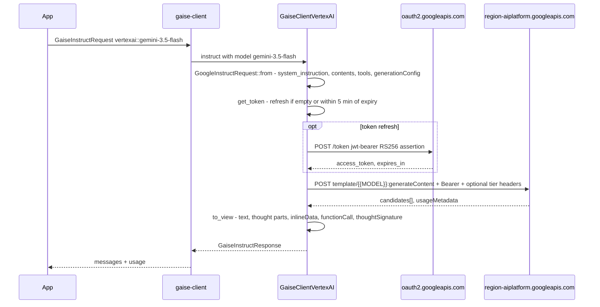
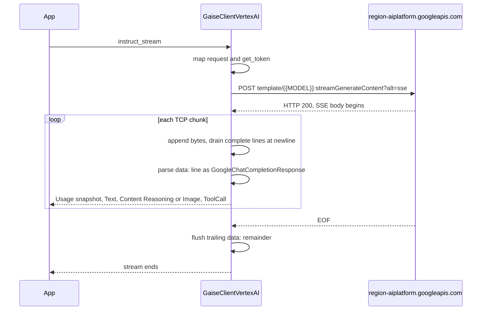

# Google Vertex AI (`vertexai`)

> Part of the [GAISe wiki](README.md) · [Models](models.md#vertexai) · [Capabilities](capabilities.md) · [HTTP API](api.md) · [Rust SDK](sdk.md) · [Flows](flows.md) · [Examples](examples.md)

The `vertexai` adapter drives Google Cloud Vertex AI with a service-account credential: `instruct` posts to `{{MODEL}}:generateContent`, `instruct_stream` to `{{MODEL}}:streamGenerateContent?alt=sse`, `embeddings` to `{{MODEL}}:predict`, and `list_models` to the Model Garden `v1beta1/publishers/{publisher}/models` endpoint derived from the same URL template. It deliberately has no Live/realtime transport, no Imagen/Veo prediction wrappers, and no Vertex-specific caching or RAG surfaces. The crate is `gaise-provider-vertexai`, enabled in `gaise-client` by the default `vertexai` feature (`vertexai = ["dep:gaise-provider-vertexai"]`). Only `src/lib.rs` modules are compiled: `contracts` and `vertexai_client`. The files `src/mod.rs` and `src/vertexai_client_threaded.rs` are stale, uncompiled leftovers and are not described here.

## At a glance

| Crate | Feature flag | Client type | Instruct surface | Streaming surface | Embeddings surface | Live surface | Model listing surface |
|---|---|---|---|---|---|---|---|
| [`gaise-provider-vertexai`](../gaise-provider-vertexai/Cargo.toml) | [`vertexai`](../gaise-client/Cargo.toml#L31) (default) | [`GaiseClientVertexAI`](../gaise-provider-vertexai/src/vertexai_client.rs#L31) | [`POST {{MODEL}}:generateContent`](../gaise-provider-vertexai/src/vertexai_client.rs#L283) | [`POST {{MODEL}}:streamGenerateContent?alt=sse`](../gaise-provider-vertexai/src/vertexai_client.rs#L173) | [`POST {{MODEL}}:predict`](../gaise-provider-vertexai/src/vertexai_client.rs#L343) | Not supported | [`GET {host}/v1beta1/publishers/{publisher}/models`](../gaise-provider-vertexai/src/contracts/catalog.rs#L81) |

## Configuration

| Variable | Read by | Default | Meaning |
|---|---|---|---|
| `VERTEXAI_API_URL` | [`gaise-api/src/main.rs`](../gaise-api/src/main.rs#L12) → `GaiseClientConfig.vertexai_api_url` | none (required) | Full request URL template containing the literal `{{MODEL}}` placeholder, e.g. `https://us-central1-aiplatform.googleapis.com/v1/projects/P/locations/us-central1/publishers/google/models/{{MODEL}}` |
| `VERTEXAI_SA_PATH` | [`gaise-api/src/main.rs`](../gaise-api/src/main.rs#L13) → read and parsed into `GaiseClientConfig.vertexai_sa` | none (required) | Path to a service-account JSON file; only `client_email` and `private_key` are deserialized ([`ServiceAccount`](../gaise-provider-vertexai/src/contracts/service_account.rs#L4)) |
| `VERTEXAI_API_TIER` | [`GaiseClientVertexAI::new`](../gaise-provider-vertexai/src/vertexai_client.rs#L62) via [`resolve_tier`](../gaise-provider-vertexai/src/vertexai_client.rs#L430) | unset | Trimmed; blank means unset. When set, every `generateContent`/`streamGenerateContent` call carries `X-Vertex-AI-LLM-Request-Type: shared` and `X-Vertex-AI-LLM-Shared-Request-Type: <tier>` (e.g. `flex`) ([`apply_tier_headers`](../gaise-provider-vertexai/src/vertexai_client.rs#L77)). Not applied to embeddings or model listing |
| `GOOGLE_ACCOUNT_ID`, `GOOGLE_PRIVATE_KEY` | [`ServiceAccount::from_env`](../gaise-provider-vertexai/src/contracts/service_account.rs#L12) | none | Alternative constructor (`\\n` in the key is unescaped). Not called by `gaise-client` or `gaise-api`; available for direct SDK use |

The router requires both `vertexai_sa` and `vertexai_api_url` ([`get_client`](../gaise-client/src/lib.rs#L132)); `configured_providers` lists `vertexai` only when both are present ([`lib.rs#L230`](../gaise-client/src/lib.rs#L230)). The adapter reads no other environment variables.

Constructor: `GaiseClientVertexAI::new(sa: &ServiceAccount, api_url: String) -> Result<Self, Box<dyn Error + Send + Sync>>` (async). It builds a `reqwest::Client` with a 15 s connect timeout and 120 s request timeout ([`new`](../gaise-provider-vertexai/src/vertexai_client.rs#L51)).

```rust
use gaise_provider_vertexai::contracts::ServiceAccount;
use gaise_provider_vertexai::vertexai_client::GaiseClientVertexAI;

let sa = ServiceAccount::from_json(&std::fs::read_to_string("sa.json")?)?;
let client = GaiseClientVertexAI::new(
    &sa,
    "https://us-central1-aiplatform.googleapis.com/v1/projects/PROJECT/locations/us-central1/publishers/google/models/{{MODEL}}".into(),
).await?;
```

### URL template contract

The adapter never builds a URL from region/project/publisher parts. Every surface is `api_url.replace("{{MODEL}}", &request.model)` plus a method suffix (`:generateContent`, `:streamGenerateContent?alt=sse`, `:predict`). The template therefore fixes the API version (`v1` or `v1beta1`), region host, project, location, and publisher for all requests. Model discovery parses the same template: [`VertexCatalogEndpoint::from_template`](../gaise-provider-vertexai/src/contracts/catalog.rs#L57) takes `scheme://host` as the host and the segment after `publishers/` as the publisher, and fails with an explicit error when either the scheme or the `publishers/<publisher>` segment is missing.

### Token lifecycle

| Step | Detail | Source |
|---|---|---|
| Claim set | `iss` = `client_email`, `scope` = `https://www.googleapis.com/auth/cloud-platform`, `aud` = `https://oauth2.googleapis.com/token`, `iat` = now, `exp` = now + 1 h | [`fetch_new_token`](../gaise-provider-vertexai/src/vertexai_client.rs#L118), [`GoogleClaims`](../gaise-provider-vertexai/src/contracts/google_claims.rs#L3) |
| Signing | `jsonwebtoken` RS256 with `EncodingKey::from_rsa_pem(private_key)` | [`L126`](../gaise-provider-vertexai/src/vertexai_client.rs#L126) |
| Exchange | `POST https://oauth2.googleapis.com/token` form `grant_type=urn:ietf:params:oauth:grant-type:jwt-bearer&assertion=<jwt>`; response parsed as [`GoogleAccessToken { access_token, token_type, expires_in }`](../gaise-provider-vertexai/src/contracts/models.rs#L70) | [`L131`](../gaise-provider-vertexai/src/vertexai_client.rs#L131) |
| Caching | Token, type, and `expires_at = now + expires_in` held in an `Arc<tokio::sync::Mutex<TokenState>>` shared by clones | [`TokenState`](../gaise-provider-vertexai/src/vertexai_client.rs#L44) |
| Refresh | Lazily on each call: refresh when the token is empty or `now + 5 min >= expires_at`. No background task | [`get_token`](../gaise-provider-vertexai/src/vertexai_client.rs#L86) |
| Header | `Authorization: Bearer <access_token>` plus `Content-type: application/json` on every request | [`instruct`](../gaise-provider-vertexai/src/vertexai_client.rs#L294) |

Token refresh events are written with `println!` to stdout; a failed exchange surfaces as `no google access token: …`.

## Request mapping

All mapping lives in pure helpers in [`contracts/models.rs`](../gaise-provider-vertexai/src/contracts/models.rs); the entry point is [`GoogleInstructRequest::from`](../gaise-provider-vertexai/src/contracts/models.rs#L575), which calls [`add_content`](../gaise-provider-vertexai/src/contracts/models.rs#L463) per input message.

### Roles and system prompts

| GAISe role | Wire | Source |
|---|---|---|
| `system` | Text collected recursively (`Text` and nested `Parts` only) into the top-level `system_instruction.parts[]` with `role: "system"`; multiple system messages append in order. Non-text system content is dropped | [`add_content`](../gaise-provider-vertexai/src/contracts/models.rs#L464), [`collect_text_content`](../gaise-provider-vertexai/src/contracts/models.rs#L352) |
| `assistant` | `contents[].role = "model"` | [`to_google_role`](../gaise-provider-vertexai/src/contracts/models.rs#L818) |
| `tool` (or any message with `tool_call_id`) | `contents[].role = "user"` carrying a `functionResponse` part | [`add_content`](../gaise-provider-vertexai/src/contracts/models.rs#L490) |
| `user` and anything else | Passed through unchanged | [`to_google_role`](../gaise-provider-vertexai/src/contracts/models.rs#L818) |

Messages that produce no parts are skipped. Consecutive same-role messages are not merged.

### Content modalities

| `GaiseContent` | Wire shape | Fallback / error | Source |
|---|---|---|---|
| `Text { text }` | `parts[].text` | — | [`from_gaise`](../gaise-provider-vertexai/src/contracts/models.rs#L304) |
| `Image { data, format }` | `parts[].inlineData { mimeType, data(base64) }`, MIME via `image_media_type` (unknown → `image/jpeg`) | None; every image is sent | [`L308`](../gaise-provider-vertexai/src/contracts/models.rs#L308) |
| `Audio { data, format }` | `parts[].inlineData`, MIME via `audio_media_type` (unknown → `audio/mpeg`) | None | [`L305`](../gaise-provider-vertexai/src/contracts/models.rs#L305) |
| `File { data, name }` | `parts[].inlineData` when `file_media_type(name)` is `application/pdf`, `application/json`, `application/rtf`, `application/xml`, or `text/*` | Other types: UTF-8 bytes become `<attached_document name="…">…</attached_document>` text; non-UTF-8 becomes the text marker `[Unsupported inline binary document for Vertex AI generateContent: name]` | [`L311`](../gaise-provider-vertexai/src/contracts/models.rs#L311), [`supports_inline_file`](../gaise-provider-vertexai/src/contracts/models.rs#L219) |
| `Reasoning { text, signature }` | `parts[] { text, thought: true, thoughtSignature }` | — | [`L327`](../gaise-provider-vertexai/src/contracts/models.rs#L327) |
| `RedactedReasoning { .. }` | Text marker `[Encrypted reasoning retained only on its source provider]` | Always a marker; Vertex has no opaque reasoning block | [`L335`](../gaise-provider-vertexai/src/contracts/models.rs#L335) |
| `Parts { parts }` | Recursively flattened in order into the same `parts[]` array | — | [`L338`](../gaise-provider-vertexai/src/contracts/models.rs#L338) |

Vertex `fileData` (GCS URI) parts are not mapped; all media is inline base64.

### Tools and tool results

| Aspect | Mapping | Source |
|---|---|---|
| Declarations | `tools: [{ functionDeclarations: [{ name, description, parameters }] }]` (one tool group). Missing description → `""`; missing parameters → `{ "type": "object", "properties": {} }` | [`from`](../gaise-provider-vertexai/src/contracts/models.rs#L627) |
| Schema | [`GoogleSchema::from`](../gaise-provider-vertexai/src/contracts/models.rs#L668) maps `type` (default `object`), `description`, `properties` (recursive), `required`, `items` (recursive, boxed). Other JSON Schema keywords are not mapped. `properties` is collected into a `HashMap`, so wire key order is not deterministic | [`GoogleSchema`](../gaise-provider-vertexai/src/contracts/models.rs#L107) |
| `tool_config.mode` | `toolConfig.functionCallingConfig.mode` = uppercased mode, default `AUTO`. `allowedFunctionNames` is not mapped | [`L647`](../gaise-provider-vertexai/src/contracts/models.rs#L647) |
| Assistant `tool_calls` history | One `parts[].functionCall { id?, name, args }` per call; `id` omitted when empty; `arguments` parsed as JSON, falling back to `{}`; `thought_signature` → `parts[].thoughtSignature` | [`L544`](../gaise-provider-vertexai/src/contracts/models.rs#L544) |
| Tool result message | `parts[].functionResponse { id: tool_call_id, name, response, parts? }`. `name` = `tool_name`, else `tool_call_id`, else `""` — supply `tool_name` for Vertex. Text parts joined with `\n` then: empty → `{}`; JSON object → as is; any other value/string → `{ "result": … }` | [`L511`](../gaise-provider-vertexai/src/contracts/models.rs#L511), [`function_response_value`](../gaise-provider-vertexai/src/contracts/models.rs#L450) |
| Multimodal tool result | `image/png`, `image/jpeg`, `image/webp` images and `application/pdf`/`text/plain` files become `functionResponse.parts[].inlineData { mimeType, displayName, data }`; `displayName` is the file name or `tool-result-N.<ext>` (128-char cap). Other images → `[Unsupported Vertex AI function-response image type: …]`; other UTF-8 files → tagged text; binary → `[Unsupported binary Vertex AI function-response document: …]`; audio → `[Unsupported Vertex AI function-response audio type: …]` | [`collect_function_response_content`](../gaise-provider-vertexai/src/contracts/models.rs#L380) |
| Parallel calls | Each response part yields its own call; history replays them as sibling parts in one `model` content | [`to_view`](../gaise-provider-vertexai/src/contracts/models.rs#L1032) |

### Generation config

`generationConfig` is emitted only when `generation_config` is `Some`; every inner field uses `skip_serializing_if = "Option::is_none"` ([`GoogleParameters`](../gaise-provider-vertexai/src/contracts/models.rs#L732)).

| `GaiseGenerationConfig` field | Wire field | Notes | Source |
|---|---|---|---|
| `temperature` | `generationConfig.temperature` | Omitted for fixed-sampling models | [`L600`](../gaise-provider-vertexai/src/contracts/models.rs#L600) |
| `top_p` | `generationConfig.topP` | Omitted for fixed-sampling models | [`L602`](../gaise-provider-vertexai/src/contracts/models.rs#L602) |
| `top_k` | `generationConfig.topK` | Omitted for fixed-sampling models | [`L603`](../gaise-provider-vertexai/src/contracts/models.rs#L603) |
| `max_tokens` | `generationConfig.max_output_tokens` | Serialized in snake_case (no rename on the struct field) | [`L601`](../gaise-provider-vertexai/src/contracts/models.rs#L601), [`L736`](../gaise-provider-vertexai/src/contracts/models.rs#L736) |
| `stop` | — | No such common field; `stopSequences` not mapped | — |
| `thinking_effort` | `generationConfig.thinkingConfig.thinkingLevel` | Gemini 3.x only: uppercased verbatim (`low` → `LOW`, `xhigh` → `XHIGH`). Not mapped on other families | [`L582`](../gaise-provider-vertexai/src/contracts/models.rs#L582) |
| `thinking_tokens` | Gemini 3.x: `thinkingLevel` via [`thinking_level_from_tokens`](../gaise-provider-vertexai/src/contracts/models.rs#L210) (0–2000 `LOW`, 2001–12000 `MEDIUM`, else `HIGH`) when no effort is set; otherwise `thinkingConfig.thinkingBudget` (i64) | `thinkingLevel` and `thinkingBudget` are never both set | [`L585`](../gaise-provider-vertexai/src/contracts/models.rs#L585), [`L592`](../gaise-provider-vertexai/src/contracts/models.rs#L592) |
| `include_thoughts` | `thinkingConfig.includeThoughts` | Only when a `thinkingConfig` is produced; defaults to `true` when absent (summaries requested by default) | [`L589`](../gaise-provider-vertexai/src/contracts/models.rs#L589) |
| `response_modalities` | `generationConfig.responseModalities[]` | Each value uppercased (`image` → `IMAGE`) | [`L605`](../gaise-provider-vertexai/src/contracts/models.rs#L605) |
| `image_config` | `generationConfig.responseFormat.image { aspectRatio, imageSize }` | Legacy `imageConfig` is always `None` | [`L612`](../gaise-provider-vertexai/src/contracts/models.rs#L612) |
| `input_media_resolution` | `generationConfig.mediaResolution` | Uppercased and prefixed with `MEDIA_RESOLUTION_` unless already prefixed (`high` → `MEDIA_RESOLUTION_HIGH`) | [`normalize_media_resolution`](../gaise-provider-vertexai/src/contracts/models.rs#L201) |
| `input_image_detail` | — | Not mapped (OpenAI-only) | — |
| `cache_key` | — | Not mapped; Vertex context caching (`cachedContent`) is not wrapped | — |
| service tier | HTTP headers, not body | From `VERTEXAI_API_TIER`; see Configuration | [`apply_tier_headers`](../gaise-provider-vertexai/src/vertexai_client.rs#L77) |

Not mapped: `safetySettings`, `responseMimeType`/`responseSchema` (structured output), `candidateCount`, `seed`, `labels`, `cachedContent`.

### Model-family rules

| Rule | Match (case-insensitive) | Effect | Source |
|---|---|---|---|
| Thinking level | `starts_with("gemini-3")` | `thinking_effort`/`thinking_tokens` → `thinkingLevel`; never `thinkingBudget` | [`model_uses_thinking_level`](../gaise-provider-vertexai/src/contracts/models.rs#L192) |
| Thinking budget | Every other model | `thinking_tokens` → `thinkingBudget`; `thinking_effort` ignored | [`L591`](../gaise-provider-vertexai/src/contracts/models.rs#L591) |
| Fixed sampling | `starts_with("gemini-3.5-flash")` or `starts_with("gemini-3.6-flash")` (covers `-lite` variants) | `temperature`, `topP`, `topK` omitted even when configured. `gemini-3.7-flash` is not in this list | [`model_uses_fixed_sampling`](../gaise-provider-vertexai/src/contracts/models.rs#L196) |

No other model-name rules exist; arbitrary IDs (including `publishers/anthropic` Claude models via the template) are passed through.

### Parameter compatibility (audited 2026-08-20)

[`model_uses_fixed_sampling`](../gaise-provider-vertexai/src/contracts/models.rs), [`thinking_levels_for`](../gaise-provider-vertexai/src/contracts/models.rs), [`normalize_thinking_level`](../gaise-provider-vertexai/src/contracts/models.rs), and [`thinking_budget_for`](../gaise-provider-vertexai/src/contracts/models.rs) enforce the table; [`tests/parameter_matrix_tests.rs`](../gaise-provider-vertexai/tests/parameter_matrix_tests.rs) pins it.

| Family | `temperature` / `topP` / `topK` | Thinking control | Accepted levels / budget | `none` effort |
|---|---|---|---|---|
| Gemini 3.7 Flash, 3.1 Pro | never sent (deprecated on all 3.x; 3.6+ ignore or 400) | `thinkingLevel` | LOW, MEDIUM, HIGH (`minimal` → LOW) | → LOW (cannot disable) |
| Gemini 3.6, 3.5, 3.5-Lite, 3.1-Lite, 3 Flash preview | never sent | `thinkingLevel` | MINIMAL, LOW, MEDIUM, HIGH | → MINIMAL |
| 3.1 Flash Image, 3.1 Flash-Lite Image | never sent | `thinkingLevel` | MINIMAL, HIGH (LOW → MINIMAL, MEDIUM → HIGH) | → MINIMAL |
| 3 Pro Image | never sent | `thinkingLevel` | HIGH only | → HIGH |
| Gemini 2.5 Pro | accepted | `thinkingBudget` | 128–32,768 (cannot disable: 0 → 128) | → 128 |
| Gemini 2.5 Flash | accepted | `thinkingBudget` | 0–24,576 | → 0 |
| Gemini 2.5 Flash-Lite | accepted | `thinkingBudget` | 0 or 512–24,576 | → 0 |

On 2.5, an effort without a budget is approximated (`low` 2,048, `medium` 8,192, `high` 24,576, `minimal` 512); `xhigh`/`max` map to HIGH on 3.x. `thinkingLevel` and `thinkingBudget` are never sent together. Sources: Vertex inference reference ("deprecated for all Gemini 3 models"), Vertex thinking page, model cards. The same helpers are duplicated in the Gemini crate.

## Response mapping

[`GoogleChatCompletionResponse`](../gaise-provider-vertexai/src/contracts/models.rs#L934) deserializes `candidates[]` and `usageMetadata`; [`to_view`](../gaise-provider-vertexai/src/contracts/models.rs#L1008) produces the common response.

| Item | Mapping |
|---|---|
| Messages | One `GaiseMessage` per candidate, `output` is always `OneOrMany::Many`. Role `model` → `assistant` ([`to_gaise_role`](../gaise-provider-vertexai/src/contracts/models.rs#L827)). Content is `OneOrMany::Many` of ordered parts, or `None` when empty |
| Text | `parts[].text` with `thought` absent/false → `GaiseContent::Text` |
| Reasoning | `parts[].text` with `thought: true` → `GaiseContent::Reasoning { text, signature: thoughtSignature }` |
| Tool calls | `parts[].functionCall` → `GaiseToolCall { id: id or name, type: "function", function { name, arguments: args.to_string() }, thought_signature: part.thoughtSignature }`. Tool calls go to `tool_calls`, not `content` |
| Generated media | `parts[].inlineData` base64-decoded by [`inline_data_to_gaise`](../gaise-provider-vertexai/src/contracts/models.rs#L239): `image/*` → `Image { format: mimeType }`, `audio/*` → `Audio`, anything else → `File { name: response.<ext> }` (`pdf`, `json`, `csv`, `html`, `md`, else `bin`). Undecodable base64 is dropped |
| Finish reason | `candidates[].finishReason` is deserialized ([`GoogleCandidate`](../gaise-provider-vertexai/src/contracts/models.rs#L944)) but not mapped; the common response has no stop-reason field |
| `external_id` | Always `None` (`responseId` is not read) |
| Usage | `usageMetadata` → [`map_google_usage`](../gaise-provider-vertexai/src/contracts/models.rs#L32); see Usage counters |
| Errors | Non-2xx → `Vertex AI request returned HTTP <status>: <first 1000 chars>` ([`response_error`](../gaise-provider-vertexai/src/vertexai_client.rs#L417)). No retries, no backoff |

Safety ratings, citation metadata, `promptFeedback`, `modelVersion`, and `createTime` are not mapped.

## Streaming

| Aspect | Behavior | Source |
|---|---|---|
| Framing | SSE from `:streamGenerateContent?alt=sse`; only `data:` lines are parsed, each as a full `GoogleChatCompletionResponse` | [`instruct_stream`](../gaise-provider-vertexai/src/vertexai_client.rs#L173) |
| Split-frame buffering | Bytes accumulate in a `Vec<u8>`; complete lines are drained at each `\n`, so a `data:` payload split across TCP chunks is reassembled. On EOF any trailing `data:` remainder is parsed once more | [`L198`](../gaise-provider-vertexai/src/vertexai_client.rs#L198), [`L246`](../gaise-provider-vertexai/src/vertexai_client.rs#L246) |
| Chunk mapping | [`to_stream_view`](../gaise-provider-vertexai/src/contracts/models.rs#L949): per frame, a `Usage` chunk first (if `usageMetadata` is present and non-empty), then per part: `Text` → `GaiseStreamChunk::Text`; thought text → `Content(Reasoning { signature })`; `inlineData` → `Content(Image/Audio/File)`; `functionCall` → `ToolCall` |
| Tool-call deltas | Vertex sends whole function calls, so each `ToolCall` chunk is complete: `index` = part index within the candidate, `id` = call id or name, `name`, `arguments` = full JSON string, `thought_signature`. The core accumulator concatenates by `index` | [`L985`](../gaise-provider-vertexai/src/contracts/models.rs#L985) |
| Usage snapshots | Every frame's `usageMetadata` is emitted as a snapshot; `GaiseStreamAccumulator` replaces counters rather than summing | [`L952`](../gaise-provider-vertexai/src/contracts/models.rs#L952) |
| Errors | Non-2xx before the body starts → immediate error. A frame that fails to parse yields an `Err` item (and an `eprintln!` preview) while the stream continues; transport errors yield `Err` | [`L217`](../gaise-provider-vertexai/src/vertexai_client.rs#L217) |
| `external_id` | Always `None` on every chunk | |

## Usage counters

Produced by [`map_google_usage`](../gaise-provider-vertexai/src/contracts/models.rs#L32) from [`GoogleUsageMetadata`](../gaise-provider-vertexai/src/contracts/models.rs#L1181). Modality detail keys are `{prefix}{modality}_tokens` with the `MODALITY_` prefix stripped and lowercased ([`google_modality_key`](../gaise-provider-vertexai/src/contracts/models.rs#L10)).

| Map | Key | Source field |
|---|---|---|
| input | `prompt_tokens` | `promptTokenCount` |
| input | `cached_tokens` | `cachedContentTokenCount` |
| input | `tool_prompt_tokens` | `toolUsePromptTokenCount` |
| input | `text_tokens`, `image_tokens`, `audio_tokens`, `video_tokens`, `document_tokens`, … | `promptTokensDetails[]` |
| input | `cached_<modality>_tokens` | `cacheTokensDetails[]` |
| input | `tool_<modality>_tokens` | `toolUsePromptTokensDetails[]` |
| output | `candidates_tokens` | `candidatesTokenCount` |
| output | `reasoning_tokens` | `thoughtsTokenCount` |
| output | `<modality>_tokens` | `candidatesTokensDetails[]` |
| total | `total_tokens` | `totalTokenCount` |

Embeddings ([`GoogleEmbeddingsResponse::to_view`](../gaise-provider-vertexai/src/contracts/models.rs#L1083)):

| Map | Key | Source field |
|---|---|---|
| input | `input_tokens` | `metadata.totalTokens` |
| input | `billable_characters` | `metadata.totalBillableCharacters` |
| total | `total_tokens` | `metadata.totalTokens` |

`trafficType` is deserialized but not mapped. Empty maps are omitted (`None`).

## Embeddings

`POST {{MODEL}}:predict` with body `{ "instances": [{ "content": "<text>", "task_type"? }, …], "parameters": { "autoTruncate": true, "outputDimensionality"? } }` built by [`vertex_embed_request`](../gaise-provider-vertexai/src/contracts/models.rs) (`GoogleEmbeddingsRequest::from` is a thin wrapper). Requests go through the shared resolver described in [embeddings.md](embeddings.md#how-a-request-is-resolved): the model's `[models.embedding]` profile in [`model-registry.toml`](../gaise-core/model-registry.toml) decides how `task`, `dimensions`, and `normalize` are expressed, and the [generated matrix](embeddings.md#model-matrix) shows the wire result per model.

- `gemini-embedding-001`: `task` → per-instance `task_type`, `dimensions` clamped to 1–3072, **one text per `:predict` call** (the client loops and sums `token_count` / billable characters across calls), truncated vectors L2-normalized locally.
- `text-embedding-005`, `text-embedding-004`, `text-multilingual-embedding-002`: `task_type`, `dimensions` clamped to 1–768, up to 250 instances per call, truncated vectors normalized locally.
- `gemini-embedding-2` and `multimodalembedding@001` are listed but not drivable (empty operations): the former needs `:embedContent` on the `aiplatform.{location}.rep.googleapis.com` host, the latter the image/video request schema. `embeddings` returns an explicit error for `gemini-embedding-2`.
- Vertex defaults an omitted `task_type` to `RETRIEVAL_QUERY`; set `task: document` when indexing.
- `title` and multimodal instances are not mapped; `autoTruncate` is always `true`. The response `predictions[].embeddings.values` becomes `output: Vec<Vec<f32>>` in order (predictions without `embeddings` are skipped); `metadata` maps to usage as above. `external_id` is `None`. Tier headers are not applied to embeddings.

## Live / realtime

Not supported. The crate implements only `GaiseClient`; there is no `GaiseLiveClient` or WebSocket transport. Model discovery deliberately reports no operations for `-live`, `-tts`, and `-omni` IDs ([`map_vertex_model`](../gaise-provider-vertexai/src/contracts/catalog.rs#L133)). Use the `gemini` provider for Gemini Live.

## Model discovery

| Aspect | Behavior | Source |
|---|---|---|
| Endpoint | `GET {host}/v1beta1/publishers/{publisher}/models?pageSize=1000[&pageToken=…]`, where `host` and `publisher` come from `VERTEXAI_API_URL` | [`list_url`](../gaise-provider-vertexai/src/contracts/catalog.rs#L81) |
| Pagination | Loops on `nextPageToken` until absent, empty, or repeated | [`list_models`](../gaise-provider-vertexai/src/vertexai_client.rs#L311) |
| Provider-sourced | `id` = resource name after `/models/` ([`vertex_model_id`](../gaise-provider-vertexai/src/contracts/catalog.rs#L95)); `status` from `launchStage` (`GA` → active; `PUBLIC_PREVIEW`/`PRIVATE_PREVIEW`/`EXPERIMENTAL` → preview; else unknown) ([`map_launch_stage`](../gaise-provider-vertexai/src/contracts/catalog.rs#L102)); `description` = `version {versionId}`; `raw` = native record when `include_raw` | [`map_vertex_model`](../gaise-provider-vertexai/src/contracts/catalog.rs#L113) |
| Heuristic | Unknown status + `preview` in the id → preview. Id containing `embedding` → text in, embedding out, `embeddings`. Id starting `gemini-` or `claude-` (not `-live`/`-tts`/`-omni`) → text in/out, `instruct` + `instruct_stream`. Everything else (Imagen, Veo, Gemma, …) gets no operations | [`L126`](../gaise-provider-vertexai/src/contracts/catalog.rs#L126) |
| Registry-filled | Modalities, tools/reasoning flags, reasoning values, dates, replacement, notes via [`RegistryModel::overlay`](../gaise-core/src/registry.rs#L296) in the router ([`list_provider_models`](../gaise-client/src/lib.rs#L254)); ids are rewritten to `vertexai::<id>` | |
| Opt-in detail | None; `include_details` is ignored. The listing has no modality, token-limit, or retirement data | |
| Operation filter | Applied in the adapter and again after enrichment in the router | [`L335`](../gaise-provider-vertexai/src/vertexai_client.rs#L335) |
| Tier headers | Not applied | |

Tests: [`catalog.rs#L150`](../gaise-provider-vertexai/src/contracts/catalog.rs#L150) (`derives_catalog_endpoint_from_template`, `maps_publisher_models`).

## Models

From `model-registry.toml` (audited 2026-08-20), `provider = "vertexai"` entries. Dates are Google Cloud dates only; Gemini API (`gemini`) lifecycle dates must never be copied here or vice versa. "Short-term" models retire 45 days after a designated replacement ships.

| Model | Aliases | Status | Dates | Input | Output | Operations | Reasoning values | GAISe support | Notes |
|---|---|---|---|---|---|---|---|---|---|
| `gemini-3.7-flash` | — | `short_term_active` | — | text, image, audio, video, file | text | instruct, instruct_stream | — | native | GA 2026-08-13; short-term availability table, no retirement date announced. |
| `gemini-3.6-flash` | — | `short_term_active` | — | text, image, audio, video, file | text | instruct, instruct_stream | — | native | Released 2026-07-21; short-term availability (retires 45 days after a designated replacement). gemini-3.7-flash has not … |
| `gemini-3.5-flash` | — | `active` | retirement_not_before 2027-05-19 | text, image, audio, video, file | text | instruct, instruct_stream | — | native | — |
| `gemini-3.5-flash-lite` | — | `active` | retirement_not_before 2027-07-21 | text, image, audio, video, file | text | instruct, instruct_stream | — | native | — |
| `gemini-3.1-flash-lite` | — | `active` | retirement_not_before 2027-05-07 | text, image, audio, video, file | text | instruct, instruct_stream | — | native | GA 2026-05-07. |
| `gemini-3-flash-preview` | — | `preview` | — | text, image, audio, video, file | text | instruct, instruct_stream | — | native | Public preview since 2025-12-17; no retirement row on the model-versions page. |
| `gemini-3.1-flash-image` | — | `active` | retirement_not_before 2027-05-28 | text, image, video, file | text, image | instruct, instruct_stream | — | native image output through generateContent | Video input remains in preview. Function calling is not supported. |
| `gemini-3.1-flash-lite-image` | — | `short_term_active` | — | text, image, video, file | text, image | instruct, instruct_stream | — | native image output through generateContent | GA 2026-06-30; no retirement date announced. Function calling is not supported on Vertex. Max output 4,096 tokens. |
| `gemini-3-pro-image` | — | `active` | retirement_not_before 2027-05-28 | text, image, file | text, image | instruct, instruct_stream | — | native image output through generateContent | Function calling is not supported; video input is not supported; 4K output remains in preview. |
| `gemini-embedding-2` | `gemini-embedding-2-preview` | `active` | — | text, image, audio, video | embedding | — | — | not yet: Vertex serves it via :embedContent on the aiplatform.{location}.rep.googleapis.com host, which the adapter does not call; use gemini::gemini-embedding-2 | GA 2026-04-22 (preview alias since 2026-03-10). Text, image, audio, video, and PDF input; 8,192 input tokens;… |
| `gemini-embedding-001` | — | `active` | retirement_not_before 2028-05-20 | text | embedding | embeddings | — | native | Previous-generation text embedding model; gemini-embedding-2 is current. Accepts one input text per :predict… |
| `text-embedding-005` | `text-embedding-004`, `text-multilingual-embedding-002` | `active` | retirement_not_before 2027-04-01 | text | embedding | embeddings | — | native | Legacy text embedding family; all retire 2027-04-01. 768 dimensions, 2,048 tokens, 250 texts per call. |
| `multimodalembedding@001` | — | `active` | retirement_not_before 2027-04-01 | text, image, audio, video | embedding | — | — | not yet: uses the image/video embedding request schema | 1408 dimensions (128/256/512 for text+image); 32 text tokens. Retires 2027-04-01. |
| `gemini-live-2.5-flash-native-audio` | — | `active` | shutdown_date 2026-12-13 | text, image, audio, video | text, audio | — | — | not supported: the Vertex AI adapter has no Live transport | GA 2025-12-12. |
| `gemini-2.5-pro` | — | `deprecated` | shutdown_date 2026-10-20 | text, image, audio, video, file | text | instruct, instruct_stream | — | native (thinkingBudget mapper path) | Replacement: gemini-3.5-flash. |
| `gemini-2.5-flash` | — | `deprecated` | shutdown_date 2026-10-20 | text, image, audio, video, file | text | instruct, instruct_stream | — | native (thinkingBudget mapper path) | Replacement: gemini-3.5-flash-lite or gemini-3.1-flash-lite. |
| `gemini-2.5-flash-lite` | — | `deprecated` | shutdown_date 2026-10-20 | text, image, audio, video, file | text | instruct, instruct_stream | — | native (thinkingBudget mapper path) | Replacement: gemini-3.1-flash-lite or Gemma 4. |
| `gemini-2.5-flash-image` | — | `deprecated` | shutdown_date 2026-10-02 | text, image | text, image | instruct, instruct_stream | — | — | Replacement: gemini-3.1-flash-lite-image. |
| `gemini-2.0-flash` | `gemini-2.0-flash-lite` | `retired` | shutdown_date 2026-06-01 | — | — | — | — | — | Replacement: gemini-3.1-flash-lite. |

The registry is advisory: any model ID the template endpoint accepts can be used. Note that the adapter's own rules key off name prefixes (`gemini-3*`, `gemini-3.5-flash*`, `gemini-3.6-flash*`), not registry entries.

## Limitations and explicit fallbacks

- No Live/realtime transport; `-live`, `-tts`, `-omni` models list with no operations.
- Binary, non-inline-capable files (Office, octet-stream) become a text marker: `[Unsupported inline binary document for Vertex AI generateContent: <name>]`; UTF-8 files of those types become `<attached_document>` tagged text.
- `RedactedReasoning` becomes the marker `[Encrypted reasoning retained only on its source provider]`.
- Tool-result audio, non-PNG/JPEG/WebP images, and binary documents become explicit `[Unsupported … function-response …]` text inside the `functionResponse`.
- Non-text content in `system` messages is dropped (only text is collected into `system_instruction`).
- `thinking_effort` is ignored on non-Gemini-3 models; `include_thoughts` alone (without effort/tokens) produces no `thinkingConfig`.
- Temperature/top-p/top-k are silently omitted for `gemini-3.5-flash*` and `gemini-3.6-flash*`.
- `cache_key`, `input_image_detail`, stop sequences, structured output (`responseSchema`), safety settings, `fileData` URIs, embedding task types, and output dimensionality are not mapped.
- `finishReason`, `responseId`, safety ratings, and citations are not surfaced; `external_id` is always `None`.
- No retry/backoff; HTTP errors carry a 1000-character body preview.
- Token refresh logs go to stdout via `println!`.
- Gemini API (`gemini` provider) retirement dates are a separate lifecycle and must not be applied to Vertex models.

## Flow

Non-streaming instruct:



Streaming instruct:



## Tests

All tests are hermetic; the crate has no `#[ignore]` live tests.

| File | Coverage |
|---|---|
| [`tests/mapping_tests.rs`](../gaise-provider-vertexai/tests/mapping_tests.rs) | Tool declarations and nested schema; text request with `temperature`/`max_output_tokens`; multimodal and multipart `inlineData` ordering; recursive `Parts` flattening; single and multiple/nested system messages into `system_instruction`; `thinkingBudget` on `gemini-2.5-flash` (serialized JSON asserts no `thinkingLevel`); `thinkingLevel` LOW/MEDIUM/HIGH on `gemini-3-pro-preview`; PDF file → `inlineData` `application/pdf`; `gemini-3.6-flash` fixed sampling, `responseModalities`, `responseFormat.image`, `mediaResolution`; response mapping of thought text + signature, generated image, tool-call signature for both `to_view` and `to_stream_view`; tool-call/tool-result round trip preserving `id`, `name`, and `thoughtSignature`; multimodal tool result → `functionResponse.parts[].inlineData` |
| [`src/contracts/models.rs#L876`](../gaise-provider-vertexai/src/contracts/models.rs#L876) | Unit tests: usage modality/cache/tool/reasoning counters and neutral total; embeddings metadata → `input_tokens`/`total_tokens` |
| [`src/contracts/catalog.rs#L150`](../gaise-provider-vertexai/src/contracts/catalog.rs#L150) | Endpoint derivation from the template (host, publisher, page token, error cases); publisher-model mapping (status, version description, heuristics, raw record, no Live operations) |
| [`src/vertexai_client.rs#L434`](../gaise-provider-vertexai/src/vertexai_client.rs#L434) | `resolve_tier` trims and treats blank as unset |

Not covered by tests: the SSE split-frame buffer in `instruct_stream` (no local fixture), the OAuth exchange, and HTTP error formatting.

## Sources

Official documentation:

- Vertex AI model catalog: https://docs.cloud.google.com/vertex-ai/generative-ai/docs/learn/models
- Vertex AI model lifecycle (Google Cloud dates only): https://docs.cloud.google.com/gemini-enterprise-agent-platform/models/model-versions
- Model Garden `publishers.models.list`: https://docs.cloud.google.com/vertex-ai/docs/reference/rest/v1beta1/publishers.models/list
- Gemini API lifecycle (separate; do not copy to Vertex): https://ai.google.dev/gemini-api/docs/deprecations

Source files:

- [`../gaise-provider-vertexai/Cargo.toml`](../gaise-provider-vertexai/Cargo.toml)
- [`../gaise-provider-vertexai/src/lib.rs`](../gaise-provider-vertexai/src/lib.rs)
- [`../gaise-provider-vertexai/src/vertexai_client.rs`](../gaise-provider-vertexai/src/vertexai_client.rs)
- [`../gaise-provider-vertexai/src/contracts/models.rs`](../gaise-provider-vertexai/src/contracts/models.rs)
- [`../gaise-provider-vertexai/src/contracts/catalog.rs`](../gaise-provider-vertexai/src/contracts/catalog.rs)
- [`../gaise-provider-vertexai/src/contracts/service_account.rs`](../gaise-provider-vertexai/src/contracts/service_account.rs)
- [`../gaise-provider-vertexai/src/contracts/google_claims.rs`](../gaise-provider-vertexai/src/contracts/google_claims.rs)
- [`../gaise-provider-vertexai/tests/mapping_tests.rs`](../gaise-provider-vertexai/tests/mapping_tests.rs)
- [`../gaise-client/src/lib.rs`](../gaise-client/src/lib.rs)
- [`../gaise-client/Cargo.toml`](../gaise-client/Cargo.toml)
- [`../gaise-api/src/main.rs`](../gaise-api/src/main.rs)
- [`../gaise-core/src/registry.rs`](../gaise-core/src/registry.rs)
- [`../gaise-core/model-registry.toml`](../gaise-core/model-registry.toml)
